# 《21世纪货币政策》— Skill Index

> 本书由 cangjie-skill 蒸馏, 共产出 **16** 个 skills。
> 处理时间: 2026-10-05

## 关于这本书

- **作者**: 本·伯南克（Ben Bernanke，美联储前主席、诺贝尔经济学奖得主）
- **出版年**: 2022（英文版 2022；中译本 2022，中信出版集团）
- **一句话主旨**: 美联储 60 年的政策演进由三大结构性力量驱动（通胀行为改变、中性利率长期下行、系统性金融不稳定上升），而每一代央行人的成败都系于同一件事：用可信的行动管理预期——信誉是货币政策最宝贵的资产，工具会过时，这一点不会。
- **整书理解**: 见 [BOOK_OVERVIEW.md](./BOOK_OVERVIEW.md)
- **精华长文** (不读全书看这篇): [DIGEST.md](./DIGEST.md)
- **术语词典**: [GLOSSARY.md](./GLOSSARY.md)

---

## Skill 列表 (按主题分组)

### 一、信誉与预期管理

- [`credibility-capital-management`](../skills/credibility-capital-management/SKILL.md) — 把信誉当作可存取、会折旧的"资本资产"做跨期经营：建立、维护、兑现前任承诺与止损摇摆。
- [`stop-go-discipline`](../skills/stop-go-discipline/SKILL.md) — 判断什么时候"灵活"实为"时断时续"，为必带阵痛的决定建立中途不摇摆的坚持纪律。
- [`preemptive-strike-policy`](../skills/preemptive-strike-policy/SKILL.md) — 长时滞场景下在苗头期出手：用温和的提前行动代价，换取免于日后的激烈矫枉。
- [`risk-management-insurance`](../skills/risk-management-insurance/SKILL.md) — 为低概率高后果的尾部风险"买保险"：付多少保费、事后如何归因、何时收回。

### 二、承诺与沟通设计

- [`guidance-credibility-design`](../skills/guidance-credibility-design/SKILL.md) — 解决"该不该承诺、承诺凭什么可信"：德尔菲/奥德赛选型与可信度四支柱核查。
- [`commitment-spectrum-design`](../skills/commitment-spectrum-design/SKILL.md) — 单次承诺的结构设计：定日期还是定条件、写门槛还是触发、免责条款怎么加。
- [`signal-engineering`](../skills/signal-engineering/SKILL.md) — 重大宣布的形式工程：戏剧性一次宣布还是阶梯式放风，让信号不可误读。
- [`bounded-discretion-design`](../skills/bounded-discretion-design/SKILL.md) — 给自由裁量装上"目标+参照系+解释纪律"的制度框架：规则与相机抉择之间的宪法。
- [`announcement-as-policy`](../skills/announcement-as-policy/SKILL.md) — 危机中的宣布即干预：可信承诺本身恢复市场运转，先设计可信度再算金额。

### 三、政策空间与工具选择

- [`policy-firepower-accounting`](../skills/policy-firepower-accounting/SKILL.md) — 盘点政策/组织弹药：把非常规手段折算成常规当量，决定好年景留多少储备。
- [`policy-evaluation-discipline`](../skills/policy-evaluation-discipline/SKILL.md) — 事后归因纪律：用"预期外成分"校正与反事实基准，判断干预到底起没起作用。

### 四、危机响应与救助

- [`panic-contagion-template`](../skills/panic-contagion-template/SKILL.md) — 恐慌六环链条诊断：定位危机处于哪一环、会不会传染、该盯哪些早于断流的边际指标。
- [`bailout-three-step-program`](../skills/bailout-three-step-program/SKILL.md) — 救助决策三步程序：流动性/偿付分类、三问检验、损失吸收结构设计。
- [`bagehot-stigma-design`](../skills/bagehot-stigma-design/SKILL.md) — 白芝浩原则下的去污名机制设计：让"该用的人敢用"最后贷款人式工具。

### 五、边界与政治

- [`monetary-fiscal-boundary`](../skills/monetary-fiscal-boundary/SKILL.md) — 跨主体的责任分配与权力边界：借贷权 vs 支出权、谁先动的懦夫博弈、"临时性"方案的陷阱。
- [`political-feasibility-engineering`](../skills/political-feasibility-engineering/SKILL.md) — 政治攻击的即期战术工程：威胁测绘、署名分工、泄露管理与"量力而行"的拒绝话术。

---

## 引用图

```mermaid
graph LR
    %% 信誉与预期管理
    credibility-capital-management -.->|contrasts-with| stop-go-discipline
    credibility-capital-management -.->|contrasts-with| announcement-as-policy
    credibility-capital-management -.->|contrasts-with| guidance-credibility-design
    preemptive-strike-policy -.->|contrasts-with| risk-management-insurance
    preemptive-strike-policy -.->|contrasts-with| stop-go-discipline

    %% 承诺与沟通设计
    guidance-credibility-design ===>|composes-with| commitment-spectrum-design
    commitment-spectrum-design -->|depends-on| guidance-credibility-design
    commitment-spectrum-design -.->|contrasts-with| signal-engineering
    bounded-discretion-design ===>|composes-with| commitment-spectrum-design
    bounded-discretion-design ===>|composes-with| credibility-capital-management
    bounded-discretion-design -.->|contrasts-with| policy-evaluation-discipline
    announcement-as-policy -.->|contrasts-with| signal-engineering
    announcement-as-policy -.->|contrasts-with| guidance-credibility-design

    %% 政策空间与工具选择
    risk-management-insurance ===>|composes-with| policy-firepower-accounting
    policy-firepower-accounting -.->|contrasts-with| preemptive-strike-policy
    policy-evaluation-discipline -.->|contrasts-with| signal-engineering
    policy-evaluation-discipline -.->|contrasts-with| policy-firepower-accounting

    %% 危机响应与救助
    panic-contagion-template ===>|composes-with| bailout-three-step-program
    panic-contagion-template ===>|composes-with| announcement-as-policy
    bailout-three-step-program ===>|composes-with| bagehot-stigma-design
    bailout-three-step-program -.->|contrasts-with| political-feasibility-engineering
    bagehot-stigma-design ===>|composes-with| announcement-as-policy
    bagehot-stigma-design -.->|contrasts-with| panic-contagion-template

    %% 边界与政治
    monetary-fiscal-boundary -.->|contrasts-with| bailout-three-step-program
    monetary-fiscal-boundary -.->|contrasts-with| stop-go-discipline
    signal-engineering ===>|composes-with| political-feasibility-engineering
    political-feasibility-engineering -.->|contrasts-with| credibility-capital-management
```



图例:
- `-->`  depends-on
- `-.->` contrasts-with
- `===>` composes-with

---

## 推荐学习顺序

(从依赖图的叶子节点开始, 向上)

1. **panic-contagion-template** — 最基础, 没有前置；纯诊断工具, 也是救助链的起点
2. **credibility-capital-management** — 没有前置；信誉资产账户视角, 后续多个 skill 以它为底座
3. **preemptive-strike-policy** — 没有前置；与 risk-management-insurance 互为对照, 先学它理解"什么时候动"
4. **risk-management-insurance** — 与 preemptive-strike-policy 互补, 理解"为小概率付多少保费"
5. **signal-engineering** — 单次宣布的形式工程, 是沟通链的最简单一环
6. **guidance-credibility-design** — 承诺的选型与可信度前提, 是承诺设计的入口
7. **commitment-spectrum-design** — 依赖 guidance-credibility-design (先判型, 再设计结构)
8. **bounded-discretion-design** — 制度层面的"宪法", 组合 commitment-spectrum-design 的"条款"
9. **announcement-as-policy** — 危机版承诺设计, 组合 panic-contagion-template 的诊断结果
10. **policy-firepower-accounting** — 事前盘点弹药, 接收 risk-management-insurance 的保费回收
11. **policy-evaluation-discipline** — 事后战果核算, 与 policy-firepower-accounting 互为事前/事后
12. **bailout-three-step-program** — 依赖 panic-contagion-template (先诊断后决策)
13. **bagehot-stigma-design** — 组合 bailout-three-step-program (决策定了, 修工具落地)
14. **stop-go-discipline** — 行动启动后的中途纪律, 与 preemptive-strike-policy 接续
15. **monetary-fiscal-boundary** — 跨主体博弈结构, 需要先懂救助与节奏纪律
16. **political-feasibility-engineering** — 最上层: 宣布之后政治系统的攻防, 组合前面所有技能的"反应面"

---

## 安装使用

本目录是构建产物, 宿主不会从这里加载 skill。要让 agent 真正调用, 把 skill 目录复制到宿主的 skills 目录:

```bash
# 用户级 (所有项目可用)
cp -r skills/credibility-capital-management ~/.claude/skills/

# 或项目级
cp -r skills/credibility-capital-management <project>/.claude/skills/    # Claude Code
cp -r skills/credibility-capital-management <project>/.cursor/skills/    # Cursor
```

---

## 接入 darwin-skill

所有 skill 均带有 `test-prompts.json` (darwin-skill 兼容格式), 可直接接入自动进化:

```
darwin evolve books/21st-century-monetary-policy/
```

---

## 审计轨迹

- 候选单元池: [candidates/](./candidates/)
- 被淘汰的候选 (含原因): [rejected/](./rejected/)
- BOOK_OVERVIEW: [BOOK_OVERVIEW.md](./BOOK_OVERVIEW.md)
