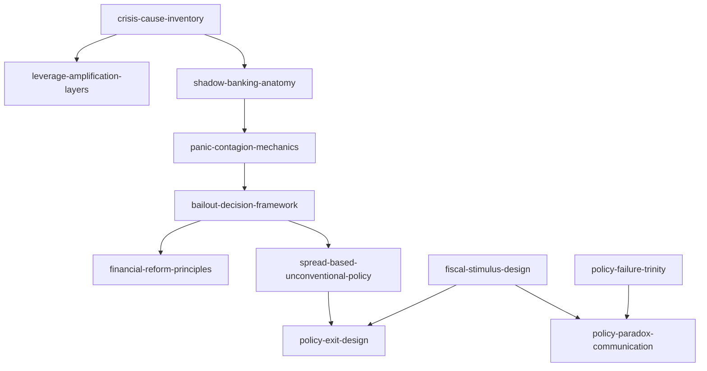

# INDEX — 《当音乐停止之后》skill 总览与引用图

> 蒸馏自艾伦·布林德《当音乐停止之后》（中译本 2014）。11 个 skill 全部通过三重验证。作者与书架既有四卷不同源；危机主题与温铁军、黄奇帆各卷互为中西视角互补。

## 一、Skill 总览

| # | Skill | 一句话 | 类型 | 章节 |
|---|---|---|---|---|
| 1 | [crisis-cause-inventory](../skills/crisis-cause-inventory/SKILL.md) | 七祸源清单化归因：反单因论+威利狼边界 | 框架·核心 | 第二章 |
| 2 | [leverage-amplification-layers](../skills/leverage-amplification-layers/SKILL.md) | 杠杆放大四层次穿透审计 | 框架 | 第二、三章 |
| 3 | [shadow-banking-anatomy](../skills/shadow-banking-anatomy/SKILL.md) | 影子银行解剖：证券化链条与激励扭曲 | 框架 | 第三章 |
| 4 | [panic-contagion-mechanics](../skills/panic-contagion-mechanics/SKILL.md) | 恐慌传染机制：回购挤兑、对手方风险、污名 | 框架 | 第四至六章 |
| 5 | [bailout-decision-framework](../skills/bailout-decision-framework/SKILL.md) | 救助五步决策树：白芝浩+牵连网络+规则手册 | 框架·核心 | 第四至七章 |
| 6 | [spread-based-unconventional-policy](../skills/spread-based-unconventional-policy/SKILL.md) | 利差之战：非常规工具 2×2 矩阵与压力测试 | 框架 | 第九、十四章 |
| 7 | [fiscal-stimulus-design](../skills/fiscal-stimulus-design/SKILL.md) | 财政刺激 3T 原则与政治资本聚焦 | 框架 | 第八章 |
| 8 | [financial-reform-principles](../skills/financial-reform-principles/SKILL.md) | 大而不乱：改革五问与激励修正 | 框架 | 第十、十一章 |
| 9 | [policy-failure-trinity](../skills/policy-failure-trinity/SKILL.md) | 政策失败三位一体：资金/产权/污名 | 框架 | 第十二章 |
| 10 | [policy-paradox-communication](../skills/policy-paradox-communication/SKILL.md) | 政策的悖论与沟通七步法 | 框架 | 第十三、十七章 |
| 11 | [policy-exit-design](../skills/policy-exit-design/SKILL.md) | 政策退出设计：两难容忍+工具箱+三时段 | 框架 | 第十四、十五章 |

## 二、引用图

**组合阅读路径**：

- **复盘一场金融危机**：crisis-cause-inventory → leverage-amplification-layers → shadow-banking-anatomy → panic-contagion-mechanics → bailout-decision-framework
- **危机政策全流程**：bailout-decision-framework → fiscal-stimulus-design / spread-based-unconventional-policy → policy-exit-design → policy-paradox-communication
- **改革设计**：financial-reform-principles + policy-failure-trinity

## 三、与书架其他书的关系（互补对照）

- 黄奇帆卷（strategy-and-path / analysis-and-thinking）：中式结构分析（代价归属、货币主权、举国体制）↔ 本卷西方亲历者视角（多因素归因、救助决策、政治沟通）——同一危机的两种解剖
- 八次危机（温铁军）：cost-transfer-analysis（内向转嫁）↔ 本卷 bailout-decision-framework（最后贷款人）——转嫁与救助是危机代价分配的两种制度安排
- crisis-deferral-chain（黄奇帆卷）↔ 本卷 crisis-cause-inventory：前瞻传导 vs 后验归因

## 四、支撑材料

- [BOOK_OVERVIEW.md](./BOOK_OVERVIEW.md) — 整书理解
- [GLOSSARY.md](./GLOSSARY.md) — 共享术语词典
- [verified.md](./verified.md) — 三重验证；[rejected/REJECTED.md](./rejected/REJECTED.md) — 淘汰审计
- [candidates/](./candidates/) — 框架 11 / 原则 9 / 案例 11 / 反例 6 / 术语 11
- [TEST_RESULTS.md](./TEST_RESULTS.md) — 压力测试
- [DIGEST.md](./DIGEST.md) — 精华长文
