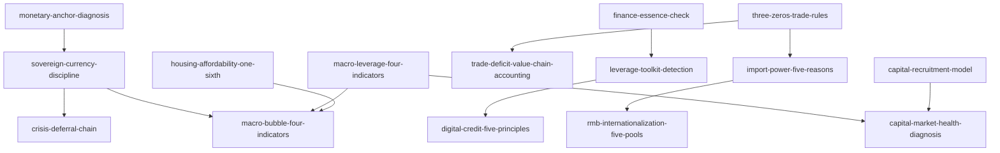

# INDEX — 《分析与思考》skill 总览与引用图

> 蒸馏自黄奇帆《分析与思考：黄奇帆的复旦经济课》（2020）。15 个新增 skill 全部通过三重验证（V1 跨域 / V2 预测力 / V3 独特性）+ 与姊妹卷《战略与路径》（strategy-and-path，19 skills）跨书去重。

## 一、Skill 总览

| # | Skill | 一句话 | 类型 | 讲次 |
|---|---|---|---|---|
| 1 | [macro-leverage-four-indicators](../skills/macro-leverage-four-indicators/SKILL.md) | 杠杆四指标+结构分解找主病灶（企业 160%） | 框架 | 第1讲 |
| 2 | [leverage-toolkit-detection](../skills/leverage-toolkit-detection/SKILL.md) | 六工具+五机制：金融乱象部件级体检 | 框架 | 第1、3讲 |
| 3 | [digital-credit-five-principles](../skills/digital-credit-five-principles/SKILL.md) | 数字信贷五原则（资本金/资金/杠杆/场景/风控） | 框架 | 第3讲 |
| 4 | [finance-essence-check](../skills/finance-essence-check/SKILL.md) | 金融本质三句话：创新是否异化的三重检验 | 框架 | 第1讲、附录 |
| 5 | [monetary-anchor-diagnosis](../skills/monetary-anchor-diagnosis/SKILL.md) | 货币锚诊断：汇兑本位制与三种发行制度 | 框架 | 第4讲 |
| 6 | [sovereign-currency-discipline](../skills/sovereign-currency-discipline/SKILL.md) | 主权信用四纪律+国债三级上限 | 框架 | 第5、13讲 |
| 7 | [capital-market-health-diagnosis](../skills/capital-market-health-diagnosis/SKILL.md) | 股市三功能诊断与九问题九建议 | 框架 | 第6、7讲 |
| 8 | [housing-affordability-one-sixth](../skills/housing-affordability-one-sixth/SKILL.md) | 住房负担六分之一标尺族 | 框架 | 第8、9讲 |
| 9 | [three-zeros-trade-rules](../skills/three-zeros-trade-rules/SKILL.md) | 中间品 70% 时代的三零规则 | 框架 | 第10讲 |
| 10 | [trade-deficit-value-chain-accounting](../skills/trade-deficit-value-chain-accounting/SKILL.md) | 贸易失衡的价值链拆账法 | 框架 | 第12讲 |
| 11 | [crisis-deferral-chain](../skills/crisis-deferral-chain/SKILL.md) | 危机后移链条：从对冲工具反推下次震中 | 框架 | 第13讲 |
| 12 | [macro-bubble-four-indicators](../skills/macro-bubble-four-indicators/SKILL.md) | GDP 比例族的泡沫体检（1:1/1.5:1） | 框架 | 第13、5讲 |
| 13 | [rmb-internationalization-five-pools](../skills/rmb-internationalization-five-pools/SKILL.md) | 人民币国际化五个蓄水池 | 框架 | 第14讲 |
| 14 | [import-power-five-reasons](../skills/import-power-five-reasons/SKILL.md) | 进口大国五条强国理由 | 框架 | 第11讲 |
| 15 | [capital-recruitment-model](../skills/capital-recruitment-model/SKILL.md) | 资本招商：从让利方到股东方 | 框架 | 第2讲、附录 |

## 二、引用图

**组合阅读路径**：

- **金融风险体检**：leverage-toolkit-detection → finance-essence-check → macro-leverage-four-indicators → macro-bubble-four-indicators
- **货币与宏观**：monetary-anchor-diagnosis → sovereign-currency-discipline → crisis-deferral-chain
- **购房与楼市**：housing-affordability-one-sixth + （书架已有）city-land-structure
- **贸易与开放**：three-zeros-trade-rules → trade-deficit-value-chain-accounting → import-power-five-reasons → rmb-internationalization-five-pools
- **政府与产业**：capital-recruitment-model + （书架已有）chain-power-analysis

## 三、与姊妹卷的关系（跨书导航）

本卷与 [strategy-and-path](../../strategy-and-path/) 同作者同源：五步分析法（本卷后记定名"问题—结构—对策"）、边界条件、兵棋推演、链权、备胎、盾牌等元框架已在姊妹卷建成 skill，本卷不再重建，只做词典挂接（见 GLOSSARY）与案例补充（华为攻防清单、惠普结算等）。

## 四、支撑材料

- [BOOK_OVERVIEW.md](./BOOK_OVERVIEW.md) — 整书理解（含跨书去重策略）
- [GLOSSARY.md](./GLOSSARY.md) — 共享术语词典
- [verified.md](./verified.md) — 三重验证与去重记录；[rejected/REJECTED.md](./rejected/REJECTED.md) — 淘汰审计
- [candidates/](./candidates/) — 框架 16 / 原则 14 / 案例 16 / 反例 8 / 术语 10
- [TEST_RESULTS.md](./TEST_RESULTS.md) — 压力测试结果
- [DIGEST.md](./DIGEST.md) — 精华长文
