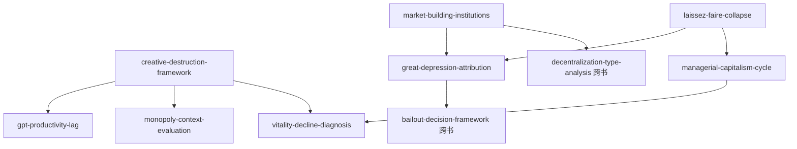

# INDEX — 《繁荣与衰退》skill 总览与引用图

> 蒸馏自格林斯潘 & 伍德里奇《繁荣与衰退：一部美国经济发展史》（中信 2019）。8 个 skill 全部通过三重验证。作者格林斯潘与书架既有各卷不同源——本卷为"创造性破坏"的美国经济史叙事。

## 一、Skill 总览

| # | Skill | 一句话 | 类型 | 章节 |
|---|---|---|---|---|
| 1 | [creative-destruction-framework](../skills/creative-destruction-framework/SKILL.md) | 创造性破坏的操作化：五机制+三大社会问题+铁笼沼泽 | 框架·核心 | 引言、大结局 |
| 2 | [market-building-institutions](../skills/market-building-institutions/SKILL.md) | 市场缔造的制度四件套：统一市场+专利+有限责任+信用 | 框架 | 第一、四章 |
| 3 | [gpt-productivity-lag](../skills/gpt-productivity-lag/SKILL.md) | 通用技术与生产率长时滞：电力 40 年、马匹悖论 | 框架 | 引言、第一、三、六章 |
| 4 | [monopoly-context-evaluation](../skills/monopoly-context-evaluation/SKILL.md) | 垄断的语境评估：两本账+分类型 | 框架 | 第四、五章 |
| 5 | [laissez-faire-collapse](../skills/laissez-faire-collapse/SKILL.md) | 自由放任的瓦解条件与管制国家兴起 | 框架 | 第五章 |
| 6 | [great-depression-attribution](../skills/great-depression-attribution/SKILL.md) | 大萧条五层归因+债务通缩+新政双轨评价 | 框架 | 第七章 |
| 7 | [managerial-capitalism-cycle](../skills/managerial-capitalism-cycle/SKILL.md) | 管理型资本主义的兴衰循环（黄金年代→滞胀→里根） | 框架 | 第八至十章 |
| 8 | [vitality-decline-diagnosis](../skills/vitality-decline-diagnosis/SKILL.md) | 活力衰退六症状诊断与权益挤出假说 | 框架 | 第十二、大结局 |

## 二、引用图

**组合阅读路径**：

- **美国经济史全景**：creative-destruction-framework → market-building-institutions → laissez-faire-collapse → managerial-capitalism-cycle
- **危机归因对照**：great-depression-attribution + （姊妹卷）crisis-cause-inventory + bailout-decision-framework
- **科技投资预期**：gpt-productivity-lag + （姊妹卷）innovation-three-stages
- **当代诊断**：vitality-decline-diagnosis + （姊妹卷）growth-mode-transformation（中美两套诊断对冲）

## 三、与书架其他书的关系

- **after-the-music-stopped（布林德）**：同一主题的联储内部人两种立场对冲——格林斯潘"全球储蓄过剩+三道防波堤" vs 布林德"七祸源+救助决策"；大衰退章跨书对照不重建
- **中国改革三部曲（吴敬琏）**：market-building-institutions ↔ rule-of-law-market-economy；growth-mode-transformation（吴）与 vitality-decline（格）为中美两套活力诊断
- **八次危机（温铁军）**：创造性破坏的代价叙事 ↔ cost-transfer-analysis 的代价归属——破坏的收益与代价两种记账

## 四、支撑材料

- [BOOK_OVERVIEW.md](./BOOK_OVERVIEW.md) — 整书理解
- [GLOSSARY.md](./GLOSSARY.md) — 共享术语词典
- [verified.md](./verified.md) — 三重验证；[rejected/REJECTED.md](./rejected/REJECTED.md) — 淘汰审计（含跨书对照说明）
- [candidates/](./candidates/) — 框架 9 / 原则 6 / 案例 10 / 反例 5 / 术语 10
- [TEST_RESULTS.md](./TEST_RESULTS.md) — 压力测试
- [DIGEST.md](./DIGEST.md) — 精华长文
