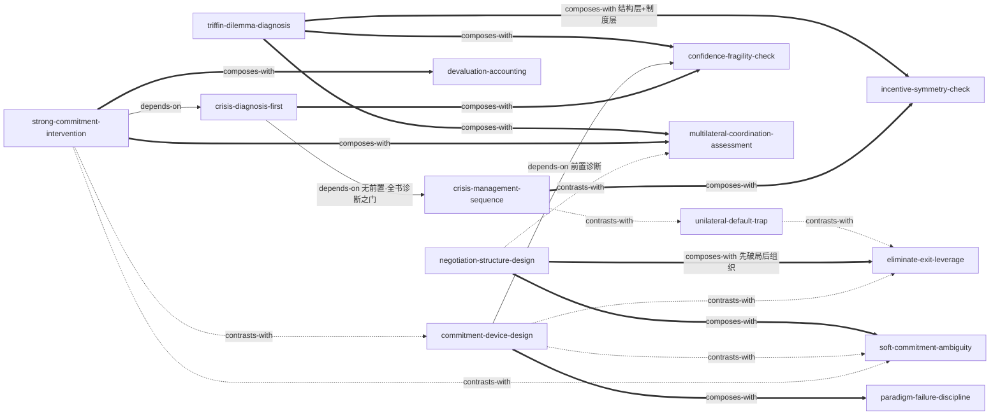

# 《时运变迁》（Changing Fortunes） — Skill Index

> 本书由 cangjie-skill 蒸馏, 共产出 **14** 个 skills。
> 处理时间: 2026-10-05

## 关于这本书

- **作者**: 保罗·沃尔克（Paul Volcker，前美联储主席）& 行天丰雄（日本大藏省前财务官）
- **出版年**: 1992（英文版）
- **一句话主旨**: 战后国际货币体系的兴衰史反复证明：稳定的货币秩序只能来自"纪律＋承诺＋大国协调"，三者缺一都不可持续——美元的特权与负担、政策协调的政治成本、汇率制度的锚之缺失，是同一条主线的三种面孔。
- **整书理解**: 见 [BOOK_OVERVIEW.md](./BOOK_OVERVIEW.md)
- **术语词典**: [GLOSSARY.md](./GLOSSARY.md)

---

## Skill 列表 (按主题分组)

### 危机管理

- [`crisis-diagnosis-first`](../skills/crisis-diagnosis-first/SKILL.md) — 危机处置前的定性之门：先分清流动性 vs 偿付能力、不能 vs 不愿、按净转移而非债务总量评估，误诊是代价最大的错误。
- [`crisis-management-sequence`](../skills/crisis-management-sequence/SKILL.md) — 定性之后的处置序列：止血→争取时间→结构改革→市场化自愿减债，目标顺序不可颠倒。
- [`unilateral-default-trap`](../skills/unilateral-default-trap/SKILL.md) — 边界警告：依赖持续流入的主体用威胁性违约施压是自我失败，"前门省下的钱从后门流出"。
- [`confidence-fragility-check`](../skills/confidence-fragility-check/SKILL.md) — 危机发生前的双重体检：定位可瞬间逆转的信心快变量，核对在场者共识，建立独立于利益相关方的警讯渠道。

### 承诺与信誉

- [`commitment-device-design`](../skills/commitment-device-design/SKILL.md) — 把可信度铸进制度结构：改变操作程序断自己的退路，信号一致打包，粗糙但无限的锚优于精密工具。
- [`strong-commitment-intervention`](../skills/strong-commitment-intervention/SKILL.md) — 战役级干预设计：市场只对"宏大、综合、一致"的一揽子强承诺反应，时机＝压垮已摇摇欲坠预期的致命一击。
- [`soft-commitment-ambiguity`](../skills/soft-commitment-ambiguity/SKILL.md) — 镜像工具：对投机敏感的目标刻意公开模糊、内部精确锚定，防单向试探——代价是失去真约束。
- [`paradigm-failure-discipline`](../skills/paradigm-failure-discipline/SKILL.md) — 判定"负反馈已失效"后选第三项（换范式而非加码或放弃），预登记最大错误，退出只认硬条件。

### 谈判与杠杆

- [`eliminate-exit-leverage`](../skills/eliminate-exit-leverage/SKILL.md) — 破局杠杆：说服无效时关闭对手的退路（常是己方授予的特权），使"维持现状"从零成本变成有代价。
- [`negotiation-structure-design`](../skills/negotiation-structure-design/SKILL.md) — 多方谈判的组织设计：接触顺序、分而治之、程序杠杆、议题重构、先例意识、双边先行。
- [`multilateral-coordination-assessment`](../skills/multilateral-coordination-assessment/SKILL.md) — 制度层评估：四条件检查表判断多边机制能否成事；小圈子、分层递进、方向性目标、内嵌调整机制。

### 体系与制度分析

- [`triffin-dilemma-diagnosis`](../skills/triffin-dilemma-diagnosis/SKILL.md) — "私器公用"结构诊断：三问判定输出义务与信用支撑是否结构性不兼容，推断崩溃时间表，评估替代供给出路。
- [`incentive-symmetry-check`](../skills/incentive-symmetry-check/SKILL.md) — 制度规则三检：义务是否只约束弱方、道德风险只能双向平衡不能消灭、私人风险与公共风险的边界要透明。
- [`devaluation-accounting`](../skills/devaluation-accounting/SKILL.md) — 调价/贬值后的效果核算：过 J 曲线时滞、稳定期、有效权重三关，才能把改善归因于调价，否则结论是"仍需基本面调整"。

---

## 引用图



图例:
- `-->`  depends-on
- `-.->` contrasts-with
- `===>` composes-with

关系依据各 SKILL.md 的 A2"与相邻 skill 的区分"：
- `crisis-diagnosis-first` 无前置依赖，是全书诊断之门；`crisis-management-sequence` 依赖它（误诊则整个序列建在错误上）。
- `strong-commitment-intervention` 与 `soft-commitment-ambiguity` 是市场沟通光谱的两端（高调压垮预期 vs 刻意模糊防靶子）；`commitment-device-design` 与 `soft-commitment-ambiguity` 是硬承诺与软承诺的镜像。
- `commitment-device-design` 与 `eliminate-exit-leverage` 方向相反：关自己的退路建信誉 vs 关对手的退路造杠杆，1971 年两者成对出现。
- `unilateral-default-trap` 是 `eliminate-exit-leverage` 同一杠杆主题的边界警告（依赖持续流入时威胁毁约自我失败），也是 `crisis-management-sequence` 自愿重组路径的反面参照。
- `devaluation-accounting` 与 `strong-commitment-intervention` 构成"事前设计干预→事后核算效果"的接力（广场协议正例）。
- `triffin-dilemma-diagnosis` 在结构层、`incentive-symmetry-check` 在制度层、`confidence-fragility-check` 在短期信心层，三者围绕同一体系可组合使用。

---

## 推荐学习顺序

(从依赖图的叶子节点开始, 向上)

1. **confidence-fragility-check** — 无前置；快变量定位与共识核对是最基础的危机前体检。
2. **crisis-diagnosis-first** — 无前置；全书诊断之门，危机管理序列与强承诺干预都依赖它。
3. **triffin-dilemma-diagnosis** — 无前置；长期结构诊断，与短期信心体检互补。
4. **eliminate-exit-leverage** — 无前置；最基础的破局杠杆，多个 skill 与它对照或组合。
5. **crisis-management-sequence** — 依赖 crisis-diagnosis-first；诊断之后的治疗顺序。
6. **unilateral-default-trap** — 依赖 crisis-diagnosis-first 的定性语境，与危机序列、消灭退路互为反面参照。
7. **commitment-device-design** — 依赖 confidence-fragility-check 作前置诊断；叶子之上的信誉工程。
8. **paradigm-failure-discipline** — 与 commitment-device-design 组合（1979.10.6：先判范式失效，再铸承诺装置）。
9. **strong-commitment-intervention** — 依赖 crisis-diagnosis-first（先排除结构问题）；战役级出击。
10. **soft-commitment-ambiguity** — 依赖对 strong-commitment-intervention / commitment-device-design 的理解，三者构成承诺设计光谱。
11. **devaluation-accounting** — 与 strong-commitment-intervention 接力：干预之后的效果核算。
12. **negotiation-structure-design** — 组合 eliminate-exit-leverage（先破局后组织程序）与 soft-commitment-ambiguity（文本工程）。
13. **multilateral-coordination-assessment** — 战役层之上的制度层：评估协调机制能否持续产出。
14. **incentive-symmetry-check** — 最上层的综合设计检验：与 triffin 诊断（结构层）、危机序列（道德风险环节）、违约陷阱（制度后果）全部衔接。

---

## 安装使用

本目录是构建产物, 宿主不会从这里加载 skill。要让 agent 真正调用, 把 skill 目录复制到宿主的 skills 目录:

```bash
# 用户级 (所有项目可用)
cp -r crisis-diagnosis-first ~/.claude/skills/

# 或项目级
cp -r crisis-diagnosis-first <project>/.claude/skills/    # Claude Code
cp -r crisis-diagnosis-first <project>/.cursor/skills/    # Cursor
```

---

## 接入 darwin-skill

所有 skill 均带有 `test-prompts.json` (darwin-skill 兼容格式), 可直接接入自动进化:

```
darwin evolve books/changing-fortunes/
```

---

## 审计轨迹

- 候选单元池: [candidates/](./candidates/)
- 被淘汰的候选 (含原因): [rejected/](./rejected/)
- BOOK_OVERVIEW: [BOOK_OVERVIEW.md](./BOOK_OVERVIEW.md)
