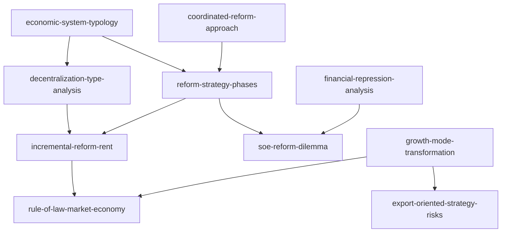

# INDEX — 《中国改革三部曲》skill 总览与引用图

> 蒸馏自吴敬琏《中国改革三部曲》（中信 2017；Ⅰ《论竞争性市场体制》1991、Ⅱ《当代中国经济改革》、Ⅲ《中国增长模式抉择》）。10 个 skill 全部通过三重验证。吴敬琏体系与书架既有五卷不同源，为"中国改革叙事"的第三种视角（理论/方案设计者视角）。

## 一、Skill 总览

| # | Skill | 一句话 | 类型 | 出处 |
|---|---|---|---|---|
| 1 | [economic-system-typology](../skills/economic-system-typology/SKILL.md) | 科尔奈四象限定位经济体+计划经济两隐含前提 | 框架·核心 | Ⅰ第二讲 |
| 2 | [decentralization-type-analysis](../skills/decentralization-type-analysis/SKILL.md) | 行政性分权 vs 经济性分权与"放-乱-收-死" | 框架·核心 | Ⅰ第七讲 |
| 3 | [reform-strategy-phases](../skills/reform-strategy-phases/SKILL.md) | 改革战略三阶段（行政分权→增量→整体推进） | 框架 | Ⅱ第二章 |
| 4 | [incremental-reform-rent](../skills/incremental-reform-rent/SKILL.md) | 双轨制租金结构与两种收敛前途 | 框架 | Ⅱ第二、十一章 |
| 5 | [soe-reform-dilemma](../skills/soe-reform-dilemma/SKILL.md) | 国企"放权-收权"两难与产权框架诊断 | 框架 | Ⅱ第四章 |
| 6 | [growth-mode-transformation](../skills/growth-mode-transformation/SKILL.md) | 粗放→集约：TFP/ICOR/苏联现象/体制遗产 | 框架·核心 | Ⅲ全卷 |
| 7 | [export-oriented-strategy-risks](../skills/export-oriented-strategy-risks/SKILL.md) | 出口导向的转型时点与东亚镜鉴 | 框架 | Ⅲ第五章 |
| 8 | [coordinated-reform-approach](../skills/coordinated-reform-approach/SKILL.md) | 整体协调改革论：配套的方法论 | 框架 | Ⅰ第六、十二讲 |
| 9 | [rule-of-law-market-economy](../skills/rule-of-law-market-economy/SKILL.md) | 两种前途：法治市场经济 vs 权贵资本主义 | 框架 | Ⅱ十一章、Ⅲ六章 |
| 10 | [financial-repression-analysis](../skills/financial-repression-analysis/SKILL.md) | 金融压制光谱与股市功能错位 | 框架 | Ⅱ第六章 |

## 二、引用图

**组合阅读路径**：

- **理解中国改革的整体逻辑**：economic-system-typology → reform-strategy-phases → incremental-reform-rent → rule-of-law-market-economy
- **理解央地与政府行为**：decentralization-type-analysis → （姊妹卷）government-behavior-phases → coordinated-reform-approach
- **理解增长与转型**：growth-mode-transformation → export-oriented-strategy-risks + （姊妹卷）manufacturing-share-diagnosis
- **企业与金融**：soe-reform-dilemma → financial-repression-analysis

## 三、与书架其他书的关系（三种改革叙事）

- **吴敬琏（本卷）**：理论/方案设计者视角——市场取向、整体配套、两种前途
- **黄奇帆两卷**：实操者视角——结构分析与政策工具（供给侧、要素市场化、国资运作），承接吴敬琏的改革议题落地
- **温铁军两卷**：代价视角——成本转嫁、三农承载，对吴敬琏的市场化叙事构成对冲
- 互补对照：growth-mode-transformation（理论源头）↔ 姊妹卷的供给侧与制造业 skills；rule-of-law-market-economy ↔ 温铁军 government-entry-exit-cycle 的政策哲学对冲

## 四、支撑材料

- [BOOK_OVERVIEW.md](./BOOK_OVERVIEW.md) — 整书理解（三部结构）
- [GLOSSARY.md](./GLOSSARY.md) — 共享术语词典
- [verified.md](./verified.md) — 三重验证；[rejected/REJECTED.md](./rejected/REJECTED.md) — 淘汰审计
- [candidates/](./candidates/) — 框架 10 / 原则 8 / 案例 10 / 反例 6 / 术语 12
- [TEST_RESULTS.md](./TEST_RESULTS.md) — 压力测试
- [DIGEST.md](./DIGEST.md) — 精华长文
