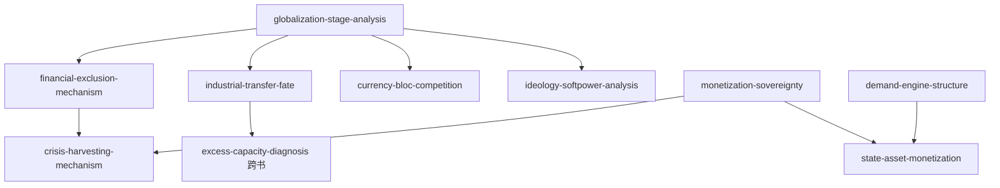

# INDEX — 《从"老冷战"到"新冷战"》skill 总览与引用图

> 蒸馏自温铁军、李卞《从"老冷战"到"新冷战"》（讲稿汇编 v1.0，2023）。9 个 skill 全部通过三重验证。本卷与姊妹卷《八次危机》（eight-crises）同作者互补，与黄奇帆两卷方法不同源。

## 一、Skill 总览

| # | Skill | 一句话 | 类型 | 章节 |
|---|---|---|---|---|
| 1 | [globalization-stage-analysis](../skills/globalization-stage-analysis/SKILL.md) | 全球化三阶段坐标：阶段决定竞争要素与冲突形态 | 框架·核心 | 第一章 |
| 2 | [financial-exclusion-mechanism](../skills/financial-exclusion-mechanism/SKILL.md) | 美元循环与金融排斥：需要而非强迫的剥夺、荷兰病 | 框架 | 第一、四章 |
| 3 | [industrial-transfer-fate](../skills/industrial-transfer-fate/SKILL.md) | 产业转移的双向命运：债权国金融占有 vs 承接国债务与失语 | 框架 | 第一、三章 |
| 4 | [monetization-sovereignty](../skills/monetization-sovereignty/SKILL.md) | 货币化主权：赋权主体是政治主权，非货币化与休克疗法的教训 | 框架·核心 | 第二、三章 |
| 5 | [crisis-harvesting-mechanism](../skills/crisis-harvesting-mechanism/SKILL.md) | 危机收割四步：无定价资产→休克开放→硬通货收购→定价收益回流 | 框架 | 第三章 |
| 6 | [currency-bloc-competition](../skills/currency-bloc-competition/SKILL.md) | 货币集团竞争：话语权→制度权→获利方式 | 框架 | 第三、五章 |
| 7 | [demand-engine-structure](../skills/demand-engine-structure/SKILL.md) | 三驾马车驾辕分析：内需/外需/投资的主从切换 | 框架 | 第五章 |
| 8 | [state-asset-monetization](../skills/state-asset-monetization/SKILL.md) | 国家资本与资产货币化：债务性质、举国互救、生态改锚 | 框架 | 第三、五章 |
| 9 | [ideology-softpower-analysis](../skills/ideology-softpower-analysis/SKILL.md) | 意识形态软实力：标签随利益反转与经验特性反制 | 框架 | 第二、四章 |

## 二、引用图

**组合阅读路径**：

- **读懂一条国际新闻**：globalization-stage-analysis（定位阶段与要素）→ currency-bloc-competition（货币利益归因）→ ideology-softpower-analysis（话语维度）
- **理解苏联解体与转轨**：monetization-sovereignty → crisis-harvesting-mechanism
- **理解中国模式**：state-asset-monetization → demand-engine-structure + （姊妹卷）rural-buffer-mechanism
- **产业与外资**：industrial-transfer-fate + （姊妹卷）foreign-capital-dependency-risk、chain-power-analysis

## 三、与书架其他书的关系（互补对照）

- 八次危机（同作者）：cost-transfer-analysis（三农代价归属）↔ 本卷 financial-exclusion-mechanism（全球金融剥夺）——内向转嫁与对外剥夺同构；foreign-capital-dependency-risk ↔ industrial-transfer-fate（中辍风险 vs 转移结构）
- 分析与思考：sovereign-currency-discipline（发行纪律）↔ 本卷 monetization-sovereignty（赋权主体）；rmb-internationalization-five-pools（建设路径）↔ currency-bloc-competition（对抗分析）

## 四、支撑材料

- [BOOK_OVERVIEW.md](./BOOK_OVERVIEW.md) — 整书理解
- [GLOSSARY.md](./GLOSSARY.md) — 共享术语词典
- [verified.md](./verified.md) — 三重验证；[rejected/REJECTED.md](./rejected/REJECTED.md) — 淘汰审计
- [candidates/](./candidates/) — 框架 10 / 原则 7 / 案例 8 / 反例 6 / 术语 11
- [TEST_RESULTS.md](./TEST_RESULTS.md) — 压力测试
- [DIGEST.md](./DIGEST.md) — 精华长文
