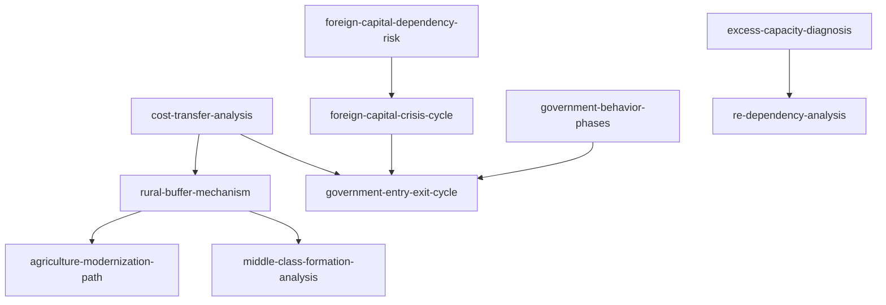

# INDEX — 《八次危机》skill 总览与引用图

> 蒸馏自温铁军《八次危机：中国的真实经验 (1949-2009)》（2013）。10 个 skill 全部通过三重验证（V1 跨域 / V2 预测力 / V3 独特性）。本作者方法论与书架既有两卷（黄奇帆）不同源，无跨书同族去重问题。

## 一、Skill 总览

| # | Skill | 一句话 | 类型 | 章节 |
|---|---|---|---|---|
| 1 | [cost-transfer-analysis](../skills/cost-transfer-analysis/SKILL.md) | 成本转嫁论：任何危机先问"代价谁承担"，软/硬着陆的真判据 | 框架·核心 | 前言、全书 |
| 2 | [foreign-capital-dependency-risk](../skills/foreign-capital-dependency-risk/SKILL.md) | 发展陷阱三要件与外资中辍风险、去依附能力盘点 | 框架 | 第一章 |
| 3 | [foreign-capital-crisis-cycle](../skills/foreign-capital-crisis-cycle/SKILL.md) | 外资—债务—危机周期律与危机归因检验（内生 vs 输入） | 框架 | 第一至四章 |
| 4 | [government-behavior-phases](../skills/government-behavior-phases/SKILL.md) | 财政决定政府行为：三阶段与以地套现闭环 | 框架 | 第一、四章 |
| 5 | [government-entry-exit-cycle](../skills/government-entry-exit-cycle/SKILL.md) | 政府退出/进入循环：危机应对的代价分配 | 框架 | 第三、四章 |
| 6 | [rural-buffer-mechanism](../skills/rural-buffer-mechanism/SKILL.md) | 三农缓冲机制：三池调节、衰减临界与城市化悖论 | 框架 | 第一、二、四章 |
| 7 | [excess-capacity-diagnosis](../skills/excess-capacity-diagnosis/SKILL.md) | 双重过剩的结构锁定与破局排序 | 框架 | 第三、四章 |
| 8 | [re-dependency-analysis](../skills/re-dependency-analysis/SKILL.md) | 再依附三构成与去依附策略 | 框架 | 第五部分 |
| 9 | [middle-class-formation-analysis](../skills/middle-class-formation-analysis/SKILL.md) | 图钉型社会与中产宿命的四条件检验 | 框架 | 第五部分 |
| 10 | [agriculture-modernization-path](../skills/agriculture-modernization-path/SKILL.md) | 农业路径的殖民化前提检验与双重外部性评估 | 框架 | 附录 |

## 二、引用图

**组合阅读路径**：

- **读懂一场危机**：cost-transfer-analysis（代价归属）→ foreign-capital-crisis-cycle（归因）→ government-entry-exit-cycle（应对模式）
- **理解中国政治经济**：government-behavior-phases → government-entry-exit-cycle → rural-buffer-mechanism
- **发展与国际比较**：foreign-capital-dependency-risk → re-dependency-analysis → agriculture-modernization-path
- **社会结构判断**：middle-class-formation-analysis → rural-buffer-mechanism

## 三、与书架其他书的关系

- 姊妹框架（互补而非重复）：[crisis-deferral-chain](../../strategy-and-path/)（黄奇帆卷，危机的时间传导）↔ 本卷 cost-transfer-analysis（危机的横向代价归属）
- [self-reliance-boundary]（黄奇帆卷，企业级自主化）↔ 本卷 foreign-capital-dependency-risk（国家级去依附）
- [city-land-structure]（黄奇帆卷，城市侧标尺）↔ 本卷 rural-buffer-mechanism（农村侧缓冲）

## 四、支撑材料

- [BOOK_OVERVIEW.md](./BOOK_OVERVIEW.md) — 整书理解（含作者批判）
- [GLOSSARY.md](./GLOSSARY.md) — 共享术语词典
- [verified.md](./verified.md) — 三重验证记录；[rejected/REJECTED.md](./rejected/REJECTED.md) — 淘汰审计
- [candidates/](./candidates/) — 框架 11 / 原则 10 / 案例 12 / 反例 7 / 术语 12
- [TEST_RESULTS.md](./TEST_RESULTS.md) — 压力测试结果
- [DIGEST.md](./DIGEST.md) — 精华长文
