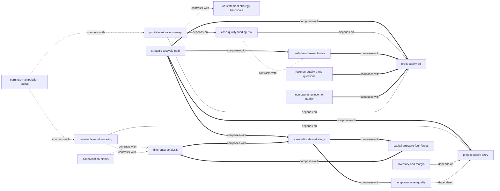

# 《财务报表分析(简明版·立体化数字教材版)》 — Skill Index

> 本书由 cangjie-skill 蒸馏, 共产出 **18** 个 skills。
> 处理时间: 2026-10-05

## 关于这本书

- **作者**: 张新民、钱爱民(对外经济贸易大学,张新民为"财务状况质量分析理论"创立者)
- **出版年**: 中国人民大学出版社,约 2020 年(教材配套案例为 2019 年报)
- **一句话主旨**: 看财务报表不能只看规模和比率,要把每张表、每个项目还原成"质量"和"战略"问题——资产有没有实际效用、利润是不是真金白银、资本结构在支持还是拖累企业——从而从公开报表反推出管理质量与企业质地。
- **整书理解**: 见 [BOOK_OVERVIEW.md](./BOOK_OVERVIEW.md)
- **精华长文** (不读全书看这篇): [DIGEST.md](./DIGEST.md) (流水线后续阶段产出)
- **术语词典**: [GLOSSARY.md](./GLOSSARY.md) (流水线后续阶段产出)

---

## Skill 列表 (按主题分组)

### 总纲与入口

- [`strategic-analysis-path`](../skills/strategic-analysis-path/SKILL.md) — 按"背景分析→会计分析→战略视角财务分析→前景预测"四步强制顺序, 对整份年报输出结构化综合分析。
- [`project-quality-entry`](../skills/project-quality-entry/SKILL.md) — 以审计意见定基调, 用重要性+例外原则圈定重大异动项目, 再以三性标尺(盈利/周转/保值)逐项评价并还原附注。

### 资产与负债质量

- [`receivables-and-funneling`](../skills/receivables-and-funneling/SKILL.md) — 应收账款三步检验+债务人六维分析+预付输送排查+其他应收款占用识别, 排查资金被占用与虚构收入挂账。
- [`inventory-and-margin`](../skills/inventory-and-margin/SKILL.md) — 按"构成-盈利性-周转性-保值性"四维评价存货质量, 用归因清单识别毛利率异常与"低转成本"。
- [`long-term-asset-quality`](../skills/long-term-asset-quality/SKILL.md) — 逐项判读长期股权投资、固定资产、在建工程、无形资产、商誉的质量与减值时点, 配对科目内含操纵手法。
- [`cash-quality-funding-risk`](../skills/cash-quality-funding-risk/SKILL.md) — 货币资金三维质量诊断+核心利润获现率检验+缺口五类归因+短贷长投推演, 回答"有利润没钱"。

### 战略透视

- [`asset-allocation-strategy`](../skills/asset-allocation-strategy/SKILL.md) — 从资产结构判断经营主导/投资主导/并重的战略类型, 并评估利润结构与资产结构的战略吻合性。
- [`capital-structure-four-forces`](../skills/capital-structure-four-forces/SKILL.md) — 用四大动力读资产负债表右边, 做资本四分类五型与结构质量五关注, 双向评价杠杆、举债与分红。

### 利润与现金验证

- [`profit-quality-3d`](../skills/profit-quality-3d/SKILL.md) — 利润表分层到核心利润, 按含金量/持续性/战略吻合性三维评价利润质量, 无关项目不得与收入比。
- [`revenue-quality-three-questions`](../skills/revenue-quality-three-questions/SKILL.md) — 按"卖什么/卖给谁/靠什么"三问五维拆解收入构成、客户集中度与可持续性。
- [`non-operating-income-quality`](../skills/non-operating-income-quality/SKILL.md) — 深挖投资收益、政府补助、公允价值变动等非经营性损益的含金量与可持续性, 识别浮盈与补贴挂账。
- [`cash-flow-three-activities`](../skills/cash-flow-three-activities/SKILL.md) — 按经营三性、投资战略吻合、筹资行为恰当三维度拆解现金流量表, 禁止只看净额正负下结论。

### 集团与比率工具

- [`consolidation-pitfalls`](../skills/consolidation-pitfalls/SKILL.md) — 合并报表负面清单: 它是会计主体的混合物, 偿债分红等真金白银决策必须回到母公司报表, 警惕合并比率三大失真。
- [`differential-analysis`](../skills/differential-analysis/SKILL.md) — 逐项相减合并与母公司报表, 把"越合并越小"的差额读成控制性投资与资金管理模式, 算撬动倍数并辨母子业务模式。
- [`ratio-revision-rules`](../skills/ratio-revision-rules/SKILL.md) — 常规比率反直觉或与同行不可比时的口径修正纪律: OPM 悖论、利息保障倍数重定义、周转率三修正等。

### 风险扫雷

- [`earnings-manipulation-tactics`](../skills/earnings-manipulation-tactics/SKILL.md) — 十种利润粉饰手法的造假机理与科目级核查动作, 供系统性逐项排查。
- [`profit-deterioration-sweep`](../skills/profit-deterioration-sweep/SKILL.md) — 12 种利润质量恶化外在表现按四组清点交叉命中并分级, 用洗大澡两阶段剧本与扭亏成色检验推演下一年。
- [`off-statement-strategy-blindspots`](../skills/off-statement-strategy-blindspots/SKILL.md) — 处理控制人风险、无法表示意见等使报表分析前提失效的报表外盲区, 并评估跨界并购合理性。

---

## 引用图



图例:
- `-->`  depends-on
- `-.->` contrasts-with
- `===>` composes-with

---

## 推荐学习顺序

(从依赖图的叶子节点开始, 向上)

1. **project-quality-entry** — 最基础, 没有前置: 审计意见判读+重大异动圈定+三性标尺, 是所有科目级 skill 的公共入口
2. **receivables-and-funneling** — 依赖 project-quality-entry, 商业债权与占款识别
3. **inventory-and-margin** — 依赖 project-quality-entry, 与 receivables-and-funneling 同为流动资产科目工具
4. **long-term-asset-quality** — 依赖 project-quality-entry, 覆盖非流动资产的逐项判读
5. **profit-quality-3d** — 无前置, 定义"核心利润"口径, 是现金验证类 skill 的分母来源
6. **revenue-quality-three-questions** — 与 profit-quality-3d 互补, 深挖持续性维度中的收入构成
7. **non-operating-income-quality** — 与 profit-quality-3d 互补, 深挖剔除非经营项目后的含金量
8. **cash-quality-funding-risk** — 依赖 profit-quality-3d (获现率=经营现金净流量÷核心利润)
9. **cash-flow-three-activities** — 与 cash-quality-funding-risk 分工: 整表三框架 vs 货币资金单项诊断
10. **asset-allocation-strategy** — 组合 long-term-asset-quality 的逐项结论, 上升到资源配置战略
11. **capital-structure-four-forces** — 与 asset-allocation-strategy 对应资产负债表右半边
12. **consolidation-pitfalls** — 无前置, 合并报表使用的负面清单
13. **differential-analysis** — 与 consolidation-pitfalls 相反相成: 一个讲"哪不能用", 一个讲"差额怎么用"
14. **ratio-revision-rules** — 无前置, 随时可查的比率口径修正纪律
15. **earnings-manipulation-tactics** — 与各科目级质量分析对照使用: 常规评价 vs 预设怀疑的机理排查
16. **profit-deterioration-sweep** — 依赖 profit-quality-3d 与 cash-quality-funding-risk (扭亏成色=核心利润转正+获现率>1)
17. **off-statement-strategy-blindspots** — 与 strategic-analysis-path 对照: 报表内做完后检查报表外致命盲区
18. **strategic-analysis-path** — 收口: 把以上所有单项工具组装进四步综合路径, 建议最后学、最先用

---

## 安装使用

本目录是构建产物, 宿主不会从这里加载 skill。要让 agent 真正调用, 把 skill 目录复制到宿主的 skills 目录:

```bash
# 用户级 (所有项目可用)
cp -r strategic-analysis-path ~/.claude/skills/
cp -r profit-quality-3d ~/.claude/skills/

# 或项目级
cp -r strategic-analysis-path <project>/.claude/skills/    # Claude Code
cp -r profit-quality-3d <project>/.cursor/skills/          # Cursor
```

---

## 接入 darwin-skill

所有 skill 均带有 `test-prompts.json` (darwin-skill 兼容格式), 可直接接入自动进化:

```
darwin evolve books/financial-statement-analysis/
```

---

## 审计轨迹

- 候选单元池: [candidates/](./candidates/) — 共 **224 条** (frameworks 59 / principles 60 / cases 33 / counter-examples 25 / glossary 47)
- 验证范围: framework + principle + counter-example 共 144 条 → **通过 81 单元 (56%)**, 三重验证 (V1/V2/V3) 判定详见 [_verify/](./verified-A.md)
- 被淘汰的候选 (含原因, 36 条): [rejected/](./rejected/)
- 合并去向: 81 个通过单元 → **18 个 skill**, 映射总表见 [verified.md](./verified.md); cases 不做独立 skill (进 DIGEST 与各 skill 的 A1 段), glossary 不做独立 skill (进 GLOSSARY.md)
- BOOK_OVERVIEW: [BOOK_OVERVIEW.md](./BOOK_OVERVIEW.md)
