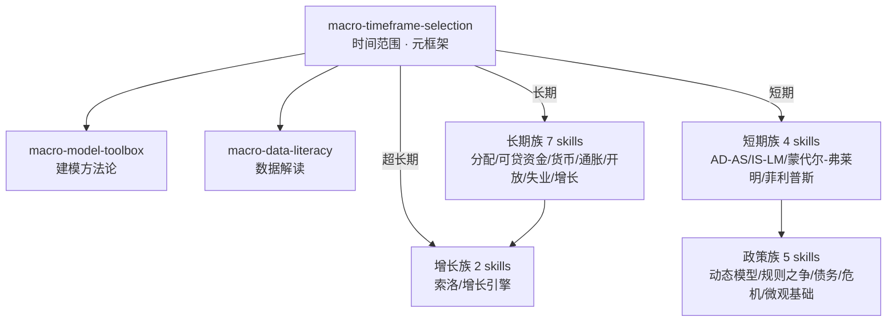

# 曼昆宏观经济学（第十版）

由曼昆《宏观经济学（第十版）》（*Macroeconomics, 10th Edition*）蒸馏出的一组**可被 AI Agent 调用的技能**（Skills）。

> 把宏观经济学的模型工具箱——时间范围选择、数据解读、长期收入分配、货币与通胀、开放经济、
> 失业结构、增长理论、IS-LM 需求管理、蒙代尔-弗莱明、菲利普斯曲线、泰勒规则、政策之争、
> 政府债务、金融危机、消费与投资微观基础——提炼成 20 个原子化技能，
> 让 Agent 能在真实的宏观新闻解读、政策评估与经济决策场景里调用它们。

---

## 来源

| | |
|---|---|
| **书名** | 宏观经济学（第十版）（*Macroeconomics, 10th Edition*） |
| **作者** | N. Gregory Mankiw（N. 格里高利·曼昆，哈佛大学教授） |
| **出版** | 中文版·中国人民大学出版社（经济学译丛）；英文原版 Worth Publishers（作者序 2018 年 5 月） |
| **蒸馏工具** | cangjie-skill（仓颉：把长内容蒸馏成可调用技能的流水线） |
| **蒸馏方法** | RIA-TV++（整书理解 → 并行提取 → 三重验证 → RIA++ 构造 → 链接 → 压力测试 → 交付） |
| **文本来源** | 扫描版 PDF（479 页）OCR 提取全文后蒸馏 |

---

## 20 个技能

**入口元框架**
- [`macro-timeframe-selection`](skills/macro-timeframe-selection/SKILL.md) — **时间范围选择**：任何宏观问题先问长期还是短期，再选模型（全书元框架）
- [`macro-model-toolbox`](skills/macro-model-toolbox/SKILL.md) — **模型工具箱思维**：内生/外生变量、简化与目的、假设纪律
- [`macro-data-literacy`](skills/macro-data-literacy/SKILL.md) — **经济数据解读**：GDP/CPI/失业率的口径、换算与偏差检查清单

**长期与古典理论**
- [`factor-income-distribution`](skills/factor-income-distribution/SKILL.md) — **收入分配**：生产函数、边际产量与要素份额（Ch3）
- [`loanable-funds-analysis`](skills/loanable-funds-analysis/SKILL.md) — **可贷资金**：储蓄-投资-利率与财政政策长期推演（Ch3）
- [`money-system-analysis`](skills/money-system-analysis/SKILL.md) — **货币系统**：货币创造、乘数与央行工具边界（Ch4）
- [`inflation-diagnosis`](skills/inflation-diagnosis/SKILL.md) — **通胀诊断**：数量论、费雪效应、通胀成本与恶性通胀（Ch5）
- [`open-economy-flows`](skills/open-economy-flows/SKILL.md) — **开放经济长期**：S-I=NX、汇率与购买力平价（Ch6）
- [`unemployment-diagnosis`](skills/unemployment-diagnosis/SKILL.md) — **失业诊断**：自然率、摩擦/结构失业与效率工资（Ch7）

**增长理论**
- [`solow-golden-rule`](skills/solow-golden-rule/SKILL.md) — **索洛与黄金律**：资本积累的稳态分析与黄金律检验（Ch8）
- [`growth-engine-analysis`](skills/growth-engine-analysis/SKILL.md) — **增长引擎**：技术进步、内生增长与制度（Ch9）

**短期波动**
- [`ad-as-fluctuations`](skills/ad-as-fluctuations/SKILL.md) — **波动总框架**：冲击分类、AD-AS 与奥肯定律（Ch10）
- [`is-lm-demand-management`](skills/is-lm-demand-management/SKILL.md) — **IS-LM 需求管理**：冲击诊断、大萧条归因、零下限工具箱（Ch11-12）
- [`mundell-fleming-analysis`](skills/mundell-fleming-analysis/SKILL.md) — **蒙代尔-弗莱明**：政策效果随汇率制度反转与不可能三角（Ch13）
- [`phillips-curve-analysis`](skills/phillips-curve-analysis/SKILL.md) — **菲利普斯曲线**：通胀三力量、牺牲率与可信性（Ch14）

**政策专题**
- [`dynamic-ad-as-taylor-rule`](skills/dynamic-ad-as-taylor-rule/SKILL.md) — **动态 AD-AS 与泰勒规则**：五方程模型与泰勒原理（Ch15）
- [`policy-rules-vs-discretion`](skills/policy-rules-vs-discretion/SKILL.md) — **政策之争**：时滞、卢卡斯批判、时间不一致性（Ch16）
- [`government-debt-analysis`](skills/government-debt-analysis/SKILL.md) — **政府债务**：衡量陷阱、传统 vs 李嘉图观点（Ch17）
- [`financial-crisis-diagnosis`](skills/financial-crisis-diagnosis/SKILL.md) — **金融危机诊断**：六元素解剖、杠杆放大器与监管工具（Ch18）
- [`consumption-investment-basics`](skills/consumption-investment-basics/SKILL.md) — **消费与投资微观基础**：永久收入、借款约束、托宾 q（Ch19）

---

## 技能之间的引用关系



图例：`macro-timeframe-selection` 是入口（如微观卷的 `econ-ten-principles`），四大族沿时间范围与主题分流。完整单技能级引用图见 [`INDEX.md`](INDEX.md)。

**推荐学习顺序**：`macro-timeframe-selection` → `macro-data-literacy` → 长期族 → 增长族 → 短期族 → 政策族（沿原书"先长期后短期"的教学次序）

**快速决策指南**：

| 你的问题 | 调用哪个 Skill |
|---|---|
| 经济新闻数据怎么读 | `macro-data-literacy` |
| 印钱/降息有没有用 | `macro-timeframe-selection` |
| 通胀从哪来、多严重 | `inflation-diagnosis` |
| 关税/汇率/贸易顺差 | `open-economy-flows` / `mundell-fleming-analysis` |
| 失业为什么高 | `unemployment-diagnosis` |
| 国家为什么穷、增长靠什么 | `growth-engine-analysis` |
| 降息为什么没效果 | `is-lm-demand-management` |
| 国债多大算危险 | `government-debt-analysis` |
| 银行间利率飙升说明什么 | `financial-crisis-diagnosis` |
| 发消费券有效吗 | `consumption-investment-basics` |

---

## 安装

每个技能目录都包含 `SKILL.md`（+ `test-prompts.json` / `test-results.md` 测试产物），可直接复制到宿主环境：

```bash
# Claude Code（用户级，所有项目可用）
cp -r skills/* ~/.claude/skills/

# 或 Claude Code（项目级）
cp -r skills/* <project>/.claude/skills/

# Trae（项目级）
cp -r skills/* <project>/.trae/skills/

# Cursor（项目级）
cp -r skills/* <project>/.cursor/skills/
```

---

## 完整文档

`docs/` 目录保留了完整的蒸馏产物与审计轨迹：

| 文件 | 说明 |
|---|---|
| [`DIGEST.md`](docs/DIGEST.md) | 面向读者的精华长文（约 8000 字，不读全书看这篇） |
| [`GLOSSARY.md`](docs/GLOSSARY.md) | 共享术语词典（90 个核心术语，作者本人用法） |
| [`INDEX.md`](docs/INDEX.md) | 技能总览 + 引用图 + 快速决策指南 |
| [`BOOK_OVERVIEW.md`](docs/BOOK_OVERVIEW.md) | 整书理解（结构/解释/批判/应用潜力） |
| [`verified.md`](docs/verified.md) | 三重验证结果（625 条候选 → 20 通过） |
| [`PIPELINE_STATE.md`](docs/PIPELINE_STATE.md) | 流水线各阶段状态 |
| [`candidates/`](docs/candidates/) | 7 个提取组的原始候选池（35 个文件，625 条） |
| [`rejected/`](docs/rejected/) | 未独立成 skill 的边缘主题及原因 |

---

## 目录结构

```text
mankiw-macroeconomics-10e/
├── README.md
├── skills/                      # 20 个可安装技能（核心交付物）
│   └── <skill-slug>/
│       ├── SKILL.md             # 技能定义（R/I/A1/A2/E/B 六段）
│       ├── test-prompts.json    # 触发/诱饵测试集
│       └── test-results.md      # 盲测结果
└── docs/                        # 蒸馏文档与审计轨迹
    ├── DIGEST.md / GLOSSARY.md / INDEX.md
    ├── BOOK_OVERVIEW.md / verified.md / PIPELINE_STATE.md
    └── candidates/              # 7 组提取候选池（框架/原则/案例/反例/术语）
```

---

## 关于内容与版权

本项目是**方法论蒸馏产物**，不含原书全文：

- 原书为扫描版 PDF，经本地 OCR 提取全文用于蒸馏，**提取文本不随本仓库分发、不长期留存**；
- 每个技能对原书的引用严格控制在**≤60 字/处**，远低于合理引用上限，属于评论与教学方法论范畴；
- 原文的版权归原作者曼昆、译者及中国人民大学出版社 / Worth Publishers 所有；
- 建议购买正版书籍配合使用。

---

## 如何重新生成

本项目由 cangjie-skill（仓颉蒸馏流水线）自动生成。若要复现或调整：

1. 准备书籍文本（扫描版 PDF → RapidOCR 200/170dpi 提取 → 按章切分）
2. 运行 RIA-TV++ 流水线（阶段 0–5，详见 `docs/PIPELINE_STATE.md`）
3. 通过三重验证 + 盲测（独立评审代理"菜单选择题"142/142 通过）的 20 个单元被构造为独立技能

如需让技能持续进化，可喂给 `darwin-skill`：`darwin evolve mankiw-macroeconomics-10e/`
