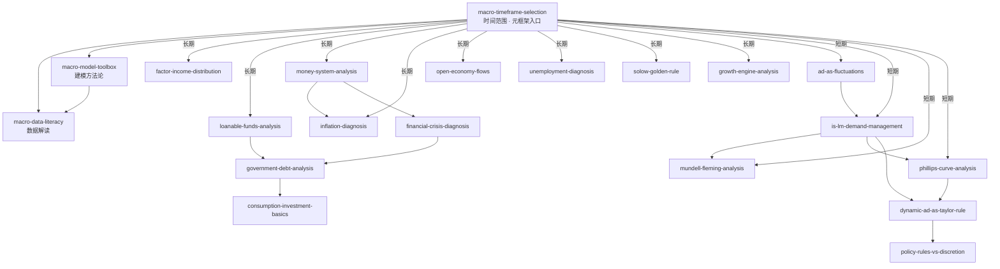

# INDEX — 技能总览与引用图

> 《宏观经济学（第十版）》蒸馏出 **20 个 skill**。本文件是技能间的路由图：从问题出发找到该用的 skill。

## 技能总览

| # | Skill | 一句话定位 | 主要章节 |
|---|---|---|---|
| 1 | [`macro-timeframe-selection`](skills/macro-timeframe-selection/SKILL.md) | **元框架入口**：任何宏观问题先问时间范围，再选模型 | Ch1/10/12/结束语 |
| 2 | [`macro-model-toolbox`](skills/macro-model-toolbox/SKILL.md) | 建模方法论：内生/外生、简化与目的、假设纪律 | Ch1-3 |
| 3 | [`macro-data-literacy`](skills/macro-data-literacy/SKILL.md) | 读 GDP/CPI/失业率：口径、换算与偏差检查清单 | Ch2 |
| 4 | [`factor-income-distribution`](skills/factor-income-distribution/SKILL.md) | 长期收入如何分配：生产函数、边际产量、要素份额 | Ch3 |
| 5 | [`loanable-funds-analysis`](skills/loanable-funds-analysis/SKILL.md) | 储蓄-投资-利率与财政政策的长期推演（挤出） | Ch3 |
| 6 | [`money-system-analysis`](skills/money-system-analysis/SKILL.md) | 货币怎么被创造：三职能、乘数、央行工具边界 | Ch4 |
| 7 | [`inflation-diagnosis`](skills/inflation-diagnosis/SKILL.md) | 通胀诊断：数量论→费雪→铸币税→恶性通胀 | Ch5 |
| 8 | [`open-economy-flows`](skills/open-economy-flows/SKILL.md) | 开放经济长期：S-I=NX、汇率、购买力平价 | Ch6 |
| 9 | [`unemployment-diagnosis`](skills/unemployment-diagnosis/SKILL.md) | 失业结构诊断：自然率、摩擦/结构、效率工资 | Ch7 |
| 10 | [`solow-golden-rule`](skills/solow-golden-rule/SKILL.md) | 资本积累与黄金律检验：储蓄率该多高 | Ch8 |
| 11 | [`growth-engine-analysis`](skills/growth-engine-analysis/SKILL.md) | 持续增长从哪来：技术、内生增长与制度 | Ch9 |
| 12 | [`ad-as-fluctuations`](skills/ad-as-fluctuations/SKILL.md) | 波动总框架：冲击分类、AD-AS、奥肯定律 | Ch10 |
| 13 | [`is-lm-demand-management`](skills/is-lm-demand-management/SKILL.md) | 需求管理：IS-LM 冲击诊断、大萧条归因、零下限 | Ch11-12 |
| 14 | [`mundell-fleming-analysis`](skills/mundell-fleming-analysis/SKILL.md) | 开放经济短期：政策效果随汇率制度反转、不可能三角 | Ch13 |
| 15 | [`phillips-curve-analysis`](skills/phillips-curve-analysis/SKILL.md) | 通胀-失业短期权衡：三力量、牺牲率、可信性 | Ch14 |
| 16 | [`dynamic-ad-as-taylor-rule`](skills/dynamic-ad-as-taylor-rule/SKILL.md) | 现代政策模型：五方程动态 AD-AS 与泰勒原理 | Ch15 |
| 17 | [`policy-rules-vs-discretion`](skills/policy-rules-vs-discretion/SKILL.md) | 政策之争：时滞、卢卡斯批判、时间不一致性 | Ch16 |
| 18 | [`government-debt-analysis`](skills/government-debt-analysis/SKILL.md) | 政府债务：衡量陷阱、传统 vs 李嘉图、代际账 | Ch17 |
| 19 | [`financial-crisis-diagnosis`](skills/financial-crisis-diagnosis/SKILL.md) | 金融系统与危机：六元素解剖、杠杆、监管工具 | Ch18 |
| 20 | [`consumption-investment-basics`](skills/consumption-investment-basics/SKILL.md) | 微观基础：永久收入、借款约束、托宾 q | Ch19 |

## 引用关系图

图例：`-->` 依赖/延伸方向。`macro-timeframe-selection` 是入口元框架，其余 skill 都从它分流到具体工具族。

## 快速决策指南

| 你的问题 | 调用哪个 Skill |
|---|---|
| 新闻里的经济数据（GDP/CPI/失业率）怎么读 | `macro-data-literacy` |
| 印钱/降息/刺激到底有没有用 | `macro-timeframe-selection`（先定位，再转具体工具） |
| AI/移民/教育对工资的影响 | `factor-income-distribution` |
| 减税、赤字对利率和投资的影响 | `loanable-funds-analysis` → 深入 `government-debt-analysis` |
| QE、比特币、银行创造货币 | `money-system-analysis` |
| 通胀从哪来、多严重、怎么结束 | `inflation-diagnosis` |
| 关税、汇率、贸易顺差 | `open-economy-flows`（长期）/ `mundell-fleming-analysis`（短期） |
| 失业为什么高、救济怎么设计 | `unemployment-diagnosis` |
| 国家该多储蓄、基建该不该狂投 | `solow-golden-rule` |
| 国家为什么穷/富、增长靠什么 | `growth-engine-analysis` |
| 这次算衰退吗、油价冲击怎么办 | `ad-as-fluctuations` |
| 降息为什么没效果、刺激规模多大 | `is-lm-demand-management` |
| 央行该盯汇率还是保独立 | `mundell-fleming-analysis` |
| 反通胀要付出多大代价 | `phillips-curve-analysis` |
| 央行规则合不合理、该不该机械执行 | `dynamic-ad-as-taylor-rule` → `policy-rules-vs-discretion` |
| 国债多大算危险、减税是发红包吗 | `government-debt-analysis` |
| 银行间利率飙升、救助该不该做 | `financial-crisis-diagnosis` |
| 发消费券有效吗、该不该扩产能 | `consumption-investment-basics` |

## 推荐学习顺序

`macro-timeframe-selection` → `macro-data-literacy` → 长期族（`factor-income-distribution` → `loanable-funds-analysis` → `money-system-analysis` → `inflation-diagnosis` → `open-economy-flows` → `unemployment-diagnosis`）→ 增长族（`solow-golden-rule` → `growth-engine-analysis`）→ 短期族（`ad-as-fluctuations` → `is-lm-demand-management` → `mundell-fleming-analysis` → `phillips-curve-analysis`）→ 政策族（`dynamic-ad-as-taylor-rule` → `policy-rules-vs-discretion` → `government-debt-analysis` → `financial-crisis-diagnosis` → `consumption-investment-basics`）
