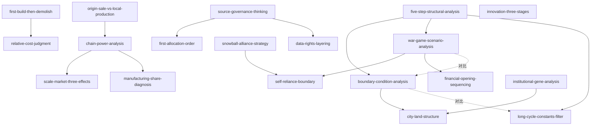

# INDEX — 《战略与路径》skill 总览与引用图

> 蒸馏自黄奇帆《战略与路径：黄奇帆的十二堂经济课》（2022）。19 个 skill 全部通过三重验证（V1 跨域 / V2 预测力 / V3 独特性）。

## 一、Skill 总览

| # | Skill | 一句话 | 类型 | 章节 |
|---|---|---|---|---|
| 1 | [five-step-structural-analysis](../skills/five-step-structural-analysis/SKILL.md) | 数据→边界条件→机制→推演→对策的五步分析骨架 | 框架 | 全书 |
| 2 | [boundary-condition-analysis](../skills/boundary-condition-analysis/SKILL.md) | 列慢变量清单判"结构性拐点还是周期波动" | 框架 | 第6章 |
| 3 | [war-game-scenario-analysis](../skills/war-game-scenario-analysis/SKILL.md) | 对抗情景双向推演+风险分级+配对反制 | 框架 | 第12章 |
| 4 | [first-build-then-demolish](../skills/first-build-then-demolish/SKILL.md) | 转型节奏：先立后破、爬行钉住、留冗余；立制度则窄起步轻负担 | 框架 | 第3章 |
| 5 | [origin-sale-vs-local-production](../skills/origin-sale-vs-local-production/SKILL.md) | 产地销/销地产二分法+搬迁时间常数证伪迁移传言 | 框架 | 第5章 |
| 6 | [chain-power-analysis](../skills/chain-power-analysis/SKILL.md) | 产业链权力五类型+链头三链判据 | 框架 | 第5章 |
| 7 | [scale-market-three-effects](../skills/scale-market-three-effects/SKILL.md) | 全门类×超大规模×单一市场的摊薄与引力机制 | 框架 | 第5章 |
| 8 | [data-rights-layering](../skills/data-rights-layering/SKILL.md) | 数据确权四层：国家/个人/平台/受让方 | 框架 | 第4章 |
| 9 | [snowball-alliance-strategy](../skills/snowball-alliance-strategy/SKILL.md) | 以存量合作为雪核逐层扩大朋友圈 | 框架 | 第9章 |
| 10 | [institutional-gene-analysis](../skills/institutional-gene-analysis/SKILL.md) | 用"基因+血脉"归因长期竞争力并评估可复制性 | 框架 | 第11章 |
| 11 | [long-cycle-constants-filter](../skills/long-cycle-constants-filter/SKILL.md) | 用十年级趋势清单过滤短期噪声，带证伪条款 | 框架 | 第12章 |
| 12 | [source-governance-thinking](../skills/source-governance-thinking/SKILL.md) | 广泛+长期的问题必从制度土壤求解 | 框架 | 第7章 |
| 13 | [innovation-three-stages](../skills/innovation-three-stages/SKILL.md) | 0→1/1→100/100→100万三段诊断创新断点 | 框架 | 第8章 |
| 14 | [first-allocation-order](../skills/first-allocation-order/SKILL.md) | 一次分配是基础、二次是关键、三次只是配套 | 原则 | 第7章 |
| 15 | [manufacturing-share-diagnosis](../skills/manufacturing-share-diagnosis/SKILL.md) | 制造业占比红线与国际经验四特征判空心化 | 原则 | 第5章 |
| 16 | [self-reliance-boundary](../skills/self-reliance-boundary/SKILL.md) | 只对"断供即封喉"环节自主化，反小而全 | 原则 | 第9章 |
| 17 | [relative-cost-judgment](../skills/relative-cost-judgment/SKILL.md) | 盯成本交叉点而非补贴口风，倒读政策信号 | 原则 | 第3章 |
| 18 | [financial-opening-sequencing](../skills/financial-opening-sequencing/SKILL.md) | 金融开放次序：门槛先行、管制是盾牌 | 原则 | 第10/12章 |
| 19 | [city-land-structure](../skills/city-land-structure/SKILL.md) | 城市齿轮梯次+土地标尺诊断楼市基本面 | 框架 | 第6章 |

## 二、引用图（composes / contrasts）

**组合阅读路径**（按使用场景）：

- **行业分析**：five-step-structural-analysis → boundary-condition-analysis → relative-cost-judgment
- **房地产/城市决策**：boundary-condition-analysis → city-land-structure → first-allocation-order
- **地缘与供应链**：war-game-scenario-analysis → self-reliance-boundary → origin-sale-vs-local-production → snowball-alliance-strategy → financial-opening-sequencing
- **组织与制度**：source-governance-thinking → first-allocation-order → innovation-three-stages → first-build-then-demolish

## 三、支撑材料

- [BOOK_OVERVIEW.md](./BOOK_OVERVIEW.md) — 阶段 0 整书理解（骨架/术语/批判）
- [GLOSSARY.md](./GLOSSARY.md) — 共享术语词典
- [verified.md](./verified.md) — 三重验证记录；[rejected/REJECTED.md](./rejected/REJECTED.md) — 淘汰审计
- [candidates/](./candidates/) — 提取器原始候选池（框架 19 / 原则 20 / 案例 25 / 反例 10 / 术语 15）
- [TEST_RESULTS.md](./TEST_RESULTS.md) — 压力测试结果
- [DIGEST.md](./DIGEST.md) — 面向读者的精华长文
