# 《激荡四十年：中国企业 1978—2018》 — Skill Index

> 本书由 cangjie-skill 蒸馏， 共产出 **16** 个 skills。
> 处理时间： 2026-10-05

## 关于这本书

- **作者**： 吴晓波（财经作家，"当代人写当代史"）
- **出版年**： 2017-2018（中信出版社；2018 修订版）
- **一句话主旨**： 四十年中国企业史是国营、民营、外资三大资本集团的博弈史，改革的每一步都从"违规"开始、在政策灰区中完成原始积累——制度创新可以逆转，技术破壁不可逆转；看懂制度窗口与政策周期的人赢得时代，把象征身份当护身符的人被时代清算。
- **整书理解**： 见 [BOOK_OVERVIEW.md](./BOOK_OVERVIEW.md)
- **精华长文** (不读全书看这篇)： [DIGEST.md](./DIGEST.md)（阶段 5 产出后可用）
- **术语词典**： [GLOSSARY.md](./GLOSSARY.md)

---

## Skill 列表 (按主题分组)

### 政策周期与信号（读风向）

- [`policy-thermometer-reading`](../skills/policy-thermometer-reading/SKILL.md) — 官方沉默、文件未出时，用一组代理指标（政策温度计）日常观测制度环境松紧。
- [`policy-signal-capture`](../skills/policy-signal-capture/SKILL.md) — 重大制度变革窗口出现时（南巡式信号），不等细则抢先布局并兑现窗口期红利。
- [`policy-cycle-positioning`](../skills/policy-cycle-positioning/SKILL.md) — 把决策放进"放—乱—收"政策周期坐标，定位调控阶段并评估自己成为"祭旗者"的暴露度。

### 制度灰区与套利

- [`dormant-clause-interpretation`](../skills/dormant-clause-interpretation/SKILL.md) — 政策文本条款级解读：从字缝里找合法性外壳，并排查"不得/严禁/原则上"休眠条款的激活风险。
- [`marginal-zone-entry`](../skills/marginal-zone-entry/SKILL.md) — 边区效应选址法：灰区业务落在旧体制最疏于防范的边缘洼地，并预设洼地被填平后的撤离时点。
- [`latecomer-resource-borrowing`](../skills/latecomer-resource-borrowing/SKILL.md) — 后发者"四借清单"（设备/技术/人员/市场）+"创新就是率先模仿"，拼激励优势而非拼资源。
- [`rent-based-model-audit`](../skills/rent-based-model-audit/SKILL.md) — 体检商业模式对制度租金（审批/补贴/公款消费）的依赖度，做"政策归零"现金流压测。

### 产权决策

- [`initial-identity-pricing`](../skills/initial-identity-pricing/SKILL.md) — 企业诞生/注册时点的身份选择（个体执照 vs 挂靠/代持），以"十年后退出能否打清官司"做远期定价。
- [`red-hat-structure-decision`](../skills/red-hat-structure-decision/SKILL.md) — 红帽子交易（私产挂靠集体/国有）的利弊账、清算情景定价与摘帽赎回时机。
- [`property-rights-timing`](../skills/property-rights-timing/SKILL.md) — 产权不清的存量企业：判断"分空饼"窗口是否关闭，在灰色 MBO 与另起炉灶之间对照决策。
- [`half-step-rights-reform`](../skills/half-step-rights-reform/SKILL.md) — 窗口未开时的产权自救"半步走"：分红权、增值权、增量分成等可升级安排，留待窗口开启转正式股权。

### 政商边界与姿态

- [`business-government-distance`](../skills/business-government-distance/SKILL.md) — 为企业设计对官方的公开姿态：三档政商距离谱系选位 + 灰区三戒生存纪律。
- [`institutional-leverage-negotiation`](../skills/institutional-leverage-negotiation/SKILL.md) — 向体制要权、要试点的谈判术："要试错豁免而非背书"，风险自担 + 既成事实筹码 + 母子结构借力。
- [`media-deification-cycle`](../skills/media-deification-cycle/SKILL.md) — 被树为典型/标杆/首富后的造神周期定位（内参→通稿→争议→调查），执行推荣誉、压表述的自保纪律。

### 企业命运与扩张风险

- [`delusional-expansion-detection`](../skills/delusional-expansion-detection/SKILL.md) — 识别狂想式扩张与多元化失控：速度三问 + 舆论反指 + 产融结合死线，输出扩张体检结论。
- [`bubble-exit-discipline`](../skills/bubble-exit-discipline/SKILL.md) — 行业/资产价格群体狂热的泡沫定性（三征兆 + 庞氏清单）与以行政动向为锚的逃顶纪律。

---

## 引用图

```mermaid
graph LR
    T[policy-thermometer-reading]
    S[policy-signal-capture]
    C[policy-cycle-positioning]
    F[dormant-clause-interpretation]
    M[marginal-zone-entry]
    L[latecomer-resource-borrowing]
    R[rent-based-model-audit]
    I[initial-identity-pricing]
    RH[red-hat-structure-decision]
    P[property-rights-timing]
    H[half-step-rights-reform]
    BG[business-government-distance]
    N[institutional-leverage-negotiation]
    MD[media-deification-cycle]
    DE[delusional-expansion-detection]
    BB[bubble-exit-discipline]

    S -->|depends-on| T
    R -->|depends-on| T
    DE -->|depends-on| MD
    H -->|depends-on| P
    BB -->|depends-on| C

    T -.->|contrasts-with| F
    T -.->|contrasts-with| MD
    S -.->|contrasts-with| C
    S -.->|contrasts-with| BG
    C -.->|contrasts-with| DE
    F -.->|contrasts-with| R
    M -.->|contrasts-with| L
    M -.->|contrasts-with| N
    M -.->|contrasts-with| I
    L -.->|contrasts-with| R
    L -.->|contrasts-with| DE
    BB -.->|contrasts-with| DE
    BB -.->|contrasts-with| R
    BB -.->|contrasts-with| MD
    R -.->|contrasts-with| C
    R -.->|contrasts-with| BG
    BG -.->|contrasts-with| N
    BG -.->|contrasts-with| MD
    N -.->|contrasts-with| S
    RH -.->|contrasts-with| P
    RH -.->|contrasts-with| I
    RH -.->|contrasts-with| H
    P -.->|contrasts-with| I
    P -.->|contrasts-with| BG
    H -.->|contrasts-with| RH

    S ===>|composes-with| M
    C ===>|composes-with| S
    M ===>|composes-with| F
    BB ===>|composes-with| DE
    N ===>|composes-with| H
    P ===>|composes-with| H
```



图例:
- `-->`  depends-on
- `-.->` contrasts-with
- `===>` composes-with

---

## 推荐学习顺序

(从依赖图的叶子节点开始, 向上)

1. **policy-thermometer-reading** — 最基础, 没有前置：观测是所有政策类判断的输入
2. **dormant-clause-interpretation** — 依赖温度计的分段（文件到手才逐条读）
3. **policy-signal-capture** — 依赖温度计交接棒（读数升格为确认信号后行动）
4. **policy-cycle-positioning** — 周期坐标，反哺信号可信度判断
5. **marginal-zone-entry** — 空间选址，与信号抢跑组合使用
6. **latecomer-resource-borrowing** — 起步要素清单，与选址互补
7. **rent-based-model-audit** — 依赖温度计读数，量化自身租金敞口
8. **business-government-distance** — 长期姿态设计，消费前述所有风险判断
9. **institutional-leverage-negotiation** — 单次谈判工艺，与姿态分工
10. **media-deification-cycle** — 被树典型后的动态自保
11. **delusional-expansion-detection** — 依赖媒体周期做舆论反指，诊断企业内部
12. **bubble-exit-discipline** — 市场级狂热的头寸逃顶，与扩张诊断对照
13. **initial-identity-pricing** — 产权线的起点：出生时的身份定价
14. **red-hat-structure-decision** — 存续期的挂靠交易与赎回
15. **property-rights-timing** — 存量产权的界定时机与路径分岔
16. **half-step-rights-reform** — 依赖时机判断结论，是窗口未开时的落地工具

---

## 安装使用

本目录是构建产物, 宿主不会从这里加载 skill。要让 agent 真正调用, 把 skill 目录复制到宿主的 skills 目录:

```bash
# 用户级 (所有项目可用)
cp -r books/turbulent-forty-years/skills/<skill-slug> ~/.claude/skills/

# 或项目级
cp -r books/turbulent-forty-years/skills/<skill-slug> <project>/.claude/skills/    # Claude Code
cp -r books/turbulent-forty-years/skills/<skill-slug> <project>/.cursor/skills/    # Cursor
```

---

## 接入 darwin-skill

所有 skill 均带有 `test-prompts.json` (darwin-skill 兼容格式), 可直接接入自动进化:

```
darwin evolve books/turbulent-forty-years/
```

---

## 审计轨迹

- 候选单元池: [candidates/](./candidates/)
- 被淘汰的候选 (含原因): [rejected/](./rejected/)
- BOOK_OVERVIEW: [BOOK_OVERVIEW.md](./BOOK_OVERVIEW.md)
