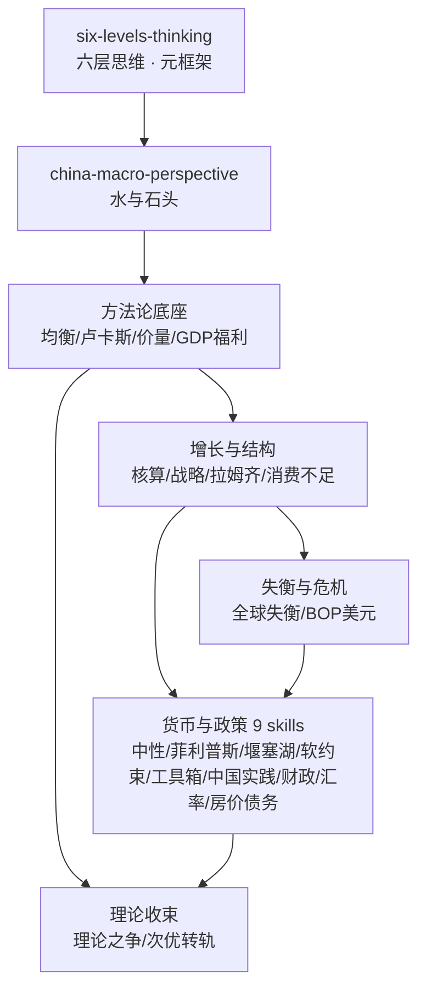

# 徐高宏观经济学二十五讲

由徐高《宏观经济学二十五讲：中国视角》（*Lectures on Macroeconomics from a Chinese Perspective*）蒸馏出的一组**可被 AI Agent 调用的技能**（Skills）。

> 用标准宏观经济学的均衡分析工具回答中国的真实宏观问题——消费不足、内外失衡、货币政策传导、
> 房价与债务、政策改革——并在"次优理论"的自觉下指出：忽视中国特有约束（收入分配、预算软约束、
> 政策目标函数）的最优化药方会系统性误判中国经济。24 个原子化技能覆盖从六层思维元框架到
> 增长核算、失衡危机、货币传导、房价债务的完整链条。

---

## 来源

| | |
|---|---|
| **书名** | 宏观经济学二十五讲：中国视角（*Lectures on Macroeconomics from a Chinese Perspective*） |
| **作者** | 徐高（中银国际证券首席经济学家；本书源自其在北京大学国家发展研究院的课程讲义） |
| **出版** | 2019 · 中国人民大学出版社（21世纪经济学系列教材）；姊妹篇《金融经济学二十五讲》 |
| **蒸馏工具** | cangjie-skill（仓颉：把长内容蒸馏成可调用技能的流水线） |
| **蒸馏方法** | RIA-TV++（整书理解 → 并行提取 → 三重验证 → RIA++ 构造 → 链接 → 压力测试 → 交付） |
| **文本来源** | 扫描版 PDF（497 页）OCR 提取全文后蒸馏 |

---

## 24 个技能

**元框架与认识论**
- [`six-levels-thinking`](skills/six-levels-thinking/SKILL.md) — **六层思维**：中国经济观点的定位仪（唯GDP论→天真的市场派→现实主义→…→道路自信）
- [`china-macro-perspective`](skills/china-macro-perspective/SKILL.md) — **水与石头**：方法普适、结论特殊——用普适工具+中国约束做分析

**方法论底座**
- [`equilibrium-methodology`](skills/equilibrium-methodology/SKILL.md) — **均衡建模纪律**：内生/外生、两步求解、校准思维（第5-6讲）
- [`expectations-lucas-critique`](skills/expectations-lucas-critique/SKILL.md) — **理性预期与卢卡斯批判**：政策评估必须内生化预期（第5讲）
- [`price-quantity-diagnosis`](skills/price-quantity-diagnosis/SKILL.md) — **价量判别法**：价量同向=需求、反向=供给（第1/3讲）
- [`gdp-welfare-analysis`](skills/gdp-welfare-analysis/SKILL.md) — **GDP 与福利标尺**：终极关切追问链（第2讲）

**增长与结构**
- [`china-growth-accounting`](skills/china-growth-accounting/SKILL.md) — **增长核算**：生产函数分解中国增速（第3讲）
- [`development-strategy-analysis`](skills/development-strategy-analysis/SKILL.md) — **发展战略**：比较优势 vs 赶超、索洛剩余再解读（第4讲）
- [`ramsey-consumption-savings`](skills/ramsey-consumption-savings/SKILL.md) — **拉姆齐模型**：跨期消费储蓄与"刺穿企业帷幕"（第7-8讲）
- [`china-underconsumption`](skills/china-underconsumption/SKILL.md) — **消费不足诊断**：收入分配根源与国企分红改革（第9讲）

**失衡与危机**
- [`global-imbalances-saving-glut`](skills/global-imbalances-saving-glut/SKILL.md) — **全球失衡**：S-I=CA 与过剩储蓄外溢（第10讲）
- [`bop-crisis-dollar-privilege`](skills/bop-crisis-dollar-privilege/SKILL.md) — **国际收支危机与美元特权**：Z 模型一鱼三吃（第11讲）

**货币与政策**
- [`money-neutrality-analysis`](skills/money-neutrality-analysis/SKILL.md) — **货币中性**：交易方程式、古典二分法、两层账（第13讲）
- [`phillips-curve-china`](skills/phillips-curve-china/SKILL.md) — **菲利普斯曲线**：中国逆时针螺旋与产出缺口替代（第14讲）
- [`monetary-transmission-blockage`](skills/monetary-transmission-blockage/SKILL.md) — **传导堰塞湖**：市场分割模型与流动性效应（第15讲）
- [`soft-budget-constraint`](skills/soft-budget-constraint/SKILL.md) — **预算软约束**：刚性兑付、挤出与"财政接权、金融卸责"（第16讲）
- [`monetary-policy-toolbox`](skills/monetary-policy-toolbox/SKILL.md) — **货币政策工具箱**：泰勒准则、三环套利、伯南克四步路线图（第17-18讲）
- [`china-monetary-practice`](skills/china-monetary-practice/SKILL.md) — **中国货币政策实践**：财政/货币主导与政策分析两步法（第19讲）
- [`fiscal-keynes-vs-ricardo`](skills/fiscal-keynes-vs-ricardo/SKILL.md) — **财政之争**：凯恩斯 vs 李嘉图的产能闲置度裁决（第12讲）
- [`exchange-rate-open-money`](skills/exchange-rate-open-money/SKILL.md) — **开放经济货币**：UIP 检验、不可能三角、冲销（第20讲）
- [`china-inflation-housing`](skills/china-inflation-housing/SKILL.md) — **结构性通胀与房价**：土地垄断供给与831大限断点（第21讲）
- [`china-debt-financial-chaos`](skills/china-debt-financial-chaos/SKILL.md) — **债务与金融乱象**：刚性储蓄者与猫鼠博弈（第22讲）

**理论收束**
- [`macro-theory-debate`](skills/macro-theory-debate/SKILL.md) — **理论之争**：新古典综合 vs 非正统的需求不足（第23-24讲）
- [`second-best-transition`](skills/second-best-transition/SKILL.md) — **次优理论与转轨**：阵痛是约束信号（第25讲）

---

## 技能之间的引用关系



图例：`six-levels-thinking` 是入口（如曼昆卷的 `macro-timeframe-selection`）。完整单技能级引用图见 [`INDEX.md`](INDEX.md)。与书架曼昆卷的关系：曼昆卷是通用工具箱，本卷是用工具箱解中国题并做方法论自觉。

**快速决策指南**：

| 你的问题 | 调用哪个 Skill |
|---|---|
| 一篇中国经济评论怎么评价 | `six-levels-thinking` |
| 西方理论能不能用于中国 | `china-macro-perspective` |
| 促消费该发钱还是改分红 | `china-underconsumption` |
| 降准了为什么实体融资还难 | `monetary-transmission-blockage` |
| 城投/刚兑/民企融资贵 | `soft-budget-constraint` |
| 房价怎么理解、控房价该不该紧货币 | `china-inflation-housing` |
| 中国债务会崩吗 | `china-debt-financial-chaos` |
| 人民币该不该自由浮动 | `exchange-rate-open-money` |
| 改革阵痛该忍还是该停 | `second-best-transition` |

---

## 安装

每个技能目录都包含 `SKILL.md`（+ `test-prompts.json` / `test-results.md` 测试产物），可直接复制到宿主环境：

```bash
# Claude Code（用户级，所有项目可用）
cp -r skills/* ~/.claude/skills/

# 或 Claude Code（项目级）
cp -r skills/* <project>/.claude/skills/

# Trae（项目级）
cp -r skills/* <project>/.trae/skills/

# Cursor（项目级）
cp -r skills/* <project>/.cursor/skills/
```

---

## 完整文档

`docs/` 目录保留了完整的蒸馏产物与审计轨迹：

| 文件 | 说明 |
|---|---|
| [`DIGEST.md`](docs/DIGEST.md) | 面向读者的精华长文（约 7700 字，不读全书看这篇） |
| [`GLOSSARY.md`](docs/GLOSSARY.md) | 共享术语词典（100 个核心术语，作者本人用法） |
| [`INDEX.md`](docs/INDEX.md) | 技能总览 + 引用图 + 快速决策指南 |
| [`BOOK_OVERVIEW.md`](docs/BOOK_OVERVIEW.md) | 整书理解（结构/解释/批判/应用潜力） |
| [`verified.md`](docs/verified.md) | 三重验证结果（789 条候选 → 24 通过） |
| [`PIPELINE_STATE.md`](docs/PIPELINE_STATE.md) | 流水线各阶段状态 |
| [`candidates/`](docs/candidates/) | 10 个提取组的原始候选池（50 个文件，789 条） |
| [`rejected/`](docs/rejected/) | 未独立成 skill 的边缘主题及原因 |

---

## 目录结构

```text
xugao-macro-25-lectures/
├── README.md
├── skills/                      # 24 个可安装技能（核心交付物）
│   └── <skill-slug>/
│       ├── SKILL.md             # 技能定义（R/I/A1/A2/E/B 六段）
│       ├── test-prompts.json    # 触发/诱饵测试集
│       └── test-results.md      # 盲测结果
└── docs/                        # 蒸馏文档与审计轨迹
    ├── DIGEST.md / GLOSSARY.md / INDEX.md
    ├── BOOK_OVERVIEW.md / verified.md / PIPELINE_STATE.md
    └── candidates/              # 10 组提取候选池（框架/原则/案例/反例/术语）
```

---

## 关于内容与版权

本项目是**方法论蒸馏产物**，不含原书全文：

- 原书为扫描版 PDF，经本地 OCR 提取全文用于蒸馏，**提取文本不随本仓库分发、不长期留存**；
- 每个技能对原书的引用严格控制在**≤60 字/处**，属于评论与教学方法论范畴；
- 原文的版权归原作者徐高及中国人民大学出版社所有；
- 建议购买正版书籍配合使用。

---

## 如何重新生成

本项目由 cangjie-skill（仓颉蒸馏流水线）自动生成。若要复现或调整：

1. 准备书籍文本（扫描版 PDF → RapidOCR 170dpi 提取 → 按讲切分）
2. 运行 RIA-TV++ 流水线（阶段 0–5，详见 `docs/PIPELINE_STATE.md`）
3. 通过三重验证 + 盲测（独立评审代理"菜单选择题"三轮修复后 171/173 通过）的 24 个单元被构造为独立技能

如需让技能持续进化，可喂给 `darwin-skill`：`darwin evolve xugao-macro-25-lectures/`
