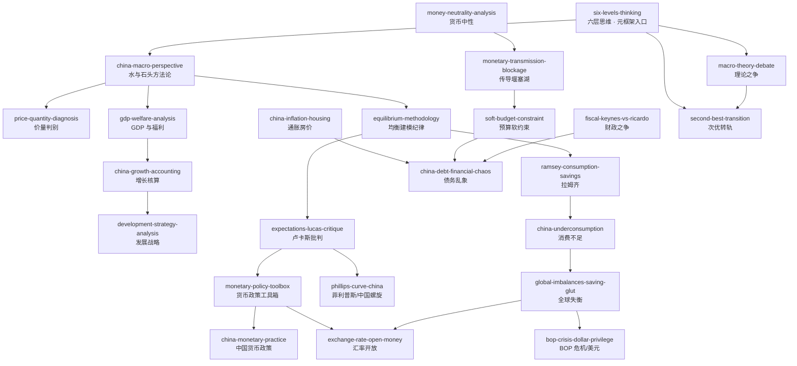

# INDEX — 技能总览与引用图

> 《宏观经济学二十五讲：中国视角》（徐高）蒸馏出 **24 个 skill**。本文件是技能间的路由图：从问题出发找到该用的 skill。

## 技能总览

| # | Skill | 一句话定位 | 主要讲次 |
|---|---|---|---|
| 1 | [`six-levels-thinking`](skills/six-levels-thinking/SKILL.md) | **元框架入口**：六层思维把中国经济观点定位到谱系 | 第25讲 |
| 2 | [`china-macro-perspective`](skills/china-macro-perspective/SKILL.md) | 水与石头：普适工具+中国约束的分析方法论 | 前言/第1讲 |
| 3 | [`price-quantity-diagnosis`](skills/price-quantity-diagnosis/SKILL.md) | 价量判别法：同向=需求主导、反向=供给主导 | 第1/3讲 |
| 4 | [`gdp-welfare-analysis`](skills/gdp-welfare-analysis/SKILL.md) | GDP 与福利标尺：终极关切追问链 | 第2讲 |
| 5 | [`china-growth-accounting`](skills/china-growth-accounting/SKILL.md) | 增长供给面：生产函数与增长核算 | 第3讲 |
| 6 | [`development-strategy-analysis`](skills/development-strategy-analysis/SKILL.md) | 发展战略：比较优势 vs 赶超与索洛剩余再解读 | 第4讲 |
| 7 | [`equilibrium-methodology`](skills/equilibrium-methodology/SKILL.md) | 一般均衡建模纪律：内生外生/求解纪律/校准 | 第5-6讲 |
| 8 | [`expectations-lucas-critique`](skills/expectations-lucas-critique/SKILL.md) | 理性预期与卢卡斯批判：政策评估必内生化预期 | 第5讲 |
| 9 | [`ramsey-consumption-savings`](skills/ramsey-consumption-savings/SKILL.md) | 拉姆齐模型：跨期消费储蓄与刺穿企业帷幕 | 第7-8讲 |
| 10 | [`china-underconsumption`](skills/china-underconsumption/SKILL.md) | 消费不足诊断：收入分配根源与国企分红 | 第9讲 |
| 11 | [`global-imbalances-saving-glut`](skills/global-imbalances-saving-glut/SKILL.md) | 全球失衡：S-I=CA 与过剩储蓄外溢 | 第10讲 |
| 12 | [`bop-crisis-dollar-privilege`](skills/bop-crisis-dollar-privilege/SKILL.md) | 国际收支危机与美元过度特权 | 第11讲 |
| 13 | [`fiscal-keynes-vs-ricardo`](skills/fiscal-keynes-vs-ricardo/SKILL.md) | 财政政策：凯恩斯 vs 李嘉图的产能闲置度裁决 | 第12讲 |
| 14 | [`money-neutrality-analysis`](skills/money-neutrality-analysis/SKILL.md) | 货币中性：交易方程式/古典二分法/两层账 | 第13讲 |
| 15 | [`phillips-curve-china`](skills/phillips-curve-china/SKILL.md) | 菲利普斯曲线：中国逆时针螺旋与产出缺口 | 第14讲 |
| 16 | [`monetary-transmission-blockage`](skills/monetary-transmission-blockage/SKILL.md) | 传导堰塞湖：市场分割与流动性效应 | 第15讲 |
| 17 | [`soft-budget-constraint`](skills/soft-budget-constraint/SKILL.md) | 预算软约束：刚性兑付、挤出与财政接权 | 第16讲 |
| 18 | [`monetary-policy-toolbox`](skills/monetary-policy-toolbox/SKILL.md) | 货币政策工具箱：泰勒准则、三环套利、伯南克路线图 | 第17-18讲 |
| 19 | [`china-monetary-practice`](skills/china-monetary-practice/SKILL.md) | 中国货币政策实践：财政/货币主导与两步法 | 第19讲 |
| 20 | [`exchange-rate-open-money`](skills/exchange-rate-open-money/SKILL.md) | 开放经济货币：UIP 检验、不可能三角、冲销 | 第20讲 |
| 21 | [`china-inflation-housing`](skills/china-inflation-housing/SKILL.md) | 结构性通胀与房价：土地垄断供给 | 第21讲 |
| 22 | [`china-debt-financial-chaos`](skills/china-debt-financial-chaos/SKILL.md) | 债务与金融乱象：刚性储蓄者与猫鼠博弈 | 第22讲 |
| 23 | [`macro-theory-debate`](skills/macro-theory-debate/SKILL.md) | 理论之争：新古典综合 vs 非正统的需求不足 | 第23-24讲 |
| 24 | [`second-best-transition`](skills/second-best-transition/SKILL.md) | 次优理论与转轨策略：阵痛是约束信号 | 第25讲 |

## 引用关系图

图例：`-->` 依赖/延伸方向。`six-levels-thinking` 是入口元框架，其余 skill 按"方法论→增长结构→失衡危机→货币政策→理论收束"的主线分流。

## 快速决策指南

| 你的问题 | 调用哪个 Skill |
|---|---|
| 一篇中国经济评论怎么评价/我该站哪派 | `six-levels-thinking` |
| 分析中国问题的正确姿势（西方理论能用吗） | `china-macro-perspective` |
| 涨价是需求还是供给造成的 | `price-quantity-diagnosis` |
| GDP 增速下降 = 福利变差吗 | `gdp-welfare-analysis` |
| 中国经济增速靠什么、能撑多久 | `china-growth-accounting` |
| 产业政策/跨越式发展可行吗 | `development-strategy-analysis` |
| 判断一份宏观分析是否靠谱 | `equilibrium-methodology` |
| 政策刺激会不会被预期消解 | `expectations-lucas-critique` |
| 利率降了该多存还是多花 | `ramsey-consumption-savings` |
| 促消费该发钱还是改分红 | `china-underconsumption` |
| 贸易顺差/全球失衡怎么理解 | `global-imbalances-saving-glut` |
| 某国会爆发货币危机吗/美元特权 | `bop-crisis-dollar-privilege` |
| 减税/发债/刺激有没有用 | `fiscal-keynes-vs-ricardo` |
| M2 高增长会带来通胀吗 | `money-neutrality-analysis` |
| 中国压通胀会推高失业吗 | `phillips-curve-china` |
| 降准了为什么实体融资还难 | `monetary-transmission-blockage` |
| 城投/刚兑/民企融资贵 | `soft-budget-constraint` |
| 利率到零央行还有什么招 | `monetary-policy-toolbox` |
| 央行操作为何和教科书不一样 | `china-monetary-practice` |
| 人民币该不该自由浮动/贬值 | `exchange-rate-open-money` |
| 猪价 CPI/房价怎么理解 | `china-inflation-housing` |
| 中国债务会崩吗/影子银行为何越管越多 | `china-debt-financial-chaos` |
| 某经济学家的话属于哪套理论 | `macro-theory-debate` |
| 改革阵痛该忍还是该停 | `second-best-transition` |

## 推荐学习顺序

`six-levels-thinking` → `china-macro-perspective` → 方法论底座（`price-quantity-diagnosis` → `gdp-welfare-analysis` → `equilibrium-methodology` → `expectations-lucas-critique`）→ 增长与结构（`china-growth-accounting` → `development-strategy-analysis` → `ramsey-consumption-savings` → `china-underconsumption`）→ 失衡与危机（`global-imbalances-saving-glut` → `bop-crisis-dollar-privilege`）→ 货币与政策（`money-neutrality-analysis` → `phillips-curve-china` → `monetary-transmission-blockage` → `soft-budget-constraint` → `monetary-policy-toolbox` → `china-monetary-practice` → `fiscal-keynes-vs-ricardo` → `exchange-rate-open-money` → `china-inflation-housing` → `china-debt-financial-chaos`）→ 收束（`macro-theory-debate` → `second-best-transition`）
