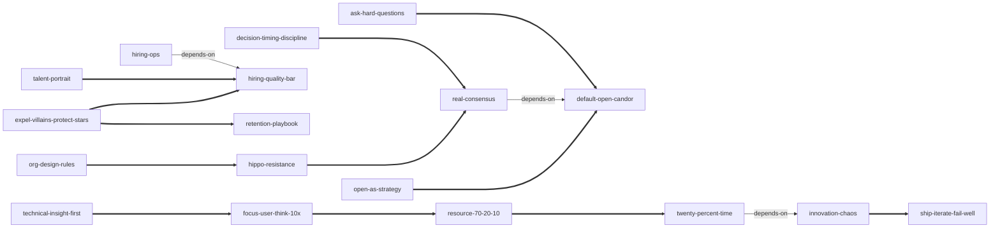

# how-google-works-skills

由《重新定义公司：谷歌是如何运营的》蒸馏出的一组**可被 AI Agent 调用的技能**（Skills）。

> 互联网时代企业的成功之道，是聚集一群"创意精英"（smart creative）并营造让他们自由发挥的环境——**赋能而非管理**。
> 信息、连接、计算的成本骤降让"速度定成败"，卓越产品是唯一护城河；指挥-控制式管理和死板的商业计划只会拖慢速度、驱走人才。
> 本项目把这套方法提炼成 18 个原子化技能，让 Agent 能在真实场景里调用它们。

---

## 来源

| | |
|---|---|
| **书名** | 重新定义公司：谷歌是如何运营的（*How Google Works*，奇点系列） |
| **作者** | 埃里克·施密特（Eric Schmidt）、乔纳森·罗森伯格（Jonathan Rosenberg），与艾伦·伊格尔合著 |
| **出版** | 英文原版 2014 / 中文版 2015（中信出版社，靳婷婷译） |
| **蒸馏工具** | cangjie-skill（仓颉：把长内容蒸馏成可调用技能的流水线） |
| **蒸馏方法** | RIA-TV++（整书理解 → 并行提取 → 三重验证 → RIA++ 构造 → 链接 → 压力测试 → 交付） |

---

## 如何选用（分诊导航）

- 会议被高薪者意见绑架 → `hippo-resistance`；决策讨论流于附和 → `real-consensus`；议而不决 → `decision-timing-discipline`
- 战略跟着计划书走 → `technical-insight-first`；方向格局太小 → `focus-user-think-10x`
- 招聘：先定标准 `hiring-quality-bar`，再看画像 `talent-portrait`，后建流程 `hiring-ops`；留汰看 `retention-playbook`
- 组织层级与团队规模 → `org-design-rules`；团队里有损公肥私者 → `expel-villains-protect-stars`
- 信息不流动、没人说真话 → `default-open-candor`
- 资源分配 → `resource-70-20-10`；创意自主权 → `twenty-percent-time`；执行与失败观 → `ship-iterate-fail-well`；创新机制 → `innovation-chaos`；组织自满 → `ask-hard-questions`

---

## 18 个技能

### 组织与文化

- [`org-design-rules`](skills/org-design-rules/SKILL.md) — **组织设计三律**：7 的法则（至少 7 份直接报告的下限）+ 两个比萨 + 以最有影响力的人为中心
- [`expel-villains-protect-stars`](skills/expel-villains-protect-stars/SKILL.md) — **驱逐恶棍，保护明星**：按"私利还是业绩"判别难相处的人，恶棍迅速清除、明星刻意容忍
- [`default-open-candor`](skills/default-open-candor/SKILL.md) — **默认开放与讲真话的安全环境**：管理者当"最牛的路由器"，剔除信息者必须举证

### 战略与方向

- [`technical-insight-first`](skills/technical-insight-first/SKILL.md) — **计划必错，信赖技术洞见**：以"请阐述你的技术洞见"作每个产品的第一道过滤器
- [`open-as-strategy`](skills/open-as-strategy/SKILL.md) — **开放为王**：开放是可核算的战略选项，封闭需要前提
- [`focus-user-think-10x`](skills/focus-user-think-10x/SKILL.md) — **聚焦用户，往大处想**：10 倍思维与"看竞争对手不如看用户"的注意力纪律

### 人才与招聘

- [`hiring-quality-bar`](skills/hiring-quality-bar/SKILL.md) — **招聘质量律**：羊群效应（A 撑 A）/ 宁缺毋滥 / 宁"漏聘"不"误聘"
- [`talent-portrait`](skills/talent-portrait/SKILL.md) — **人才画像**：学习型动物 / 机场测试 / 加大光圈（不按模式匹配招人）
- [`hiring-ops`](skills/hiring-ops/SKILL.md) — **招聘组织化**：全员出动 / 招聘委员会（用人经理有否决权无决定权）/ 面试 30 分钟
- [`retention-playbook`](skills/retention-playbook/SKILL.md) — **留汰律**：换出巧克力留下葡萄干 / 电梯演讲挽留 / 爱他就让他走

### 决策与沟通

- [`hippo-resistance`](skills/hippo-resistance/SKILL.md) — **别听河马的话**：以数据开场、把质疑设为硬性义务、信赖一线
- [`real-consensus`](skills/real-consensus/SKILL.md) — **共识的真正含义**：共识≠人人同意——人人发言 + 愿意挺身支持
- [`decision-timing-discipline`](skills/decision-timing-discipline/SKILL.md) — **决策时机与授权**：该响铃时就响铃 / 80% 时间给 80% 收入 / 马背原则 / PIA

### 创新与未来

- [`resource-70-20-10`](skills/resource-70-20-10/SKILL.md) — **70/20/10 资源配置**：70% 核心、20% 新兴、10% 全新
- [`twenty-percent-time`](skills/twenty-percent-time/SKILL.md) — **20% 时间制**：重点在自由，不在时间
- [`ship-iterate-fail-well`](skills/ship-iterate-fail-well/SKILL.md) — **交付—迭代与败得漂亮**：修改创意而不否决创意
- [`innovation-chaos`](skills/innovation-chaos/SKILL.md) — **创新不可指派**：缔造原始的混沌，CEO 兼任首席创新官
- [`ask-hard-questions`](skills/ask-hard-questions/SKILL.md) — **把难题提出来**：问 5 年后"可能会怎样"而非"一定会怎样"

---

## 技能之间的引用关系

图例：`-->` depends-on · `===>` composes-with（共 15 条真实关系，未硬造）

---

## 文档与审计

- **不读全书看这篇**：[docs/DIGEST.md](docs/DIGEST.md)
- **整书理解**（含作者局限批判）：[docs/BOOK_OVERVIEW.md](docs/BOOK_OVERVIEW.md)
- **三重验证**（18 通过 / 7 淘汰）：[docs/verified.md](docs/verified.md)；淘汰审计见 [docs/rejected/](docs/rejected/)
- **skill 总览 + 学习顺序**：[docs/INDEX.md](docs/INDEX.md)
- **术语词典**（作者用法 ≠ 字典义）：[docs/GLOSSARY.md](docs/GLOSSARY.md)
- **流水线状态**：[docs/PIPELINE_STATE.md](docs/PIPELINE_STATE.md)

每个 skill 目录含 `SKILL.md`（R 原文 / I 骨架 / A1 书中案例 / A2 触发场景 / E 可执行步骤 / B 边界）、`test-prompts.json`（should_trigger / should_not_trigger / edge_case，含跨 skill 混淆诱饵）与 `test-results.md`。

## 版权说明

本书蒸馏为转换性分析：所有原文引用均为 ≤150 字的短引注并标注出处。原书全文不入库；书名、案例与观点版权归原作者与出版社（中信出版社 / Grand Central Publishing）所有。
