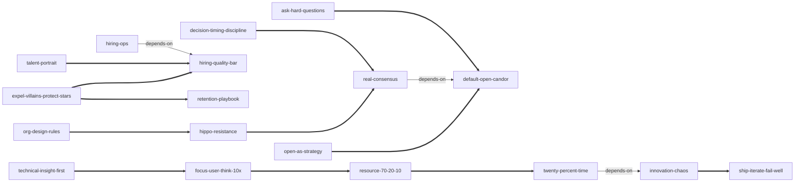

# 《重新定义公司：谷歌是如何运营的》 — Skill Index

> 本书由 cangjie-skill (RIA-TV++) 蒸馏，共产出 **18** 个 skills。
> 处理时间：2026-10-01（无人值守模式，确认点见文末）

## 关于这本书

- **作者**: 埃里克·施密特、乔纳森·罗森伯格（与艾伦·伊格尔合著），中文版 2015（中信出版社）
- **一句话主旨**: 互联网时代企业的成功之道，是聚集一群"创意精英"并营造让他们自由发挥的环境——赋能而非管理；因为速度定成败、产品卓越是唯一护城河，而指挥-控制式管理与死板计划只会拖慢速度、驱走人才。
- **总框架**: 时代前提（三股科技狂潮→创意精英）→ 文化 → 战略 → 人才 → 决策 → 沟通 → 创新 → 结语（平台与难题之问），雪球式递进。
- **整书理解**: [BOOK_OVERVIEW.md](./BOOK_OVERVIEW.md)
- **精华长文**（不读全书看这篇）: [DIGEST.md](./DIGEST.md)
- **术语词典**: [GLOSSARY.md](./GLOSSARY.md)
- **三重验证**: [verified.md](./verified.md)（合并 25 单元 → 通过 18 / 淘汰 7；淘汰审计见 [rejected/](./rejected/)）

---

## 如何选用这 18 个 skills（分诊导航）

- 问题出在**会议上谁的意见说话**（高薪者一言堂）→ `hippo-resistance`
- 问题出在**决策讨论流程**（附和/没结论/表面一致）→ `real-consensus`（前置环境：`default-open-candor`）
- 问题出在**决策时机**（议而不决/拍脑袋就干）→ `decision-timing-discipline`
- 问题出在**战略与立项**（跟着计划书/市场调查走）→ `technical-insight-first`
- 问题出在**方向与格局**（聚焦竞品/只做渐进）→ `focus-user-think-10x`
- 问题出在**资源分配**（新业务饿死或核心失血）→ `resource-70-20-10`
- 问题出在**招聘质量**（招错人/标准不清）→ `hiring-quality-bar`（先看标准）
  - 招什么人（画像）→ `talent-portrait`；怎么招（流程）→ `hiring-ops`
- 问题出在**留人/淘汰**（明星要走/平庸占坑）→ `retention-playbook`
- 问题出在**团队里有人损公肥私** → `expel-villains-protect-stars`
- 问题出在**组织层级与团队规模** → `org-design-rules`
- 问题出在**信息不流动/没人说真话** → `default-open-candor`
- 问题出在**创新机制**（创新被指派/只敢小步）→ `innovation-chaos`（机制：`twenty-percent-time`；方法：`ship-iterate-fail-well`）
- 问题出在**组织自满/回避难题** → `ask-hard-questions`

## Skill 列表（按主题分组）

### 组织与文化

- [`org-design-rules`](../skills/org-design-rules/SKILL.md) — 组织设计三律：7 的法则（下限）+ 两个比萨 + 以最有影响力的人为中心
- [`expel-villains-protect-stars`](../skills/expel-villains-protect-stars/SKILL.md) — 驱逐恶棍，保护明星：按"私利还是业绩"判别难相处的人
- [`default-open-candor`](../skills/default-open-candor/SKILL.md) — 默认开放与讲真话的安全环境：管理者当最牛的路由器

### 战略与方向

- [`technical-insight-first`](../skills/technical-insight-first/SKILL.md) — 计划必错，信赖技术洞见：以洞见之问作第一道过滤器
- [`open-as-strategy`](../skills/open-as-strategy/SKILL.md) — 开放为王与选择封闭的前提
- [`focus-user-think-10x`](../skills/focus-user-think-10x/SKILL.md) — 聚焦用户，往大处想：10 倍思维与注意力纪律

### 人才与招聘

- [`hiring-quality-bar`](../skills/hiring-quality-bar/SKILL.md) — 招聘质量律：羊群效应/宁缺毋滥/宁"漏聘"不"误聘"
- [`talent-portrait`](../skills/talent-portrait/SKILL.md) — 人才画像：学习型动物/机场测试/加大光圈
- [`hiring-ops`](../skills/hiring-ops/SKILL.md) — 招聘组织化：全员出动/招聘委员会/30 分钟面试
- [`retention-playbook`](../skills/retention-playbook/SKILL.md) — 留汰律：换出巧克力/电梯演讲/爱他就让他走

### 决策与沟通

- [`hippo-resistance`](../skills/hippo-resistance/SKILL.md) — 别听河马的话：让数据与论据说话，质疑是义务
- [`real-consensus`](../skills/real-consensus/SKILL.md) — 共识的真正含义：共识≠人人同意
- [`decision-timing-discipline`](../skills/decision-timing-discipline/SKILL.md) — 决策时机与授权：响铃/80-80/马背原则/PIA

### 创新与未来

- [`resource-70-20-10`](../skills/resource-70-20-10/SKILL.md) — 70/20/10 资源配置原则
- [`twenty-percent-time`](../skills/twenty-percent-time/SKILL.md) — 20% 时间制：重点在自由，不在时间
- [`ship-iterate-fail-well`](../skills/ship-iterate-fail-well/SKILL.md) — 交付—迭代与败得漂亮
- [`innovation-chaos`](../skills/innovation-chaos/SKILL.md) — 创新不可指派：缔造原始的混沌
- [`ask-hard-questions`](../skills/ask-hard-questions/SKILL.md) — 把难题提出来：5 年"可能会怎样"与组织自检

---

## 引用图



图例：`-->` depends-on · `===>` composes-with（共 15 条真实关系，未硬造）

---

## 推荐学习顺序

1. **default-open-candor** — 文化底座，无前置；讲真话的环境是一半 skill 的前提
2. **hippo-resistance** — 会议级机制，依赖开放文化
3. **org-design-rules** — 组织为"离一线近"服务
4. **expel-villains-protect-stars** — 文化维护的奖罚律
5. **technical-insight-first** — 战略根基，无前置
6. **open-as-strategy** — 对外的开放与对内开放同构
7. **focus-user-think-10x** — 依赖技术洞见
8. **hiring-quality-bar** → **talent-portrait** → **hiring-ops** — 招聘三部曲
9. **retention-playbook** — 留汰与奖罚同律
10. **real-consensus** → **decision-timing-discipline** — 决策两半
11. **resource-70-20-10** → **twenty-percent-time** — 资源与自由
12. **innovation-chaos** → **ship-iterate-fail-well** — 创新的立场与方法
13. **ask-hard-questions** — 结语级自检，依赖坦诚文化

---

## 安装使用

skills 位于本仓库的 `skills/` 子目录（构建产物不会自动被宿主加载）。要让 agent 真正调用，把单个 skill 目录复制到宿主的 skills 目录：

```bash
# ZCode 用户级
cp -r skills/<skill-slug>/ ~/.zcode/skills/

# Claude Code 用户级
cp -r skills/<skill-slug>/ ~/.claude/skills/
```

---

## 接入 darwin-skill

所有 skill 均带有 `test-prompts.json`（darwin-skill 兼容格式，含 should_trigger / should_not_trigger / edge_case 三类用例与跨 skill 混淆诱饵），可直接接入自动进化：

```
darwin evolve how-google-works/
```

---

## 审计轨迹

- 候选单元池: [candidates/](./candidates/) — frameworks 51 · principles 227 · cases 92 · counter-examples 62 · glossary 25
- 被淘汰的候选（含原因与去向）: [rejected/](./rejected/) — 7 个淘汰文件 + 4 个依附簇文件，278 条参选候选全部有归属
- 流水线状态: [PIPELINE_STATE.md](./PIPELINE_STATE.md)

## 用户确认点（无人值守模式）

阶段 0（整书骨架）与阶段 1.5（录取名单）的方法论确认点已改为事后确认：
- 对骨架/批判有异议 → 修改 BOOK_OVERVIEW.md 后重跑对应提取器
- 要捞回被淘汰单元 → 优先候选：rejected/p14（拥挤出成绩）、rejected/cluster-okr（OKR 簇）
