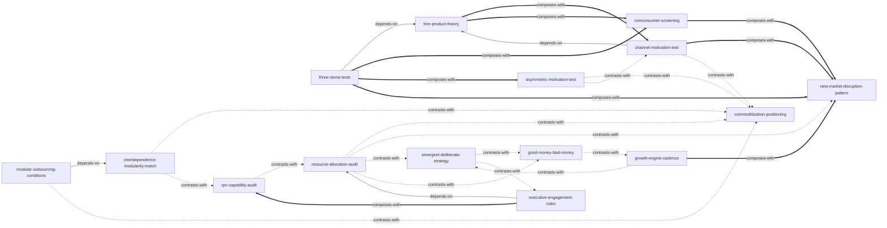

# 创新者的解答 — Skill Index

> 本书由 cangjie-skill 蒸馏, 共产出 **15** 个 skills。
> 处理时间: 2026-10-05

## 关于这本书

- **作者**: 克莱顿·克里斯坦森 & 迈克尔·雷纳
- **出版年**: 2003
- **一句话主旨**: 创新的成功不靠天赋与运气，而靠理解塑造创新的力量——选对战场（不对称动机）、选对客户（零消费者/任务理论）、配对组织（RPV）与资金（好钱坏钱）、用对流程（应急 vs 谋划）；起始条件正确比战略精确更重要。
- **整书理解**: 见 [BOOK_OVERVIEW.md](./BOOK_OVERVIEW.md)
- **精华长文** (不读全书看这篇): [DIGEST.md](./DIGEST.md)
- **术语词典**: [GLOSSARY.md](./GLOSSARY.md)

---

## Skill 列表 (按主题分组)

### 战场选择与机会甄别

- [`three-stone-tests`](../skills/three-stone-tests/SKILL.md) — 用新市场、低端、对称动机三道试金石，判断一个构想能否成为破坏性成长机会。
- [`asymmetric-motivation-test`](../skills/asymmetric-motivation-test/SKILL.md) — 逐一扫描每个重要在位者，判断该创新对它是破坏还是延续，预判其反击或撤退。
- [`nonconsumer-screening`](../skills/nonconsumer-screening/SKILL.md) — 甄别"零消费者"是真机会（有任务无满意方案）还是伪机会（无任务），并确定性能参照基准。
- [`new-market-disruption-pattern`](../skills/new-market-disruption-pattern/SKILL.md) — 用四要素模式把已判定的新市场破坏塑造成可评审、可资助的业务计划（模式化预算）。

### 客户与任务

- [`hire-product-theory`](../skills/hire-product-theory/SKILL.md) — 按客户"要完成的任务"而非产品属性细分市场，重定义真正的竞争对手。
- [`channel-motivation-test`](../skills/channel-motivation-test/SKILL.md) — 把渠道当客户，审计它是否有动力推你的产品沿自身轨迹向高端迁移。

### 业务范围与价值链

- [`interdependence-modularity-match`](../skills/interdependence-modularity-match/SKILL.md) — 按性能缺口/过度服务情境决定垂直整合还是模块化——"核心竞争力"不是判据。
- [`modular-outsourcing-conditions`](../skills/modular-outsourcing-conditions/SKILL.md) — 在决定外包后，逐条检验接口是否成熟到可安全分包（规格明确、可衡量、无不确定互依）。
- [`commoditization-positioning`](../skills/commoditization-positioning/SKILL.md) — 预测货品化与反货品化下利润沿价值链迁移到哪里、企业该重新定位与投资品牌于哪一环。

### 组织能力与流程

- [`rpv-capability-audit`](../skills/rpv-capability-audit/SKILL.md) — 用资源/流程/价值观审计组织能否胜任新业务，决定并入主流还是单设自治组织。
- [`resource-allocation-audit`](../skills/resource-allocation-audit/SKILL.md) — 盘点资源分配过滤器，揭示组织"实际会执行"的真实战略与创意被磨平之处。
- [`emergent-deliberate-strategy`](../skills/emergent-deliberate-strategy/SKILL.md) — 按情境在应急型与谋划型战略流程间匹配主导权（该探索时探索、该执行时执行）。

### 资金与高管

- [`good-money-bad-money`](../skills/good-money-bad-money/SKILL.md) — 按投资者"对成长/利润的耐心"结构诊断资金好坏与死亡螺旋，识别早期急迫赢利的价值。
- [`growth-engine-cadence`](../skills/growth-engine-cadence/SKILL.md) — 趁核心健康时按既定节奏持续启动破坏性新业务，把成长引擎制度化。
- [`executive-engagement-rules`](../skills/executive-engagement-rules/SKILL.md) — 按情境（而非业务规模）判断高管何时必须亲自跨界介入破坏性创新。

---

## 引用图



图例:
- `-->`  depends-on（前置依赖：先做指向方，才能做被指向方）
- `-.->` contrasts-with（易混淆但对象/输出不同，择一或分工使用）
- `===>` composes-with（同一流程的互补组件，常配合使用）

---

## 推荐学习顺序

(从依赖图的叶子节点开始, 向上)

1. **hire-product-theory** — 最基础, 没有前置：先建立"任务理论"的市场与竞争集合视角。
2. **three-stone-tests** — 依赖 hire-product-theory：用三道试金石判定构想是否为破坏。
3. **nonconsumer-screening** — 与 three-stone-tests / hire-product-theory 互补：细筛"零消费者"真伪。
4. **asymmetric-motivation-test** — 展开 three-stone-tests 第三关：扫描在位者会反击还是撤退。
5. **new-market-disruption-pattern** — 承接 three-stone-tests / nonconsumer-screening：把判定结果塑造成可评审计划。
6. **channel-motivation-test** — 依赖 hire-product-theory，与 new-market-disruption-pattern 互补：审计渠道动力。
7. **interdependence-modularity-match** — 进入业务范围判断：整合还是模块化。
8. **modular-outsourcing-conditions** — 依赖 interdependence-modularity-match：检验接口能否外包。
9. **commoditization-positioning** — 与 interd./modular 及 outsourcing 相对照：预测利润迁移与重新定位。
10. **resource-allocation-audit** — 组织诊断根基，无前置：揭示真实战略与创意磨平点。
11. **rpv-capability-audit** — 与 resource-allocation-audit 相对照：审计组织能力并选组织结构。
12. **emergent-deliberate-strategy** — 与 resource-allocation-audit 相对照：匹配应急/谋划流程。
13. **good-money-bad-money** — 与 resource-allocation-audit / emergent-deliberate-strategy 相对照：诊断资金期望结构。
14. **growth-engine-cadence** — 与 good-money-bad-money 相对照，与 new-market-disruption-pattern 互补：设计启动节奏。
15. **executive-engagement-rules** — 依赖 resource-allocation-audit，与 rpv-capability-audit 互补：判断高管介入层级。

---

## 安装使用

本目录是构建产物, 宿主不会从这里加载 skill。要让 agent 真正调用, 把 skill 目录复制到宿主的 skills 目录:

```bash
# 用户级 (所有项目可用)
cp -r three-stone-tests ~/.claude/skills/

# 或项目级
cp -r three-stone-tests <project>/.claude/skills/    # Claude Code
cp -r three-stone-tests <project>/.cursor/skills/    # Cursor
```

---

## 接入 darwin-skill

所有 skill 均带有 `test-prompts.json` (darwin-skill 兼容格式), 可直接接入自动进化:

```
darwin evolve books/innovators-solution/
```

---

## 审计轨迹

- 候选单元池: [candidates/](./candidates/)
- 被淘汰的候选 (含原因): [rejected/](./rejected/)
- BOOK_OVERVIEW: [BOOK_OVERVIEW.md](./BOOK_OVERVIEW.md)
