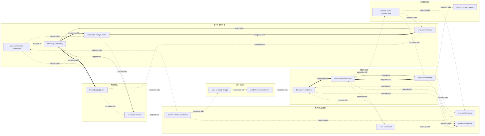

# 《小米创业思考》 — Skill Index

> 本书由 cangjie-skill 蒸馏, 共产出 **17** 个 skills。
> 处理时间: 2026-10-05

## 关于这本书

- **作者**: 雷军 / 徐洁云（执笔）
- **出版年**: 2022（中信出版集团）
- **一句话主旨**: 小米 12 年只做了一件事——用互联网方法改造制造业、推动效率革命：把"感动人心、价格厚道"从口号变成可计算的模型（ROI=利润率×周转）、可执行的纪律（七字诀）和可制度化的承诺（硬件净利率红线），方法论的价值超过公司本身。
- **整书理解**: 见 [BOOK_OVERVIEW.md](./BOOK_OVERVIEW.md)
- **精华长文** (不读全书看这篇): [DIGEST.md](./DIGEST.md)
- **术语词典**: [GLOSSARY.md](./GLOSSARY.md)

---

## Skill 列表 (按主题分组)

### 效率与定价算账

- [`cost-performance-philosophy`](../skills/cost-performance-philosophy/SKILL.md) — 性价比哲学：性价比是比较优势而非绝对低价，高价是结果不是手段，含高端化提价检验。
- [`efficiency-accounting`](../skills/efficiency-accounting/SKILL.md) — 效率算账：ROI=（毛利率–费用率）×周转次数的总账工具，配定倍率体检、定价五分项、研发分摊判据。
- [`impossible-triangle-model`](../skills/impossible-triangle-model/SKILL.md) — 不可能三角复合模型：把"感动人心/厚道/盈利"式取舍题改写成交叉补贴的结构设计题，含地狱立方复制前的掂量。
- [`new-retail-efficiency`](../skills/new-retail-efficiency/SKILL.md) — 新零售效率三件套：先判货权归属（合作还是博弈），再算渠道层级费用率，最后守试点养店纪律。

### 爆品模式

- [`hit-product-judgment`](../skills/hit-product-judgment/SKILL.md) — 爆品判定：单款/精品/海量/长周期四特征体检（是结果不是原因）+ 产生三条件的窗口期检查表。
- [`hit-product-system`](../skills/hit-product-system/SKILL.md) — 爆品打造体系：找准需求→超预期产品→惊喜定价→效率制胜的四要素串行流程，配 80/80 减法法则。

### 七字诀决策纪律

- [`one-core-business`](../skills/one-core-business/SKILL.md) — 一元核心律（专注）：核心业务一元化的聚焦审计，新机会用"+"改"×"三问过筛。
- [`optimal-solution-excellence`](../skills/optimal-solution-excellence/SKILL.md) — 极致=每个技术世代做到自身能力极限的最优解，含防自嗨三问。
- [`speed-four-abilities`](../skills/speed-four-abilities/SKILL.md) — 快的四能力与快慢律：洞察/响应/决策/改善，战略积累快不得、战术演进慢不得。
- [`sunk-cost-restart`](../skills/sunk-cost-restart/SKILL.md) — 方向性错误推倒重来：沉没成本当学费的止损判定，重做目标必须是终结性产品。

### 用户与口碑

- [`word-of-mouth-design`](../skills/word-of-mouth-design/SKILL.md) — 超预期口碑设计：口碑=产品+服务+沟通全触点的总和，事前设计超预期点。
- [`word-of-mouth-verification`](../skills/word-of-mouth-verification/SKILL.md) — 口碑验证三原则：甄别好评真伪、打破信息茧房与"刻舟求剑"式阈值漂移。

### 战略与终局

- [`endgame-reasoning`](../skills/endgame-reasoning/SKILL.md) — 终局思维三层推论：业务终局→行业终局→用户期待检验，大额不可逆新业务的进入论证法。
- [`new-business-three-pits`](../skills/new-business-three-pits/SKILL.md) — 大公司新业务三大坑自检：认知错位、惯性思维、偶像包袱，"决定做之后"的心态纪律。
- [`downturn-remediation`](../skills/downturn-remediation/SKILL.md) — 低谷补课：先补能力再谈故事，交付/创新/质量三抓手+质量一票否决。

### 治理与组织

- [`values-into-governance`](../skills/values-into-governance/SKILL.md) — 价值观制度化：把承诺写进法律文件（如硬件净利率红线）并预留风险缓冲，让价值观超越创始人任期。
- [`minority-stake-empowerment`](../skills/minority-stake-empowerment/SKILL.md) — 生态链赋能模式：投资不控股+产品定义/设计/供应链/渠道全方位赋能，"帮忙不添乱"的共生治理。

---

## 引用图

依据各 SKILL.md 的 A2"与相邻 skill 的区分"整理。



图例:
- `-->`  depends-on
- `-.->` contrasts-with
- `===>` composes-with

---

## 推荐学习顺序

(从依赖图的叶子节点开始, 向上)

1. **cost-performance-philosophy** — 先立立场：性价比是什么、低价能否长期健康，后续一切算账的前提
2. **efficiency-accounting** — 把立场兑现成数字：ROI 公式、定倍率、五分项，最基础的算账工具
3. **impossible-triangle-model** — 在算账之上做模式设计：用交叉补贴打破取舍死局
4. **new-retail-efficiency** — 模式落到渠道环节的执行三件套（货权/层级费用率/试点纪律）
5. **hit-product-judgment** — 爆品的事后判定与窗口期检查，为打造体系提供判定地基
6. **optimal-solution-excellence** — 极致判据：hit-product-system 第 2 步"至少一方面杰出"的来源
7. **hit-product-system** — 依赖 optimal-solution-excellence 与 efficiency-accounting 的四要素串行打造流程
8. **word-of-mouth-design** — 口碑的事前设计（超预期+全触点），与爆品体系互补
9. **word-of-mouth-verification** — 口碑的事后核验，与设计 skill 成对使用
10. **one-core-business** — 专注的聚焦审计，为战略组提供结构前提
11. **speed-four-abilities** — 快的四能力与快慢律，与 endgame-reasoning 的"战略宁慢"对照
12. **sunk-cost-restart** — 方向性错误的止损判定，与 speed 的"对的事快做"互补
13. **endgame-reasoning** — 大额新业务的终局论证，new-business-three-pits 的前置
14. **new-business-three-pits** — 依赖 endgame-reasoning：决定进入后的三大坑自检
15. **downturn-remediation** — 失速后的组织补课，与 sunk-cost-restart / speed-four-abilities 按对象分工
16. **values-into-governance** — 把确立的价值观固化为治理约束，方法论的制度化终点
17. **minority-stake-empowerment** — 不自己下场、用投资+孵化复制模式，与 one-core-business 相互对照的收尾课

---

## 安装使用

本目录是构建产物, 宿主不会从这里加载 skill。要让 agent 真正调用, 把 skill 目录复制到宿主的 skills 目录:

```bash
# 用户级 (所有项目可用)
cp -r skills/<skill-slug> ~/.claude/skills/

# 或项目级
cp -r skills/<skill-slug> <project>/.claude/skills/    # Claude Code
cp -r skills/<skill-slug> <project>/.cursor/skills/    # Cursor
```

---

## 接入 darwin-skill

所有 skill 均带有 `test-prompts.json` (darwin-skill 兼容格式), 可直接接入自动进化:

```
darwin evolve books/xiaomi-startup-thinking/
```

---

## 审计轨迹

- 候选单元池: [candidates/](./candidates/)
- 被淘汰的候选 (含原因): [rejected/](./rejected/)
- BOOK_OVERVIEW: [BOOK_OVERVIEW.md](./BOOK_OVERVIEW.md)
