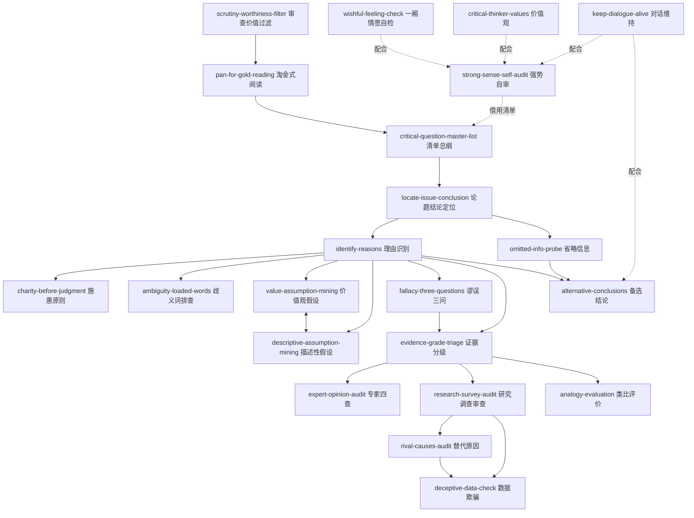

# 《学会提问（原书第10版）》 — Skill Index

> 本书由 cangjie-skill 蒸馏，共产出 **22** 个 skills。
> 处理时间： 2026-10-03

## 关于这本书

- **作者**： [美] 尼尔·布朗（M. Neil Browne）、斯图尔特·基利（Stuart M. Keeley）
- **出版年**： 英文原版 10th ed. 2012；中文版机械工业出版社 2013（吴礼敬 译）
- **一句话主旨**： 面对任何想说服你的论证，用一套环环相扣的批判性问题（论题→结论→理由→歧义词→假设→谬误→证据→替代原因→数据→省略信息→备选结论）逐层拆解它，形成自己的判断，而不是被动吸收。
- **整书理解**： 见 [BOOK_OVERVIEW.md](./BOOK_OVERVIEW.md)
- **精华长文** (不读全书看这篇)： [DIGEST.md](./DIGEST.md)
- **术语词典**： [GLOSSARY.md](./GLOSSARY.md)

---

## Skill 列表 (按主题分组)

主题分组对应布朗 & 基利的骨架：态度地基（第 1 章）→ 审查总纲 → 拆解论证的流程（第 2–12 章，按"结构→语言→暗层→质量→收尾"递进）。

### 姿态与自我审查（第 1 章的地基）

- [`scrutiny-worthiness-filter`](../skills/scrutiny-worthiness-filter/SKILL.md) — 审查价值过滤：深审前先问"这个问题关我什么事"，按利害分全审/抽查/不审三档配置注意力。
- [`pan-for-gold-reading`](../skills/pan-for-gold-reading/SKILL.md) — 淘金式阅读：先海绵吸收再带问题清单掂量，边读边问产出"信/不信/待证据"的取舍。
- [`strong-sense-self-audit`](../skills/strong-sense-self-audit/SKILL.md) — 强势批判自审：把同一张问题清单对准自己的结论，对称审查+最强反方测试。
- [`critical-thinker-values`](../skills/critical-thinker-values/SKILL.md) — 批判性思考者价值观：自主性/好奇心/谦恭/以理服人者逢之必敬四条对照，专治党同伐异。
- [`keep-dialogue-alive`](../skills/keep-dialogue-alive/SKILL.md) — 批判性对话维持：复述确认、好奇口吻、暂停取证、合并理由，防止"逮错"关闭对话通道。
- [`wishful-feeling-check`](../skills/wishful-feeling-check/SKILL.md) — 感情先行与一厢情愿自检：把愿望与证据分开，感情投入排在推理之后。

### 审查总纲

- [`critical-question-master-list`](../skills/critical-question-master-list/SKILL.md) — 关键问题清单总纲：一张 11 问、顺序即依赖关系的论证审查全流程，每问路由给单点 skill。

### 拆解结构：结论与理由（第 2–3 章）

- [`locate-issue-conclusion`](../skills/locate-issue-conclusion/SKILL.md) — 论题与结论定位：先分类（描述性/规定性），再用六线索找出"他要我信什么"，区分结论与纯观点。
- [`identify-reasons`](../skills/identify-reasons/SKILL.md) — 理由识别：问"为什么"+提示词+复述编号登记理由，检测先有结论再编理由的逆向逻辑。
- [`charity-before-judgment`](../skills/charity-before-judgment/SKILL.md) — 施惠原则：识别阶段一律按最强形式重构对方论证，重构完成前不开火。

### 语言与暗层（第 4–5 章）

- [`ambiguity-loaded-words`](../skills/ambiguity-loaded-words/SKILL.md) — 歧义词与感情色彩词排查：锁定关键词、换义替换测效度、防思维短路，谁说服谁负责澄清。
- [`value-assumption-mining`](../skills/value-assumption-mining/SKILL.md) — 价值观假设挖掘：规定性论证里"冲突时宁要哪个"的隐藏取舍，背景/后果/反串三线索。
- [`descriptive-assumption-mining`](../skills/descriptive-assumption-mining/SKILL.md) — 描述性假设挖掘：补全理由到结论之间"世界如何运作"的逻辑缺口。

### 推理质量（第 6 章）

- [`fallacy-three-questions`](../skills/fallacy-three-questions/SKILL.md) — 谬误三问判别法：不背名称，统一三问（错误假设/注意力花招/循环论证），并防清单式抬杠。

### 证据与因果（第 7–10 章）

- [`evidence-grade-triage`](../skills/evidence-grade-triage/SKILL.md) — 证据效力分级：事实断言三问+四类弱证据的结构性毛病，按类型分诊给下游。
- [`expert-opinion-audit`](../skills/expert-opinion-audit/SKILL.md) — 专家意见四查：专长对口/一手渠道/歪曲风险/同行验证，输出"给分量"而非一票否决。
- [`research-survey-audit`](../skills/research-survey-audit/SKILL.md) — 研究报告与调查审查：研究结果只能支撑不能证明+样本三查+调查两偏见。
- [`analogy-evaluation`](../skills/analogy-evaluation/SKILL.md) — 类比评价与自造：两维评价（相关相同/不同点）+生成三步法+框架类比警告。
- [`rival-causes-audit`](../skills/rival-causes-audit/SKILL.md) — 替代原因审查：相关四解释框架+侦探四问+事后归因+基本归因错误。
- [`deceptive-data-check`](../skills/deceptive-data-check/SKILL.md) — 数据欺骗性检查：来历/平均值三算/数据-结论错位/绝对值百分比互换/风险表述转换。

### 收尾：省略与可能（第 11–12 章）

- [`omitted-info-probe`](../skills/omitted-info-probe/SKILL.md) — 省略信息排查：九类清单+负面效果五问+"信息缺失下仍要决断"的反瘫痪收尾。
- [`alternative-conclusions`](../skills/alternative-conclusions/SKILL.md) — 备选结论生成：条件句+问题重述破除二分式思维，收尾按推理标准挑最强防和稀泥。

---

## 引用图

---

## 推荐学习顺序

依赖关系决定的入门路径（≈ 读完一本书的一轮）：

1. **先装备姿态**（第 1 章域）：`scrutiny-worthiness-filter` → `pan-for-gold-reading` → `strong-sense-self-audit`（+`wishful-feeling-check`、`keep-dialogue-alive`、`critical-thinker-values` 随用随取）
2. **走一遍总纲**：`critical-question-master-list`（了解全流程与每问的依赖关系）
3. **按审查顺序学单点**（每个都是清单一问）：`locate-issue-conclusion` → `identify-reasons` → `ambiguity-loaded-words` → `value-assumption-mining` / `descriptive-assumption-mining` → `fallacy-three-questions` → `evidence-grade-triage`（→ `expert-opinion-audit` / `research-survey-audit` / `analogy-evaluation`）→ `rival-causes-audit` → `deceptive-data-check` → `omitted-info-probe` → `alternative-conclusions`
4. `charity-before-judgment` 与 `keep-dialogue-alive` 建议成对练——前者管"审之前怎么理解对方"，后者管"审之后怎么开口"
