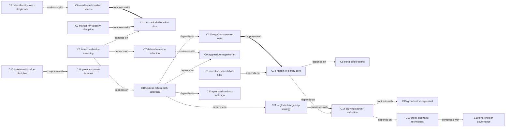

# 《聪明的投资者》（The Intelligent Investor）— Skill Index

> 本书由 cangjie-skill 蒸馏，共产出 **20** 个 skills。
> 处理时间：2026-10-06

## 关于这本书

- **作者**：本杰明·格雷厄姆（Benjamin Graham）
- **版本说明**：第 4 版老译本（1965 年出版，数据截至 1964 年，16 章 4 篇，无 Zweig 点评）
- **一句话主旨**：投资的成败不取决于智力或预测，而取决于以"安全边际"（价格与价值之间经统计可证明的足够顺差）为核心的态度与纪律——普通投资者把抱负限于能力之内、活动限于安全的狭窄范围，就能用最小的努力取得可信的结果。
- **整书理解**：见 [BOOK_OVERVIEW.md](BOOK_OVERVIEW.md)
- **术语词典**：[GLOSSARY.md](GLOSSARY.md)

> **⚠ 1964 年快照约束（读任何 skill 前必看）**
> - 本 pipeline 使用的第 4 版老译本数据截至 1964 年。所有估值锚（7 年均益 25×/近 12 月 20×、12 倍中立倍数、8.5+2g 的基数 8.5、覆盖倍数 4/5/7、净流动资产 2/3 折扣、股利正常派息 2/3 等）与绝对门槛（资产/营业额 5000 万美元、流动资本 1000 万美元、1940 年起连续派息）**绑定 1964 年利率、税制与会计准则，使用前必须按当期重查，禁止机械照抄**——要学的是"替换参数"的示范，不是数字本身。
> - 原书无指数基金/ETF/量化工具（"全取样"只能以道指 30 或封闭基金实现），今天可直接指数化；"现金红利+优先认股权"的税收论证随税制一变即失效。
> - 老译本 OCR/排印讹误密集（如表 8 "P/E 113.1" 应为 13.1），引用具体数字前回查英文原版。

---

## Skill 列表（按主题分组）

### 投资哲学与身份

- [`invest-vs-speculation-filter`](../skills/invest-vs-speculation-filter/SKILL.md) — 三判据（全面分析/本金安全/满意回报）逐条过筛任何一笔操作，附投机三非理性检验与专款隔离处置。
- [`investor-identity-matching`](../skills/investor-identity-matching/SKILL.md) — 防御/进攻二分定身份：回报与明智努力相称律、无中间立场（折衷最可能产生失望）、先定努力预算再定收益预期。

### 市场波动与纪律

- [`rule-reliability-trend-skepticism`](../skills/rule-reliability-trend-skepticism/SKILL.md) — 判别一条准则/因子/趋势还能否依赖：类型挂钩 vs 人性挂钩的分类检验、流行即失效定律、趋势逆转 2:1。
- [`market-mr-volatility-discipline`](../skills/market-mr-volatility-discipline/SKILL.md) — 把市场当仆人不当向导：波动二义、1/3 检视阈值、浮盈不可兑现律、风险三来源重定义（风险≠波动）。
- [`overheated-market-defense`](../skills/overheated-market-defense/SKILL.md) — 牛市顶部信号逐条打分（五特征/六条件/新股倒挂）＋谨慎三准则，输出警惕等级而非崩盘预测。

### 组合策略

- [`mechanical-allocation-dca`](../skills/mechanical-allocation-dca/SKILL.md) — 25–75 股债比例带与 50:50±5%→调 1/11 的机械再平衡，定投去留与"有资金即可买入"原则。
- [`defensive-stock-selection`](../skills/defensive-stock-selection/SKILL.md) — 防御型选股四原则（10–30 只、大而突出、连续红利、25×/20× 价格上限）与全取样/排除法/低倍数法三路径。
- [`aggressive-negative-list`](../skills/aggressive-negative-list/SKILL.md) — 进攻型先做减法：四不碰负面清单、收益换本金检验、2/3 账面值折扣线是唯一例外通道。
- [`excess-return-path-selection`](../skills/excess-return-path-selection/SKILL.md) — 超额收益从哪来：差异化公理→五路排除→冷门大公司/廉价证券/特别情况三域按气质三选一。

### 证券选择与估值

- [`stock-diagnosis-techniques`](../skills/stock-diagnosis-techniques/SKILL.md) — 报表还原四件套、股价-收益四模式地图、高增长公司三查预警——只还原真相，不做买卖判断。
- [`earnings-power-valuation`](../skills/earnings-power-valuation/SKILL.md) — 盈利能力（跨好差年景均值）×资本化率五因素：评估价须超市价 1/3、投资/投机成分分解、繁荣≠安全。
- [`growth-stock-appraisal`](../skills/growth-stock-appraisal/SKILL.md) — 8.5+2g 正算与隐含增长率反解：前景几乎必然已在价中、进攻型 20 倍参与上限、防御型整体回避。
- [`neglected-large-cap-strategy`](../skills/neglected-large-cap-strategy/SKILL.md) — 失宠大公司低倍数法：Drexel 26 项年度调查、6–10 种持 1–5 年、为何明确拒绝同型小公司。
- [`bargain-issues-net-nets`](../skills/bargain-issues-net-nets/SKILL.md) — 廉价证券定义与发现双法、净流动资产 2/3 折扣（为厂房机器商誉付零价）、成组购买不按单笔止损。
- [`special-situations-arbitrage`](../skills/special-situations-arbitrage/SKILL.md) — 兼并清算重组中利润可预先计算的事件价差：时间风险定价、"决不买进一场诉讼"偏见反用。

### 保护主义与安全边际

- [`bond-safety-terms`](../skills/bond-safety-terms/SKILL.md) — 债券安全双标准检验（类别覆盖倍数门槛＋最差年）与可赎回条款"我得头你失尾"的结构性规避。
- [`protection-over-forecast`](../skills/protection-over-forecast/SKILL.md) — 预言法/保护法二分：定量优先的认识论、数学化-准确性反比定律、集合预测优于个别预测、技巧中和定律。
- [`margin-of-safety-core`](../skills/margin-of-safety-core/SKILL.md) — 全书收束：安全边际三领域量化（债券覆盖/普通股盈利超额/议价 2/3）、可证明性试金石、保险同构多样化。

### 治理与建议纪律

- [`shareholder-governance`](../skills/shareholder-governance/SKILL.md) — 所有者思维：管理低效三信号、内外股东利益结构性背离、公平回购与接管正当性、股利政策举证二分。
- [`investment-advice-discipline`](../skills/investment-advice-discipline/SKILL.md) — 外部建议使用双条件：卖方利益结构审视、小费免疫、提问重构（问内在价值，不问下月涨跌）。

---

## 引用图

节点编号 C1–C20 沿用 [verified.md](verified.md) 聚类总表顺序；所有关系均落在各 skill frontmatter `related_skills` 双向（或单向）声明与 verified.md 触发边界互斥声明上，无硬造链接。



图例：
- `-->` depends-on（A 的使用前提是先理解 B）
- `==>` composes-with（A 和 B 经常配合使用）
- `-.->` contrasts-with（A 和 B 是两种可选方案/易混分工，看情境选一）

### 关系明细（20 条）

| 关系 | 类型 | 依据 |
|---|---|---|
| C5 身份匹配 → C10 路径选择 | depends-on | 先定身份与努力预算，再选超额路径（"不会有中间的立场"） |
| C5 身份匹配 → C7 防御型选股 | depends-on | 防御型身份决定四原则清单的适用 |
| C5 身份匹配 → C4 机械配置 | depends-on | 无把握守 50:50，身份决定比例带的使用方式 |
| C10 路径选择 → C9 负面清单 | depends-on | 进攻型先做减法，负面清单先于正面领域 |
| C10 路径选择 → C11 冷门大公司 | depends-on | 三域之一 |
| C10 路径选择 → C12 廉价证券 | depends-on | 三域之二 |
| C10 路径选择 → C13 特别情况 | depends-on | 三域之三 |
| C1 投机过筛 → C18 安全边际 | depends-on | 三判据的最终回扣是"可证明的顺差"试金石 |
| C18 安全边际 → C14 盈利能力估值 | depends-on | 边际＝价格与价值之差，先有估值才有顺差 |
| C18 安全边际 → C8 债券安全检验 | depends-on | 债券形态的边际参数（覆盖倍数/价值缓冲）来自 C8 |
| C14 盈利能力估值 → C17 报表诊断 | depends-on | 盈利能力须经报表还原才能得到 |
| C3 市场先生 ↔ C4 机械再平衡 | composes-with | 互补：市场先生定态度、机械程序定动作（双向声明） |
| C6 过热防守 → C4 机械配置 | composes-with | 谨慎三准则的降档动作落回比例带执行 |
| C11 冷门大公司 → C14 估值 | composes-with | 低倍数筛选依赖盈利能力与倍数判断 |
| C12 廉价证券 → C18 安全边际 | composes-with | 成组购买与保险同构互相支撑 |
| C17 诊断 → C19 股东问责 | composes-with | 诊断产出证据，治理质询使用证据 |
| C20 建议纪律 → C16 保护法 | composes-with | 提问重构＝把对建议的提问转成定量问题 |
| C2 准则可靠性 ↔ C6 过热防守 | contrasts-with | 分工对照：C2 管"某条方法/趋势能否依赖"，C6 管"当期市场水位是否过热" |
| C7 防御型选股 ↔ C9 负面清单 | contrasts-with | 身份与方向相反：防御型买什么 vs 进攻型坚决不碰什么 |
| C14 一般估值 ↔ C15 成长股估值 | contrasts-with | 按标的二选一：非成长股用盈利能力×资本化率，成长股用 8.5+2g 与反解 |

---

## 推荐学习顺序

（与全书论证链 L1→L6 一致，从依赖图的叶子向上）

1. **invest-vs-speculation-filter** — 第一道闸门，几乎无前置（其对安全边际的依赖是定义回扣，可后置理解）
2. **investor-identity-matching** — 定身份，之后一切策略由此分岔
3. **market-mr-volatility-discipline** — 心理基础：如何看待波动
4. **mechanical-allocation-dca** — 组合纪律：比例带与定投
5. **overheated-market-defense** — 高市况防守动作
6. **rule-reliability-trend-skepticism** — 元规则：何时该信/弃一条准则
7. **stock-diagnosis-techniques** — 还原真实盈利（估值层的前置）
8. **bond-safety-terms** — 债券安全检验
9. **earnings-power-valuation** — 一般估值工具
10. **growth-stock-appraisal** — 成长股估值（与上一条对照使用）
11. **protection-over-forecast** — 方法论认识论：定量优先
12. **margin-of-safety-core** — 收束判据：一切买卖的最后检验
13. **defensive-stock-selection** — 防御型身份落地
14. **aggressive-negative-list** — 进攻型第一步：减法
15. **excess-return-path-selection** — 进攻型选路
16. **neglected-large-cap-strategy** — 三域之一
17. **bargain-issues-net-nets** — 三域之二
18. **special-situations-arbitrage** — 三域之三
19. **shareholder-governance** — 所有者权利层
20. **investment-advice-discipline** — 如何使用外部建议

---

## 安装使用

本目录是构建产物，宿主不会从这里加载 skill。要让 agent 真正调用，把 skill 目录复制到宿主的 skills 目录：

```bash
# 用户级（所有项目可用）
cp -r skills/margin-of-safety-core ~/.claude/skills/

# 或项目级
cp -r skills/margin-of-safety-core <project>/.claude/skills/    # Claude Code
cp -r skills/margin-of-safety-core <project>/.cursor/skills/    # Cursor
```

---

## 接入 darwin-skill

所有 20 个 skill 均带有 `test-prompts.json`（darwin-skill 兼容格式），可直接接入自动进化：

```
darwin evolve books/intelligent-investor/
```

---

## 审计轨迹

- 候选单元池：[candidates/](candidates/)
- 被淘汰的候选（含原因）：[rejected/](rejected/)
- 三重验证结果与聚类总表（20 行）＋时效警示：[verified.md](verified.md)
- 整书理解：[BOOK_OVERVIEW.md](BOOK_OVERVIEW.md)
