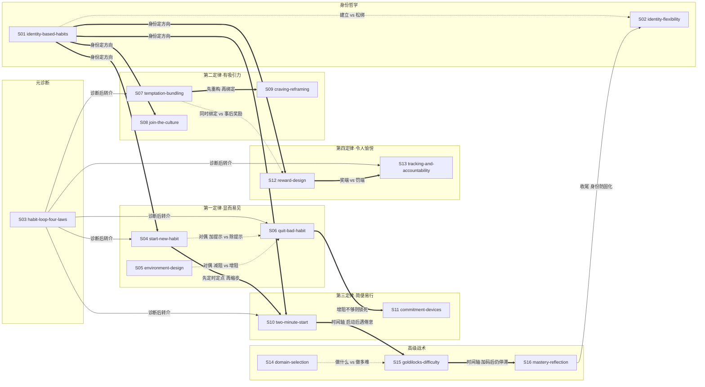

# 《掌控习惯》（Atomic Habits） — Skill Index

> 本书由 cangjie-skill 蒸馏, 共产出 **16** 个 skills。
> 处理时间: 2026-10-06

## 关于这本书

- **书名**: 《掌控习惯》（Atomic Habits）
- **作者**: 詹姆斯·克利尔（James Clear）
- **出版年**: 2018（英文原版；中译本 2019.7，北京联合出版公司，迩东晨译）
- **skill 总数**: 16
- **一句话主旨**: 微小习惯的复利式积累能重塑一个人的身份与人生；改变行为不靠拔高目标或锤炼意志力，而是靠一套基于"提示→渴求→反应→奖励"习惯回路的体系工程——四大定律正向使用养成好习惯，反向使用戒除坏习惯。
- **整书理解**: [BOOK_OVERVIEW.md](BOOK_OVERVIEW.md)
- **术语词典**: [GLOSSARY.md](GLOSSARY.md)
- **阶段 1.5 验证总表**: [verified.md](verified.md)

---

## Skill 列表（按主题分组）

### 身份哲学

- [`identity-based-habits`](../skills/identity-based-habits/SKILL.md) — 用三层行为改变模型把结果目标改写为身份方向（想成为哪类人→这类人会做什么），再用投票模型给破戒一次发"多数票豁免"。
- [`identity-flexibility`](../skills/identity-flexibility/SKILL.md) — 角色退场或身份过紧时，把角色型身份改写为特质型身份（"我是运动员"→"我是那种精神坚强、喜欢身体挑战的人"），防止自我定义固化成牢笼。

### 元诊断

- [`habit-loop-four-laws`](../skills/habit-loop-four-laws/SKILL.md) — 元诊断器：用习惯回路四步定位行为卡在哪一环，按结论章诊断表（记不住→一；不想开始→二；太难→三；不想坚持→四）转介对应定律的技术 skill，只诊断不教技术。

### 第一定律：让它显而易见

- [`start-new-habit`](../skills/start-new-habit/SKILL.md) — 启动新习惯的计划链：习惯记分卡觉察（可选前置）→执行意图"我将于[时间]在[地点]做[事]"→习惯叠加，附锚点三校验（提示具体/频率一致/匹配动线）。
- [`environment-design`](../skills/environment-design/SKILL.md) — 让好行为自动发生的空间工程（兼跨第三定律的减阻）：提示显性化、一空间一用途（含数字分区）、减阻预备，把行为交给环境而非意志力。
- [`quit-bad-habit`](../skills/quit-bad-habit/SKILL.md) — 第一定律反用·戒除：盘点提示源→逐项移除隔离→对残留通道按增阻梯度加障碍，把"戒行为"换成"戒暴露"——自律者只是少暴露者。

### 第二定律：让它有吸引力

- [`temptation-bundling`](../skills/temptation-bundling/SKILL.md) — 两段式公式把"需要做的"与"想要做的"同时性绑定（特定剧只在健身车上看），让需要的习惯成为通往渴望的入口而非竞争者。
- [`join-the-culture`](../skills/join-the-culture/SKILL.md) — 社会杠杆：用双条件筛选群体（目标行为在其中是常态 + 你与成员已有共同点），让"和大家一样"本身成为执行力。
- [`craving-reframing`](../skills/craving-reframing/SKILL.md) — 认知杠杆："得→想"换词改写预测即改写渴望，配激励仪式随时调用状态；反用可逐条重写坏习惯的"好处"，让它失去吸引力。

### 第三定律：让它简便易行

- [`two-minute-start`](../skills/two-minute-start/SKILL.md) — 启动器：把新习惯压缩成两分钟内能物理完成的门户习惯，先标准化再优化；状态好想继续的日子也在两分钟处强制停。
- [`commitment-devices`](../skills/commitment-devices/SKILL.md) — 第三定律反用·锁定：承诺机制（奥德修斯合约）、一次性决策与自动化把正确行为变成默认选项；频率低到养不成习惯的重要行为直接交给自动化。

### 第四定律：让它令人愉悦

- [`reward-design`](../skills/reward-design/SKILL.md) — 给长期有利的行为添加即时快乐（增强法），用颠倒记账法奖励"忍住了没做"，奖励须经身份一致性校验——"奖励启动习惯，身份维持习惯"。
- [`tracking-and-accountability`](../skills/tracking-and-accountability/SKILL.md) — 持续件：追踪减负三原则 +"绝不错过两次"崩溃恢复协议，自我追踪不足时升级为习惯契约与问责伙伴（后果四性）。

### 高级战术

- [`domain-selection`](../skills/domain-selection/SKILL.md) — 方向层：基因适配四问定位"做什么"——乐趣的标志不是喜欢，而是能比多数人更容易承受其痛苦；找不到优势就自创交叉领域。
- [`goldilocks-difficulty`](../skills/goldilocks-difficulty/SKILL.md) — 动力层：给稳定运转的习惯加约 4% 难度并保留成功内核，爱上厌倦——成功的最大威胁不是失败而是倦怠。
- [`mastery-reflection`](../skills/mastery-reflection/SKILL.md) — 精通层：诊断自动化钝化（"你只是在强化，而不是在改善"），用掌握循环 + 年终三问/决策日志/诚信报告重启改进。

---

## 引用图



图例:

- `-->`  depends-on（依赖 / 转介）
- `-.->` contrasts-with（对比 / 对偶）
- `==>` composes-with（组合 / 衔接）

主要关系链:

1. **身份 → 各定律**: S01 的"想成为谁"是四个定律技术群的方向输入（图中各画一条代表边），S08/S12 直接引用投票模型。
2. **元诊断 → 技术群**: S03 诊断完立即转介对应定律 skill（S04/S06/S07/S10/S13 为五条主转介边），不抢调用。
3. **时间轴链**: S10 两分钟启动 → S15 4% 难度加码 → S16 反思防钝化，对应习惯生命周期的三个阶段。
4. **对偶结构**: S04 启动好习惯 ↔ S06 戒除坏习惯（提示的加与除）；S05 减阻 ↔ S06 增阻（同一环境工程的两个方向）；S12 奖励端 ↔ S13 契约罚端（第四定律的两面）。
5. **升级兜底**: S06 增阻不够时转 S11 锁死；S16 反思收尾转 S02 身份防固化。

---

## 推荐学习顺序

(从依赖图的叶子节点开始, 向上)

1. **S01 identity-based-habits** — 最基础, 没有前置: 先回答"想成为谁"
2. **S03 habit-loop-four-laws** — 学会用回路四步定位卡点, 为所有技术选型打底
3. **S04 start-new-habit** — 计划"何时何地做什么"（依赖 S01 方向）
4. **S10 two-minute-start** — 与 S04 组合: 把第一步压到两分钟
5. **S05 environment-design** — S04 的物理配套: 布置空间让提示显眼
6. **S06 quit-bad-habit** — S04/S05 的对偶面: 戒除方向的环境工程
7. **S07 temptation-bundling** — 第二定律首选杠杆: 给枯燥正事接上渴望
8. **S08 join-the-culture** — 社会杠杆: 双条件选群体
9. **S09 craving-reframing** — 认知杠杆: 换词重构, 可与 S07 组合
10. **S12 reward-design** — 第四定律: 即时奖励与颠倒记账
11. **S13 tracking-and-accountability** — 持续件: 追踪、绝不错过两次、契约问责
12. **S11 commitment-devices** — 结构兜底: 承诺机制与自动化
13. **S15 goldilocks-difficulty** — 习惯稳定后: 4% 加码对抗倦怠
14. **S16 mastery-reflection** — 自动化后: 钝化诊断与反思体系
15. **S14 domain-selection** — 方向层复盘: 复盘结论是"换赛道"时用
16. **S02 identity-flexibility** — 收尾: 身份防固化, 角色退场时改写

---

## 安装使用

本目录是构建产物, 宿主不会从这里加载 skill。要让 agent 真正调用, 把 skill 目录复制到宿主的 skills 目录:

```bash
# 用户级 (所有项目可用)
cp -r skills/start-new-habit ~/.claude/skills/

# 或项目级
cp -r skills/start-new-habit <project>/.claude/skills/    # Claude Code
cp -r skills/start-new-habit <project>/.cursor/skills/    # Cursor
```

---

## 接入 darwin-skill

所有 16 个 skill 均带有 `test-prompts.json` (darwin-skill 兼容格式), 可直接接入自动进化:

```
darwin evolve books/atomic-habits/
```

---

## 审计轨迹

- 候选单元池: [candidates/](candidates/)
- 被淘汰的候选 (含原因): [rejected/](rejected/)
- 阶段 1.5 三重验证总表: [verified.md](verified.md)
- BOOK_OVERVIEW: [BOOK_OVERVIEW.md](BOOK_OVERVIEW.md)
- 术语词典: [GLOSSARY.md](GLOSSARY.md)
