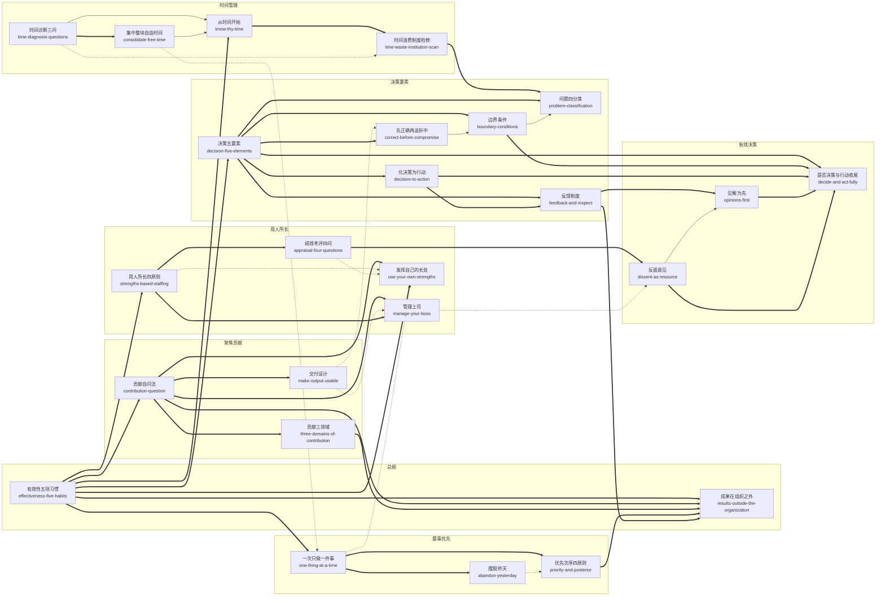

# 卓有成效的管理者（中英文双语珍藏版）（The Effective Executive）· 技能集

由彼得·德鲁克《卓有成效的管理者（中英文双语珍藏版）》蒸馏出的一组**可被 AI Agent 调用的技能**（Skills）。

> 有效性不是天赋而是可以学会的习惯——知识工作者通过「记录时间—聚焦贡献—发挥长处—要事优先—有效决策」五项实践，
> 把自己（而非下属）管理成能对组织成果负责的「管理者」，从而让平凡人做出不平凡的事。
> 本书不讲道理而讲动作：每一项习惯都配着可当场执行的操作（三问、四原则、五要素），是管理学里少见的「行动规范」。
> 本项目把这些方法论提炼成 25 个原子化技能。

---

## 来源

| | |
|---|---|
| **书名** | 卓有成效的管理者（中英文双语珍藏版）*The Effective Executive* |
| **作者** | 彼得·德鲁克（Peter F. Drucker），译者 许是祥 |
| **出版** | 英文原版 1966 年 / 机械工业出版社（德鲁克管理经典丛书）双语珍藏版 |
| **蒸馏工具** | cangjie-skill（仓颉：把长内容蒸馏成可调用技能的流水线） |
| **蒸馏方法** | RIA-TV++（整书理解 → 并行提取 → 三重验证 → RIA++ 构造 → 链接 → 压力测试 → 交付） |

---

## 25 个技能

25 个技能全部为 framework（方法论骨架）型单元，按德鲁克「总纲 + 五项习惯」的章节骨架分组。

### 一、有效性总纲（第 1 章：有效性可以学会）

- [`effectiveness-five-habits`](skills/effectiveness-five-habits/SKILL.md) — **有效性五项习惯（总纲与自检）**：不存在「有效的个性」，有效性是可训练的五项习惯，也是从「忙而无果」到「查缺下钻」的诊断路径
- [`results-outside-the-organization`](skills/results-outside-the-organization/SKILL.md) — **成果在组织之外（内/外定向）**：内部只有人工和成本，成果只能由外部产生；须付出特殊努力保持直接接触、观察「趋势的转变」

### 二、时间管理（第 2 章：掌握自己的时间）

- [`know-thy-time`](skills/know-thy-time/SKILL.md) — **从时间开始：记录规范与三步总纲**：起点不是做计划而是「认识你的时间」——当时记录、连续取样，再管理、再集中
- [`time-diagnosis-questions`](skills/time-diagnosis-questions/SKILL.md) — **时间诊断三问（取消 / 授权 / 问下属）**：逐项问「不做会怎样／能否别人代做／我在浪费谁的时间」，分别指向删、转、改三个动作
- [`time-waste-institution-scan`](skills/time-waste-institution-scan/SKILL.md) — **时间浪费的制度检修四项**：重复危机、人员过多（1/10 判据）、会议过多（1/4 判据）、信息不健全——时间浪费常是结构症状
- [`consolidate-free-time`](skills/consolidate-free-time/SKILL.md) — **集中整块自由时间并持续防守**：自由时间只剩约 1/4；碎片时间之和等于没有，必须并成整块并持续防守

### 三、聚焦贡献（第 3 章：我能贡献什么）

- [`contribution-question`](skills/contribution-question/SKILL.md) — **贡献自问法：「我能贡献什么」**：一句自问把注意力从勤奋、职权与融洽转向外部成果（含有效人际关系四项要求）
- [`three-domains-of-contribution`](skills/three-domains-of-contribution/SKILL.md) — **贡献三领域（直接成果 / 价值观 / 人才）**：三条互不替代的成效线，缺任一条机构衰败，权重随处境定
- [`make-output-usable`](skills/make-output-usable/SKILL.md) — **交付设计：让专业产出为他人可用**：被理解的责任在产出者一方；按使用者需要的时机、形式与语言交付

### 四、用人所长（第 4 章：如何发挥人的长处）

- [`strengths-based-staffing`](skills/strengths-based-staffing/SKILL.md) — **用人所长四原则（职位设计 → 择人 → 容忍短处）**：职位为常人设计、要求严涵盖广、先看能做什么、容忍短处并使其不产生作用——不改造人
- [`appraisal-four-questions`](skills/appraisal-four-questions/SKILL.md) — **绩效考评四问（含正直否决项）**：只评绩效不评「潜能」；末问「愿否让子女随他工作」是唯一的资格门槛
- [`manage-your-boss`](skills/manage-your-boss/SKILL.md) — **管理上司：用其长处、按他接受的方式**：协助上司发挥所长是下属的责任；「与其说提什么建议，倒不如说如何提出这一建议」
- [`use-your-own-strengths`](skills/use-your-own-strengths/SKILL.md) — **发挥自己的长处（工作习惯与机会意识）**：以「别人费力我轻松」定位长处，顺应工作习惯设计做法，「别人不让我干」多半是借口

### 五、要事优先（第 5 章：先做要事）

- [`one-thing-at-a-time`](skills/one-thing-at-a-time/SKILL.md) — **一次只做一件事（含三件自毁习惯）**：每件要事有最低整块时间门槛，人不能同时抛接多个球——越集中，完成得越多
- [`abandon-yesterday`](skills/abandon-yesterday/SKILL.md) — **摆脱昨天（该不该开始之问与推陈出新）**：先删旧、后开新：对既有投入问「如果还没做，现在该不该开始」
- [`priority-and-posterior`](skills/priority-and-posterior/SKILL.md) — **优先次序四原则与「优后」**：重将来/重机会/自选方向/目标高；真正的困难是敢定「不做什么」并坚持

### 六、决策要素（第 6 章：决策的要素）

- [`decision-five-elements`](skills/decision-five-elements/SKILL.md) — **决策五要素（审计清单）**：问题性质/边界条件/正确方案/化决策为行动/反馈，顺序不可倒置
- [`problem-classification`](skills/problem-classification/SKILL.md) — **问题四分类（「先假定它是经常性问题」）**：按「是否重复出现」分类，除真正偶发外一律建立规则/政策/原则
- [`boundary-conditions`](skills/boundary-conditions/SKILL.md) — **边界条件：决策必须满足的最低规范**：最低必须达成什么；不符者无效；据以判定决策何时应被抛弃
- [`correct-before-compromise`](skills/correct-before-compromise/SKILL.md) — **先「正确」再谈折中（两种折中的辨别）**：先有「正确」的基准，才能分辨「半片面包」与「半个婴儿」式折中
- [`decision-to-action`](skills/decision-to-action/SKILL.md) — **化决策为行动（四问与激励同步）**：谁了解/什么行动/谁执行/如何执行；要求改变行为时衡量与激励必须同步
- [`feedback-and-inspect`](skills/feedback-and-inspect/SKILL.md) — **反馈制度：决策前反馈与亲自视察**：决策前反馈检验衡量方法本身；最可靠的反馈是亲自视察而非批阅报告

### 七、有效决策（第 7 章：有效的决策）

- [`opinions-first`](skills/opinions-first/SKILL.md) — **见解为先：把见解当假设，先定衡量标准**：决策不从「搜集事实」开始；见解=尚待证实的假设，「相关的标准是什么」才是第一问
- [`dissent-as-resource`](skills/dissent-as-resource/SKILL.md) — **反面意见：制造并运用不同意见**：有意制造冲突意见（防俘虏/另一方案/激发想象），先理解后判是非
- [`decide-and-act-fully`](skills/decide-and-act-fully/SKILL.md) — **是否需要决策与行动收尾**：不做也是决策；行动或不行动，绝不只做一半；最后一步是勇气

---

## 技能之间的引用关系

显式链接共 **49 条**（composes-with 35 · contrasts-with 9 · depends-on 5）。本书为「总纲 + 两条链」的天然网络结构：总纲连 7 个下游，时间四单元成链，决策七单元成链。

图例：`-->` depends-on（使用前提） · `-.->` contrasts-with（同境况二选一） · `===>` composes-with（配合/接力）



**推荐学习顺序**（先总纲，再按「时间→贡献→长处→要事→决策」推进）：

1. **effectiveness-five-habits** — 总纲：有效性可学、五习惯清单与诊断路径；无前置。
2. **know-thy-time** → **time-diagnosis-questions** / **time-waste-institution-scan** → **consolidate-free-time** — 时间链：先采数据，再分流，最后集中整块并防守。
3. **contribution-question** → **three-domains-of-contribution** / **make-output-usable** — 贡献链；可并行读 **results-outside-the-organization** 理解「为什么必须向外看」。
4. **strengths-based-staffing** → **appraisal-four-questions**；**manage-your-boss**；**use-your-own-strengths** — 长处链：向下用人、周期考评、向上用长、对自己盘点。
5. **abandon-yesterday** → **priority-and-posterior** → **one-thing-at-a-time** — 要事链：先减存量，再排次序，最后串行执行。
6. **decision-five-elements** → **problem-classification** → **boundary-conditions** → **correct-before-compromise** → **decision-to-action** → **feedback-and-inspect** — 决策审计与逐要素下钻；**decide-and-act-fully** 贯穿首尾。
7. **opinions-first** → **dissent-as-resource** → **decide-and-act-fully** — 有效决策链：先立「见解=假设、先定标准」的规则，再主动制造并消化异议，最后勇气拍板。

只读四篇（时间有限时）：effectiveness-five-habits → know-thy-time → contribution-question → decision-five-elements。

---

## 目录结构

```text
effective-executive/
├── README.md
├── skills/                      # 25 个可安装技能（核心交付物）
│   └── <skill-slug>/
│       ├── SKILL.md             # 技能定义（R/I/A1/A2/E/B 六段）
│       ├── test-prompts.json    # 触发/诱饵测试集
│       └── test-results.md      # 压力测试结果
└── docs/                        # 蒸馏文档与审计轨迹
    ├── DIGEST.md / GLOSSARY.md / INDEX.md
    ├── BOOK_OVERVIEW.md / verified.md / PIPELINE_STATE.md
    ├── rejected/
    └── candidates/              # 框架/原则/案例/反例/术语 候选池
```

---

## 关于内容与版权

本项目是**方法论蒸馏产物**，不含原书全文：

- 每个技能对原书的引用严格控制在 **≤150 字/段**，属于合理引用范畴；
- 原文的版权归原作者彼得·德鲁克、译者许是祥及出版社（机械工业出版社）所有；
- 建议购买正版书籍配合使用。

---

## 如何重新生成

本项目由 cangjie-skill（仓颉蒸馏流水线）自动生成。若要复现或调整：

1. 准备书籍文本（`fulltext.txt`）
2. 运行 RIA-TV++ 流水线（阶段 0–5，详见 `docs/PIPELINE_STATE.md`）
3. 通过三重验证 + 压力测试的单元会被构造为独立技能并安装

如需让技能持续进化，可喂给 `darwin-skill`：`darwin evolve effective-executive/`
