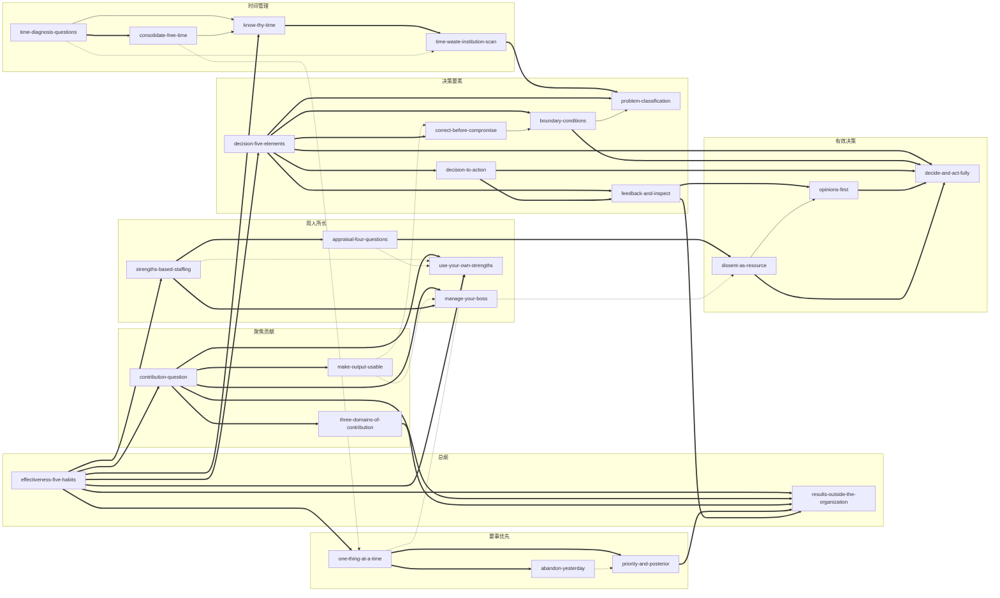

# 《卓有成效的管理者（中英文双语珍藏版）》 — Skill Index

> 本书由 cangjie-skill 蒸馏， 共产出 **25** 个 skills。
> 处理时间: 2026-09-29

## 关于这本书

- **作者**: [美] 彼得·德鲁克（Peter F. Drucker），译者 许是祥
- **出版年**: 英文原版 1966 年（Harper & Row）；本版机械工业出版社（德鲁克管理经典丛书），ISBN 978-7-111-28070-5
- **一句话主旨**: 有效性不是天赋而是可以学会的习惯——知识工作者通过"记录时间—聚焦贡献—发挥长处—要事优先—有效决策"这五项实践，把自己（而非下属）管理成能对组织成果负责的"管理者"，从而让平凡人做出不平凡的事。
- **整书理解**: 见 [BOOK_OVERVIEW.md](./BOOK_OVERVIEW.md)
- **精华长文** (不读全书看这篇): [DIGEST.md](./DIGEST.md)
- **术语词典**: [GLOSSARY.md](./GLOSSARY.md)

---

## Skill 列表 (按主题分组)

> 25 个 skill 全部为 **framework（方法论骨架）** 型单元（阶段 1.5 verified.md 判定），类型栏括注为其形态。
> 来源章节按 fulltext.txt 中文部分行号；verified id 对应 [verified.md](./verified.md) 的 f01–f25。

### 一、有效性总纲（第1章：有效性可以学会）

| slug | 标题 | 一句话 | 类型 | 来源章节 | verified id |
|---|---|---|---|---|---|
| [`effectiveness-five-habits`](./effectiveness-five-habits/SKILL.md) | 有效性五项习惯（总纲与自检） | 不存在"有效的个性"，有效性是可训练的五项习惯，也是从"忙而无果"到"查缺下钻"的诊断路径 | framework（总纲/路由） | 第1章（L442–468、L482）；第8章（L1904–1914） | f01 |
| [`results-outside-the-organization`](./results-outside-the-organization/SKILL.md) | 成果在组织之外（内/外定向） | 内部只有人工和成本，成果只能由外部产生；须付出特殊努力保持直接接触、观察"趋势的转变" | framework（结构定律/定向体检） | 第1章（L358–394）；第3章（L799、L861、L970）；第8章（L1922） | f25 |

### 二、时间管理（第2章：掌握自己的时间）

| slug | 标题 | 一句话 | 类型 | 来源章节 | verified id |
|---|---|---|---|---|---|
| [`know-thy-time`](./know-thy-time/SKILL.md) | 从时间开始：记录规范与三步总纲 | 起点不是做计划而是"认识你的时间"——当时记录、连续取样，再管理、再集中 | framework（记录规范/流程） | 第2章（L493–509、L601–609）；第8章（L1904） | f02 |
| [`time-diagnosis-questions`](./time-diagnosis-questions/SKILL.md) | 时间诊断三问（取消 / 授权 / 问下属） | 逐项问"不做会怎样／能否别人代做／我在浪费谁的时间"，分别指向删、转、改三个动作 | framework（三问清单） | 第2章（L611–635、L639–657）；第8章（L1906） | f03 |
| [`time-waste-institution-scan`](./time-waste-institution-scan/SKILL.md) | 时间浪费的制度检修四项 | 重复危机、人员过多（1/10 判据）、会议过多（1/4 判据）、信息不健全——时间浪费常是结构症状 | framework（检修清单/阈值判据） | 第2章（L663–724）；第8章（L1906） | f04 |
| [`consolidate-free-time`](./consolidate-free-time/SKILL.md) | 集中整块自由时间并持续防守 | 自由时间只剩约 1/4；碎片时间之和等于没有，必须并成整块并持续防守 | framework（操作程序） | 第2章（L730–769） | f05 |

### 三、聚焦贡献（第3章：我能贡献什么）

| slug | 标题 | 一句话 | 类型 | 来源章节 | verified id |
|---|---|---|---|---|---|
| [`contribution-question`](./contribution-question/SKILL.md) | 贡献自问法："我能贡献什么" | 一句自问把注意力从勤奋、职权与融洽转向外部成果（含有效人际关系四项要求） | framework（自问句/心态转换） | 第3章（L782–811、L896–949）；第8章（L1908） | f06 |
| [`three-domains-of-contribution`](./three-domains-of-contribution/SKILL.md) | 贡献三领域（直接成果 / 价值观 / 人才） | 三条互不替代的成效线，缺任一条机构衰败，权重随处境定 | framework（清单/配比检查） | 第3章（L813–829、L845–853）；第8章（L1908） | f07 |
| [`make-output-usable`](./make-output-usable/SKILL.md) | 交付设计：让专业产出为他人可用 | 被理解的责任在产出者一方；按使用者需要的时机、形式与语言交付 | framework（四问交付设计） | 第3章（L867–890）；机制来源第1章 L276 | f08 |

### 四、用人所长（第4章：如何发挥人的长处）

| slug | 标题 | 一句话 | 类型 | 来源章节 | verified id |
|---|---|---|---|---|---|
| [`strengths-based-staffing`](./strengths-based-staffing/SKILL.md) | 用人所长四原则（职位设计 → 择人 → 容忍短处） | 职位为常人设计、要求严涵盖广、先看能做什么、容忍短处并使其不产生作用——不改造人 | framework（四原则） | 第4章（L990–1170）；第1章 L411；第8章（L1910） | f09 |
| [`appraisal-four-questions`](./appraisal-four-questions/SKILL.md) | 绩效考评四问（含正直否决项） | 只评绩效不评"潜能"；末问"愿否让子女随他工作"是唯一的资格门槛 | framework（四问+资格门槛） | 第4章（L1086–1118） | f10 |
| [`manage-your-boss`](./manage-your-boss/SKILL.md) | 管理上司：用其长处、按他接受的方式 | 协助上司发挥所长是下属的责任；"与其说提什么建议，倒不如说如何提出这一建议" | framework（四问+方式判定） | 第4章（L1176–1201） | f11 |
| [`use-your-own-strengths`](./use-your-own-strengths/SKILL.md) | 发挥自己的长处（工作习惯与机会意识） | 以"别人费力我轻松"定位长处，顺应工作习惯设计做法，"别人不让我干"多半是借口 | framework（盘点+改写） | 第4章（L1207–1244） | f12 |

### 五、要事优先（第5章：先做要事）

| slug | 标题 | 一句话 | 类型 | 来源章节 | verified id |
|---|---|---|---|---|---|
| [`one-thing-at-a-time`](./one-thing-at-a-time/SKILL.md) | 一次只做一件事（含三件自毁习惯） | 每件要事有最低整块时间门槛，人不能同时抛接多个球——越集中，完成得越多 | framework（串行纪律） | 第5章（L1257–1289，含第2章 L540–546） | f13 |
| [`abandon-yesterday`](./abandon-yesterday/SKILL.md) | 摆脱昨天（该不该开始之问与推陈出新） | 先删旧、后开新：对既有投入问"如果还没做，现在该不该开始" | framework（判据+配比规则） | 第5章（L1295–1332） | f14 |
| [`priority-and-posterior`](./priority-and-posterior/SKILL.md) | 优先次序四原则与"优后" | 重将来/重机会/自选方向/目标高；真正的困难是敢定"不做什么"并坚持 | framework（四原则+优后决策） | 第5章（L1338–1383） | f15 |

### 六、决策要素（第6章：决策的要素）

| slug | 标题 | 一句话 | 类型 | 来源章节 | verified id |
|---|---|---|---|---|---|
| [`decision-five-elements`](./decision-five-elements/SKILL.md) | 决策五要素（审计清单） | 问题性质/边界条件/正确方案/化决策为行动/反馈，顺序不可倒置 | framework（五要素审计清单） | 第6章（L1391–1488）；第8章（L1914） | f16 |
| [`problem-classification`](./problem-classification/SKILL.md) | 问题四分类（"先假定它是经常性问题"） | 按"是否重复出现"分类，除真正偶发外一律建立规则/政策/原则 | framework（四分类法） | 第6章（L1492–1556）；第7章 L1861 | f17 |
| [`boundary-conditions`](./boundary-conditions/SKILL.md) | 边界条件：决策必须满足的最低规范 | 最低必须达成什么；不符者无效；据以判定决策何时应被抛弃 | framework（三用途判据） | 第6章（L1558–1586；L1550；L1630–1638） | f18 |
| [`correct-before-compromise`](./correct-before-compromise/SKILL.md) | 先"正确"再谈折中（两种折中的辨别） | 先有"正确"的基准，才能分辨"半片面包"与"半个婴儿"式折中 | framework（两类折中辨别） | 第6章第三要素（L1588–1598；L1746–1762） | f19 |
| [`decision-to-action`](./decision-to-action/SKILL.md) | 化决策为行动（四问与激励同步） | 谁了解/什么行动/谁执行/如何执行；要求改变行为时衡量与激励必须同步 | framework（四问+激励同步） | 第6章第四要素（L1600–1628） | f20 |
| [`feedback-and-inspect`](./feedback-and-inspect/SKILL.md) | 反馈制度：决策前反馈与亲自视察 | 决策前反馈检验衡量方法本身；最可靠的反馈是亲自视察而非批阅报告 | framework（两层反馈设计） | 第6章第五要素（L1630–1652）；第7章（L1701–1707） | f21 |

### 七、有效决策（第7章：有效的决策）

| slug | 标题 | 一句话 | 类型 | 来源章节 | verified id |
|---|---|---|---|---|---|
| [`opinions-first`](./opinions-first/SKILL.md) | 见解为先：把见解当假设，先定衡量标准 | 决策不从"搜集事实"开始；见解=尚待证实的假设，"相关的标准是什么"才是第一问 | framework（认识论规则） | 第7章（L1673–1717） | f22 |
| [`dissent-as-resource`](./dissent-as-resource/SKILL.md) | 反面意见：制造并运用不同意见 | 有意制造冲突意见（防俘虏/另一方案/激发想象），先理解后判是非 | framework（异议制造与处理纪律） | 第7章（L1719–1784） | f23 |
| [`decide-and-act-fully`](./decide-and-act-fully/SKILL.md) | 是否需要决策与行动收尾 | 不做也是决策；行动或不行动，绝不只做一半；最后一步是勇气 | framework（两端判据） | 第7章（L1786–1820） | f24 |

---

## 类型说明

25 个 skill 全部通过阶段 1.5 三重验证（V1 跨域 / V2 预测力 / V3 独特性），全部为 **framework（方法论骨架）** 型：

- **总纲/路由** 1 个（effectiveness-five-habits）——可先跑它做整体诊断，再按缺口下钻。
- **结构定律/定向** 1 个（results-outside-the-organization）——理解全书外部导向的公共背景。
- **诊断/清单/判据类** 14 个（时间四单元、贡献三单元中两席、考评/上司/自我三席、决策要素六单元等）。
- **程序/纪律类** 9 个（记录、集中整块、串行、放弃、排序、折中辨别、行动化、反馈、异议与拍板）。

全部单元均绑定书内案例与反例（详见各 SKILL.md 的 A1/B 段与 [candidates/](./candidates/)）。

---

## 引用图

图例: `-->` depends-on（使用前提） · `-.->` contrasts-with（同境况二选一） · `===>` composes-with（配合/接力）



关系统计: 显式链接 **49 条**（composes-with 35 · contrasts-with 9 · depends-on 5）；frontmatter 双向记录共 98 条，另需 2 条单向补齐已对称。节制原则校验：本书为"总纲 + 两条链"的天然网络结构（总纲连 7 个下游，时间四单元成链，决策七单元成链），平均每 skill 度数约 3.9——高于单书平行结构的经验值，但与德鲁克本人的章节递进结构一致，非硬凑；5 条 depends-on 集中于链内（时间链 2 条、决策链 2 条、异议规则 1 条）。

---

## 推荐学习顺序

（从依赖关系与书内推进逻辑推出：先总纲，再按"时间（可观察）→ 贡献（观念）→ 长处（行为）→ 要事（取舍）→ 决策（判断）"推进。）

1. **effectiveness-five-habits** — 总纲：有效性可学、五习惯清单与诊断路径；无前置。
2. **know-thy-time** → **time-diagnosis-questions** / **time-waste-institution-scan** → **consolidate-free-time** — 时间链：先采数据，再分流（个人活动裁决 / 制度检修），最后集中整块并防守。
3. **contribution-question** → **three-domains-of-contribution** / **make-output-usable** — 贡献链：先换心态坐标，再做成效配比与交付设计；可并行读 **results-outside-the-organization** 理解"为什么必须向外看"。
4. **strengths-based-staffing** → **appraisal-four-questions**；**manage-your-boss**；**use-your-own-strengths** — 长处链：向下用人、周期考评、向上用长、对自己盘点，四个方向同源。
5. **abandon-yesterday** → **priority-and-posterior** → **one-thing-at-a-time** — 要事链：先减存量（放弃），再排次序（含优后），最后串行执行。
6. **decision-five-elements** — 决策总审计；随后按要素下钻：**problem-classification** → **boundary-conditions** → **correct-before-compromise** → **decision-to-action** → **feedback-and-inspect**；两端的 **decide-and-act-fully** 贯穿首尾。
7. **opinions-first** → **dissent-as-resource** → **decide-and-act-fully** — 有效决策链：先立"见解=假设、先定标准"的规则，再主动制造并消化异议，最后勇气拍板、绝不只做一半。

只读四篇（时间有限时）：effectiveness-five-habits → know-thy-time → contribution-question → decision-five-elements。

---

## 安装使用

本目录是构建产物，宿主不会从这里加载 skill。**按用户 2026-09-29 决策，本批 skill 未安装**（未复制到 `.trae/skills/`，未动 `e:\solo\skill-bookshelf\`）。如需启用，把 skill 目录手动复制到宿主的 skills 目录：

```bash
# 用户级 (所有项目可用)
cp -r effectiveness-five-habits ~/.claude/skills/

# 或项目级
cp -r effectiveness-five-habits <project>/.claude/skills/    # Claude Code
cp -r effectiveness-five-habits <project>/.cursor/skills/    # Cursor
```

只建议安装通过阶段 4 测试的 skill（本批 25 个全部达标，见各目录 `test-results.md`）；安装前请连同 `SKILL.md` 与 `test-prompts.json` 整个目录一并复制。

---

## 接入 darwin-skill

所有 skill 均带有 `test-prompts.json`（darwin-skill 兼容格式），可直接接入自动进化：

```
darwin evolve books/effective-executive/
```

---

## 审计轨迹

- 候选单元池: [candidates/](./candidates/)（184 条候选：框架 25 / 原则 43 / 案例 51 / 反例 37 / 术语 28）
- 被淘汰的候选 (含原因): [rejected/](./rejected/)（p17 会议，V3 不过）
- 三重验证结果: [verified.md](./verified.md)
- BOOK_OVERVIEW: [BOOK_OVERVIEW.md](./BOOK_OVERVIEW.md)
- 流水线状态: [PIPELINE_STATE.md](./PIPELINE_STATE.md)
