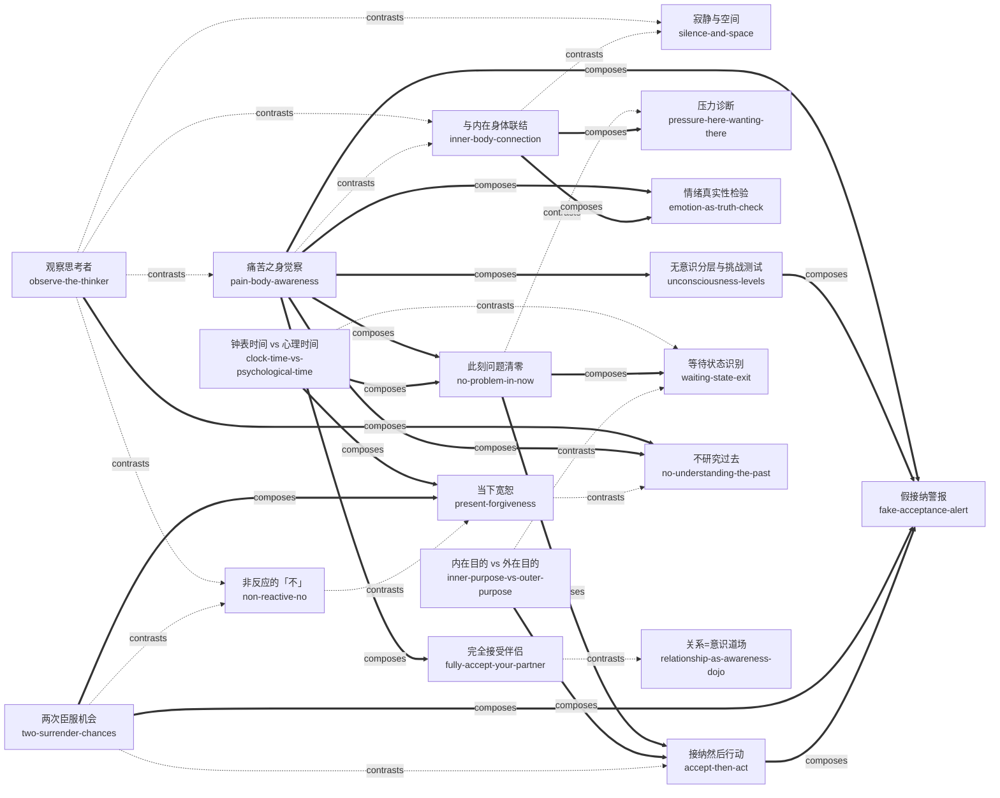

# 当下的力量（白金版）（The Power of Now）· 技能集

由埃克哈特·托利《当下的力量（白金版）》蒸馏出的一组**可被 AI Agent 调用的技能**（Skills）。

> 痛苦源于你对思维和时间（过去与未来）的认同；把注意力从思维中撤回、完全接纳当下时刻（临在），就能瓦解痛苦之身并触及本体——当下是你唯一拥有、也唯一能借力的东西。
> 本书先拆痛苦的发生机制（思维认同、心理时间、痛苦之身、无意识分层），再给出一组可以当场操作的门
> （观察思考者、内在身体、寂静与空间、臣服），最后把这些处方推广到最难的两类场景——亲密关系与厄运。
> 本项目把这些方法论提炼成 19 个原子化技能。

---

## 来源

| | |
|---|---|
| **书名** | 当下的力量（白金版）*The Power of Now* |
| **作者** | 埃克哈特·托利（Eckhart Tolle），译者 曹植 |
| **出版** | 英文原版 1997 年 / 中信出版社白金版（中文版 2009） |
| **蒸馏工具** | cangjie-skill（仓颉：把长内容蒸馏成可调用技能的流水线） |
| **蒸馏方法** | RIA-TV++（整书理解 → 并行提取 → 三重验证 → RIA++ 构造 → 链接 → 压力测试 → 交付） |

---

## 19 个技能

### 一、觉察的入口（把注意力从思维移开）

- [`observe-the-thinker`](skills/observe-the-thinker/SKILL.md) — **观察思考者**：倾听脑内声音但不评判，观察使思维失去能量（全书之母，公共内核）
- [`inner-body-connection`](skills/inner-body-connection/SKILL.md) — **与内在身体联结**：注意力放进身体能量场，挑战来时先回体内几秒
- [`silence-and-space`](skills/silence-and-space/SKILL.md) — **寂静与空间**：注意力从声音/物体转向其下的寂静/空间，最省力的当下入口

### 二、看清机制的诊断器

- [`pain-body-awareness`](skills/pain-body-awareness/SKILL.md) — **痛苦之身觉察**：把反复发作的情绪痛苦当能量体识别、断粮、不认同
- [`unconsciousness-levels`](skills/unconsciousness-levels/SKILL.md) — **无意识分层与挑战测试**：用小挑战的反应测量自己的清醒度，独处的平静不作数
- [`clock-time-vs-psychological-time`](skills/clock-time-vs-psychological-time/SKILL.md) — **钟表时间 vs 心理时间**：用过去未来干活可以，被它们认同不行
- [`no-problem-in-now`](skills/no-problem-in-now/SKILL.md) — **此刻问题清零**：「此刻你有什么问题？」把焦虑的燃料库当场清空
- [`pressure-here-wanting-there`](skills/pressure-here-wanting-there/SKILL.md) — **压力诊断**：压力不在活多，在身在此心在彼；可以手快，不许心逃
- [`emotion-as-truth-check`](skills/emotion-as-truth-check/SKILL.md) — **情绪真实性检验**：脑中叙事与身体感受冲突时，先信身体

### 三、对处境的接纳与行动

- [`accept-then-act`](skills/accept-then-act/SKILL.md) — **接纳然后行动**：像它是你选择的一样接受现状，再行动（日常级）
- [`two-surrender-chances`](skills/two-surrender-chances/SKILL.md) — **两次臣服机会**：先接受已发生的事实，接受不了就接受感受本身（厄运级）
- [`non-reactive-no`](skills/non-reactive-no/SKILL.md) — **非反应的「不」**：可以坚定说不或陈述事实，但让它出自洞见而非反应
- [`fake-acceptance-alert`](skills/fake-acceptance-alert/SKILL.md) — **假接纳警报**：「允许一切」若不迈向「不再创造」就只是灵性徽章

### 四、与过去和未来和解

- [`waiting-state-exit`](skills/waiting-state-exit/SKILL.md) — **等待状态识别**：识别「用一生等待生活开始」的思维状态并当场撤离
- [`inner-purpose-vs-outer-purpose`](skills/inner-purpose-vs-outer-purpose/SKILL.md) — **内在目的 vs 外在目的**：目标尽管去追，决定体验的是你如何做此刻的事
- [`no-understanding-the-past`](skills/no-understanding-the-past/SKILL.md) — **不研究过去**：当下观察即化解过去，无限回溯是无底洞（创伤场景须转介）
- [`present-forgiveness`](skills/present-forgiveness/SKILL.md) — **当下宽恕**：事中即时宽恕，不给未来囤积怨恨

### 五、关系道场

- [`fully-accept-your-partner`](skills/fully-accept-your-partner/SKILL.md) — **完全接受伴侣**：停止批判与改造工程，接受或分开，禁止中间态
- [`relationship-as-awareness-dojo`](skills/relationship-as-awareness-dojo/SKILL.md) — **关系=意识道场**：关系不负责让你幸福，负责让无意识现形

---

## 技能之间的引用关系

图例：`-->` depends-on（本批为 0，19 个技能是同一状态「临在」的平行入口） · `-.->` contrasts-with（二选一） · `===>` composes-with（接力/配合）



显式链接共 32 条（contrasts-with 14 · composes-with 18 · depends-on 0）。19 个技能均为「临在」的平行入口，无 skill 以另一个 skill 为理解前提，故 depends-on 为 0 是如实结果而非缺失。

**推荐学习顺序**（按全书练习的依赖逻辑：先学公共内核，再学诊断器，最后按场景取用）：

1. **observe-the-thinker** — 全书之母，其余练习的公共内核。
2. **pain-body-awareness** — 情绪现场的第一线流程，与 1 互为内外两翼。
3. **inner-body-connection** / **silence-and-space** — 身体与环境两扇门。
4. **no-problem-in-now**（急性焦虑第一动作）+ **clock-time-vs-psychological-time**（立长期边界）。
5. **accept-then-act** → **two-surrender-chances** — 从日常抗拒到重大厄运的接纳阶梯。
6. 按场景取用：**unconsciousness-levels**（自测进步）· **pressure-here-wanting-there**（赶工）· **waiting-state-exit**（等待）· **inner-purpose-vs-outer-purpose**（意义）· **emotion-as-truth-check**（决策）· **non-reactive-no**（冲突）· **present-forgiveness**（怨恨）· **no-understanding-the-past**（疗愈路线）· **fully-accept-your-partner** / **relationship-as-awareness-dojo**（关系）· **fake-acceptance-alert**（修炼质检）。

---

## 目录结构

```text
power-of-now/
├── README.md
├── skills/                      # 19 个可安装技能（核心交付物）
│   └── <skill-slug>/
│       ├── SKILL.md             # 技能定义（R/I/A1/A2/E/B 六段）
│       ├── test-prompts.json    # 触发/诱饵测试集
│       └── test-results.md      # 压力测试结果
└── docs/                        # 蒸馏文档与审计轨迹
    ├── DIGEST.md / GLOSSARY.md / INDEX.md
    ├── BOOK_OVERVIEW.md / verified.md / PIPELINE_STATE.md
    ├── rejected/
    └── candidates/              # 框架/原则/案例/反例/术语 候选池
```

---

## 关于内容与版权

本项目是**方法论蒸馏产物**，不含原书全文：

- 每个技能对原书的引用严格控制在 **≤150 字/段**，属于合理引用范畴；
- 原文的版权归原作者埃克哈特·托利、译者曹植及出版社所有；
- 建议购买正版书籍配合使用。

---

## 如何重新生成

本项目由 cangjie-skill（仓颉蒸馏流水线）自动生成。若要复现或调整：

1. 准备书籍文本（`fulltext.txt`）
2. 运行 RIA-TV++ 流水线（阶段 0–5，详见 `docs/PIPELINE_STATE.md`）
3. 通过三重验证 + 压力测试的单元会被构造为独立技能并安装

如需让技能持续进化，可喂给 `darwin-skill`：`darwin evolve power-of-now/`
