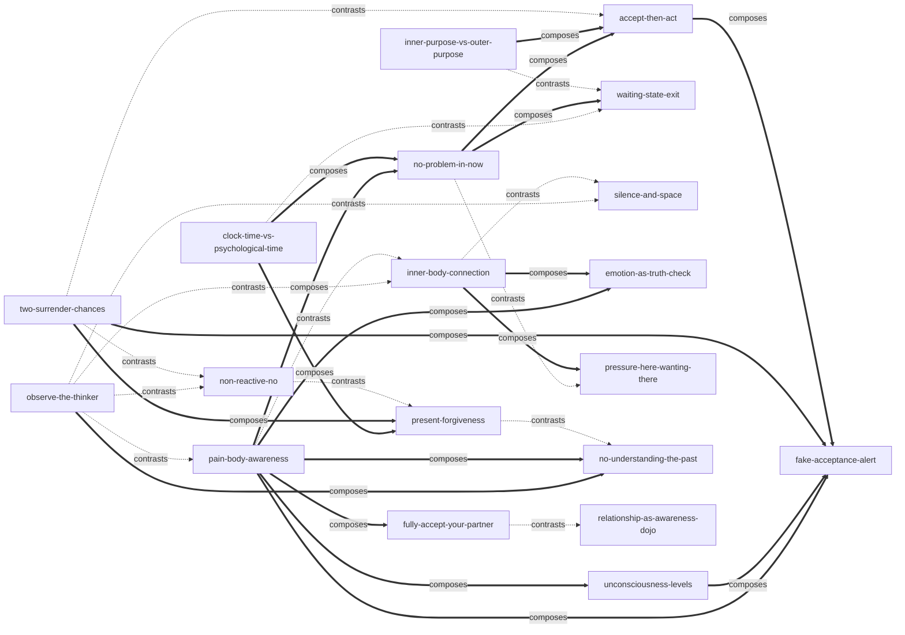

# 《当下的力量（白金版）》 — Skill Index

> 本书由 cangjie-skill 蒸馏， 共产出 **19** 个 skills。
> 处理时间: 2026-09-29

## 关于这本书

- **作者**: [德] 埃克哈特·托利（Eckhart Tolle），译者 曹植
- **出版年**: 英文原版 1997 年；中信出版社白金版（ISBN 9787508661766）
- **一句话主旨**: 痛苦源于你对思维和时间（过去与未来）的认同；把注意力从思维中撤回、完全接纳当下时刻（临在），就能瓦解痛苦之身并触及本体——当下是你唯一拥有、也唯一能借力的东西。
- **整书理解**: 见 [BOOK_OVERVIEW.md](./BOOK_OVERVIEW.md)
- **精华长文** (不读全书看这篇): [DIGEST.md](./DIGEST.md)
- **术语词典**: [GLOSSARY.md](./GLOSSARY.md)

---

## Skill 列表 (按主题分组)

### 一、觉察的入口（把注意力从思维移开）

- [`observe-the-thinker`](./observe-the-thinker/SKILL.md) — 观察思考者：倾听脑内声音但不评判，观察使思维失去能量（全书之母，公共内核）。
- [`inner-body-connection`](./inner-body-connection/SKILL.md) — 与内在身体联结：注意力放进身体能量场，挑战来时先回体内几秒。
- [`silence-and-space`](./silence-and-space/SKILL.md) — 寂静与空间：注意力从声音/物体转向其下的寂静/空间，最省力的当下入口。

### 二、看清机制的诊断器

- [`pain-body-awareness`](./pain-body-awareness/SKILL.md) — 痛苦之身觉察：把反复发作的情绪痛苦当能量体识别、断粮、不认同。
- [`unconsciousness-levels`](./unconsciousness-levels/SKILL.md) — 无意识分层与挑战测试：用小挑战的反应测量自己的清醒度，独处的平静不作数。
- [`clock-time-vs-psychological-time`](./clock-time-vs-psychological-time/SKILL.md) — 钟表时间 vs 心理时间：用过去未来干活可以，被它们认同不行。
- [`no-problem-in-now`](./no-problem-in-now/SKILL.md) — 此刻问题清零："此刻你有什么问题？"把焦虑的燃料库当场清空。
- [`pressure-here-wanting-there`](./pressure-here-wanting-there/SKILL.md) — 压力诊断：压力不在活多，在身在此心在彼；可以手快，不许心逃。
- [`emotion-as-truth-check`](./emotion-as-truth-check/SKILL.md) — 情绪真实性检验：脑中叙事与身体感受冲突时，先信身体。

### 三、对处境的接纳与行动

- [`accept-then-act`](./accept-then-act/SKILL.md) — 接纳然后行动：像它是你选择的一样接受现状，再行动（日常级）。
- [`two-surrender-chances`](./two-surrender-chances/SKILL.md) — 两次臣服机会：先接受已发生的事实，接受不了就接受感受本身（厄运级）。
- [`non-reactive-no`](./non-reactive-no/SKILL.md) — 非反应的"不"：可以坚定说不或陈述事实，但让它出自洞见而非反应。
- [`fake-acceptance-alert`](./fake-acceptance-alert/SKILL.md) — 假接纳警报："允许一切"若不迈向"不再创造"就只是灵性徽章。

### 四、与过去和未来和解

- [`waiting-state-exit`](./waiting-state-exit/SKILL.md) — 等待状态识别：识别"用一生等待生活开始"的思维状态并当场撤离。
- [`inner-purpose-vs-outer-purpose`](./inner-purpose-vs-outer-purpose/SKILL.md) — 内在目的 vs 外在目的：目标尽管去追，决定体验的是你如何做此刻的事。
- [`no-understanding-the-past`](./no-understanding-the-past/SKILL.md) — 不研究过去：当下观察即化解过去，无限回溯是无底洞（创伤场景须转介）。
- [`present-forgiveness`](./present-forgiveness/SKILL.md) — 当下宽恕：事中即时宽恕，不给未来囤积怨恨。

### 五、关系道场

- [`fully-accept-your-partner`](./fully-accept-your-partner/SKILL.md) — 完全接受伴侣：停止批判与改造工程，接受或分开，禁止中间态。
- [`relationship-as-awareness-dojo`](./relationship-as-awareness-dojo/SKILL.md) — 关系=意识道场：关系不负责让你幸福，负责让无意识现形。

### 类型说明

19 个 skill 中 **framework（方法论骨架）11 个**、**principle（原则/判据）8 个**，全部通过阶段 1.5 三重验证（V1 跨域 / V2 预测力 / V3 独特性），见 [verified.md](./verified.md)。

---

## 引用图

图例: `-->` depends-on（本批为 0，19 个 skill 是平行入口） · `-.->` contrasts-with（二选一） · `===>` composes-with（接力/配合）



关系统计: 显式链接 **32 条**（contrasts-with 14 · composes-with 18 · depends-on 0）。节制原则校验：本书 19 个 skill 均为同一状态（临在）的平行入口，无 skill 以另一个 skill 为理解前提，故 depends-on 为 0 是如实结果而非缺失；平均每 skill 度数 1.7，无硬凑链接。

---

## 推荐学习顺序

（本批无 depends-on 边，以下顺序按"全书练习的依赖逻辑"而非硬依赖给出：先学公共内核，再学诊断器，最后按场景取用。）

1. **observe-the-thinker** — 全书之母，其余练习的公共内核（观察使思维断能）。
2. **pain-body-awareness** — 情绪现场的第一线流程；与 1 互为内外两翼。
3. **inner-body-connection** / **silence-and-space** — 身体与环境两扇门，给 1-2 提供可轮换的入口。
4. **no-problem-in-now** — 急性焦虑的第一动作；配合 **clock-time-vs-psychological-time** 立长期边界。
5. **accept-then-act** → **two-surrender-chances** — 从日常抗拒到重大厄运的接纳阶梯。
6. 按场景取用：**unconsciousness-levels**（自测进步）· **pressure-here-wanting-there**（赶工）· **waiting-state-exit**（等待）· **inner-purpose-vs-outer-purpose**（意义）· **emotion-as-truth-check**（决策）· **non-reactive-no**（冲突）· **present-forgiveness**（怨恨）· **no-understanding-the-past**（疗愈路线）· **fully-accept-your-partner** / **relationship-as-awareness-dojo**（关系）· **fake-acceptance-alert**（修炼质检）。

---

## 安装使用

本目录是构建产物，宿主不会从这里加载 skill。**按用户 2026-09-29 决策，本批 skill 未安装**（未复制到 `.trae/skills/`，未动 `e:\solo\skill-bookshelf\`）。如需启用，把 skill 目录手动复制到宿主的 skills 目录：

```bash
# 用户级 (所有项目可用)
cp -r observe-the-thinker ~/.claude/skills/

# 或项目级
cp -r observe-the-thinker <project>/.claude/skills/    # Claude Code
cp -r observe-the-thinker <project>/.cursor/skills/    # Cursor
```

只建议安装通过阶段 4 测试的 skill（本批 19 个全部达标，见各目录 `test-results.md`）。

---

## 接入 darwin-skill

所有 skill 均带有 `test-prompts.json` (darwin-skill 兼容格式), 可直接接入自动进化:

```
darwin evolve books/power-of-now/
```

---

## 审计轨迹

- 候选单元池: [candidates/](./candidates/)
- 被淘汰的候选 (含原因): [rejected/](./rejected/)
- 三重验证结果: [verified.md](./verified.md)
- BOOK_OVERVIEW: [BOOK_OVERVIEW.md](./BOOK_OVERVIEW.md)
- 流水线状态: [PIPELINE_STATE.md](./PIPELINE_STATE.md)
