# 高效能人士的七个习惯（30周年纪念版）（The 7 Habits of Highly Effective People）· 技能集

由史蒂芬·柯维《高效能人士的七个习惯（30周年纪念版）》蒸馏出的一组**可被 AI Agent 调用的技能**（Skills）。

> 高效能不是技巧的叠加，而是把普遍永恒的原则内化为习惯、由内而外（先个人领域成功、后公众领域成功）地实现「产出/产能平衡」的持续过程。
> 全书有一条不可跳级的成长主线（成熟模式图）：依赖期（你）→ 独立期（我）→ 互赖期（我们），
> 前三个习惯完成个人领域的成功，中间三个完成公众领域的成功，第七个习惯给前六个充电。
> 本项目把这些方法论提炼成 29 个原子化技能。

---

## 来源

| | |
|---|---|
| **书名** | 高效能人士的七个习惯（30周年纪念版）*The 7 Habits of Highly Effective People* |
| **作者** | 史蒂芬·柯维（Stephen R. Covey, 1932–2012） |
| **出版** | 原著 1989 年 / 本批以 30 周年纪念版（2018 中文版）为底本 |
| **蒸馏工具** | cangjie-skill（仓颉：把长内容蒸馏成可调用技能的流水线） |
| **蒸馏方法** | RIA-TV++（整书理解 → 并行提取 → 三重验证 → RIA++ 构造 → 链接 → 压力测试 → 交付） |

---

## 29 个技能

主题分组对应柯维自己的骨架：思维方式（第 1–2 章）→ 个人领域的成功（习惯一/二/三）→ 公众领域的成功（习惯四/五/六及关系原则）→ 更新（习惯七）。

### 思维方式与原则（第 1–2 章的地基）

- [`paradigm-shift-first`](skills/paradigm-shift-first/SKILL.md) — **思维转换优先**：先判定问题在行为层、态度层还是地图（思维方式）层，地图错了越努力越错
- [`habit-knowledge-skill-desire`](skills/habit-knowledge-skill-desire/SKILL.md) — **习惯三要素**：习惯 = 知识 × 技巧 × 意愿的交集，「知道做不到」先定位缺哪一栏再对症下药
- [`maturity-continuum`](skills/maturity-continuum/SKILL.md) — **成熟模式图**：依赖→独立→互赖三阶段给个人或团队定位，是全书 29 个技能排序逻辑的骨架
- [`ppc-balance`](skills/ppc-balance/SKILL.md) — **产出/产能平衡**：金蛋与鹅——识别杀鹅取蛋（透支健康、信任、士气换短期数字）与守鹅不取蛋

### 个人领域的成功（习惯一/二/三：依赖→独立）

**习惯一·积极主动**

- [`influence-circle`](skills/influence-circle/SKILL.md) — **影响圈与关注圈**：把挂心事归圈、审计精力投放，把行动拉回影响圈
- [`stimulus-response-gap`](skills/stimulus-response-gap/SKILL.md) — **刺激与回应之间的距离**：在刺激与回应之间行使选择的自由，用四大天赋选回应
- [`proactive-language`](skills/proactive-language/SKILL.md) — **替换消极语言**：把「要是/我不得不/我办不到」改写为「我可以/我选择」，并绑定圈内行动
- [`make-and-keep-promises`](skills/make-and-keep-promises/SKILL.md) — **做出承诺，信守诺言**：影响圈的核心——从小事「承诺-兑现」循环培育内心的诚信

**习惯二·以终为始**

- [`two-creations`](skills/two-creations/SKILL.md) — **两次创造**：任何事物先有心智创造（蓝图）再有实体创造（施工），警惕蓝图被他人代写
- [`leadership-before-management`](skills/leadership-before-management/SKILL.md) — **领导先于管理**：先验证方向（做正确的事）再优化执行（正确地做事）
- [`personal-mission-statement`](skills/personal-mission-statement/SKILL.md) — **个人使命宣言**：品德+贡献+原则的个人宪法，重大取舍用它裁决而非临场权衡
- [`life-center-diagnosis`](skills/life-center-diagnosis/SKILL.md) — **生活中心诊断**：用两难情境反推安全感/方向/智慧/力量的供给源，十种中心+情境测试
- [`funeral-exercise`](skills/funeral-exercise/SKILL.md) — **葬礼演练**：以人生终点为衡量标准，四位发言人的价值观探测仪
- [`transition-person`](skills/transition-person/SKILL.md) — **转型者**：识别并改写家族代际传递的行为模式，「到我这为止」

**习惯三·要事第一**

- [`fourth-gen-time-management`](skills/fourth-gen-time-management/SKILL.md) — **第四代时间管理**：以角色与第二象限（重要不紧急）为中心的周规划，六标准+四步骤
- [`stewardship-delegation`](skills/stewardship-delegation/SKILL.md) — **责任型授权**：指令型授权 vs 责任型授权，五要素共识，盯结果不盯方法
- [`effectiveness-not-efficiency-with-people`](skills/effectiveness-not-efficiency-with-people/SKILL.md) — **对人讲效用，对事讲效率**：为人牺牲日程合法且不应内疚

### 公众领域的成功（习惯四/五/六：独立→互赖）

**关系介质（第六章）**

- [`emotional-bank-account`](skills/emotional-bank-account/SKILL.md) — **情感账户**：信任是可存取、会透支、按对方汇率计价的账户，七种存款方式——公众领域三个习惯的共同介质
- [`clarify-expectations`](skills/clarify-expectations/SKILL.md) — **一开始就明确期望**：几乎所有的人际障碍源于对角色和目标的期望不明
- [`honor-the-absent`](skills/honor-the-absent/SKILL.md) — **维护不在场的人**：在场的人会据此推定你将如何对待他们

**习惯四·双赢思维**

- [`win-win-five-dimensions`](skills/win-win-five-dimensions/SKILL.md) — **双赢思维五要领**：品德、关系、协议、体系、过程五层检视「双赢推行不下去」卡在哪
- [`six-interaction-modes`](skills/six-interaction-modes/SKILL.md) — **人际交往六模式**：双赢/赢输/输赢/输输/独善其身/无交易，给交往定性并追溯模式来源
- [`win-win-or-no-deal`](skills/win-win-or-no-deal/SKILL.md) — **不能双赢就好聚好散**：无交易是双赢不可得时的合法出口
- [`no-involvement-no-commitment`](skills/no-involvement-no-commitment/SKILL.md) — **唯有参与，才有认同**：让执行者参与拟定共同目标，四问检验

**习惯五·知彼解己**

- [`seek-first-to-understand`](skills/seek-first-to-understand/SKILL.md) — **先理解再被理解**：先移情聆听直到能替对方复述其立场，再争取被理解
- [`diagnose-before-prescribe`](skills/diagnose-before-prescribe/SKILL.md) — **先诊断，后开方**：暂停四种自传式回应，走移情聆听四阶段，诊断完成前不开方

**习惯六·统合综效**

- [`synergy-third-alternative`](skills/synergy-third-alternative/SKILL.md) — **统合综效与第三选择**：从立场下探到真实关切，共创既非折中（1+1≈1.5）也非单方胜利的 1+1>2

**影响他人**

- [`affirm-potential`](skills/affirm-potential/SKILL.md) — **以潜能期许他人**：不做社会之镜的复读机，按潜能而非现有表现设定并明说期许（第十章·改变他人）

### 更新（习惯七）

- [`sharpen-the-saw-four-dimensions`](skills/sharpen-the-saw-four-dimensions/SKILL.md) — **不断更新·四层面**：身体/精神/智力/社会情感平衡「磨刀」，最小单元是每天一小时——所有习惯的保鲜机制

---

## 技能之间的引用关系

共 64 条关系边：12 条 depends-on（使用前先理解）、13 条 contrasts-with（看情境二选一）、39 条 composes-with（经常配合使用）。

```mermaid
graph LR
    subgraph G1[思维方式与原则]
        n_paradigm_shift_first["思维转换优先<br/>paradigm-shift-first"]
        n_habit_knowledge_skill_desire["习惯三要素<br/>habit-knowledge-skill-desire"]
        n_maturity_continuum["成熟模式图<br/>maturity-continuum"]
        n_ppc_balance["产出/产能平衡<br/>ppc-balance"]
    end
    subgraph G2[个人领域的成功]
        n_influence_circle["影响圈与关注圈<br/>influence-circle"]
        n_stimulus_response_gap["刺激与回应距离<br/>stimulus-response-gap"]
        n_proactive_language["替换消极语言<br/>proactive-language"]
        n_make_and_keep_promises["承诺与信守<br/>make-and-keep-promises"]
        n_two_creations["两次创造<br/>two-creations"]
        n_leadership_before_management["领导先于管理<br/>leadership-before-management"]
        n_personal_mission_statement["个人使命宣言<br/>personal-mission-statement"]
        n_life_center_diagnosis["生活中心诊断<br/>life-center-diagnosis"]
        n_funeral_exercise["葬礼演练<br/>funeral-exercise"]
        n_transition_person["转型者<br/>transition-person"]
        n_fourth_gen_time_management["第四代时间管理<br/>fourth-gen-time-management"]
        n_stewardship_delegation["责任型授权<br/>stewardship-delegation"]
        n_effectiveness_not_efficiency_with_people["对人讲效用对事讲效率<br/>effectiveness-not-efficiency-with-people"]
    end
    subgraph G3[公众领域的成功]
        n_emotional_bank_account["情感账户<br/>emotional-bank-account"]
        n_win_win_five_dimensions["双赢五要领<br/>win-win-five-dimensions"]
        n_six_interaction_modes["人际六模式<br/>six-interaction-modes"]
        n_win_win_or_no_deal["好聚好散<br/>win-win-or-no-deal"]
        n_clarify_expectations["明确期望<br/>clarify-expectations"]
        n_honor_the_absent["维护不在场的人<br/>honor-the-absent"]
        n_no_involvement_no_commitment["唯有参与才有认同<br/>no-involvement-no-commitment"]
        n_seek_first_to_understand["先理解再被理解<br/>seek-first-to-understand"]
        n_diagnose_before_prescribe["先诊断后开方<br/>diagnose-before-prescribe"]
        n_synergy_third_alternative["统合综效·第三选择<br/>synergy-third-alternative"]
        n_affirm_potential["以潜能期许<br/>affirm-potential"]
    end
    subgraph G4[更新]
        n_sharpen_the_saw_four_dimensions["四层面更新<br/>sharpen-the-saw-four-dimensions"]
    end

    n_leadership_before_management -->|depends-on| n_two_creations
    n_fourth_gen_time_management -->|depends-on| n_leadership_before_management
    n_fourth_gen_time_management -->|depends-on| n_personal_mission_statement
    n_stewardship_delegation -->|depends-on| n_leadership_before_management
    n_personal_mission_statement -->|depends-on| n_two_creations
    n_funeral_exercise -->|depends-on| n_two_creations
    n_transition_person -->|depends-on| n_personal_mission_statement
    n_proactive_language -->|depends-on| n_influence_circle
    n_diagnose_before_prescribe -->|depends-on| n_seek_first_to_understand
    n_synergy_third_alternative -->|depends-on| n_seek_first_to_understand
    n_synergy_third_alternative -->|depends-on| n_win_win_five_dimensions
    n_win_win_five_dimensions -->|depends-on| n_emotional_bank_account
    n_stimulus_response_gap -.->|contrasts-with| n_proactive_language
    n_stimulus_response_gap -.->|contrasts-with| n_transition_person
    n_stimulus_response_gap -.->|contrasts-with| n_paradigm_shift_first
    n_life_center_diagnosis -.->|contrasts-with| n_funeral_exercise
    n_habit_knowledge_skill_desire -.->|contrasts-with| n_fourth_gen_time_management
    n_habit_knowledge_skill_desire -.->|contrasts-with| n_stimulus_response_gap
    n_transition_person -.->|contrasts-with| n_two_creations
    n_paradigm_shift_first -.->|contrasts-with| n_diagnose_before_prescribe
    n_paradigm_shift_first -.->|contrasts-with| n_affirm_potential
    n_clarify_expectations -.->|contrasts-with| n_stewardship_delegation
    n_honor_the_absent -.->|contrasts-with| n_make_and_keep_promises
    n_no_involvement_no_commitment -.->|contrasts-with| n_synergy_third_alternative
    n_two_creations -.->|contrasts-with| n_clarify_expectations
    n_influence_circle ==>|composes-with| n_stimulus_response_gap
    n_influence_circle ==>|composes-with| n_make_and_keep_promises
    n_influence_circle ==>|composes-with| n_honor_the_absent
    n_influence_circle ==>|composes-with| n_affirm_potential
    n_ppc_balance ==>|composes-with| n_emotional_bank_account
    n_ppc_balance ==>|composes-with| n_sharpen_the_saw_four_dimensions
    n_ppc_balance ==>|composes-with| n_stewardship_delegation
    n_ppc_balance ==>|composes-with| n_effectiveness_not_efficiency_with_people
    n_ppc_balance ==>|composes-with| n_fourth_gen_time_management
    n_fourth_gen_time_management ==>|composes-with| n_effectiveness_not_efficiency_with_people
    n_fourth_gen_time_management ==>|composes-with| n_sharpen_the_saw_four_dimensions
    n_fourth_gen_time_management ==>|composes-with| n_stewardship_delegation
    n_emotional_bank_account ==>|composes-with| n_diagnose_before_prescribe
    n_emotional_bank_account ==>|composes-with| n_clarify_expectations
    n_emotional_bank_account ==>|composes-with| n_honor_the_absent
    n_emotional_bank_account ==>|composes-with| n_maturity_continuum
    n_emotional_bank_account ==>|composes-with| n_seek_first_to_understand
    n_emotional_bank_account ==>|composes-with| n_six_interaction_modes
    n_emotional_bank_account ==>|composes-with| n_effectiveness_not_efficiency_with_people
    n_emotional_bank_account ==>|composes-with| n_make_and_keep_promises
    n_maturity_continuum ==>|composes-with| n_synergy_third_alternative
    n_maturity_continuum ==>|composes-with| n_habit_knowledge_skill_desire
    n_life_center_diagnosis ==>|composes-with| n_personal_mission_statement
    n_life_center_diagnosis ==>|composes-with| n_maturity_continuum
    n_personal_mission_statement ==>|composes-with| n_funeral_exercise
    n_personal_mission_statement ==>|composes-with| n_no_involvement_no_commitment
    n_personal_mission_statement ==>|composes-with| n_habit_knowledge_skill_desire
    n_personal_mission_statement ==>|composes-with| n_sharpen_the_saw_four_dimensions
    n_win_win_five_dimensions ==>|composes-with| n_six_interaction_modes
    n_win_win_five_dimensions ==>|composes-with| n_stewardship_delegation
    n_win_win_five_dimensions ==>|composes-with| n_win_win_or_no_deal
    n_win_win_five_dimensions ==>|composes-with| n_no_involvement_no_commitment
    n_six_interaction_modes ==>|composes-with| n_win_win_or_no_deal
    n_diagnose_before_prescribe ==>|composes-with| n_synergy_third_alternative
    n_synergy_third_alternative ==>|composes-with| n_win_win_or_no_deal
    n_habit_knowledge_skill_desire ==>|composes-with| n_make_and_keep_promises
    n_paradigm_shift_first ==>|composes-with| n_life_center_diagnosis
    n_paradigm_shift_first ==>|composes-with| n_proactive_language
    n_clarify_expectations ==>|composes-with| n_no_involvement_no_commitment
```



图例：`-->` depends-on（使用前需先理解） · `-.->` contrasts-with（看情境二选一） · `==>` composes-with（经常配合使用）

**推荐学习顺序**（体现柯维「个人领域成功先于公众领域成功」的次序）：

1. **influence-circle** — 最通用的第一诊断器，无前置。
2. **stimulus-response-gap** → **proactive-language** / **make-and-keep-promises** — 习惯一的两个练习面。
3. **paradigm-shift-first** / **habit-knowledge-skill-desire** / **ppc-balance** / **maturity-continuum** — 四把跨章诊断尺，可随时插入。
4. **two-creations** → **funeral-exercise** → **personal-mission-statement**（葬礼演练产价值观素材，宣言落成宪法）；**life-center-diagnosis** 与前者构成「现状诊断/应然校准」一对。
5. **leadership-before-management** → **fourth-gen-time-management** / **stewardship-delegation**；**effectiveness-not-efficiency-with-people** 是排程的分界原则。
6. **transition-person** — 把上述工具用在代际链条上。
7. **emotional-bank-account** — 公众领域成功的第一站：所有关系技巧的前置账户检查。
8. **win-win-five-dimensions** → **six-interaction-modes** / **win-win-or-no-deal** / **no-involvement-no-commitment** / **clarify-expectations** / **honor-the-absent** / **affirm-potential**。
9. **seek-first-to-understand** → **diagnose-before-prescribe**；**synergy-third-alternative** 收束公众领域。
10. **sharpen-the-saw-four-dimensions** — 闭环：每天一小时的磨刀计划落回第四代时间管理的周历。

---

## 目录结构

```text
seven-habits/
├── README.md
├── skills/                      # 29 个可安装技能（核心交付物）
│   └── <skill-slug>/
│       ├── SKILL.md             # 技能定义（R/I/A1/A2/E/B 六段）
│       ├── test-prompts.json    # 触发/诱饵测试集
│       └── test-results.md      # 压力测试结果
└── docs/                        # 蒸馏文档与审计轨迹
    ├── DIGEST.md / GLOSSARY.md / INDEX.md
    ├── BOOK_OVERVIEW.md / verified.md / PIPELINE_STATE.md
    ├── rejected/
    └── candidates/              # 框架/原则/案例/反例/术语 候选池
```

---

## 关于内容与版权

本项目是**方法论蒸馏产物**，不含原书全文：

- 每个技能对原书的引用严格控制在 **≤150 字/段**，属于合理引用范畴；
- 原文的版权归原作者史蒂芬·柯维及出版社所有；
- 建议购买正版书籍配合使用。

---

## 如何重新生成

本项目由 cangjie-skill（仓颉蒸馏流水线）自动生成。若要复现或调整：

1. 准备书籍文本（`fulltext.txt`）
2. 运行 RIA-TV++ 流水线（阶段 0–5，详见 `docs/PIPELINE_STATE.md`）
3. 通过三重验证 + 压力测试的单元会被构造为独立技能并安装

如需让技能持续进化，可喂给 `darwin-skill`：`darwin evolve seven-habits/`
