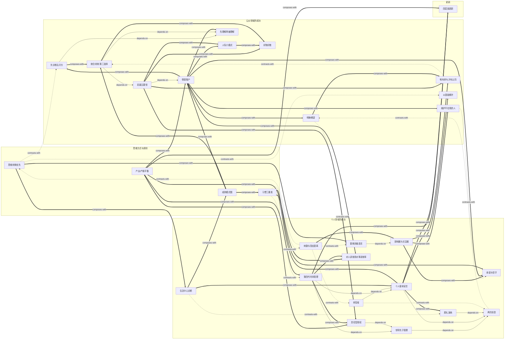

# 《高效能人士的七个习惯（30周年纪念版）》 — Skill Index

> 本书由 cangjie-skill 蒸馏， 共产出 **29** 个 skills。
> 处理时间： 2026-09-29

## 关于这本书

- **作者**： [美] 史蒂芬·柯维（Stephen R. Covey, 1932-2012）
- **出版年**： 原著 1989；本批以 30 周年纪念版（含 2004 版前言、Collins 序、家族追忆、后记"答读者问"）为底本
- **一句话主旨**： 高效能不是技巧的叠加，而是把普遍永恒的原则内化为习惯、由内而外（先个人领域成功、后公众领域成功）地实现"产出/产能平衡"的持续过程。
- **整书理解**： 见 [BOOK_OVERVIEW.md](./BOOK_OVERVIEW.md)
- **精华长文** (不读全书看这篇)： [DIGEST.md](./DIGEST.md)
- **术语词典**： [GLOSSARY.md](./GLOSSARY.md)

---

## Skill 列表 (按主题分组)

主题分组对应柯维自己的骨架：思维方式（第 1–2 章）→ 个人领域的成功（习惯一/二/三）→ 公众领域的成功（习惯四/五/六及关系原则）→ 更新（习惯七）。

### 思维方式与原则（第 1–2 章的地基）

- [`paradigm-shift-first`](../skills/./paradigm-shift-first/SKILL.md) — 思维转换优先：先判定问题在行为层、态度层还是地图（思维方式）层，地图错了越努力越错。
- [`habit-knowledge-skill-desire`](../skills/./habit-knowledge-skill-desire/SKILL.md) — 习惯三要素：习惯 = 知识 × 技巧 × 意愿的交集，"知道做不到"先定位缺哪一栏再对症下药。
- [`maturity-continuum`](../skills/./maturity-continuum/SKILL.md) — 成熟模式图：依赖→独立→互赖三阶段给个人或团队定位，是全书 29 个 skill 排序逻辑的骨架。
- [`ppc-balance`](../skills/./ppc-balance/SKILL.md) — 产出/产能平衡：金蛋与鹅——识别杀鹅取蛋（透支健康、信任、士气换短期数字）与守鹅不取蛋。

### 个人领域的成功（习惯一/二/三：依赖→独立）

**习惯一·积极主动**

- [`influence-circle`](../skills/./influence-circle/SKILL.md) — 影响圈与关注圈：把挂心事归圈、审计精力投放，把行动拉回影响圈。
- [`stimulus-response-gap`](../skills/./stimulus-response-gap/SKILL.md) — 刺激与回应之间的距离：在刺激与回应之间行使选择的自由，用四大天赋选回应。
- [`proactive-language`](../skills/./proactive-language/SKILL.md) — 替换消极语言：把"要是/我不得不/我办不到"改写为"我可以/我选择"，并绑定圈内行动。
- [`make-and-keep-promises`](../skills/./make-and-keep-promises/SKILL.md) — 做出承诺，信守诺言：影响圈的核心——从小事"承诺-兑现"循环培育内心的诚信。

**习惯二·以终为始**

- [`two-creations`](../skills/./two-creations/SKILL.md) — 两次创造：任何事物先有心智创造（蓝图）再有实体创造（施工），警惕蓝图被他人代写。
- [`leadership-before-management`](../skills/./leadership-before-management/SKILL.md) — 领导先于管理：先验证方向（做正确的事）再优化执行（正确地做事）。
- [`personal-mission-statement`](../skills/./personal-mission-statement/SKILL.md) — 个人使命宣言：品德+贡献+原则的个人宪法，重大取舍用它裁决而非临场权衡。
- [`life-center-diagnosis`](../skills/./life-center-diagnosis/SKILL.md) — 生活中心诊断：用两难情境反推安全感/方向/智慧/力量的供给源，十种中心+情境测试。
- [`funeral-exercise`](../skills/./funeral-exercise/SKILL.md) — 葬礼演练：以人生终点为衡量标准，四位发言人的价值观探测仪。
- [`transition-person`](../skills/./transition-person/SKILL.md) — 转型者：识别并改写家族代际传递的行为模式，"到我这为止"。

**习惯三·要事第一**

- [`fourth-gen-time-management`](../skills/./fourth-gen-time-management/SKILL.md) — 第四代时间管理：以角色与第二象限（重要不紧急）为中心的周规划，六标准+四步骤。
- [`stewardship-delegation`](../skills/./stewardship-delegation/SKILL.md) — 责任型授权：指令型授权 vs 责任型授权，五要素共识，盯结果不盯方法。
- [`effectiveness-not-efficiency-with-people`](../skills/./effectiveness-not-efficiency-with-people/SKILL.md) — 对人讲效用，对事讲效率：为人牺牲日程合法且不应内疚。

### 公众领域的成功（习惯四/五/六：独立→互赖）

**关系介质（第六章）**

- [`emotional-bank-account`](../skills/./emotional-bank-account/SKILL.md) — 情感账户：信任是可存取、会透支、按对方汇率计价的账户，七种存款方式——公众领域三个习惯的共同介质。
- [`clarify-expectations`](../skills/./clarify-expectations/SKILL.md) — 一开始就明确期望：几乎所有的人际障碍源于对角色和目标的期望不明。
- [`honor-the-absent`](../skills/./honor-the-absent/SKILL.md) — 维护不在场的人：在场的人会据此推定你将如何对待他们。

**习惯四·双赢思维**

- [`win-win-five-dimensions`](../skills/./win-win-five-dimensions/SKILL.md) — 双赢思维五要领：品德、关系、协议、体系、过程五层检视"双赢推行不下去"卡在哪。
- [`six-interaction-modes`](../skills/./six-interaction-modes/SKILL.md) — 人际交往六模式：双赢/赢输/输赢/输输/独善其身/无交易，给交往定性并追溯模式来源。
- [`win-win-or-no-deal`](../skills/./win-win-or-no-deal/SKILL.md) — 不能双赢就好聚好散：无交易是双赢不可得时的合法出口。
- [`no-involvement-no-commitment`](../skills/./no-involvement-no-commitment/SKILL.md) — 唯有参与，才有认同：让执行者参与拟定共同目标，四问检验。

**习惯五·知彼解己**

- [`seek-first-to-understand`](../skills/./seek-first-to-understand/SKILL.md) — 先理解再被理解：先移情聆听直到能替对方复述其立场，再争取被理解。
- [`diagnose-before-prescribe`](../skills/./diagnose-before-prescribe/SKILL.md) — 先诊断，后开方：暂停四种自传式回应，走移情聆听四阶段，诊断完成前不开方。

**习惯六·统合综效**

- [`synergy-third-alternative`](../skills/./synergy-third-alternative/SKILL.md) — 统合综效与第三选择：从立场下探到真实关切，共创既非折中（1+1≈1.5）也非单方胜利的 1+1>2。

**影响他人**

- [`affirm-potential`](../skills/./affirm-potential/SKILL.md) — 以潜能期许他人：不做社会之镜的复读机，按潜能而非现有表现设定并明说期许（第十章·改变他人）。

### 更新（习惯七）

- [`sharpen-the-saw-four-dimensions`](../skills/./sharpen-the-saw-four-dimensions/SKILL.md) — 不断更新·四层面：身体/精神/智力/社会情感平衡"磨刀"，最小单元是每天一小时——所有习惯的保鲜机制。

---

## 引用图

共 64 条关系边：12 条 depends-on（箭头方向 = "使用前先理解"）、13 条 contrasts-with、39 条 composes-with。每条边的双向说明见各 SKILL.md 文末「相关 skills」节。



图例：
- `-->`  depends-on（A 使用前需先理解 B）
- `-.->` contrasts-with（A 与 B 看情境二选一）
- `==>`  composes-with（A 与 B 经常配合使用）

---

## 推荐学习顺序

（从依赖图的叶子节点出发；同时体现柯维"个人领域成功先于公众领域成功"的次序）

1. **influence-circle** — 最通用的第一诊断器，无前置：几乎任何困境都可先用它定位精力该投在哪。
2. **stimulus-response-gap** — 与影响圈同一章、互补使用：先归圈，再学刺激当下的回应。
3. **proactive-language** / **make-and-keep-promises** — 习惯一的两个练习面：换句式、守承诺（后者同时也是影响圈的扩大机制）。
4. **paradigm-shift-first** / **habit-knowledge-skill-desire** / **ppc-balance** / **maturity-continuum** — 四把跨章诊断尺：判问题层级、判习惯缺口、判效能取舍、判成长阶段。可在第 1 步后任何时候插入。
5. **two-creations** — 个人领域"创造"框架的根。
6. **funeral-exercise** → **personal-mission-statement**（葬礼演练产价值观素材，宣言落成宪法）；**life-center-diagnosis** 与前者构成"现状诊断/应然校准"一对。
7. **leadership-before-management**（依赖两次创造）→ **fourth-gen-time-management**（依赖领导检查+使命锚点）与 **stewardship-delegation**（依赖领导检查）；**effectiveness-not-efficiency-with-people** 是排程的分界原则。
8. **transition-person**（依赖使命宣言）— 个人领域的进阶：把上述工具用在代际链条上。
9. **emotional-bank-account** — 公众领域成功的第一站：所有关系技巧的前置账户检查。
10. **win-win-five-dimensions**（依赖情感账户）→ **six-interaction-modes**（先定性再建结构）、**win-win-or-no-deal**（出口）、**no-involvement-no-commitment**（认同生成）、**clarify-expectations** / **honor-the-absent** / **affirm-potential**（关系原则）。
11. **seek-first-to-understand** → **diagnose-before-prescribe**（原则→操作）；**synergy-third-alternative**（依赖先理解+双赢结构）。
12. **sharpen-the-saw-four-dimensions** — 闭环：每天一小时的磨刀计划落回第四代时间管理的周历，四个层面分别强化习惯一/二/三与四/五/六。

---

## 安装使用

**注意：按用户要求，本批 skill 未安装**（未复制到任何宿主 skills 目录，未写入 skill-bookshelf）。本目录只是构建产物，宿主不会从这里加载 skill。如需启用，把 skill 目录复制到宿主的 skills 目录：

```bash
# 用户级 (所有项目可用)
cp -r influence-circle ~/.claude/skills/

# 或项目级
cp -r influence-circle <project>/.claude/skills/    # Claude Code
cp -r influence-circle <project>/.cursor/skills/    # Cursor
```

只安装通过阶段 4 压力测试的 skill（通过名单见各 skill 目录的 `test-results.md`）。

---

## 接入 darwin-skill

所有 skill 均带有 `test-prompts.json` (darwin-skill 兼容格式)， 可直接接入自动进化：

```
darwin evolve books/seven-habits/
```

---

## 审计轨迹

- 候选单元池： [candidates/](./candidates/)（框架 22 / 原则 24 / 案例 34 / 反例 24 / 术语 24，共 128 条）
- 被淘汰的候选 (含原因)： [rejected/](./rejected/)（17 份）
- 三重验证名单： [verified.md](./verified.md)（46 条 skill 单元通过 29）
- 整书理解： [BOOK_OVERVIEW.md](./BOOK_OVERVIEW.md)
- 压力测试： 各 skill 目录下 `test-prompts.json` + `test-results.md`（阶段 4，主流程降级自测）
