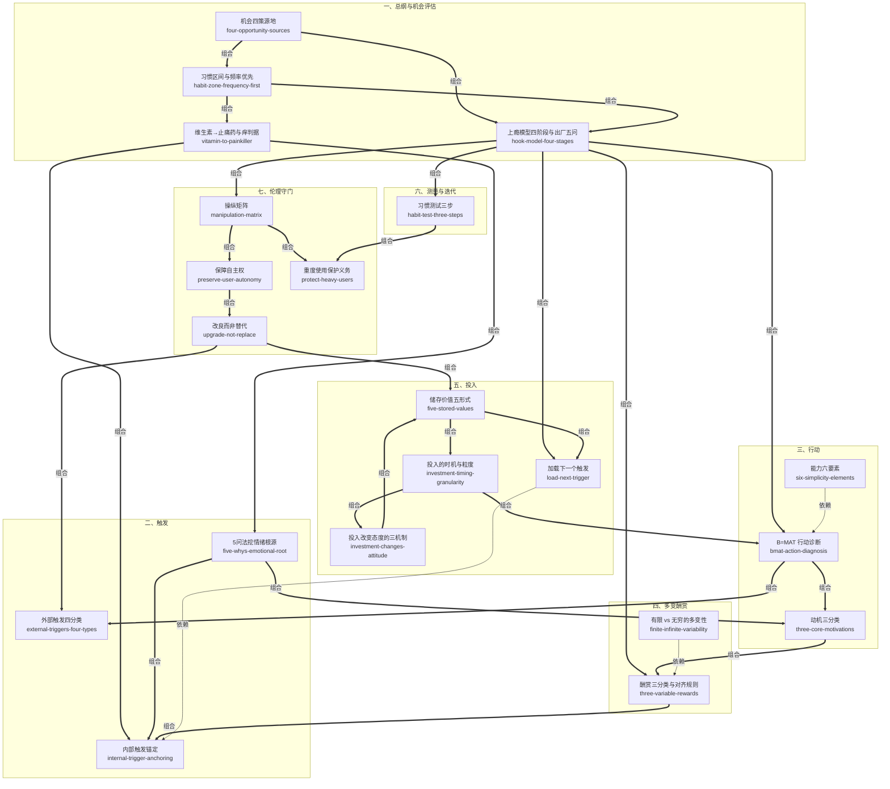

# 上瘾（Hooked）· 技能集

由尼尔·埃亚尔 & 瑞安·胡佛《上瘾：让用户养成使用习惯的四大产品逻辑》蒸馏出的一组**可被 AI Agent 调用的技能**（Skills）。

> 习惯养成类产品的引擎是一个四阶段闭环：**触发 → 行动 → 多变的酬赏 → 投入**（Hook 模型）。
> 外部触发把用户第一次拉进门，越简单的行动让使用真的发生，不可预测的酬赏点燃「想要更多」的渴望，
> 而用户的点滴投入沉淀为储存价值、并自动加载下一次触发——第四环接回第一环，循环闭合，
> 直到用户的某种情绪一出现、产品就自动浮现，不再需要外部提醒。
> 但全书自带警告：先用操纵矩阵问「该不该」，再问「能不能」。本项目把这套方法论提炼成 21 个原子化技能。

---

## 来源

| | |
|---|---|
| **书名** | 上瘾：让用户养成使用习惯的四大产品逻辑 *Hooked: How to Build Habit-Forming Products* |
| **作者** | 尼尔·埃亚尔（Nir Eyal）& 瑞安·胡佛（Ryan Hoover），钟莉婷、杨晓红 译 |
| **出版** | 英文原版 2014（Portfolio/Penguin）/ 中文版中信出版社 |
| **蒸馏工具** | cangjie-skill（仓颉：把长内容蒸馏成可调用技能的流水线） |
| **蒸馏方法** | RIA-TV++（整书理解 → 并行提取 → 三重验证 → RIA++ 构造 → 链接 → 压力测试 → 交付） |

---

## 21 个技能

> 18 个为 framework（方法论骨架）、3 个为 principle（独立原则）型单元；分组按上瘾模型的功能位置组织，不严格等于原书章节。

### 一、总纲与机会评估

- [`hook-model-four-stages`](skills/hook-model-four-stages/SKILL.md) — **上瘾模型四阶段与出厂五问**：四阶段是闭环而非漏斗（投入端回连触发端），「投入」是习惯引擎；五问把模型变成可定位弱环的出厂检查表（前言、第 6–8 章）
- [`habit-zone-frequency-first`](skills/habit-zone-frequency-first/SKILL.md) — **习惯区间与频率优先**：频率×可感知用途两轴不对称，频率可脱离用途把行为拖进习惯区间，用途再强救不了低频（第 1、7 章）
- [`vitamin-to-painkiller`](skills/vitamin-to-painkiller/SKILL.md) — **维生素→止痛药与「痒」判据**：习惯产品先维生素后止痛药，判据是「无法实施即痛苦」的轻微渴求，只认行为证据（第 1、8 章）
- [`four-opportunity-sources`](skills/four-opportunity-sources/SKILL.md) — **机会四策源地**：照镜子/新生行为/促成性技术/界面更改四路定向扫描，各带判据（第 8 章）

### 二、触发

- [`external-triggers-four-types`](skills/external-triggers-four-types/SKILL.md) — **外部触发四分类**：付费/回馈/人际三类管拉新、自主型管留存，资源分配从「哪种便宜」变成「哪类触发服务哪段旅程」（第 2、7 章）
- [`internal-trigger-anchoring`](skills/internal-trigger-anchoring/SKILL.md) — **内部触发锚定**：习惯的完成态是负面情绪与产品绑成条件反射——找高频情绪→做即时药方→外部触发喂养数周（第 2、6–7 章）
- [`five-whys-emotional-root`](skills/five-whys-emotional-root/SKILL.md) — **5 问法挖情绪根源**：对表层功能请求连问五个为什么，出现情绪词即停（第 2 章）

### 三、行动

- [`bmat-action-diagnosis`](skills/bmat-action-diagnosis/SKILL.md) — **B=MAT 行动诊断**：行为=动机×能力×触发，任一为零乘积为零；诊断顺序触发→能力→动机，修复先补能力（第 3、7 章）
- [`three-core-motivations`](skills/three-core-motivations/SKILL.md) — **动机三分类**：快乐/希望/认同三组趋避杠杆，先选杠杆再设计强度，动机因人群而异（第 3 章）
- [`six-simplicity-elements`](skills/six-simplicity-elements/SKILL.md) — **能力六要素**：时间/金钱/体力/脑力/社会偏差/非常规性六项摩擦源，只补目标用户最缺乏的一项（第 3 章）

### 四、多变酬赏

- [`three-variable-rewards`](skills/three-variable-rewards/SKILL.md) — **酬赏三分类与对齐规则**：社交/猎物/自我三通道机制不同不可代偿；第一规则是回答「用户为什么来」，社交认同通常大于金钱（第 4 章）
- [`finite-infinite-variability`](skills/finite-infinite-variability/SKILL.md) — **有限 vs 无穷的多变性**：追问「不可预测性由谁制造」——只靠设计者上新的注定冷却，由他人（用户/对手）制造的才持久（第 4 章）

### 五、投入

- [`investment-changes-attitude`](skills/investment-changes-attitude/SKILL.md) — **投入改变态度的三机制**：宜家效应/行为一致性/文饰作用——投入让用户自己说服自己（第 5 章）
- [`five-stored-values`](skills/five-stored-values/SKILL.md) — **储存价值五形式**：内容/数据/关注者/信誉/技能五类资产，与「恶意锁定」的分界是退出权（第 1、5 章）
- [`load-next-trigger`](skills/load-next-trigger/SKILL.md) — **加载下一个触发**：最好的召回由用户自己的投入内生生成，时机对准内部触发最活跃的瞬间——闭环合页（第 2、5 章）
- [`investment-timing-granularity`](skills/investment-timing-granularity/SKILL.md) — **投入的时机与粒度**：投入必须在酬赏之后提出、拆成小步、能预填则预填——行动减摩擦，投入可加摩擦（第 3、5、7 章）

### 六、测量与迭代

- [`habit-test-three-steps`](skills/habit-test-three-steps/SKILL.md) — **习惯测试三步**：定义忠实用户频率→≥5% 硬门槛→从忠实用户反推「习惯路径」→把新用户往路径上导（第 8 章）

### 七、伦理守门

- [`manipulation-matrix`](skills/manipulation-matrix/SKILL.md) — **操纵矩阵**：「我会用吗×能否大大提高用户生活质量」两问四象限 + 羞愧判据 + 成瘾红线；先问「该不该」再问「能不能」（第 1、6 章）
- [`preserve-user-autonomy`](skills/preserve-user-autonomy/SKILL.md) — **保障自主权**：明示「你有权接受，也有权拒绝」反而使顺从翻倍——强迫感即设计缺陷（principle，第 4 章）
- [`protect-heavy-users`](skills/protect-heavy-users/SKILL.md) — **重度使用保护义务**：「能力产生义务」——能用自身数据识别过度使用用户起，沉默即失责（principle，第 1、6 章）
- [`upgrade-not-replace`](skills/upgrade-not-replace/SKILL.md) — **改良而非替代**：把新产品做成既有行为的改良版，让用户在既有与改良间自主选择；保有退回自由=设计健康的检验标准（principle，第 2、4、8 章）

---

## 技能之间的引用关系

完整引用图有 49 条显式边（见 [`docs/INDEX.md`](docs/INDEX.md)），下图为主干：



图例：`== 组合 ==>` 配合/接力（常一起使用或按顺序接力）· `-- 依赖 -->` 使用前提（依赖者 → 被依赖方，如能力六要素不可跳过 B=MAT 归因）

**推荐学习顺序**（从依赖关系与书内推进逻辑推出）：`hook-model-four-stages`（总纲）→ `habit-zone-frequency-first` → `vitamin-to-painkiller`（机会评估两闸，`four-opportunity-sources` 是它们的上游）→ 触发链 `five-whys-emotional-root` → `internal-trigger-anchoring` → `external-triggers-four-types` → 行动链 `bmat-action-diagnosis` → `six-simplicity-elements` / `three-core-motivations` → 酬赏链 `three-variable-rewards` → `finite-infinite-variability` → 投入链 `investment-timing-granularity` → `investment-changes-attitude` / `five-stored-values` → `load-next-trigger` → `habit-test-three-steps`（上线后验证）→ 伦理守门 `manipulation-matrix` → `preserve-user-autonomy` → `protect-heavy-users` → `upgrade-not-replace`（可与任何环节并联，落地前必过）。

**典型使用路径**：

| 你的问题 | 调用哪些 Skill |
|---|---|
| 新产品出厂检查 | `four-opportunity-sources` → `habit-zone-frequency-first` → `hook-model-four-stages` → 按弱环下钻单环 skill → `manipulation-matrix` → `habit-test-three-steps` |
| 现有产品习惯诊断 | `habit-test-three-steps` → `hook-model-four-stages` 定位弱环 → 单环 skill 深挖 → 迭代后复测 |
| 伦理危机/灰色方案 | `manipulation-matrix`（该不该）→ `preserve-user-autonomy`（要求怎么提）→ `protect-heavy-users`（保护义务）；采纳与迁移类抵触走 `upgrade-not-replace` |

---

## 安装

每个技能目录都包含 `SKILL.md`（+ `test-prompts.json` / `test-results.md` 测试产物），可直接复制到宿主环境：

```bash
# Claude Code（用户级，所有项目可用）
cp -r skills/* ~/.claude/skills/

# 或 Claude Code（项目级）
cp -r skills/* <project>/.claude/skills/

# Trae（项目级）
cp -r skills/* <project>/.trae/skills/

# Cursor（项目级）
cp -r skills/* <project>/.cursor/skills/
```

---

## 完整文档

`docs/` 目录保留了完整的蒸馏产物与审计轨迹：

| 文件 | 说明 |
|---|---|
| [`DIGEST.md`](docs/DIGEST.md) | 面向读者的精华长文（不读全书看这篇，约 9800 字） |
| [`GLOSSARY.md`](docs/GLOSSARY.md) | 共享术语词典（27 条，含习惯/成瘾、三种「触发」等红线词辨析） |
| [`INDEX.md`](docs/INDEX.md) | 技能总览 + 49 边引用图 + 学习顺序 |
| [`BOOK_OVERVIEW.md`](docs/BOOK_OVERVIEW.md) | 整书理解（结构/解释/批判/应用潜力） |
| [`verified.md`](docs/verified.md) | 三重验证结果（候选池 → 21 通过，skill 池通过率 21/48） |
| [`PIPELINE_STATE.md`](docs/PIPELINE_STATE.md) | 流水线各阶段状态 |
| [`rejected/`](docs/rejected/) | 淘汰候选及原因（9 条，全部 V3 不过） |
| [`candidates/`](docs/candidates/) | 5 个提取器的原始候选池（134 条：框架/原则/案例/反例/术语） |

---

## 目录结构

```text
hooked/
├── README.md
├── skills/                      # 21 个可安装技能（核心交付物）
│   └── <skill-slug>/
│       ├── SKILL.md             # 技能定义（R/I/A1/A2/E/B 六段）
│       ├── test-prompts.json    # 触发/诱饵测试集
│       └── test-results.md      # 压力测试结果
└── docs/                        # 蒸馏文档与审计轨迹
    ├── DIGEST.md / GLOSSARY.md / INDEX.md
    ├── BOOK_OVERVIEW.md / verified.md / PIPELINE_STATE.md
    ├── rejected/                # 淘汰候选及原因（9 条）
    └── candidates/              # 框架/原则/案例/反例/术语 候选池（134 条）
```

---

## 关于内容与版权

本项目是**方法论蒸馏产物**，不含原书全文：

- 每个技能对原书的引用严格控制在 **≤150 字/段**，属于合理引用范畴；
- 原文的版权归原作者尼尔·埃亚尔、瑞安·胡佛及出版社所有；
- 建议购买正版书籍配合使用。

---

## 如何重新生成

本项目由 cangjie-skill（仓颉蒸馏流水线）自动生成。若要复现或调整：

1. 准备书籍文本（`fulltext.txt`）
2. 运行 RIA-TV++ 流水线（阶段 0–5，详见 `docs/PIPELINE_STATE.md`）
3. 通过三重验证 + 压力测试的单元会被构造为独立技能并安装

如需让技能持续进化，可喂给 `darwin-skill`：`darwin evolve hooked/`
