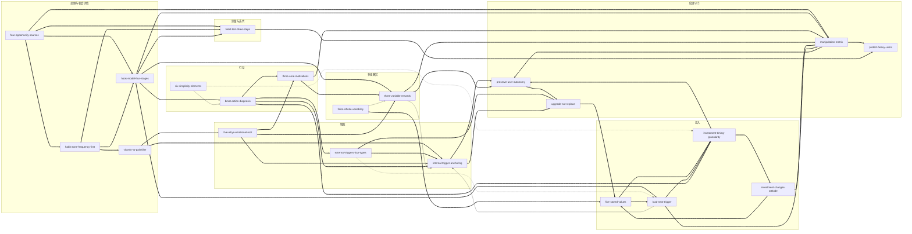

# 《上瘾：让用户养成使用习惯的四大产品逻辑》 — Skill Index

> 本书由 cangjie-skill 蒸馏， 共产出 **21** 个 skills。
> 处理时间: 2026-10-01（阶段 3/4/5 收尾；阶段 0–2 于 2026-09-30 完成）

## 关于这本书

- **作者**: [美] 尼尔·埃亚尔（Nir Eyal）、瑞安·胡佛（Ryan Hoover）著，钟莉婷、杨晓红 译
- **出版年**: 英文原版 2014 年（Portfolio/Penguin）；中文版中信出版社
- **一句话主旨**: 习惯养成类产品通过"触发→行动→多变的酬赏→投入"四阶段循环，把外部触发逐步转化为与用户情绪绑定的内部触发、把用户的点滴投入转化为储存价值，从而以极低成本让用户不假思索地反复使用——而设计者必须先用操纵矩阵自问"该不该"，再问"能不能"。
- **整书理解**: 见 [BOOK_OVERVIEW.md](./BOOK_OVERVIEW.md)
- **精华长文** (不读全书看这篇): [DIGEST.md](./DIGEST.md)
- **术语词典**: [GLOSSARY.md](./GLOSSARY.md)

---

## Skill 列表 (按模型结构分组)

> 21 个 skill 中 18 个为 **framework（方法论骨架）**、3 个为 **principle（独立原则）** 型单元（阶段 1.5 verified.md 判定）。
> 来源章节按 fulltext.txt 行号；verified id 对应 [verified.md](./verified.md) 的 f01–f22 与 p09/p16/p18。
> 分组按上瘾模型的功能位置组织，不严格等于原书章节：酬赏章（第 4 章）的 p09 与采纳原则 p18 因其守门功能归入"伦理守门"组。

### 一、总纲与机会评估

| slug | 标题 | 一句话 | 类型 | 来源章节 | verified id |
|---|---|---|---|---|---|
| [`hook-model-four-stages`](../skills/./hook-model-four-stages/SKILL.md) | 上瘾模型四阶段与出厂五问 | 四阶段是闭环而非漏斗（投入端回连触发端），"投入"是习惯引擎；五问把模型变成可定位弱环的出厂检查表 | framework（总纲/路由） | 前言；第6、7、8章 | f01 |
| [`habit-zone-frequency-first`](../skills/./habit-zone-frequency-first/SKILL.md) | 习惯区间与频率优先 | 频率×可感知用途两轴不对称：频率可脱离用途把行为拖进习惯区间，用途再强救不了低频 | framework（入场过滤/判据） | 第1章；第7章 | f02 |
| [`vitamin-to-painkiller`](../skills/./vitamin-to-painkiller/SKILL.md) | 维生素→止痛药与"痒"判据 | 习惯产品先维生素后止痛药；判据是"无法实施即痛苦"（低烈度的痒），只认行为证据 | framework（验收判据） | 第1章；第8章 | f03 |
| [`four-opportunity-sources`](../skills/./four-opportunity-sources/SKILL.md) | 机会四策源地 | 照镜子/新生行为/促成性技术/界面更改四路定向扫描，各带判据；扫描与过滤是两道工序 | framework（扫描法） | 第8章 | f22 |

### 二、触发（第 2 章）

| slug | 标题 | 一句话 | 类型 | 来源章节 | verified id |
|---|---|---|---|---|---|
| [`external-triggers-four-types`](../skills/./external-triggers-four-types/SKILL.md) | 外部触发四分类 | 付费/回馈/人际三类管拉新、自主型（用户许可）管留存；资源分配从"哪种便宜"变成"哪类触发服务哪段旅程" | framework（分类学） | 第2章；第7章 | f04 |
| [`internal-trigger-anchoring`](../skills/./internal-trigger-anchoring/SKILL.md) | 内部触发锚定 | 习惯的完成态是负面情绪与产品绑成条件反射：找高频情绪→做即时药方→外部触发喂养数周 | framework（安装机制） | 第2章；第6、7章 | f05 |
| [`five-whys-emotional-root`](../skills/./five-whys-emotional-root/SKILL.md) | 5 问法挖情绪根源 | 对表层功能请求连问五个为什么，出现情绪词即停（丰田原版的改用：终点从"根因"改为"可锚定情绪"） | framework（发现法） | 第2章 | f06 |

### 三、行动（第 3 章）

| slug | 标题 | 一句话 | 类型 | 来源章节 | verified id |
|---|---|---|---|---|---|
| [`bmat-action-diagnosis`](../skills/./bmat-action-diagnosis/SKILL.md) | B=MAT 行动诊断 | 行为=动机×能力×触发，任一为零乘积为零；诊断顺序触发→能力→动机，修复先补能力 | framework（归因诊断） | 第3章；第7章 | f07 |
| [`three-core-motivations`](../skills/./three-core-motivations/SKILL.md) | 动机三分类 | 快乐/希望/认同三组趋避杠杆，先选杠杆再设计强度；动机因人群而异，勿套普适 | framework（选型工具） | 第3章 | f08 |
| [`six-simplicity-elements`](../skills/./six-simplicity-elements/SKILL.md) | 能力六要素 | 时间/金钱/体力/脑力/社会偏差/非常规性六项摩擦源，只补目标用户最缺乏的一项 | framework（摩擦清单） | 第3章 | f09 |

### 四、多变酬赏（第 4 章）

| slug | 标题 | 一句话 | 类型 | 来源章节 | verified id |
|---|---|---|---|---|---|
| [`three-variable-rewards`](../skills/./three-variable-rewards/SKILL.md) | 酬赏三分类与对齐规则 | 社交/猎物/自我三通道机制不同不可代偿；第一规则是回答"用户为什么来"，社交认同通常大于金钱 | framework（激励设计链中游） | 第4章 | f12 |
| [`finite-infinite-variability`](../skills/./finite-infinite-variability/SKILL.md) | 有限 vs 无穷的多变性 | 追问"不可预测性由谁制造"：只靠设计者上新的注定冷却，由他人（用户/对手）制造的才持久 | framework（结构判据） | 第4章 | f13 |

### 五、投入（第 5 章）

| slug | 标题 | 一句话 | 类型 | 来源章节 | verified id |
|---|---|---|---|---|---|
| [`investment-changes-attitude`](../skills/./investment-changes-attitude/SKILL.md) | 投入改变态度的三机制 | 宜家效应（动手造抬高估值）/行为一致性（小承诺放大）/文饰作用（为投入辩护）——投入让用户自己说服自己 | framework（心理机制） | 第5章 | f14 |
| [`five-stored-values`](../skills/./five-stored-values/SKILL.md) | 储存价值五形式 | 内容/数据/关注者/信誉/技能五类迁移性各异的资产；"改换产品=放弃自己"与"恶意锁定"的分界是退出权 | framework（资产清单） | 第5章；第1章 | f15 |
| [`load-next-trigger`](../skills/./load-next-trigger/SKILL.md) | 加载下一个触发 | 最好的召回由用户自己的投入内生生成（Any.do 会后通知），时机对准内部触发最活跃的瞬间——与运营群发有结构区别 | framework（闭环合页） | 第5章；第2章 | f16 |
| [`investment-timing-granularity`](../skills/./investment-timing-granularity/SKILL.md) | 投入的时机与粒度 | 投入必须在酬赏之后提出、拆成小步、能预填则预填；行动减摩擦、投入可加摩擦（修正"越顺滑越好"教条） | framework（设计规则） | 第5章；第3、7章 | f17 |

### 六、测量与迭代（第 8 章）

| slug | 标题 | 一句话 | 类型 | 来源章节 | verified id |
|---|---|---|---|---|---|
| [`habit-test-three-steps`](../skills/./habit-test-three-steps/SKILL.md) | 习惯测试三步 | 定义忠实用户频率→≥5% 硬门槛（二元归因）→从忠实用户反推"习惯路径"→把新用户往路径上导 | framework（验证装置） | 第8章 | f20 |

### 七、伦理守门（第 4、6 章）

| slug | 标题 | 一句话 | 类型 | 来源章节 | verified id |
|---|---|---|---|---|---|
| [`manipulation-matrix`](../skills/./manipulation-matrix/SKILL.md) | 操纵矩阵 | "我会用吗×能否大大提高用户生活质量"两问四象限 + 羞愧判据 + 成瘾红线；先问"该不该"再问"能不能" | framework（出厂道德自检） | 第6章；第1章 | f18 |
| [`preserve-user-autonomy`](../skills/./preserve-user-autonomy/SKILL.md) | 保障自主权 | 强迫感激活逆反心理；明示"你有权接受，也有权拒绝"反而使顺从翻倍（42 项研究）——强迫感即设计缺陷 | principle（单点交互规则） | 第4章 | p09 |
| [`protect-heavy-users`](../skills/./protect-heavy-users/SKILL.md) | 重度使用保护义务 | "能力产生义务"：能用自身数据识别过度使用用户起，沉默即失责；"仅 1% 上瘾"不构成豁免 | principle（义务执行） | 第6章；第1章 | p16 |
| [`upgrade-not-replace`](../skills/./upgrade-not-replace/SKILL.md) | 改良而非替代 | 把新产品做成既有行为的改良版，让用户在既有与改良间自主选择；保有退回自由=设计健康的检验标准 | principle（采纳策略） | 第4章；第2、8章 | p18 |

---

## 引用图

图例: `-->` depends-on（使用前提，画向被依赖方） · `-.->` contrasts-with（同境况二选一） · `===>` composes-with（配合/接力）



关系统计: 显式链接 **49 条**（composes-with 43 · contrasts-with 2 · depends-on 4；其中 4 条 composes 边同时是下游单元的 depends-on 供需对，如 f12 depends-on f05 / f05 composes-with f12）。frontmatter 逐 skill 记录共 **83 条**（composes-with 75 / depends-on 4 / contrasts-with 4），其中对称记录 34 对、单向记录 15 条——单向条目集中在两处：五个机制单元的 E 段伦理复核步骤指向 `manipulation-matrix`（守门星型结构，f18 文件不逐一回链，见其"相关 skills"说明），以及 `upgrade-not-replace` 向触发端（f04/f05）与 `five-stored-values` 的反场景路由。
节制原则校验：本书为"闭环链条 + 守门闸门"的天然网络结构，平均每 skill 度数约 2.3，密度高于平行结构的经验值（10 skill 约 8–15 条），原因是阶段 2 各 SKILL.md 的 A2 区分条目与 E 段转交步骤已把 handoff 写死，阶段 3 只做显式化记录，无硬造链接；4 条 depends-on 全部来自 SKILL.md 内的显式"使用前提"声明（f09 不可跳过 f07 归因、f12 无内部触发不谈对齐、f13 无通道不谈变量、f16 无情绪锚点不排时机）。

---

## 推荐学习顺序

（从依赖关系与书内推进逻辑推出：先总纲与机会评估，再按模型链条"触发→行动→酬赏→投入"走一圈，最后测量与伦理。）

1. **hook-model-four-stages** — 总纲：四阶段闭环 + 出厂五问；无前置，其余 20 个单元都在它的坐标系里。
2. **habit-zone-frequency-first** → **vitamin-to-painkiller** — 机会评估两闸：先判断"能不能成为习惯"（向前看），再学会判断"已经成了没有"（向后看）；**four-opportunity-sources** 是这两道闸的上游（点子从哪来）。
3. 触发链：**five-whys-emotional-root**（挖情绪）→ **internal-trigger-anchoring**（绑定施工）→ **external-triggers-four-types**（拉新与喂养载体）。先懂内部触发是什么，再看外部触发四类如何服务它。
4. 行动链：**bmat-action-diagnosis**（总归因）→ **six-simplicity-elements**（能力短板）与 **three-core-motivations**（动机杠杆）。f09/f08 均以 f07 为使用前提。
5. 酬赏链：**three-variable-rewards**（选通道+对齐）→ **finite-infinite-variability**（查变量存续）。f13 以 f12 为使用前提。
6. 投入链：**investment-timing-granularity**（时机与粒度规则）→ **investment-changes-attitude**（机制加成）与 **five-stored-values**（资产沉淀）→ **load-next-trigger**（闭环合页）。
7. **habit-test-three-steps** — 上线后验证：5% 门槛与习惯路径把四阶段从叙事变成可证伪程序。
8. 伦理守门（可与任何环节并联，落地前必过）：**manipulation-matrix**（整产品该不该）→ **preserve-user-autonomy**（单次要求怎么提）→ **protect-heavy-users**（做了之后对重度使用者怎么办）→ **upgrade-not-replace**（迁移采纳策略）。

只读五篇（时间有限时）：hook-model-four-stages → habit-zone-frequency-first → internal-trigger-anchoring → bmat-action-diagnosis → manipulation-matrix。

---

## 典型使用路径（详见 DIGEST.md）

- **新产品出厂五问**：`four-opportunity-sources`（找方向）→ `habit-zone-frequency-first`（过频率闸）→ `hook-model-four-stages`（五问逐环）→ 按弱环下钻单环 skill → `manipulation-matrix`（过闸）→ 上线后 `habit-test-three-steps`（验证）。
- **现有产品习惯诊断**：`habit-test-three-steps`（定位习惯路径）→ `hook-model-four-stages`（定位弱环）→ 单环 skill 深挖（触发 `external-triggers-four-types`/`internal-trigger-anchoring`、行动 `bmat-action-diagnosis` 系、酬赏 `three-variable-rewards`/`finite-infinite-variability`、投入四件套）→ 迭代后复测。
- **伦理危机/灰色方案**：`manipulation-matrix`（该不该）→ `preserve-user-autonomy`（要求怎么提）→ `protect-heavy-users`（保护义务）；采纳与迁移类抵触走 `upgrade-not-replace`。

---

## 安装使用

本目录是构建产物，宿主不会从这里加载 skill。**本批 skill 未安装**（未复制到 `.trae/skills/`，未动 `e:\solo\skill-bookshelf\` 本地目录——产物将整仓上传 GitHub，如需启用请手动复制）。把 skill 目录复制到宿主的 skills 目录：

```bash
# 用户级 (所有项目可用)
cp -r hook-model-four-stages ~/.claude/skills/

# 或项目级
cp -r hook-model-four-stages <project>/.claude/skills/    # Claude Code
cp -r hook-model-four-stages <project>/.cursor/skills/    # Cursor
```

只建议安装通过阶段 4 测试的 skill（本批 21 个全部达标，其中 3 个经边界用例微修后复测通过，见各目录 `test-results.md`）；安装前请连同 `SKILL.md` 与 `test-prompts.json` 整个目录一并复制。

---

## 接入 darwin-skill

所有 skill 均带有 `test-prompts.json`（darwin-skill 兼容格式），可直接接入自动进化：

```
darwin evolve books/hooked/
```

---

## 审计轨迹

- 候选单元池: [candidates/](./candidates/)（134 条候选：框架 24 / 原则 24 / 案例 37 / 反例 22 / 术语 27）
- 被淘汰的候选 (含原因): [rejected/](./rejected/)（9 条，全部 V3 不过）
- 三重验证结果: [verified.md](./verified.md)（skill 池通过率 21/48 ≈ 44%）
- BOOK_OVERVIEW: [BOOK_OVERVIEW.md](./BOOK_OVERVIEW.md)
- 流水线状态: [PIPELINE_STATE.md](./PIPELINE_STATE.md)
