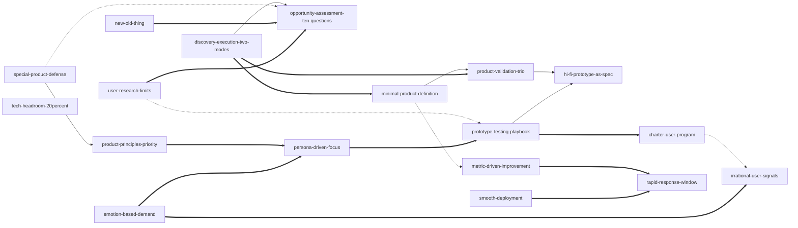

# INDEX — 《启示录：打造用户喜爱的产品》Skill 集

## 书籍信息

- **书名**：启示录：打造用户喜爱的产品（*INSPIRED: How to Create Tech Products Customers Love*）
- **作者**：[美] Marty Cagan（曾任网景平台及工具部门副总裁、eBay 产品管理及设计高级副总裁）
- **出版**：英文原版 2008 年
- **一句话主旨**：产品经理的本职是探索出有价值的、可用的、可行的产品——在写代码之前，用高保真原型和真实用户验证这三点。
- **处理时间**：2026-10-01 ｜ **Skill 总数**：18 个（均已通过三重验证）

---

## Skill 列表（按主题分组）

### 立项与探索

- [`opportunity-assessment-ten-questions`  -ten-questions/SKILL.md) — 十连问评估产品机会值不值得做，只问问题不谈方案
- [`discovery-execution-two-modes`](../skills/discovery-execution-two-modes/SKILL.md) — 判定该做探索还是执行，用流水线并行收纳中途新需求
- [`product-validation-trio`](../skills/product-validation-trio/SKILL.md) — 开发前三验证：可行性、可用性、价值，缺一即败
- [`minimal-product-definition`](../skills/minimal-product-definition/SKILL.md) — 只定义减无可减的基本产品，超支只延工期不砍功能
- [`hi-fi-prototype-as-spec`](../skills/hi-fi-prototype-as-spec/SKILL.md) — 高保真原型取代纸质文档，通过用户测试才算合格

### 用户与验证

- [`charter-user-program`](../skills/charter-user-program/SKILL.md) — 物色六位目标用户作开发伙伴，全程参与产品研发
- [`prototype-testing-playbook`](../skills/prototype-testing-playbook/SKILL.md) — 原型测试操作法：观察重于询问，连续六位通过收工
- [`user-research-limits`](../skills/user-research-limits/SKILL.md) — 调研能答谁在用怎么用，答不了该打造什么产品
- [`persona-driven-focus`](../skills/persona-driven-focus/SKILL.md) — 人物角色定这版为谁而做，砍掉不属于关键角色的功能
- [`irrational-user-signals`](../skills/irrational-user-signals/SKILL.md) — 警惕技术爱好者，研究情感被放大的非理性消费者

### 决策与方向

- [`product-principles-priority`](../skills/product-principles-priority/SKILL.md) — 把"什么更重要"排成产品原则，先对齐优先级再谈方案
- [`special-product-defense`](../skills/special-product-defense/SKILL.md) — 识别并拒绝大客户定制特例，防止产品公司变定制商
- [`emotion-based-demand`](../skills/emotion-based-demand/SKILL.md) — 购买源于情感需求：企业买恐惧贪婪，大众买孤独爱自豪
- [`new-old-thing`](../skills/new-old-thing/SKILL.md) — 成熟市场靠老需求加新瓶切入：洞悉缺陷、跟踪新技术

### 增长与运维

- [`metric-driven-improvement`](../skills/metric-driven-improvement/SKILL.md) — 改进靠关键指标与漏斗定位，别沦为功能加工厂
- [`smooth-deployment`](../skills/smooth-deployment/SKILL.md) — 审慎更新版本：通知、灰度、保留旧版，不试用户耐心
- [`rapid-response-window`](../skills/rapid-response-window/SKILL.md) — 发布后几天全员待命快速响应，急于撤军是大忌
- [`tech-headroom-20percent`](../skills/tech-headroom-20percent/SKILL.md) — 预留 20% 技术余量防重写危机，危机则递增式重写

---

## Skill 关系图

依据阶段 3 审定关系表绘制：`-->` 为 depends-on（依赖），`-.->` 为 contrasts-with（对照），`===>` 为 composes-with（组合）。互为组合的对只画一条；依赖与组合同时出现在同一对 skill 时，以定向的 depends-on 边表示。

> `tech-headroom-20percent` 按审定关系表与任何 skill 均无关系（不硬造），是关系图中的独立节点。

---

## 推荐学习顺序

1. [`opportunity-assessment-ten-questions`  -ten-questions/SKILL.md) — 一切从"要不要做"开始：它是流水线第一闸门，也为后续所有 skill 提供目标与度量。
2. [`hi-fi-prototype-as-spec`](../skills/hi-fi-prototype-as-spec/SKILL.md) — 学会探索阶段的载体：把想法变成可测试的高保真原型，是一切验证的前提。
3. [`user-research-limits`](../skills/user-research-limits/SKILL.md) — 动手调研前先划清调研边界，避免把问卷结果直接当需求清单。
4. [`emotion-based-demand`](../skills/emotion-based-demand/SKILL.md) — 用情感需求看透"用户为什么买"，为产品定义找到动机起点。
5. [`product-principles-priority`](../skills/product-principles-priority/SKILL.md) — 先立好"什么更重要"的标尺，之后的每个取舍都靠它裁决。
6. [`prototype-testing-playbook`](../skills/prototype-testing-playbook/SKILL.md) — 拿着原型找真实用户：从物色、主持到判停的完整操作法。
7. [`discovery-execution-two-modes`](../skills/discovery-execution-two-modes/SKILL.md) — 理解探索与执行两种工作性质的切换纪律与流水线并行。
8. [`product-validation-trio`](../skills/product-validation-trio/SKILL.md) — 探索的出口标准：可行性、可用性、价值三证齐全才准写代码。
9. [`minimal-product-definition`](../skills/minimal-product-definition/SKILL.md) — 把验证对象收缩到减无可减的基本产品，学会"只延工期不砍功能"。
10. [`charter-user-program`](../skills/charter-user-program/SKILL.md) — 建立常设用户伙伴机制：既是反馈来源，又是发布时的口碑引擎。
11. [`persona-driven-focus`](../skills/persona-driven-focus/SKILL.md) — 用人物角色回答"这版为谁而做"，给功能清单定取舍。
12. [`irrational-user-signals`](../skills/irrational-user-signals/SKILL.md) — 分清该研究谁、该警惕谁，别被嗓门最大的技术爱好者带偏。
13. [`special-product-defense`](../skills/special-product-defense/SKILL.md) — 面对大客户定制的诱惑，掌握用产品原则说"不"的完整框架。
14. [`new-old-thing`](../skills/new-old-thing/SKILL.md) — 成熟市场照样能进：老需求＋新瓶的两件法宝。
15. [`metric-driven-improvement`](../skills/metric-driven-improvement/SKILL.md) — 上线之后靠指标而非堆功能改进产品，逃离功能加工厂。
16. [`smooth-deployment`](../skills/smooth-deployment/SKILL.md) — 版本更新前管理用户适应成本，不轻易试探用户耐心。
17. [`rapid-response-window`](../skills/rapid-response-window/SKILL.md) — 发布后的黄金窗口：全员待命、分级响应，急于撤军是大忌。
18. [`tech-headroom-20percent`](../skills/tech-headroom-20percent/SKILL.md) — 给架构留 20% 余量，别让高速增长的产品毁于重写危机。

---

## 相关文档

- [BOOK_OVERVIEW.md](./BOOK_OVERVIEW.md) — 整书理解（阶段 0 全局上下文）
- [DIGEST.md](./DIGEST.md) — 全书精读摘要（尚未生成，链接预留）
- [GLOSSARY.md](./GLOSSARY.md) — 全部 skill 共享的术语词典（25 条）
- [verified.md](./verified.md) — skill 间关系的三重验证记录
- [candidates/](./candidates/) — 阶段 2 提取素材（术语、案例、原则、框架、反例）
