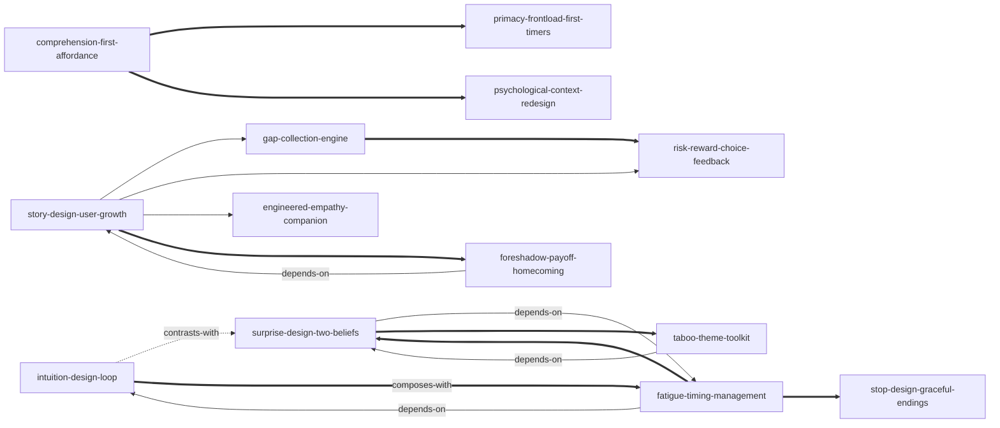

# nintendo-experience-design-skills

由《任天堂的体验设计——创造不知不觉打动人心的体验》蒸馏出的一组**可被 AI Agent 调用的技能**（Skills）。

> 任何人都能创造打动人心的体验——方法不是把东西做得更好，
> 而是把"用户经历体验的过程"本身当成设计对象：
> 用直觉设计让人**不由自主地行动**，用惊喜设计让人**不由自主地着迷**，
> 用故事设计让体验**有意义**、让人**不由自主地想叙述**。
> 本项目把这套方法提炼成 13 个原子化技能。

---

## 来源

| | |
|---|---|
| **书名** | 任天堂的体验设计——创造不知不觉打动人心的体验（*任天堂の体験設計*） |
| **作者** | 玉树真一郎（前任天堂 Wii 策划开发） |
| **出版** | 日文原版约 2020 / 中文版 2021（电子工业出版社，王芳 译） |
| **蒸馏工具** | cangjie-skill（仓颉：把长内容蒸馏成可调用技能的流水线） |
| **蒸馏方法** | RIA-TV++（整书理解 → 并行提取 → 三重验证 → RIA++ 构造 → 链接 → 压力测试 → 交付） |

---

## 如何选用（三分诊导航）

- 问题**令人难以理解**（对方不懂、不会做）→ 先用 `comprehension-first-affordance` + `intuition-design-loop`
- 问题**让人疲劳厌倦**（能懂但坚持不下去）→ `fatigue-timing-management` + `surprise-design-two-beliefs`（取材用 `taboo-theme-toolkit`）
- 问题**没有价值**（做着没意义）→ `story-design-user-growth`
- 不确定问题出在哪 → 先跑 `psychological-context-redesign` 的心理脉络诊断

---

## 13 个技能

### 基础层：让人不由自主地"行动"

- [`intuition-design-loop`](skills/intuition-design-loop/SKILL.md) — **直觉设计三步循环**：用"假设→尝试→高兴"微循环取代讲解、命令与说明书，让用户自己发现并深信
- [`comprehension-first-affordance`](skills/comprehension-first-affordance/SKILL.md) — **"了解"优先与示能取舍**：第一秒只传达"此刻该做什么"，敢为它牺牲一切好看与有趣
- [`primacy-frontload-first-timers`](skills/primacy-frontload-first-timers/SKILL.md) — **初始效应双律**：必学内容全部前置、永远优先"第一次使用的普通用户"

### 节奏层：让人不由自主地"着迷"

- [`fatigue-timing-management`](skills/fatigue-timing-management/SKILL.md) — **疲劳厌倦时机管理**："想玩但很困"是可预测坐标，在预测饱和点动手
- [`surprise-design-two-beliefs`](skills/surprise-design-two-beliefs/SKILL.md) — **惊喜设计**：先让对方坚信，再在顶点打破——惊讶只有"前提/日常"两种坚信两个杠杆
- [`taboo-theme-toolkit`](skills/taboo-theme-toolkit/SKILL.md) — **禁忌主题工具箱**：把禁忌从回避清单反转为制造惊讶的原材料库（10 种主题 + 4 问检验）

### 意义层：让人不由自主地"叙述"

- [`story-design-user-growth`](skills/story-design-user-growth/SKILL.md) — **故事设计**：虚构故事只是手段，检验"用户离开后现实中哪里不一样了"
- [`gap-collection-engine`](skills/gap-collection-engine/SKILL.md) — **空缺驱动**：先给整体再露空缺，把重复变成不由自主的填空（图鉴/节奏/蔡格尼克）
- [`risk-reward-choice-feedback`](skills/risk-reward-choice-feedback/SKILL.md) — **风险回报选项与反馈闭环**：选项即自定难度器，失败要归因于用户操作（残酷但必要）
- [`engineered-empathy-companion`](skills/engineered-empathy-companion/SKILL.md) — **工程化共鸣**：打击主人公 → 麻烦的同行者统一主观 → 危机逆转超越憎恨
- [`foreshadow-payoff-homecoming`](skills/foreshadow-payoff-homecoming/SKILL.md) — **伏笔与回到起点**：用时间差制造"原来如此"，让成长在相同环境的前后对比中被自己看见

### 应用层：立场与迁移

- [`psychological-context-redesign`](skills/psychological-context-redesign/SKILL.md) — **心理脉络重设计**：别再打磨物本身，改写"产品×环境×心理状态"
- [`stop-design-graceful-endings`](skills/stop-design-graceful-endings/SKILL.md) — **让体验停止的设计**：用户人生才是主角——停止点禁用惊喜、回归日常收尾、把"作弊"的自由还给用户

---

## 技能之间的引用关系

图例：`-->` depends-on · `-.->` contrasts-with · `===>` composes-with（共 13 条真实关系，未硬造）

---

## 文档与审计

- **不读全书看这篇**：[docs/DIGEST.md](docs/DIGEST.md)（约 7000 字精华长文）
- **整书理解**（含作者局限批判）：[docs/BOOK_OVERVIEW.md](docs/BOOK_OVERVIEW.md)
- **三重验证**（13 通过 / 4 淘汰）：[docs/verified.md](docs/verified.md)；淘汰审计见 [docs/rejected/](docs/rejected/)
- **skill 总览 + 学习顺序**：[docs/INDEX.md](docs/INDEX.md)
- **术语词典**（作者用法 ≠ 字典义）：[docs/GLOSSARY.md](docs/GLOSSARY.md)
- **流水线状态**：[docs/PIPELINE_STATE.md](docs/PIPELINE_STATE.md)

每个 skill 目录含 `SKILL.md`（R 原文 / I 骨架 / A1 书中案例 / A2 触发场景 / E 可执行步骤 / B 边界）、`test-prompts.json`（should_trigger / should_not_trigger / edge_case，含跨 skill 混淆诱饵）与 `test-results.md`。

## 版权说明

本书蒸馏为转换性分析：所有原文引用均为 ≤150 字的短引注并标注出处。原书全文不入库；书名、案例与观点版权归原作者与出版社所有，对游戏内容的分析为作者个人见解，不代表游戏公司官方见解。
