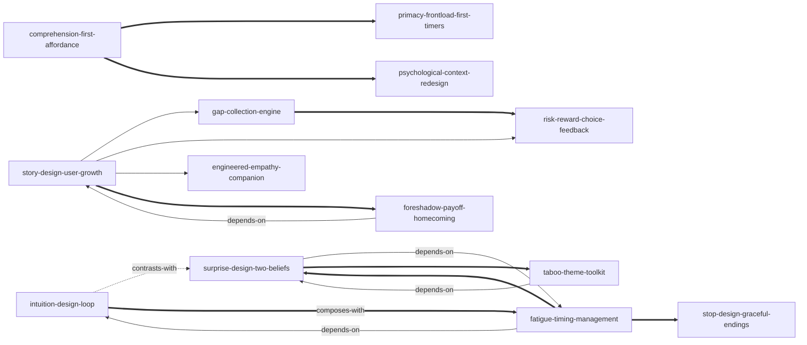

# 《任天堂的体验设计》 — Skill Index

> 本书由 cangjie-skill (RIA-TV++) 蒸馏，共产出 **13** 个 skills。
> 处理时间：2026-10-01（无人值守模式，确认点见文末）

## 关于这本书

- **作者**: 玉树真一郎（前任天堂 Wii 策划开发）
- **出版年**: 中文版 2021（电子工业出版社；日文原版约 2020）
- **一句话主旨**: 任何人都能创造打动人心的体验——把"用户经历体验的过程"本身当设计对象，用直觉、惊喜、故事三种设计让人不知不觉地行动、着迷并成长。
- **总框架**（候选 f46，INDEX 级知识）: 直觉设计管"不由自主地行动"→ 惊喜设计管"不由自主地着迷"→ 故事设计管"不由自主地叙述"；本质是"体验→感情→记忆"。
- **整书理解**: [BOOK_OVERVIEW.md](./BOOK_OVERVIEW.md)
- **精华长文**（不读全书看这篇）: [DIGEST.md](./DIGEST.md)
- **术语词典**: [GLOSSARY.md](./GLOSSARY.md)
- **三重验证**: [verified.md](./verified.md)（合并 17 单元 → 通过 13 / 淘汰 4；淘汰审计见 [rejected/](./rejected/)）

---

## 如何选用这 13 个 skills（分诊导航）

> 来自候选 f37 的三分诊规则（未独立成 skill，作为导航呈现）：
> - 问题**令人难以理解**（对方不懂、不会做）→ 先用 `comprehension-first-affordance` + `intuition-design-loop`
> - 问题**让人疲劳厌倦**（能懂但坚持不下去）→ `fatigue-timing-management` + `surprise-design-two-beliefs`（取材用 `taboo-theme-toolkit`）
> - 问题**没有价值**（做着没意义）→ `story-design-user-growth`
> - 不确定问题出在哪 → 先跑 `psychological-context-redesign` 的心理脉络诊断

## Skill 列表（按主题分组）

### 基础层：让人不由自主地"行动"

- [`intuition-design-loop`](../skills/intuition-design-loop/SKILL.md) — 直觉设计三步循环：假设→尝试→高兴，用自发体验取代命令与讲解
- [`comprehension-first-affordance`](../skills/comprehension-first-affordance/SKILL.md) — "了解"优先与示能/能指取舍：第一秒只传达"该做什么"，敢为它牺牲好看
- [`primacy-frontload-first-timers`](../skills/primacy-frontload-first-timers/SKILL.md) — 初始效应双律：必学的全部前置、永远优先第一次的用户

### 节奏层：让人不由自主地"着迷"

- [`fatigue-timing-management`](../skills/fatigue-timing-management/SKILL.md) — 疲劳厌倦时机管理："想玩但很困"是可预测坐标，在饱和点动手
- [`surprise-design-two-beliefs`](../skills/surprise-design-two-beliefs/SKILL.md) — 惊喜设计：先让对方坚信，再在顶点打破（误解→尝试→惊讶）
- [`taboo-theme-toolkit`](../skills/taboo-theme-toolkit/SKILL.md) — 禁忌主题工具箱：10 种制造惊讶的原材料 + 4 问检验

### 意义层：让人不由自主地"叙述"

- [`story-design-user-growth`](../skills/story-design-user-growth/SKILL.md) — 故事设计：虚构只是手段，检验"用户离开后哪里不一样了"
- [`gap-collection-engine`](../skills/gap-collection-engine/SKILL.md) — 空缺驱动：先给整体再露空缺，把重复变成不由自主的填空
- [`risk-reward-choice-feedback`](../skills/risk-reward-choice-feedback/SKILL.md) — 风险回报选项与反馈闭环：选项即自定难度，失败要归因于用户
- [`engineered-empathy-companion`](../skills/engineered-empathy-companion/SKILL.md) — 工程化共鸣：打击主人公→麻烦的同行者→超越憎恨的三步施工
- [`foreshadow-payoff-homecoming`](../skills/foreshadow-payoff-homecoming/SKILL.md) — 伏笔与回到起点：用时间差制造"原来如此"，让成长被自己看见

### 应用层：立场与迁移

- [`psychological-context-redesign`](../skills/psychological-context-redesign/SKILL.md) — 心理脉络重设计：别再打磨物本身，改写"产品×环境×心理状态"
- [`stop-design-graceful-endings`](../skills/stop-design-graceful-endings/SKILL.md) — 让体验停止的设计：用户人生是主角，停止点禁用惊喜

---

## 引用图



图例: `-->` depends-on · `-.->` contrasts-with · `===>` composes-with（共 13 条真实关系，未硬造）

---

## 推荐学习顺序

1. **psychological-context-redesign** — 总诊断方法，无前置；读它学会"先看脉络再看物"
2. **comprehension-first-affordance** — 传达的第一决策，无前置
3. **intuition-design-loop** — 全书最基本单元，无前置
4. **primacy-frontload-first-timers** — 依赖"了解优先"的逻辑
5. **fatigue-timing-management** — 依赖直觉设计（先有连续循环才有疲劳）
6. **surprise-design-two-beliefs** — 依赖疲劳时机（使用前提）
7. **taboo-theme-toolkit** — 依赖惊喜设计的杠杆模型
8. **gap-collection-engine** — 成长主题一，无前置
9. **risk-reward-choice-feedback** — 成长主题二，与收集互补
10. **engineered-empathy-companion** — 成长主题三
11. **story-design-user-growth** — 统摄三个成长主题 + 意义层
12. **foreshadow-payoff-homecoming** — 依赖故事设计
13. **stop-design-graceful-endings** — 依赖惊喜设计（知道原理才知在哪禁用）

---

## 安装使用

skills 位于本仓库的 `skills/` 子目录（构建产物不会自动被宿主加载）。要让 agent 真正调用，把单个 skill 目录复制到宿主的 skills 目录：

```bash
# ZCode 用户级
cp -r skills/<skill-slug>/ ~/.zcode/skills/

# Claude Code 用户级
cp -r skills/<skill-slug>/ ~/.claude/skills/
```

---

## 接入 darwin-skill

所有 skill 均带有 `test-prompts.json`（darwin-skill 兼容格式，含 should_trigger / should_not_trigger / edge_case 三类用例与跨 skill 混淆诱饵），可直接接入自动进化：

```
darwin evolve books/nintendo-experience-design/
```

---

## 审计轨迹

- 候选单元池: [candidates/](./candidates/) — frameworks 46 · principles 91 · cases 62 · counter-examples 39 · glossary 20
- 被淘汰的候选（含原因与去向）: [rejected/](./rejected/) — 12 个文件，45 条未录取候选全部有去向
- 流水线状态: [PIPELINE_STATE.md](./PIPELINE_STATE.md)

## 用户确认点（无人值守模式）

阶段 0（整书骨架）与阶段 1.5（录取名单）的方法论确认点已改为事后确认：
- 对骨架/批判有异议 → 修改 BOOK_OVERVIEW.md 后重跑对应提取器
- 要捞回被淘汰单元 → 优先候选：rejected/03（从记忆出发）、rejected/04（分诊规则已转为本文档的导航段）
