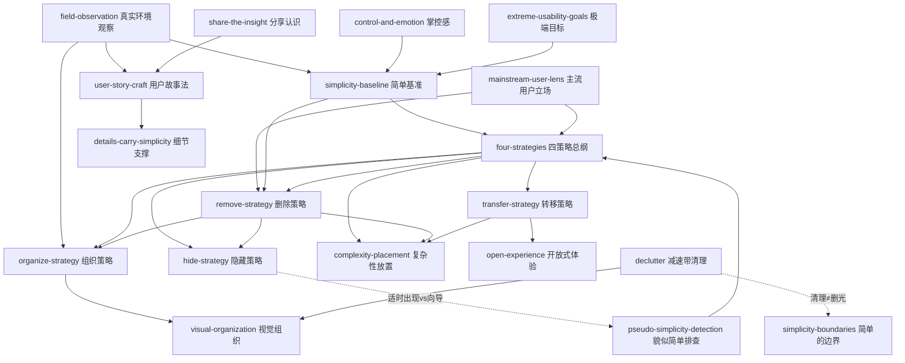

# 《简约至上：交互式设计四策略》 — Skill Index

> 本书由 cangjie-skill 蒸馏，共产出 **20** 个 skills。
> 处理时间： 2026-10-03

## 关于这本书

- **作者**： [英] Giles Colborne（cxpartners 公司总裁）
- **出版年**： 英文原版 2011（New Riders）；中文版 人民邮电出版社 2011（李松峰、秦绪文 译）
- **一句话主旨**： 简单不是减少功能数，而是用户的感觉——先用主流用户的视角明确"什么才是简单"，再通过删除、组织、隐藏、转移四个策略，把无法消除的复杂性放到正确的位置上。
- **整书理解**： 见 [BOOK_OVERVIEW.md](./BOOK_OVERVIEW.md)
- **精华长文** (不读全书看这篇)： [DIGEST.md](./DIGEST.md)
- **术语词典**： [GLOSSARY.md](./GLOSSARY.md)

---

## Skill 列表 (按主题分组)

主题分组对应 Colborne 的骨架：明确认识（第 1–2 章）→ 四策略（第 3–7 章）→ 收尾与哲学（第 8 章）。

### 认识与立场（第 1–2 章：简化之前）

- [`pseudo-simplicity-detection`](../skills/pseudo-simplicity-detection/SKILL.md) — 貌似简单排查：用三特征识别并否决说明书/向导/卡通助手类假捷径。
- [`business-case-for-simplicity`](../skills/business-case-for-simplicity/SKILL.md) — 简化的商业论证：公司方程式翻译 + 重要性×可行性强制分档。
- [`simplicity-baseline`](../skills/simplicity-baseline/SKILL.md) — 简单基准描述：先成文"什么算简单"（一句话/使用情景），此后一切取舍拿它当自检句。
- [`field-observation`](../skills/field-observation/SKILL.md) — 真实环境观察：走出办公室，让设计"在被打断的间隙生存"。
- [`mainstream-user-lens`](../skills/mainstream-user-lens/SKILL.md) — 主流用户立场：三分类+六组对照，为主流用户设计、对专家噪音视而不见。
- [`control-and-emotion`](../skills/control-and-emotion/SKILL.md) — 掌控感与感情需求：连问"然后呢"挖到感情需求层再出方案。
- [`extreme-usability-goals`](../skills/extreme-usability-goals/SKILL.md) — 极端简单目标：把常规可用性目标升格为不可能达成的方向舵。
- [`user-story-craft`](../skills/user-story-craft/SKILL.md) — 用户故事法：环境→角色→情节的电影式三层结构 + 四标准自检。
- [`share-the-insight`](../skills/share-the-insight/SKILL.md) — 分享认识：把认识压成判据句，让不在场的人也能做对决定。

### 四策略（第 3–7 章：简化的执行）

- [`four-strategies`](../skills/four-strategies/SKILL.md) — 四策略总纲：删除→组织→隐藏→转移的穷尽式路径与选择逻辑。
- [`remove-strategy`](../skills/remove-strategy/SKILL.md) — 删除策略：举证责任反转（问"为什么留着"）+ 需求逆向工程 + 掌控感边界。
- [`declutter`](../skills/declutter/SKILL.md) — 减速带清理：感知层减负（干扰链接、错误来源、视觉混乱、文字冗余）。
- [`organize-strategy`](../skills/organize-strategy/SKILL.md) — 组织策略：分类标准三重判定、围绕行为组织、期望路径检验。
- [`visual-organization`](../skills/visual-organization/SKILL.md) — 视觉组织：感知分层、色标条件、网格对齐、大小编码重要性。
- [`hide-strategy`](../skills/hide-strategy/SKILL.md) — 隐藏策略：三类可隐藏判断 + 渐进/适时出现 + 关注点提示 + 不做自定义。
- [`transfer-strategy`](../skills/transfer-strategy/SKILL.md) — 转移策略：人机分工表 + 平台长短板 + 信任前提。
- [`open-experience`](../skills/open-experience/SKILL.md) — 开放式体验：菜刀钢琴模型，让用户自己定义成功。

### 收尾与哲学（第 8 章 + 全书边界）

- [`complexity-placement`](../skills/complexity-placement/SKILL.md) — 复杂性放置：Tesler 法则 + 四问——复杂性消不掉，决定谁面对它。
- [`details-carry-simplicity`](../skills/details-carry-simplicity/SKILL.md) — 细节支撑简单：规模乘法（瑕疵×用户数×频率）给小问题定价。
- [`simplicity-boundaries`](../skills/simplicity-boundaries/SKILL.md) — 简单的边界：下防删光特征（≠极简主义），上防塞满认知（留白）。

---

## 引用图

---

## 推荐学习顺序

1. **先立认识**（第 1–2 章域）：`pseudo-simplicity-detection` → `simplicity-baseline`（配 `field-observation` 取材）→ `mainstream-user-lens`
2. **学四策略**：`four-strategies` 总纲 → `remove-strategy` → `organize-strategy`（+`visual-organization`）→ `hide-strategy` → `transfer-strategy`（+`open-experience`）
3. **辅助工序**：`declutter`（感知减负）、`business-case-for-simplicity`（组织内推动）、`control-and-emotion` / `user-story-craft` / `share-the-insight` / `extreme-usability-goals`（认识域工具）
4. **收尾**：`complexity-placement`（终局问句）→ `details-carry-simplicity`（细节定价）→ `simplicity-boundaries`（防过度执行）
