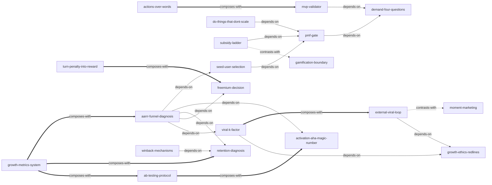

# 《增长黑客》 — Skill Index

> **时效警示（2015 年快照）**：本书具体打法建立在 2014–2015 年的平台生态上——开放平台红利、O2O 现金补贴大战、SEO/ASO 权重、第三方 cookie 重定向、EDM 生态等大多已失效；以下 skills 只保留"判断逻辑层"，任何涉及具体渠道与参数的动作请按当期平台规则与法规重查。

## 关于这本书

- **书名**：《增长黑客：创业公司的用户与收入增长秘籍》
- **作者**：范冰
- **出版年**：2015（电子工业出版社，中国第一部系统引介 Growth Hacker 概念的著作）
- **Skill 总数**：21，按 8 大域分组——PMF 验证 4 / 获客 3 / 激活 4 / 留存 3 / 收入 2 / 传播 3 / AARRR 元层 1 / 职业道德 1
- **一句话主旨**：初创公司没钱买流量，就用"以数据驱动营销、以市场指导产品、通过技术化手段贯彻增长目标"的方式，围绕 AARRR 漏斗每一环做低成本、可测量的实验式增长——前提是产品已达成 PMF，"任何增长黑客都无法挽回一个无药可救的垃圾产品"。
- **整书理解**：[BOOK_OVERVIEW.md](BOOK_OVERVIEW.md)
- **术语词典**：[GLOSSARY.md](GLOSSARY.md)

---

## Skill 列表（按 8 大域分组）

### 一、PMF 验证（4）

- [`demand-four-questions`](../skills/demand-four-questions/SKILL.md) — 立项前纸面过筛单个需求的"真伪/刚性/量与肥/变现"四问，任何一问不过即出局；依据是 68~200 倍需求成本定律——全书最便宜的一道质量关。
- [`pmf-gate`](../skills/pmf-gate/SKILL.md) — 推广/扩招/烧钱扩张前的 PMF 决策门：无"留存曲线走平 + 自发口碑 + 复购"硬证据则三禁止（禁止过早推广、过量优化、烧钱扩张）。
- [`mvp-validator`](../skills/mvp-validator/SKILL.md) — 用最小成本验证"价值假设 + 增长假设"：按验证目标选形态（视频/假门网站/手工服务/公众号），第一天就带反馈/公告/升级三大必备模块；MVP ≠ 便宜难看残破。
- [`actions-over-words`](../skills/actions-over-words/SKILL.md) — 解读用户调研时用"行为 > 口头"校准可信度：付费意愿是意见权重的最佳标尺，口头高度一致反而是失真警报。

### 二、获客（3）

- [`seed-user-selection`](../skills/seed-user-selection/SKILL.md) — 冷启动准入设计：种子用户贵精不贵多，用筛选机制（邀请制/答题/付费/先攻高势能人群）定调产品氛围，并用数据日志排除"产品蝗虫"。
- [`do-things-that-dont-scale`](../skills/do-things-that-dont-scale/SKILL.md) — 零预算冷启动的"人工补课"选型：内容缺失人肉生产、信任缺失一对一陪聊、供给缺失手工服务；规模化后制度化退出。
- [`content-marketing-engine`](../skills/content-marketing-engine/SKILL.md) — 搭建持续输出的内容引擎而非赌单篇爆款：先定位内容三作用（引流/培养/转化），再建选题—生产—分发—复盘的固定循环。

### 三、激活（4）

- [`ab-testing-protocol`](../skills/ab-testing-protocol/SKILL.md) — A/B 测试操作规范：双方案并行/单变量/预设判优标准三铁律，"多数测试注定失败"的预期管理，以及微优化陷阱与测量架构失真的边界警惕。
- [`activation-aha-magic-number`](../skills/activation-aha-magic-number/SKILL.md) — 新用户激活三步：从留存数据反推关键行为 → 做成注册默认引导 → A/B 校准魔法数字；关键行为被技术卡住时"要结果不要路径"绕路降门槛。
- [`subsidy-ladder`](../skills/subsidy-ladder/SKILL.md) — 补贴形态升级阶梯：返利 → 限期券 → 现金 → 红包（借关系链二次传播，一份预算同时完成拉新+留存+传播），并预演"停止补贴后的留存曲线"。
- [`gamification-boundary`](../skills/gamification-boundary/SKILL.md) — 游戏化 PBL 设计与红线判据："只能锦上添花，不能雪中送炭"——先确认产品核心价值成立，再上积分/徽章/排行榜，并预设新鲜感衰减后的退役。

### 四、留存（3）

- [`retention-diagnosis`](../skills/retention-diagnosis/SKILL.md) — 留存四层诊断：真增长=新增−流失 → 次日/7日/30日三口径对照品类基准（如 40-20-10）→ 流失五分类归因 → 性能硬伤用"有损服务"止血；留存有硬伤时拉新是给漏水的桶灌水。
- [`winback-mechanisms`](../skills/winback-mechanisms/SKILL.md) — 流失召回的"通道 × 内容"选型矩阵：邮件/推送/网页唤起三通道 × 奖励/进展/个性化/社交提示四策略；唤醒是补救手段而非留存的替代品。
- [`growth-metrics-system`](../skills/growth-metrics-system/SKILL.md) — 全漏斗度量底座：一个 North Star 终结部门之争 + "先假设后取数、跨指标互证"两条分析纪律 + 带口径陷阱注解的 26 项指标字典排除虚荣指标。

### 五、收入（2）

- [`freemium-decision`](../skills/freemium-decision/SKILL.md) — 免费/收费模式决策器：先过"边际成本趋零 + 海量市场 + 二八法则"前提，撑不起时走"静默砍免费版试验"（悄悄删 → A/B 验证 → 公开切换）。
- [`turn-penalty-into-reward`](../skills/turn-penalty-into-reward/SKILL.md) — 越轨用户（盗版/薅价格漏洞）的转化三原则：绝不责备、给予补偿、提供便利——把越轨者识别为"准付费用户"而非敌人，堵不如疏。

### 六、传播（3）

- [`viral-k-factor`](../skills/viral-k-factor/SKILL.md) — 产品内传播机制的设计与诊断：K=感染率×转化率与病毒循环周期双指标定位瓶颈，八种用户心理触发器匹配分享动作；产品本身足够好才是最佳传播因素。
- [`external-viral-loop`](../skills/external-viral-loop/SKILL.md) — 主产品外的病毒活动策划（H5 小游戏/测试、Bug 营销）：三大考验自检 + 六要点执行 + "让用户略微付出代价"的付出感设计；自带平台封杀风险评估。
- [`moment-marketing`](../skills/moment-marketing/SKILL.md) — 借势营销的"时机艺术"与营销前置：只在热点爆发期把推广融入用户语境、话题须简明可转述；为可预测节点（节日/春运）在研发阶段预埋卖点。

### 七、AARRR 元层（1）

- [`aarrr-funnel-diagnosis`](../skills/aarrr-funnel-diagnosis/SKILL.md) — 增长停滞时的元层诊断：用指标链找出转化率最低的卡点环节，只对该环节设计实验并转入对应专项 skill；"获取排第一"是叙述顺序不是优先级。

### 八、职业道德（1）

- [`growth-ethics-redlines`](../skills/growth-ethics-redlines/SKILL.md) — 一切增长手段执行前的守门闸：换位思考 / 最小授权最大知情 / 契约精神三道闸，任何一闸不过即砍——2015 年即在 GDPR 之前操作化道德约束的前瞻设计。

---

## 引用图



图例：
- `-->` depends-on（使用前提：先理解后者）
- `-.->` contrasts-with（二选一的替代方案，看情境选）
- `===>` composes-with（经常配合使用）

要点：`pmf-gate` 是所有"放量类"手法（获客/补贴/扩张）的总闸；`aarrr-funnel-diagnosis` 只做定位、把流量分发给各环专项；`growth-metrics-system` 是贯穿全漏斗的度量底座；`growth-ethics-redlines` 是灰度手法（体外循环、K 值激励设计）的执行前守门。共 19 条关系边，全部源自各 skill frontmatter 的 `related_skills` 与验证阶段确认的边界互斥，未硬造。

---

## 推荐学习顺序

（从依赖图的叶子节点向上，先底座后专项）

1. **growth-metrics-system** — 度量底座，无前置；没有共同口径，后面的诊断都是各说各话
2. **demand-four-questions** — 纸面筛需求，无前置
3. **actions-over-words** — 与需求四问配合，校准一切"用户说"的信号
4. **mvp-validator** — 依赖 demand-four-questions
5. **pmf-gate** — 依赖 demand-four-questions；放量决策的总闸
6. **aarrr-funnel-diagnosis** — 依赖 pmf-gate 与 growth-metrics-system，进入漏斗各环
7. **各环专项（互相独立，按卡点选用）**：
   - 获客：seed-user-selection、do-things-that-dont-scale、content-marketing-engine
   - 激活：ab-testing-protocol（实验方法）→ activation-aha-magic-number（应用）、subsidy-ladder、gamification-boundary
   - 留存：retention-diagnosis → winback-mechanisms（先诊断归因，再选召回通道）
   - 收入：freemium-decision → turn-penalty-into-reward
   - 传播：viral-k-factor ↔ external-viral-loop（内循环/外循环配合）、moment-marketing
8. **growth-ethics-redlines** — 贯穿全程的守门闸：任何灰度手法执行前回头过三道闸

---

## 安装使用

本目录是构建产物，宿主不会从这里加载 skill。要让 agent 真正调用，把对应 skill 目录复制到宿主的 skills 目录：

```bash
# 用户级（所有项目可用）
cp -r skills/pmf-gate/ ~/.claude/skills/pmf-gate/

# 或项目级
cp -r skills/retention-diagnosis/ <project>/.claude/skills/retention-diagnosis/
```

---

## 审计轨迹

- 整书理解：[BOOK_OVERVIEW.md](BOOK_OVERVIEW.md)
- 术语词典：[GLOSSARY.md](GLOSSARY.md)
- 候选单元池：[candidates/](candidates/)
- 三重验证产出（21 单元聚类总表 + 时效警示）：[verified.md](verified.md)
- 被淘汰的候选（含原因）：[rejected/](rejected/)
