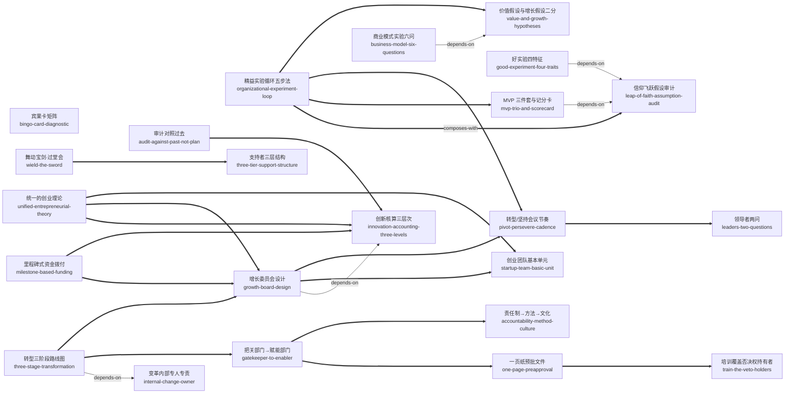

# 精益创业 2.0（The Startup Way）· 技能集

由埃里克·莱斯《精益创业 2.0》蒸馏出的一组**可被 AI Agent 调用的技能**（Skills）。

> 创业管理应当成为成熟企业的第二套核心管理体制——像设立财务部一样设立「创业部」，
> 用创业团队作为基本工作单元、用创新核算与里程碑式拨款问责，分三个阶段完成一场可以反复进行的「二次创业」。
> 它把「创新」从天赋问题翻译成设计问题：预算怎么拨、委员会怎么设、失败怎么讲、审批规则怎么参数化，全部拆成可执行、可审计的机制。
> 本项目把这些方法论提炼成 36 个原子化技能。

---

## 来源

| | |
|---|---|
| **书名** | 精益创业 2.0 *The Startup Way* |
| **作者** | 埃里克·莱斯（Eric Ries），译者 陈毅平 |
| **出版** | 英文原版 2017 年 / 中文版中信出版集团 2020 年 |
| **蒸馏工具** | cangjie-skill（仓颉：把长内容蒸馏成可调用技能的流水线） |
| **蒸馏方法** | RIA-TV++（整书理解 → 并行提取 → 三重验证 → RIA++ 构造 → 链接 → 压力测试 → 交付） |

---

## 36 个技能

36 个技能按书的骨架分为四大主题，对应「把精益方法装进成熟企业」的四层体系：**实验引擎**（方法本体）→ **资源与治理**（钱与问责）→ **组织与团队**（制度载体）→ **领导与文化**（人的行为与土壤）。

### 一、实验引擎 —— 假设→实验→学习→决策的循环本体

- [`organizational-experiment-loop`](skills/organizational-experiment-loop/SKILL.md) — **精益实验循环五步法（组织场景版）**：假设→MVP→验证式学习→开发-测量-认知→转型/坚持，附领导者两问、风险控制、终止受奖、会议节奏四件组织附件
- [`leap-of-faith-assumption-audit`](skills/leap-of-faith-assumption-audit/SKILL.md) — **信仰飞跃假设审计**：立项前把「我们觉得会成功」的隐含前提写成可检验假设清单，按「最不舒适」排序——先问该不该造，再问能不能造
- [`value-and-growth-hypotheses`](skills/value-and-growth-hypotheses/SKILL.md) — **价值假设与增长假设二分**：给两条根本假设分别定量化门槛，先价值后增长；门槛必须能与财务模型对账
- [`good-experiment-four-traits`](skills/good-experiment-four-traits/SKILL.md) — **好实验四特征**：用可证伪/下一步/风险控制/绑定假设四特征评审实验，把「失败可控」写成合同条款
- [`mvp-trio-and-scorecard`](skills/mvp-trio-and-scorecard/SKILL.md) — **MVP 三件套头脑风暴与记分卡**：对同一假设强制想出现有版/镀金版/极简版三个 MVP，按「单位成本换学习量」选型
- [`mvp-for-learning-not-scale`](skills/mvp-for-learning-not-scale/SKILL.md) — **优化 MVP 是为了学习，不是为了规模**：挡住「给 MVP 加高可用/上规模」的要求，用风险控制替代工程加码
- [`prfaq-working-backwards`](skills/prfaq-working-backwards/SKILL.md) — **PRFAQ / 逆向工作法**：开发或消耗政治资本前，先写「产品已上线」的虚构新闻稿+FAQ 测真实反馈
- [`business-model-six-questions`](skills/business-model-six-questions/SKILL.md) — **商业模式实验六问**：产品卖不动时过六问重构收钱结构，而非只会降价
- [`lean-for-non-startup-work`](skills/lean-for-non-startup-work/SKILL.md) — **创业方法适用于非创业工作**：行政、财务、年会筹备皆可写一页假设做最小验证——方法论同时成为人才发现机制

### 二、资源与治理 —— 钱、问责与裁决机构

- [`innovation-accounting-three-levels`](skills/innovation-accounting-three-levels/SKILL.md) — **创新核算制度三层次**：传统指标失效时用三层次记账（仪表板→商业案例→净现值）证明「在进步而不是瞎忙」，核心是「为信息定价」
- [`audit-against-past-not-plan`](skills/audit-against-past-not-plan/SKILL.md) — **审计对照过去，不对照梦想计划**：创新审计的基线是环比学习曲线而非期初承诺
- [`bingo-card-diagnostic`](skills/bingo-card-diagnostic/SKILL.md) — **宾果卡（三规模×四阶段矩阵）**：逐格下钻定位推广卡在哪一层：实施→行为变化→用户影响→财务影响，跳格测量全是噪声
- [`growth-board-design`](skills/growth-board-design/SKILL.md) — **增长委员会设计**：设 6–8 人委员会当「可运作的风险资本基金会」：唯一问责点、信息交换所、拨款把关人
- [`milestone-based-funding`](skills/milestone-based-funding/SKILL.md) — **里程碑式资金拨付 vs 按指定用途拨款**：整笔预付+里程碑复审，拨款与学习成果挂钩——「钱你随便花，但下一笔要拿学习换」
- [`innovation-needs-constraints`](skills/innovation-needs-constraints/SKILL.md) — **没有制约的创新不是好创新**：资金过剩项目死亡率更高——先自我设限，约束本身是方法的一部分
- [`wield-the-sword`](skills/wield-the-sword/SKILL.md) — **舞动宝剑（过堂会）**：向高管报出可交付结果，一次性换取三项清障（政策豁免/专职人手/免干预）——团队很少要钱，要的是「宝剑」
- [`one-page-preapproval`](skills/one-page-preapproval/SKILL.md) — **一页纸预批文件**：把把关规则参数化成三档预批并当 MVP 向内部用户迭代——参数反向激励团队把实验做小
- [`one-team-success-is-enough`](skills/one-team-success-is-enough/SKILL.md) — **只要有一个团队成功就是胜利**：上场前对高层明示组合期望，防「表演性成功」；全胜反而可疑

### 三、组织与团队 —— 制度载体与推进时序

- [`startup-team-basic-unit`](skills/startup-team-basic-unit/SKILL.md) — **创业团队作为基本工作单元**：实验/执行是每个业务单元的配比且随时间移动；成功会引发组织排异，落地路径要预先谈判
- [`dedicated-cross-functional-teams`](skills/dedicated-cross-functional-teams/SKILL.md) — **跨职能团队必须专职**：专职性是参与度问题而非预算问题——借人不借编制，请认同愿景的职能「义工」坐进团队
- [`three-tier-support-structure`](skills/three-tier-support-structure/SKILL.md) — **支持者三层结构**：发起人保项目、支持者保工作法、教练保学习——三层不可互换，找错层级等于没支持
- [`train-the-veto-holders`](skills/train-the-veto-holders/SKILL.md) — **培训要覆盖「能喊停的人」**：否决权持有者不进教室，新方法就会在下一个审批口被旧标准击毙
- [`gatekeeper-to-enabler`](skills/gatekeeper-to-enabler/SKILL.md) — **把关部门→赋能部门改造路径**：法务/财务/IT/HR/采购把自己当创业团队经营——五职能可对照的改造实例组
- [`unified-entrepreneurial-theory`](skills/unified-entrepreneurial-theory/SKILL.md) — **统一的创业理论**：新产品/内部产品/企业发展/组织转型四类活动统一归创业职能，用七项职责审计判断创新头衔是实职还是封号
- [`internal-change-owner`](skills/internal-change-owner/SKILL.md) — **变革必须内部专人专责**：外部顾问主导注定失败，无主变革=权力真空
- [`three-stage-transformation`](skills/three-stage-transformation/SKILL.md) — **转型三阶段路线图与时机判断**：临界规模→扩大规模→深层机制；无试点证据与政治资本时触碰考核薪酬等深层机制等于自杀
- [`pivot-persevere-cadence`](skills/pivot-persevere-cadence/SKILL.md) — **转型/坚持会议节奏设计**：每 6 周一次、月上限季下限的预排期决策会——决策频率本身成为反沉没成本装置

### 四、领导与文化 —— 语言、激励与移植规则

- [`leaders-two-questions`](skills/leaders-two-questions/SKILL.md) — **领导者两问**：「你学到了什么？你是怎么知道的？」——把问责从人转向假设的语言装置，第二问专防假学习
- [`coach-assume-they-are-right`](skills/coach-assume-they-are-right/SKILL.md) — **教练立场：「假定你们是对的，我是错的」**：对拒绝新方法的固执者不辩论，只卖一个「证明你是对的」的自证实验，让现实做说服者
- [`coach-not-leader-not-spy`](skills/coach-not-leader-not-spy/SKILL.md) — **教练不是领导，也不是间谍**：教练一旦兼任监视者，团队只汇报好消息、学习通道关闭
- [`reward-useful-failure`](skills/reward-useful-failure/SKILL.md) — **奖励有益的失败，终止叙述权归创业者**：项目黄了由负责人自己讲：测了什么假设、花了多少、省下什么
- [`innovate-in-the-open`](skills/innovate-in-the-open/SKILL.md) — **公开创新，不偷偷摸摸**：地下是保火种的过渡态不是归宿——长期地下=资源与合法性双输
- [`accountability-method-culture`](skills/accountability-method-culture/SKILL.md) — **责任制→方法→文化三层因果模型**：文化是过去责任制与方法的残留而非宣言——先改考核什么、奖惩什么，贴海报无效
- [`behavior-before-tools`](skills/behavior-before-tools/SKILL.md) — **技术只是手段：先改行为与文化，再上工具**：先小群行为实验→迭代工具→分层自愿扩大；工具先行得到的只有噪声
- [`voluntary-adoption-indicator`](skills/voluntary-adoption-indicator/SKILL.md) — **自愿参加是领先性指标**：用自愿迁移率而非部署率/覆盖率验收制度质量——强制切换只测出合规
- [`localize-dont-copy`](skills/localize-dont-copy/SKILL.md) — **用本公司语言重述方法，不照搬复制**：「复制」被判为不可能；替代程序：本地实验→自有语言→自有工具

---

## 技能之间的引用关系

36 个技能共 101 条唯一关系（depends-on 5 · contrasts-with 32 · composes-with 64），下图只画主干（全部 depends-on + 实验循环与治理链的核心 composes-with），不是全图。



图例：`-->` depends-on（先理解它才用得好） · `-.->` contrasts-with（二选一，看情境） · `===>` composes-with（经常配合使用）

几条最有用的「导航线」：

1. **实验循环的分解**：`organizational-experiment-loop` 是总纲，`leap-of-faith-assumption-audit`（第 1 步）、`mvp-trio-and-scorecard`（第 2 步）、`pivot-persevere-cadence`（第 5 步）是其中三步的深钻。
2. **治理链条**：创新核算（怎么记账）→ 审计基线（拿什么对比）→ 增长委员会（谁来裁）→ 里程碑拨款（钱怎么给）；没有创新核算，委员会退化成讲故事比赛。
3. **组织落地链**：三阶段路线图（何时动）→ 增长委员会与里程碑拨款（二阶段组件）→ 把关部门改造（三阶段主体），全程要求内部专人负责。

**推荐学习顺序**（先个体可用，后组织级）：`organizational-experiment-loop` → `leap-of-faith-assumption-audit` → `value-and-growth-hypotheses` / `mvp-trio-and-scorecard` / `good-experiment-four-traits` → `leaders-two-questions` / `pivot-persevere-cadence` / `reward-useful-failure` → `innovation-accounting-three-levels` → `growth-board-design` + `milestone-based-funding` → `three-stage-transformation` → 制度施工包（`three-tier-support-structure` / `train-the-veto-holders` / `one-page-preapproval` / `gatekeeper-to-enabler` / `wield-the-sword`）→ 文化土壤与移植规则（`accountability-method-culture` / `behavior-before-tools` / `voluntary-adoption-indicator` / `localize-dont-copy` / `innovate-in-the-open` / `coach-assume-they-are-right` / `coach-not-leader-not-spy`）→ 收口（`startup-team-basic-unit` / `unified-entrepreneurial-theory` / `internal-change-owner` / `lean-for-non-startup-work`）。

---

## 目录结构

```text
lean-startup-2/
├── README.md
├── skills/                      # 36 个可安装技能（核心交付物）
│   └── <skill-slug>/
│       ├── SKILL.md             # 技能定义（R/I/A1/A2/E/B 六段）
│       ├── test-prompts.json    # 触发/诱饵测试集
│       └── test-results.md      # 压力测试结果
└── docs/                        # 蒸馏文档与审计轨迹
    ├── DIGEST.md / GLOSSARY.md / INDEX.md
    ├── BOOK_OVERVIEW.md / verified.md / PIPELINE_STATE.md
    ├── rejected/
    └── candidates/              # 框架/原则/案例/反例/术语 候选池
```

---

## 关于内容与版权

本项目是**方法论蒸馏产物**，不含原书全文：

- 每个技能对原书的引用严格控制在 **≤150 字/段**，属于合理引用范畴；
- 原文的版权归原作者埃里克·莱斯、译者陈毅平及出版社所有；
- 建议购买正版书籍配合使用。

---

## 如何重新生成

本项目由 cangjie-skill（仓颉蒸馏流水线）自动生成。若要复现或调整：

1. 准备书籍文本（`fulltext.txt`）
2. 运行 RIA-TV++ 流水线（阶段 0–5，详见 `docs/PIPELINE_STATE.md`）
3. 通过三重验证 + 压力测试的单元会被构造为独立技能并安装

如需让技能持续进化，可喂给 `darwin-skill`：`darwin evolve lean-startup-2/`
