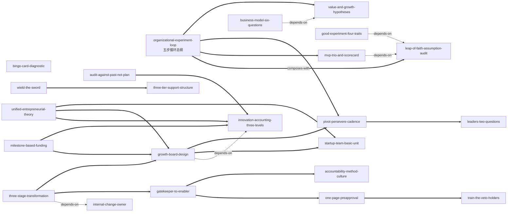

# 《精益创业 2.0》— Skill Index

> 本书由 cangjie-skill 蒸馏，共产出 **36** 个 skills（框架 20 + 原则 16）。
> 处理时间：2026-09-29

## 关于这本书

- **作者**：[美] 埃里克·莱斯（Eric Ries），译者陈毅平
- **出版年**：英文原版 2017 年；中文版中信出版集团 2020 年
- **一句话主旨**：创业管理应当成为成熟企业的第二套核心管理体制——像设立财务部一样设立"创业部"，用创业团队作为基本工作单元、用创新核算与里程碑式拨款问责，分三个阶段完成一场可以反复进行的"二次创业"。
- **整书理解**：见 [BOOK_OVERVIEW.md](./BOOK_OVERVIEW.md)
- **精华长文**（不读全书看这篇）：[DIGEST.md](./DIGEST.md)
- **术语词典**：[GLOSSARY.md](./GLOSSARY.md)

---

## Skill 列表（按主题分组）

36 个 skill 按书的骨架分为四大主题，对应"把精益方法装进成熟企业"的四层体系：**实验引擎**（方法本体）→ **资源与治理**（钱与问责）→ **组织与团队**（制度载体）→ **领导与文化**（人的行为与土壤）。类型一栏：框架 = 可直接执行的程序/工具；原则 = 裁决规则与立场。

### 一、实验引擎 —— 假设→实验→学习→决策的循环本体

| Skill | 标题 | 一句话 | 类型 | 来源章节 | verified id |
|---|---|---|---|---|---|
| [`organizational-experiment-loop`](../skills/./organizational-experiment-loop/SKILL.md) | 精益实验循环五步法（组织场景版） | 把"先做完还是先测"的纠结变成五步循环：假设→MVP→验证式学习→开发-测量-认知→转型/坚持，附领导者两问、风险控制、终止受奖、会议节奏四件组织附件 | 框架 | 第 4 章（另见 2、6、8 章） | f01 |
| [`leap-of-faith-assumption-audit`](../skills/./leap-of-faith-assumption-audit/SKILL.md) | 信仰飞跃假设审计 | 立项前把"我们觉得会成功"的隐含前提写成可检验假设清单，按"最不舒适"排序——先问该不该造，再问能不能造 | 框架 | 第 4 章（第 6 章 X 系列为组织实例） | f22 |
| [`value-and-growth-hypotheses`](../skills/./value-and-growth-hypotheses/SKILL.md) | 价值假设与增长假设二分 | 给两条根本假设分别定量化门槛，先价值后增长；满意度代理变量（如 NPS）不可用，门槛必须能与财务模型对账 | 框架 | 第 4 章；另见 6、9 章 | f02 |
| [`good-experiment-four-traits`](../skills/./good-experiment-four-traits/SKILL.md) | 好实验四特征 | 用可证伪/下一步/风险控制/绑定假设四特征评审实验，把"失败可控"写成合同条款（限用户数、不贴商标、退款承诺） | 框架 | 第 6 章；另见第 8 章 | f03 |
| [`mvp-trio-and-scorecard`](../skills/./mvp-trio-and-scorecard/SKILL.md) | MVP 三件套头脑风暴与记分卡 | 对同一假设强制想出现有版/镀金版/极简版三个 MVP，用记分卡按"单位成本换学习量"选型——同假设不同经费，必淘汰贵者 | 框架 | 第 4 章（表 4-3） | f04 |
| [`mvp-for-learning-not-scale`](../skills/./mvp-for-learning-not-scale/SKILL.md) | 优化 MVP 是为了学习，不是为了规模 | 挡住"给 MVP 加高可用/上规模"的要求：先问加码增加了什么学习，用风险控制替代工程加码 | 原则 | 第 4 章（第 6 章"只卖一台发动机"之争） | p05 |
| [`prfaq-working-backwards`](../skills/./prfaq-working-backwards/SKILL.md) | PRFAQ / 逆向工作法 | 开发或消耗政治资本前，先写"产品已上线"的虚构新闻稿+FAQ 测真实反馈——把拒绝当作最便宜的教训 | 框架 | 第 4 章；第 1 章 | f16 |
| [`business-model-six-questions`](../skills/./business-model-six-questions/SKILL.md) | 商业模式实验六问 | 产品卖不动时过六问重构收钱结构（资产负债表归属、产品/服务分界、按效果收费……），而非只会降价 | 框架 | 第 6 章 | f14 |
| [`lean-for-non-startup-work`](../skills/./lean-for-non-startup-work/SKILL.md) | 创业方法适用于非创业工作 | 行政、财务、年会筹备皆可写一页假设做最小验证——"你无法预知谁是创业者"使方法论同时成为人才发现机制 | 原则 | 第 2、8 章；另见第 3 章 | p23 |

### 二、资源与治理 —— 钱、问责与裁决机构

| Skill | 标题 | 一句话 | 类型 | 来源章节 | verified id |
|---|---|---|---|---|---|
| [`innovation-accounting-three-levels`](../skills/./innovation-accounting-three-levels/SKILL.md) | 创新核算制度三层次 | 传统指标失效时用三层次记账（仪表板→商业案例→净现值）证明"在进步而不是瞎忙"，核心是"为信息定价" | 框架 | 第 9 章；另见 1、7 章 | f05 |
| [`audit-against-past-not-plan`](../skills/./audit-against-past-not-plan/SKILL.md) | 审计对照过去，不对照梦想计划 | 创新审计的基线是环比学习曲线而非期初承诺——诚实且可审计的进步写法 | 原则 | 第 9 章 | p14 |
| [`bingo-card-diagnostic`](../skills/./bingo-card-diagnostic/SKILL.md) | 宾果卡（三规模×四阶段矩阵） | 逐格下钻定位推广卡在哪一层：实施→行为变化→用户影响→财务影响，每格是下一格的预测器，跳格测量全是噪声 | 框架 | 第 9 章（表 9-3/9-4） | f07 |
| [`growth-board-design`](../skills/./growth-board-design/SKILL.md) | 增长委员会设计 | 设 6-8 人委员会当"可运作的风险资本基金会"：唯一问责点、信息交换所、拨款把关人，只验可审计学习，不出席者不投票 | 框架 | 第 9 章；另见第 6 章 | f08 |
| [`milestone-based-funding`](../skills/./milestone-based-funding/SKILL.md) | 里程碑式资金拨付 vs 按指定用途拨款 | 对偶模型：整笔预付+里程碑复审，拨款与学习成果挂钩而非与时间表挂钩——"钱你随便花，但下一笔要拿学习换" | 框架 | 第 3、7 章；另见第 9 章 | f09 |
| [`innovation-needs-constraints`](../skills/./innovation-needs-constraints/SKILL.md) | 没有制约的创新不是好创新 | 资金过剩项目死亡率更高——先自我设限（不可展期的时间盒与资源上限），约束本身是方法的一部分 | 原则 | 第 7 章；另见 2、3 章 | p13 |
| [`wield-the-sword`](../skills/./wield-the-sword/SKILL.md) | 舞动宝剑（过堂会） | 向高管报出可交付结果，一次性换取三项清障（政策豁免/专职人手/免干预）——团队很少要钱，要的是"宝剑" | 框架 | 第 6 章 | f11 |
| [`one-page-preapproval`](../skills/./one-page-preapproval/SKILL.md) | 一页纸预批文件 | 把把关规则参数化成三档预批（区间内免批/超档签字/再超面谈）并当 MVP 向内部用户迭代——参数反向激励团队把实验做小 | 框架 | 第 8 章 | f12 |
| [`one-team-success-is-enough`](../skills/./one-team-success-is-enough/SKILL.md) | 只要有一个团队成功就是胜利 | 上场前对高层明示组合期望，防"表演性成功"；全胜反而可疑，失败要看是否留下可审计学习 | 原则 | 第 6 章；另见 9、2 章 | p09 |

### 三、组织与团队 —— 制度载体与推进时序

| Skill | 标题 | 一句话 | 类型 | 来源章节 | verified id |
|---|---|---|---|---|---|
| [`startup-team-basic-unit`](../skills/./startup-team-basic-unit/SKILL.md) | 创业团队作为基本工作单元 | 实验/执行是每个业务单元的配比且随时间移动；成功会引发组织排异，落地路径要预先谈判 | 框架 | 第 2 章；第 5 章 | f18 |
| [`dedicated-cross-functional-teams`](../skills/./dedicated-cross-functional-teams/SKILL.md) | 跨职能团队必须专职 | 专职性是参与度问题而非预算问题——借人不借编制，请认同愿景的职能"义工"坐进团队 | 原则 | 第 6 章；另见 9、8 章 | p10 |
| [`three-tier-support-structure`](../skills/./three-tier-support-structure/SKILL.md) | 支持者三层结构 | 发起人保项目、支持者保工作法、教练保学习——三层不可互换，找错层级等于没支持 | 框架 | 第 6、7 章 | f17 |
| [`train-the-veto-holders`](../skills/./train-the-veto-holders/SKILL.md) | 培训要覆盖"能喊停的人" | 否决权持有者不进教室，新方法就会在下一个审批口被旧标准击毙——制止那些妨碍运动的人 | 原则 | 第 7 章（伊梅尔特论断） | p11 |
| [`gatekeeper-to-enabler`](../skills/./gatekeeper-to-enabler/SKILL.md) | 把关部门→赋能部门改造路径 | 法务/财务/IT/HR/采购把自己当创业团队经营——五职能可对照的改造实例组 | 框架 | 第 8 章 | f15 |
| [`unified-entrepreneurial-theory`](../skills/./unified-entrepreneurial-theory/SKILL.md) | 统一的创业理论 | 新产品/内部产品/企业发展/组织转型四类活动统一归创业职能，用七项职责审计判断创新头衔是实职还是封号 | 框架 | 第 10 章；另见 2、5 章 | f21 |
| [`internal-change-owner`](../skills/./internal-change-owner/SKILL.md) | 变革必须内部专人专责 | 外部顾问主导注定失败，无主变革=权力真空——变革必须由真正懂得公司文化和变革方法的内部人设计 | 原则 | 第 6 章；另见 7、10 章 | p24 |
| [`three-stage-transformation`](../skills/./three-stage-transformation/SKILL.md) | 转型三阶段路线图与时机判断 | 临界规模→扩大规模→深层机制；无试点证据与政治资本时触碰考核薪酬等深层机制等于自杀 | 框架 | 第二部分引言+第 6-8 章 | f10 |
| [`pivot-persevere-cadence`](../skills/./pivot-persevere-cadence/SKILL.md) | 转型/坚持会议节奏设计 | 每 6 周一次、月上限季下限的预排期决策会——决策频率本身成为反沉没成本装置，"开会≠承认失败" | 框架 | 第 4 章；第 9 章 | f19 |

### 四、领导与文化 —— 语言、激励与移植规则

| Skill | 标题 | 一句话 | 类型 | 来源章节 | verified id |
|---|---|---|---|---|---|
| [`leaders-two-questions`](../skills/./leaders-two-questions/SKILL.md) | 领导者两问 | "你学到了什么？你是怎么知道的？"——把问责从人转向假设的语言装置，第二问专防"我觉得下次会好"式假学习 | 原则 | 第 4 章；第 9 章 | p06 |
| [`coach-assume-they-are-right`](../skills/./coach-assume-they-are-right/SKILL.md) | 教练立场："假定你们是对的，我是错的" | 对拒绝新方法的固执者不辩论，只卖一个"证明你是对的"的自证实验，让现实做说服者 | 原则 | 第 7 章（展会信封实验） | p12 |
| [`coach-not-leader-not-spy`](../skills/./coach-not-leader-not-spy/SKILL.md) | 教练不是领导，也不是间谍 | 教练一旦兼任监视者，团队只汇报好消息、学习通道关闭——拒斥情报职能是制度条件 | 原则 | 第 7 章 | p16 |
| [`reward-useful-failure`](../skills/./reward-useful-failure/SKILL.md) | 奖励有益的失败，终止叙述权归创业者 | 项目黄了由负责人自己讲：测了什么假设、花了多少、省下什么——奖励"及时证伪"而非叙事化失败 | 原则 | 第 1、4、5 章 | p19 |
| [`innovate-in-the-open`](../skills/./innovate-in-the-open/SKILL.md) | 公开创新，不偷偷摸摸 | 地下是保火种的过渡态不是归宿——长期地下=资源与合法性双输，须在下一个里程碑公开换取支持者 | 原则 | 第 6 章（第 7 章马汉冰箱案） | p08 |
| [`accountability-method-culture`](../skills/./accountability-method-culture/SKILL.md) | 责任制→方法→文化三层因果模型 | 文化是过去责任制与方法的残留而非宣言——先改考核什么、奖惩什么，方法才会自组织更新，贴海报无效 | 框架 | 第 5 章；另见 8、6 章 | f13 |
| [`behavior-before-tools`](../skills/./behavior-before-tools/SKILL.md) | 技术只是手段：先改行为与文化，再上工具 | 先小群行为实验（20-100 人）→迭代工具→分层自愿扩大；工具先行得到的只有噪声（80% vs <2%） | 原则 | 第 8 章（PD@GE） | p20 |
| [`voluntary-adoption-indicator`](../skills/./voluntary-adoption-indicator/SKILL.md) | 自愿参加是领先性指标 | 用自愿迁移率而非部署率/覆盖率验收制度质量——强制切换只测出合规，还烧掉纠错信息 | 原则 | 第 8 章；另见第 2 章 | p21 |
| [`localize-dont-copy`](../skills/./localize-dont-copy/SKILL.md) | 用本公司语言重述方法，不照搬复制 | "复制"被判为不可能（FastWorks 反映 GE 的文化与性格）；替代程序：本地实验→自有语言→自有工具 | 原则 | 第 6 章；另见 7、2 章 | p17 |

---

## 引用图

36 个 skill 之间的关系均依据各 SKILL.md「与相邻 skill 的区分」段落确定，共 **101 条**唯一关系：depends-on 5 条、contrasts-with 32 条、composes-with 64 条（每条关系的完整清单见各 SKILL.md 的 frontmatter `related_skills` 与文末「相关 skills」节）。下图只画主干（全部 depends-on + 实验循环与治理链的核心 composes-with），不是全图。



图例：`-->` depends-on（先理解它才用得好）｜`-.->` contrasts-with（二选一，看情境）｜`===>` composes-with（经常配合使用）。

几条最有用的"导航线"：

1. **实验循环的分解**：`organizational-experiment-loop` 是总纲，`leap-of-faith-assumption-audit`（第 1 步）、`mvp-trio-and-scorecard`（第 2 步）、`pivot-persevere-cadence`（第 5 步）是其中三步的深钻；`good-experiment-four-traits` 与 `mvp-for-learning-not-scale` 分别管实验质量与 MVP 打磨标准之争。
2. **治理链条**：创新核算（怎么记账）→ 审计基线（拿什么对比）→ 增长委员会（谁来裁）→ 里程碑拨款（钱怎么给）；没有创新核算，委员会退化成讲故事比赛。
3. **组织落地链**：三阶段路线图（何时动）→ 增长委员会与里程碑拨款（二阶段组件）→ 把关部门改造（三阶段主体），全程要求内部专人负责。

---

## 推荐学习顺序

（从依赖图的叶子节点向上；先个体可用，后组织级）

1. **`organizational-experiment-loop`** — 总纲，无前置；个人副业即可跑通最小循环。
2. **`leap-of-faith-assumption-audit`** — 循环第 1 步的深钻，后续多个 skill 的前置。
3. **`value-and-growth-hypotheses`** / **`mvp-trio-and-scorecard`** / **`good-experiment-four-traits`** — 假设分类、载体选型、实验质检三件套。
4. **`leaders-two-questions`** / **`pivot-persevere-cadence`** / **`reward-useful-failure`** — 让循环在组织里活下来的语言与节奏。
5. **`innovation-accounting-three-levels`** → **`audit-against-past-not-plan`** / **`bingo-card-diagnostic`** — 先会记账，再会定基线、做组织级诊断。
6. **`growth-board-design`** + **`milestone-based-funding`**（通常组合）+ **`one-team-success-is-enough`** / **`innovation-needs-constraints`** — 治理与资金机制。
7. **`three-stage-transformation`** → **`three-tier-support-structure`** / **`train-the-veto-holders`** / **`one-page-preapproval`** / **`gatekeeper-to-enabler`** / **`wield-the-sword`** — 按阶段推进的制度施工包。
8. **`accountability-method-culture`** / **`behavior-before-tools`** / **`voluntary-adoption-indicator`** / **`localize-dont-copy`** / **`innovate-in-the-open`** / **`coach-assume-they-are-right`** / **`coach-not-leader-not-spy`** — 文化土壤与移植规则，随时可穿插。
9. **`startup-team-basic-unit`** / **`unified-entrepreneurial-theory`** / **`internal-change-owner`** / **`lean-for-non-startup-work`** — 收口：组织架构与适用边界。

---

## 安装使用

本目录是构建产物，宿主不会从这里加载 skill。要让 agent 真正调用，把 skill 目录复制到宿主的 skills 目录：

```bash
# 用户级（所有项目可用）
cp -r organizational-experiment-loop ~/.claude/skills/

# 或项目级
cp -r organizational-experiment-loop <project>/.claude/skills/    # Claude Code
cp -r organizational-experiment-loop <project>/.cursor/skills/    # Cursor
```

> **注意**：按用户要求，**本批 36 个 skill 未执行安装**（未复制到 `.trae/skills/` 或 skill-bookshelf）。如需启用，请按上面的命令手动复制到技能目录。

---

## 接入 darwin-skill

所有 skill 均带有 `test-prompts.json`（darwin-skill 兼容格式，每个 6 条测试），可直接接入自动进化：

```
darwin evolve books/lean-startup-2/
```

---

## 附录：id→slug 权威映射表

阶段 2 各批次曾以「fXX/pXX《标题》」格式做跨单元引用；阶段 3 已全部归一为实际 slug（SKILL.md 共替换 479 处，test-prompts.json notes 共替换 85 处）。此表是全书引用的权威对照。

### 存活 skill 单元（36）

| id | slug | 标题 | 类型 |
|---|---|---|---|
| f01 | `organizational-experiment-loop` | 精益实验循环五步法（组织场景版） | 框架 |
| f02 | `value-and-growth-hypotheses` | 价值假设与增长假设二分（含量化门槛） | 框架 |
| f03 | `good-experiment-four-traits` | 好实验四特征 | 框架 |
| f04 | `mvp-trio-and-scorecard` | MVP 三件套头脑风暴与记分卡 | 框架 |
| f05 | `innovation-accounting-three-levels` | 创新核算制度三层次 | 框架 |
| f07 | `bingo-card-diagnostic` | 宾果卡（三规模×四阶段矩阵） | 框架 |
| f08 | `growth-board-design` | 增长委员会设计 | 框架 |
| f09 | `milestone-based-funding` | 里程碑式资金拨付 vs 按指定用途拨款 | 框架 |
| f10 | `three-stage-transformation` | 转型三阶段路线图与时机判断 | 框架 |
| f11 | `wield-the-sword` | 舞动宝剑（过堂会） | 框架 |
| f12 | `one-page-preapproval` | 一页纸预批文件 | 框架 |
| f13 | `accountability-method-culture` | 责任制→方法→文化三层因果模型 | 框架 |
| f14 | `business-model-six-questions` | 商业模式实验六问 | 框架 |
| f15 | `gatekeeper-to-enabler` | 把关部门→赋能部门改造路径 | 框架 |
| f16 | `prfaq-working-backwards` | PRFAQ / 逆向工作法 | 框架 |
| f17 | `three-tier-support-structure` | 支持者三层结构 | 框架 |
| f18 | `startup-team-basic-unit` | 创业团队作为基本工作单元 | 框架 |
| f19 | `pivot-persevere-cadence` | 转型/坚持会议节奏设计 | 框架 |
| f21 | `unified-entrepreneurial-theory` | 统一的创业理论 | 框架 |
| f22 | `leap-of-faith-assumption-audit` | 信仰飞跃假设审计 | 框架 |
| p05 | `mvp-for-learning-not-scale` | 优化 MVP 是为了学习，不是为了规模 | 原则 |
| p06 | `leaders-two-questions` | 领导者两问 | 原则 |
| p08 | `innovate-in-the-open` | 公开创新，不偷偷摸摸 | 原则 |
| p09 | `one-team-success-is-enough` | 只要有一个团队成功就是胜利 | 原则 |
| p10 | `dedicated-cross-functional-teams` | 跨职能团队必须专职 | 原则 |
| p11 | `train-the-veto-holders` | 培训要覆盖"能喊停的人" | 原则 |
| p12 | `coach-assume-they-are-right` | 教练立场："假定你们是对的，我是错的" | 原则 |
| p13 | `innovation-needs-constraints` | 没有制约的创新不是好创新 | 原则 |
| p14 | `audit-against-past-not-plan` | 审计对照过去，不对照梦想计划 | 原则 |
| p16 | `coach-not-leader-not-spy` | 教练不是领导，也不是间谍 | 原则 |
| p17 | `localize-dont-copy` | 用本公司语言重述方法，不照搬复制 | 原则 |
| p19 | `reward-useful-failure` | 奖励有益的失败，终止叙述权归创业者 | 原则 |
| p20 | `behavior-before-tools` | 技术只是手段：先改行为与文化，再上工具 | 原则 |
| p21 | `voluntary-adoption-indicator` | 自愿参加是领先性指标 | 原则 |
| p23 | `lean-for-non-startup-work` | 创业方法适用于非创业工作 | 原则 |
| p24 | `internal-change-owner` | 变革必须内部专人专责 | 原则 |

### 已淘汰/并入单元（在旧引用中出现时按下表理解）

| 旧 id | 去向 |
|---|---|
| f06 增长引擎三分法 | 淘汰（V1）；内容并入 `value-and-growth-hypotheses` 增长面子模块，词典 g17 保留 |
| f20 领先性指标选择法 | 淘汰（V3）；组织级指标内容并入 `bingo-card-diagnostic` 与词典 g09 |
| p02 先价值后增长 | 并入 `value-and-growth-hypotheses`（f02） |
| p03 假设越少越好 | 并入 `leap-of-faith-assumption-audit`（f22，假设饮食法） |
| p07 提前排期转型会议 | 并入 `pivot-persevere-cadence`（f19） |
| p15 增长委员会铁律 | 并入 `growth-board-design`（f08） |
| p22 过早触及深层机制 | 并入 `three-stage-transformation`（f10，B 段时序铁律） |
| p01 / p04 / p18 | 验证淘汰（公理索引 / UX 圈常识 / 口号式格言），素材保留于相关 skill 的 A1/example |

---

## 审计轨迹

- 候选单元池：[candidates/](./candidates/)
- 被淘汰的候选（含原因）：[rejected/](./rejected/)
- 三重验证产出：[verified.md](./verified.md)
- BOOK_OVERVIEW：[BOOK_OVERVIEW.md](./BOOK_OVERVIEW.md)
- 阶段 4 盲测结果：各 skill 目录 `test-results.md`（串行降级自测，详见其中说明）
