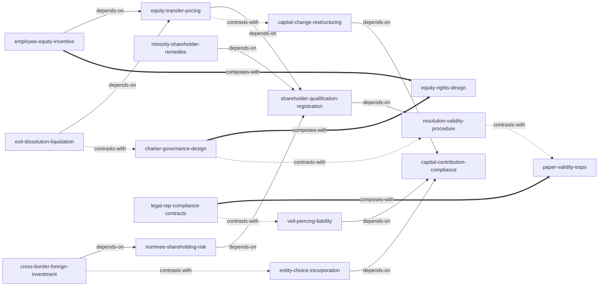

# 《创业投资法律手册:那些你在创业时应该知道的公司法知识》 — Skill Index

> 本书由 cangjie-skill 蒸馏, 共产出 **16** 个 skills。
> 处理时间: 2026-10-06

## ⚠️ 法律时效性警示(必读)

> **本书成书于 2014 年,基于 2013 年《公司法》修正案语境。所有 16 个 skill 均携带时效性警示。**
>
> 下列现行法已实质改写书中规则,使用任何 skill 输出的程序细节前**必须对照现行法核实**:
> - **2023 年《公司法》大修(2024-07 施行)**:注册资本 5 年实缴、认缴加速到期、股东失权制度、知情权扩围、派生诉讼扩至全资子公司、董事对第三人责任、库存股规则等;
> - **《民法典》(2021)**:取代书中引用的《合同法》《民法通则》《物权法》;
> - **《外商投资法》(2020)**:废止外资三法,负面清单取代产业目录,商务审批改报告制度——涉外 skill 中约七成报批细节已无直接适用意义;
> - **《九民纪要》(2019) 及后续司法解释**:越权担保、企业间借贷、利率上限等口径已变。
>
> 因此,本书 skill 的真正价值不在具体规则数字,而在**"程序即效力、章程即宪法、退出要预设、有限责任有边界"**这套法律风险思维方式。每个 skill 输出后,请将其视为"思维框架 + 需现行法核实的程序清单",而非可直接执行的法条依据。

---

## 关于这本书

- **作者**: 杨春宝、王成兵(均为执业律师;杨春宝为"法律桥"网站主持人)
- **出版年**: 2014 年(中国法制出版社,基于 2013 年《公司法》修正案;2015 年曾以《完胜创业——律师写给创业者的235封信》再版)
- **一句话主旨**: 创业公司的法律灾难绝大多数来自"用想当然的方式安排公司事务"——本书用 235 个真实咨询问答把每一个想当然逐一纠正,教创业者按"法定程序 + 章程自治"安排股权、治理、交易与退出。
- **整书理解**: 见 [BOOK_OVERVIEW.md](./BOOK_OVERVIEW.md)
- **验证记录**: [verified.md](./verified.md)

---

## Skill 列表 (按主题分组)

### 一、起点与形式选择

- [`entity-choice-incorporation`](./entity-choice-incorporation/SKILL.md) — 按"责任敞口→税负交换→上市预留→过渡方案"选择企业形式,配合设立流程清单与"设立协议条款搬进章程"完成设立期安排(合伙/有限/股份/独资、一人公司)。

### 二、出资与财产边界

- [`capital-contribution-compliance`](./capital-contribution-compliance/SKILL.md) — 判断"什么能出资":按"两要件→禁止清单→财产判定→瑕疵与抽逃责任→债权人追责路径"输出出资合规判断(技术股、认缴、抽逃、补充赔偿)。
- [`veil-piercing-liability`](./veil-piercing-liability/SKILL.md) — 判断公司债务是否会烧到股东个人财产:按"出资到位+财产独立→刺破情形→一人公司举证倒置→追加两通道"输出避险与追偿方案(公私混用、两套账、代收货款)。

### 三、治理与章程

- [`charter-governance-design`](./charter-governance-design/SKILL.md) — 按"表决权数学→授权清单→僵局条款→控制权可行性检查"输出章程层设计建议,而非泛泛说"章程很重要"(五五开、一票否决、董事职权)。
- [`equity-rights-design`](./equity-rights-design/SKILL.md) — 为技术/不出资方安排股东权益:表决/分红权脱钩判断 + 技术贡献者三路径选型 + 章程落点(同股不同权、超额分红、优先认缴权安排)。
- [`resolution-validity-procedure`](./resolution-validity-procedure/SKILL.md) — 判断已作出的股东会/董事会决议"算不算数":按"无效/可撤销/决议不成立"分流定性,核对召集顺序、通知送达、表决基数与 60 日除斥期间。

### 四、股东权利与救济

- [`shareholder-qualification-registration`](./shareholder-qualification-registration/SKILL.md) — 用五类证据链判断"谁是股东":章程/名册/出资证明文件/出资证明书/工商登记,名册生效、登记对抗、30 日时限与分场景补救(含公章证照被抢)。
- [`minority-shareholder-remedies`](./minority-shareholder-remedies/SKILL.md) — 小股东遭大股东滥权时的工具箱:知情权三步(请求→15 日答复→拒绝即诉)+ 派生诉讼四步,先固定证据再诉讼,赔偿归公司不归个人。
- [`nominee-shareholding-risk`](./nominee-shareholding-risk/SKILL.md) — 代持/隐名投资的防控与救济:按"效力→不抗第三人→显名化→协议六项清单→名义股东风险"输出方案(显名股东擅自处分、借代持绕准入)。

### 五、股权流转与激励

- [`equity-transfer-pricing`](./equity-transfer-pricing/SKILL.md) — 股权转让全流程:按"四步程序→两级救济→定价三锚点→瑕疵出资与付款红线"输出方案(优先购买权、未分配利润归属、公司代付转让款红线)。
- [`capital-change-restructuring`](./capital-change-restructuring/SKILL.md) — 增资与组织形式改制:按"增资四要件→稀释处理→改制路径→分立连带"输出程序与效力判断(入股协议打款、分公司转子公司、分家后债务)。
- [`employee-equity-incentive`](./employee-equity-incentive/SKILL.md) — 员工股权激励设计:干股 vs 真股权 vs 未上市期权五种变通的分水岭判断,配套离职退出与股份收回机制。

### 六、退出与清算

- [`exit-dissolution-liquidation`](./exit-dissolution-liquidation/SKILL.md) — 退出全路径:四级退出阶梯→50/50 僵局破局→司法解散三要件→清算注销程序→破产转换→"置之不理"的连环后果。

### 七、合规与陷阱

- [`legal-rep-compliance-contracts`](./legal-rep-compliance-contracts/SKILL.md) — 法定代表人责任与经营合规:身份体检→登记程序→合同三步清单(代签/冒签/意向书/公章)→资金红线(闲钱拆借、挪用)。
- [`paper-validity-traps`](./paper-validity-traps/SKILL.md) — "以为生效其实失效"的文件与程序陷阱识别:登报声明公章作废、公告自动放弃股份、伪造签名决议、工商范本章程、多数决直接除名,按四类陷阱判定真实效力并给程序替代通道。

### 八、涉外(强时效警示)

- [`cross-border-foreign-investment`](./cross-border-foreign-investment/SKILL.md) — 涉外投资定性与结构方法论:身份认定→准入穿透→结构变通→形式选择→程序效力→管辖(代表处 vs 分公司、离岸地选择、合资中方资格)。**2014 年语境,现行实操须按《外商投资法》及负面清单重核。**

---

## 引用图



图例:
- `-->`  depends-on (调用前常需先过另一 skill 的判断)
- `-.->` contrasts-with (同一问题的事前设计 vs 事后救济,或正反两面)
- `===>` composes-with (组合使用才完整)

关键关系说明:
- **charter-governance ↔ resolution-validity ↔ paper-validity-traps** 构成"事前章程设计 — 事后决议效力判断 — 文件效力想当然纠偏"三层,是全书"章程即宪法、程序即效力"命题的三种表达;
- **contribution → veil** 是"有限责任有边界"命题的两面:出资义务在先,面纱刺破在后;
- **transfer ↔ change**:老股东卖股权(转让)与公司发新股(增资)是两条常被混淆的路径;
- **exit -.-> charter**:书中反复强调"退出机制必须事前写进章程",事后只有四扇窄门。

---

## 推荐学习顺序

(从依赖图的叶子节点开始, 向上;亦对应公司生命周期)

1. **entity-choice-incorporation** — 最基础, 没有前置;一切从"选什么形式"开始
2. **capital-contribution-compliance** — 依赖 skill-1;形式定了才有"出什么资"
3. **veil-piercing-liability** — 依赖 skill-2;有限责任的边界在哪里
4. **equity-rights-design** — 与 skill-2 互补;权益怎么在章程里安排
5. **charter-governance-design** — 依赖 skill-4;全书反复强调的第一失败根源
6. **resolution-validity-procedure** — 与 skill-5 互为事前/事后两面
7. **paper-validity-traps** — 与 skill-6 构成正反两面;"想当然"陷阱总纲
8. **shareholder-qualification-registration** — 依赖 skill-6;股东身份与登记规则
9. **minority-shareholder-remedies** — 依赖 skill-8;有资格才有救济
10. **nominee-shareholding-risk** — 依赖 skill-8;代持是系统性风险源
11. **equity-transfer-pricing** — 依赖 skill-8;股权流转的第一主路径
12. **capital-change-restructuring** — 与 skill-11 对照;增资/改制是另一条路径
13. **employee-equity-incentive** — 依赖 skill-11, 组合 skill-4;激励本质是受限的股权安排
14. **exit-dissolution-liquidation** — 依赖 skill-11;退出机制要事前设计(见 skill-5)
15. **legal-rep-compliance-contracts** — 存续期日常合规, 与 skill-3/7 呼应
16. **cross-border-foreign-investment** — 跨境平行线, 时效折损最大, 最后读并强核实

---

## 安装使用

本目录是构建产物, 宿主不会从这里加载 skill。要让 agent 真正调用, 把 skill 目录复制到宿主的 skills 目录:

```bash
# 用户级 (所有项目可用)
cp -r charter-governance-design ~/.claude/skills/
cp -r exit-dissolution-liquidation ~/.claude/skills/

# 或项目级
cp -r charter-governance-design <project>/.claude/skills/    # Claude Code
cp -r exit-dissolution-liquidation <project>/.cursor/skills/    # Cursor
```

(以上以两个代表 skill 为例——章程设计是全书第一优先级,退出清算是生命周期的最后一环;其余 14 个 skill 同法复制即可。)

---

## 接入 darwin-skill

所有 skill 均带有 `test-prompts.json` (darwin-skill 兼容格式), 可直接接入自动进化:

```
darwin evolve books/startup-legal-handbook/
```

---

## 审计轨迹

- **候选单元池**: 约 400 条 (frameworks 58 / principles 125 / cases 49 / counter-examples 61 / glossary 55) — [candidates/](./candidates/)
- **验证范围**: framework + principle + counter-example 共 244 条 → **通过 77 条** (框架+原则池 183 条中 61 条,反例池 16 条),淘汰 73 条(含复核);通过率 32%,处于合理区间
- **时效性标注**: 77 条中稳定 52 / 部分变化 17 / 已被现行法推翻 7——推翻项全部带 boundary_note 保留思维价值
- **被淘汰的候选 (含原因)**: [rejected/](./rejected/) — V3 纯法条复述约 62 条主力淘汰,V1 单一语境 11 条淘汰;详细判定见 `_verify/`
- **合并去向**: 77 个通过单元 → 16 个 skill 的映射表见 [verified.md](./verified.md);B 包陷阱条目按主题并入对应能力型 skill,唯一独立成 skill 的是 `paper-validity-traps`(跨章"以为生效其实失效"主题)
- **完整性说明**: 2026-10-06 中途工作区曾遭并行会话清理,原始候选与合并池丢失,仅验证产出幸存;反例池由验证官重建后已逐条对照原书文本复核 (16/16 原文命中),BOOK_OVERVIEW.md 由主流程按原内容恢复
- **BOOK_OVERVIEW**: [BOOK_OVERVIEW.md](./BOOK_OVERVIEW.md)
