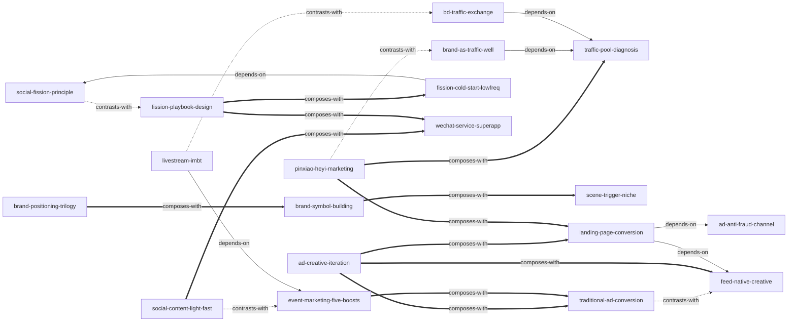

# 《流量池》 — Skill Index

> 本书由 cangjie-skill 蒸馏，共产出 **19** 个 skills。
> 处理时间： 2026-10-06（阶段 3 — Zettelkasten 建链）

## 关于这本书

- **书名**: 《流量池》
- **作者**: 杨飞（神州优车集团 CMO / luckin coffee 营销负责人）
- **出版年**: 2018（中信出版集团）
- **一句话主旨**: 流量红利消失、买量越来越贵时，从"获取即变现"的流量思维转向"获取—存储—运营—再发掘"的流量池思维：以品牌和场景筑池、以裂变和社交流量低成本获客、以数据监测和落地页完成转化，让每次营销同时产出声量与销量（品效合一）。
- **整书理解**: 见 [BOOK_OVERVIEW.md](BOOK_OVERVIEW.md)
- **精华长文** (不读全书看这篇): [DIGEST.md](DIGEST.md)
- **术语词典**: [GLOSSARY.md](GLOSSARY.md)
- **时代提示**: 本书为 2018 年快照（微信裂变规则、模板消息、DMP 跨屏追踪、SEO/ASO 参数等已大半失效）。所有 skill 只保留心法层与判断逻辑，参数层须按当期平台与合规环境重查。

---

## Skill 列表 (按主题分组)

### 流量池思维总纲

- [`traffic-pool-diagnosis`](../skills/traffic-pool-diagnosis/SKILL.md) — 企业级流量战略诊断：用"少/贵/陷阱"三问与自有/媒体/采购三桶盘点，判断该不该自建流量池、先建哪个池。
- [`pinxiao-heyi-marketing`](../skills/pinxiao-heyi-marketing/SKILL.md) — 单笔营销动作的品效合一检验：品效双问 → 加装转化口径 → 承诺转化周期 → 按成单账复盘。

### 品牌与定位

- [`brand-as-traffic-well`](../skills/brand-as-traffic-well/SKILL.md) — 品牌预算的战略辩护：井模型（关注＋粉丝两口井、成本边际递减）回答"做品牌还是买流量"。
- [`brand-positioning-trilogy`](../skills/brand-positioning-trilogy/SKILL.md) — 后发品牌定位三选一决策：对立型 / USP / 升维，配"一句话说清、创牌禁情怀"双判据与产品作证检验。
- [`brand-symbol-building`](../skills/brand-symbol-building/SKILL.md) — 品牌符号化打造与保护：视觉锤四件套＋语言钉两件套，换不换 LOGO、口号怎么过 20 秒电梯测试。
- [`scene-trigger-niche`](../skills/scene-trigger-niche/SKILL.md) — 场景扳机与利基切割：从订单数据反常点选场景、补贴补在刀刃上，以弱胜强的窗口选择程序。

### 裂变增长

- [`social-fission-principle`](../skills/social-fission-principle/SKILL.md) — 裂变原理与成本结构：关系链护城河、强调分享＋后付奖励双原则、"广告成本＝双边奖励"公式。
- [`fission-playbook-design`](../skills/fission-playbook-design/SKILL.md) — 具体裂变活动设计：13 种玩法三级谱系选型＋三要素上线检查＋合规红线（分销≤二级、防诱导封号）。
- [`fission-cold-start-lowfreq`](../skills/fission-cold-start-lowfreq/SKILL.md) — 裂变可行性判断：冷启动悖论（存量找增量、两手抓预算）与低频产品高频化改造路径。

### 社媒与事件

- [`wechat-service-superapp`](../skills/wechat-service-superapp/SKILL.md) — 微信载体定位与运营：服务号＝超级 App、"频发多选短决策"行业判据、创意＋技术＋福利三要素。
- [`social-content-light-fast`](../skills/social-content-light-fast/SKILL.md) — 日常社媒内容生产：轻、快、有网感三字诀与一图流低成本借势。
- [`event-marketing-five-boosts`](../skills/event-marketing-five-boosts/SKILL.md) — 一次性事件战役策划：轻快爆三原则＋五爆点检查链（热点/爆点/卖点/槽点/节点）＋借势 vs 造势决策。

### 广告投放与创意

- [`traditional-ad-conversion`](../skills/traditional-ad-conversion/SKILL.md) — 传统/线下广告实效化改造：互动 4 件套、"流动的人看不动的媒体"、产品带品牌、防墙纸效应。
- [`ad-creative-iteration`](../skills/ad-creative-iteration/SKILL.md) — 广告素材迭代实测：指标前置＋单变量＋版本阶梯，把创意品味之争变成实验设计问题。
- [`ad-anti-fraud-channel`](../skills/ad-anti-fraud-channel/SKILL.md) — 数字广告防作弊与渠道判断：高相关性营销、KPI 定成单层、三端六环监测、渠道风险排序。
- [`landing-page-conversion`](../skills/landing-page-conversion/SKILL.md) — 落地页设计与评审：六要素＋留资极简＋"不让用户思考"，投放转化的第一生产力。
- [`feed-native-creative`](../skills/feed-native-creative/SKILL.md) — 信息流素材生产：用户视角七法则＋原生感"不像广告的广告"＋配图三式。

### 直播与跨界

- [`livestream-imbt`](../skills/livestream-imbt/SKILL.md) — 带货直播完整项目策划：IMBT 四关键（创意 IP/媒介/福利/技术）＋平台选型＋事件化预热与沉淀。
- [`bd-traffic-exchange`](../skills/bd-traffic-exchange/SKILL.md) — 跨界 BD 与流量互洗：知彼知己盘点流量位、四阶段递进谈判、BD 经理四守则。

---

## 引用图



图例:
- `-->`  depends-on（A 的使用前提是先理解 B）
- `-.->` contrasts-with（互斥触发边界对：同一问题只归其一，看情境选一）
- `===>` composes-with（经常配合使用）

关键关系说明（对应 verified.md 聚类总表）:

- **互斥触发边界对**：`social-fission-principle`↔`fission-playbook-design`（原理层 vs 落地层，CL09↔CL10）；`traditional-ad-conversion`↔`feed-native-creative`（品牌硬广 vs 效果信息流，CL07↔CL17）；`social-content-light-fast`↔`event-marketing-five-boosts`（日常轻内容 vs 一次性战役，CL13↔CL14）；`livestream-imbt`↔`bd-traffic-exchange`（直播项目执行 vs 品牌合作关系，CL18↔CL19）；`pinxiao-heyi-marketing`↔`brand-as-traffic-well`（单笔品效检验 vs 品牌预算战略辩护，CL02↔CL03）。
- **投放转化链**：`ad-anti-fraud-channel`（CL15，管钱）→ `feed-native-creative`（CL17，管素材）→ `landing-page-conversion`（CL16，管承接）——落地页是投放上游的转化收口，故 CL16 依赖 CL15/CL17。
- **裂变三部曲**：`fission-cold-start-lowfreq`（CL11）用 CL09 的后付奖励公式判断可行性，先于 CL10 的选型落地；`fission-playbook-design` 的选型以 CL09 的原理为前提。
- **品牌落地三环**：定位（CL04）→ 符号（CL05）→ 场景（CL06）依次组合，场景须为定位作证。
- **公共载体**：`wechat-service-superapp`（CL12）是裂变活动、日常社媒内容与直播沉淀的共同承载体。
- **事件杠杆**：`event-marketing-five-boosts`（CL14）通过"广告公关化"救活 `traditional-ad-conversion`（CL07）的墙纸型广告；`livestream-imbt`（CL18）复用 CL14 的事件营销程序做直播前后传播。

---

## 推荐学习顺序

(从依赖图的叶子节点开始，向上)

1. **traffic-pool-diagnosis** — 全书总纲与依赖根节点，没有前置；先建立"获取—存储—运营—发掘"的战略视角。
2. **pinxiao-heyi-marketing** — 总纲另一支柱，与 diagnosis 配合：每笔钱怎么花都先过品效双问。
3. **brand-as-traffic-well** → **brand-positioning-trilogy** → **brand-symbol-building** → **scene-trigger-niche** — 品牌环依序展开：为什么建品牌 → 说什么 → 怎么被记住 → 在哪里被触发。
4. **social-fission-principle** — 裂变原理与成本公式，是另外两个裂变 skill 的前置。
5. **fission-cold-start-lowfreq** 与 **fission-playbook-design** — 先判断"能不能裂"（可行性），再落地"怎么裂"（选型与合规）。
6. **wechat-service-superapp** 与 **social-content-light-fast** — 承载与内容：微信载体定位 + 日常轻内容生产。
7. **traditional-ad-conversion** 与 **feed-native-creative** — 两类媒体的素材改造（互斥对，按媒介选一）。
8. **ad-creative-iteration**、**ad-anti-fraud-channel**、**landing-page-conversion** — 投放的实验、管钱与承接三件套，落地页是转化收口。
9. **event-marketing-five-boosts** — 池子搭好后的引爆杠杆；**livestream-imbt**、**bd-traffic-exchange** — 最后两个放大器（直播、跨界），依赖前面所有池子与程序。

---

## 安装使用

本目录是构建产物，宿主不会从这里加载 skill。要让 agent 真正调用，把 skill 目录复制到宿主的 skills 目录:

```bash
# 用户级 (所有项目可用)
cp -r skills/traffic-pool-diagnosis ~/.claude/skills/

# 或项目级
cp -r skills/traffic-pool-diagnosis <project>/.claude/skills/    # Claude Code
cp -r skills/traffic-pool-diagnosis <project>/.cursor/skills/    # Cursor
```

---

## 接入 darwin-skill

所有 skill 均带有 `test-prompts.json` (darwin-skill 兼容格式), 可直接接入自动进化:

```
darwin evolve books/traffic-pool/
```

---

## 审计轨迹

- 候选单元池: [candidates/](candidates/)
- 三重验证结果: [verified.md](verified.md)
- 被淘汰的候选 (含原因): [rejected/](rejected/)
- BOOK_OVERVIEW: [BOOK_OVERVIEW.md](BOOK_OVERVIEW.md)
