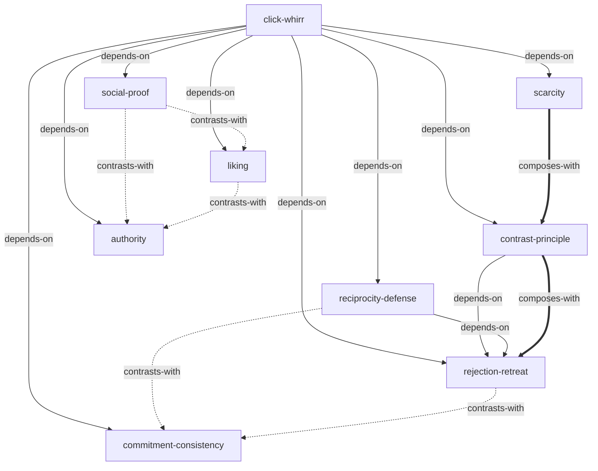

# 影响力（Influence）· 技能集

由罗伯特·西奥迪尼（Robert B. Cialdini）《影响力：你为什么说"是"》蒸馏出的一组**可被 AI Agent 调用的技能**（Skills）。

> 六大心理原理——互惠、承诺一致、社会认同、喜好、权威、短缺——如何自动触发人类的「卡嗒，哗」依从反应，
> 让我们在还没思考之前就被说服。本书不只揭示这套机制，更给出针对每一条原理的**防御方法**。
> 本项目把这套「识别 + 防御」方法论提炼成 9 个原子化技能。

---

## 来源

| | |
|---|---|
| **书名** | 影响力：你为什么说"是"（*Influence: The Psychology of Persuasion*） |
| **作者** | 罗伯特·西奥迪尼（Robert B. Cialdini） |
| **出版** | 1984（初版）/ 2016（最终版） |
| **蒸馏工具** | cangjie-skill（仓颉：把长内容蒸馏成可调用技能的流水线） |
| **蒸馏方法** | RIA-TV++（整书理解 → 并行提取 → 三重验证 → RIA++ 构造 → 链接 → 压力测试 → 交付） |

---

## 9 个技能

### 元框架（Meta-Frameworks）

- [`click-whirr`](skills/click-whirr/SKILL.md) — **「卡嗒，哗」自动反应模型**：识别启动特征如何绕过理性分析触发机械反应（Ch1）
- [`contrast-principle`](skills/contrast-principle/SKILL.md) — **认知对比原理**：感知差异被系统性放大，接触顺序可被操纵（Ch1）

### 六大原理防御（Defense Strategies）

- [`reciprocity-defense`](skills/reciprocity-defense/SKILL.md) — **互惠原理**：识别不请自来的好处，用「重新定义」解除负债感（Ch2）
- [`commitment-consistency`](skills/commitment-consistency/SKILL.md) — **承诺和一致**：用肠胃/心灵信号逃脱机械一致的锁定（Ch3）
- [`social-proof`](skills/social-proof/SKILL.md) — **社会认同**：破解多元无知，识别虚假社会证据（Ch4）
- [`liking`](skills/liking/SKILL.md) — **喜好**：分离人与交易，防御光环效应和关联原理（Ch5）
- [`authority`](skills/authority/SKILL.md) — **权威**：两问验证法——他是真正的专家？他会说真话？（Ch6）
- [`scarcity`](skills/scarcity/SKILL.md) — **短缺**：两步情绪防御法——用情绪冲动本身作为停止信号（Ch7）

### 组合策略（Composite Tactics）

- [`rejection-retreat`](skills/rejection-retreat/SKILL.md) — **拒绝—退让策略**（Door-in-the-Face）：互惠 + 对比的双引擎依从策略及其防御（Ch2）

---

## 技能之间的引用关系



图例：`-->` 依赖 · `-.->` 二选一 · `===>` 常配合使用

**推荐学习顺序**（从依赖图叶子节点向上）：`click-whirr` → `contrast-principle` → `reciprocity-defense` → `commitment-consistency` → `social-proof` → `liking` → `authority` → `scarcity` → `rejection-retreat`

---

## 安装

每个技能目录都包含 `SKILL.md`（+ `test-prompts.json` / `test-results.md` 测试产物），可直接复制到宿主环境：

```bash
# Claude Code（用户级，所有项目可用）
cp -r skills/* ~/.claude/skills/

# 或 Claude Code（项目级）
cp -r skills/* <project>/.claude/skills/

# Trae（项目级）
cp -r skills/* <project>/.trae/skills/

# Cursor（项目级）
cp -r skills/* <project>/.cursor/skills/
```

---

## 完整文档

`docs/` 目录保留了完整的蒸馏产物与审计轨迹：

| 文件 | 说明 |
|---|---|
| [`DIGEST.md`](docs/DIGEST.md) | 面向读者的精华长文（不读全书看这篇，约 8000 字） |
| [`GLOSSARY.md`](docs/GLOSSARY.md) | 共享术语词典（14 个核心术语：卡嗒哗/互惠/承诺一致/…） |
| [`INDEX.md`](docs/INDEX.md) | 技能总览 + 引用图 + 学习顺序 |
| [`BOOK_OVERVIEW.md`](docs/BOOK_OVERVIEW.md) | 整书理解（结构/解释/批判/应用潜力） |
| [`verified.md`](docs/verified.md) | 三重验证结果（候选池 → 9 通过） |
| [`PIPELINE_STATE.md`](docs/PIPELINE_STATE.md) | 流水线各阶段状态 |
| [`rejected/`](docs/rejected/) | 淘汰候选及原因（2 个） |
| [`candidates/`](docs/candidates/) | 5 个提取器的原始候选池（框架/原则/案例/反例/术语） |

---

## 目录结构

```text
influence-cialdini/
├── README.md
├── skills/                      # 9 个可安装技能（核心交付物）
│   └── <skill-slug>/
│       ├── SKILL.md             # 技能定义（R/I/A1/A2/E/B 六段）
│       ├── test-prompts.json    # 触发/诱饵测试集
│       └── test-results.md      # 压力测试结果
└── docs/                        # 蒸馏文档与审计轨迹
    ├── DIGEST.md / GLOSSARY.md / INDEX.md
    ├── BOOK_OVERVIEW.md / verified.md / PIPELINE_STATE.md
    ├── rejected/                # 淘汰候选
    └── candidates/              # 框架/原则/案例/反例/术语 候选池
```

---

## 关于内容与版权

本项目是**方法论蒸馏产物**，不含原书全文：

- 每个技能对原书的引用严格控制在 **≤150 字/段**，属于合理引用范畴；
- 原文的版权归原作者罗伯特·西奥迪尼（Robert B. Cialdini）及出版社所有；
- 建议购买正版书籍配合使用。

---

## 如何重新生成

本项目由 cangjie-skill（仓颉蒸馏流水线）自动生成。若要复现或调整：

1. 准备书籍文本（`fulltext.txt`）
2. 运行 RIA-TV++ 流水线（阶段 0–5，详见 `docs/PIPELINE_STATE.md`）
3. 通过三重验证 + 压力测试的单元会被构造为独立技能并安装

如需让技能持续进化，可喂给 `darwin-skill`：`darwin evolve influence-cialdini/`
