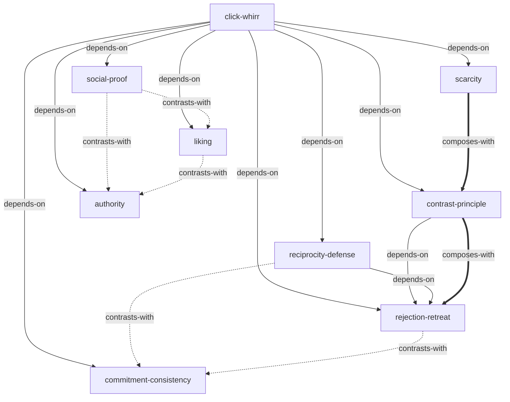

# 影响力 — Skill Index

> 本书由 cangjie-skill 蒸馏, 共产出 **9** 个 skills。
> 处理时间: 2026-09-22

## 关于这本书

- **作者**: Robert B. Cialdini
- **出版年**: 1984 (初版) / 2016 (最终版)
- **一句话主旨**: 六大心理原理（互惠、承诺一致、社会认同、喜好、权威、短缺）如何自动触发人类的"卡嗒哗"依从反应，以及如何防御。
- **整书理解**: 见 [BOOK_OVERVIEW.md](./BOOK_OVERVIEW.md)
- **术语词典**: [GLOSSARY.md](./GLOSSARY.md)

---

## Skill 列表 (按主题分组)

### 元框架 (Meta-Frameworks)

- [`click-whirr`](../skills/click-whirr/SKILL.md) — "卡嗒，哗"自动反应模型：识别启动特征如何绕过理性分析触发机械反应
- [`contrast-principle`](../skills/contrast-principle/SKILL.md) — 认知对比原理：感知差异被系统性放大，接触顺序可被操纵

### 六大原理防御 (Defense Strategies)

- [`reciprocity-defense`](../skills/reciprocity-defense/SKILL.md) — 互惠原理：识别不请自来的好处，用"重新定义"解除负债感
- [`commitment-consistency`](../skills/commitment-consistency/SKILL.md) — 承诺和一致：用肠胃/心灵信号逃脱机械一致的锁定
- [`social-proof`](../skills/social-proof/SKILL.md) — 社会认同：破解多元无知，识别虚假社会证据
- [`liking`](../skills/liking/SKILL.md) — 喜好：分离人与交易，防御光环效应和关联原理
- [`authority`](../skills/authority/SKILL.md) — 权威：两问验证法——他是真正的专家？他会说真话？
- [`scarcity`](../skills/scarcity/SKILL.md) — 短缺：两步情绪防御法——用情绪冲动本身作为停止信号

### 组合策略 (Composite Tactics)

- [`rejection-retreat`](../skills/rejection-retreat/SKILL.md) — 拒绝—退让策略：互惠+对比的双引擎依从策略及其防御

---

## 引用图

图例:
- `-->`  depends-on (A 的使用前提是先理解 B)
- `-.->` contrasts-with (A 和 B 是两种可选方案)
- `===>` composes-with (A 和 B 经常配合使用)

---

## 推荐学习顺序

(从依赖图的叶子节点开始, 向上)

1. **click-whirr** — 最基础，没有前置。理解"启动特征→自动反应"的元机制
2. **contrast-principle** — 依赖 click-whirr。理解感知放大机制
3. **reciprocity-defense** — 依赖 click-whirr。六大原理防御之一
4. **commitment-consistency** — 依赖 click-whirr。与 reciprocity-defense 互补（负债感 vs 一致性压力）
5. **social-proof** — 依赖 click-whirr。与 authority/liking 对比（水平 vs 垂直影响）
6. **liking** — 依赖 click-whirr。与 authority/social-proof 对比
7. **authority** — 依赖 click-whirr。与社会认同/喜好对比
8. **scarcity** — 依赖 click-whirr。与 contrast-principle 组合使用
9. **rejection-retreat** — 依赖 click-whirr + contrast-principle + reciprocity-defense。组合策略，最后学

---

## 审计轨迹

- 候选单元池: [candidates/](./candidates/)
- 被淘汰的候选 (含原因): [rejected/](./rejected/)
- BOOK_OVERVIEW: [BOOK_OVERVIEW.md](./BOOK_OVERVIEW.md)
- 验证结果: [verified.md](./verified.md)
