# 领导梯队建设系列（共 5 册）· 技能集

由拉姆·查兰、斯蒂芬·德罗特、詹姆斯·诺埃尔、拉里·博西迪 等《领导梯队建设系列（共 5 册）》蒸馏出的一组**可被 AI Agent 调用的技能**（Skills）。系列 5 册合并蒸馏为一个拆书单元（册5 立总纲、册2 补业绩、册4 供人才、册3 给语言、册1 拉回执行），技能按分册标注来源。

> 公司的成败很大程度上取决于它能否**成批量、可预见地从内部培养出各层级领导者**——
> 为此要把「每个层级该做什么」（六阶段×三维度）与「每层该交出什么业绩」（业绩梯队）定义清楚，
> 让选拔、培养、评价、继任全部对齐到同一套层级标准；用轮岗实践而非课堂来生产人才；
> 用一门通用商业语言让全员看懂公司如何赚钱；并由领导者亲自把人员、战略、运营三条流程咬合成一套执行系统。
> 本项目把这些方法论提炼成 59 个原子化技能。

---

## 来源

| | |
|---|---|
| **书名** | 领导梯队建设系列（共 5 册）：《领导梯队》《业绩梯队》《高管路径》《CEO说》《执行》 |
| **作者** | 拉姆·查兰（Ram Charan）、斯蒂芬·德罗特（Stephen Drotter）、詹姆斯·诺埃尔（James Noel）、拉里·博西迪（Larry Bossidy）、查尔斯·伯克（Charles Burck）等 |
| **出版** | 系列英文原版约 2001–2011 年 / 中文版机械工业出版社 2011–2012 年（系列 5 册合并蒸馏） |
| **蒸馏工具** | cangjie-skill（仓颉：把长内容蒸馏成可调用技能的流水线） |
| **蒸馏方法** | RIA-TV++（整书理解 → 并行提取 → 三重验证 → RIA++ 构造 → 链接 → 压力测试 → 交付） |

---

## 59 个技能

按系列 5 册组织（册5 立总纲、册2 补业绩、册4 供人才、册3 给语言、册1 拉回执行）。

### 册5《领导梯队》 — 体系总框架（20 个）

- [`leadership-pipeline-six-passages`](skills/leadership-pipeline-six-passages/SKILL.md) — **领导力发展六阶段模型**（领导梯队总框架）· 册5·导论、第1章
- [`three-dimension-transition`](skills/three-dimension-transition/SKILL.md) — **阶段转型三维度：技能/时间/理念** · 册5·导论、第1/9章
- [`first-manager-three-transitions`](skills/first-manager-three-transitions/SKILL.md) — **初任经理三项工作转型**（通过他人完成任务）· 册5·第2章
- [`manager-transition-tactics-three-steps`](skills/manager-transition-tactics-three-steps/SKILL.md) — **疏通梯队三步战术：准备—监督—干预** · 册5·第2章
- [`managing-managers-role`](skills/managing-managers-role/SKILL.md) — **部门总监：四项技能与两年期杠杆机制** · 册5·第3章
- [`functional-manager-maturity`](skills/functional-manager-maturity/SKILL.md) — **职能主管：领导力成熟度与竞争优势使命** · 册5·第4章
- [`business-manager-complexity-triangle`](skills/business-manager-complexity-triangle/SKILL.md) — **事业部总经理：协同三角形与整合团队** · 册5·第5章
- [`group-executive-indirect-success`](skills/group-executive-indirect-success/SKILL.md) — **集团高管：间接成功与组合管理** · 册5·第6章
- [`ceo-five-challenges`](skills/ceo-five-challenges/SKILL.md) — **CEO 五项领导力挑战与执行到位五问** · 册5·第7章
- [`diagnosis-five-steps`](skills/diagnosis-five-steps/SKILL.md) — **个体与组织诊断五步/四步法** · 册5·第8章
- [`role-clarity-gaps-overlaps`](skills/role-clarity-gaps-overlaps/SKILL.md) — **明确职责三步法与职责断裂/重叠检查** · 册5·第9章
- [`performance-gap-circle`](skills/performance-gap-circle/SKILL.md) — **绩效圆圈与绩效缺口：七项内容与培养四步循环** · 册5·第9章
- [`succession-five-steps`](skills/succession-five-steps/SKILL.md) — **继任计划：新定义、四原则与五步骤** · 册5·第10章
- [`potential-three-types`](skills/potential-three-types/SKILL.md) — **潜能三分类：转型/成长/熟练** · 册5·第10章
- [`nine-box-actions`](skills/nine-box-actions/SKILL.md) — **潜能-绩效九格矩阵与每格行动** · 册5·第10章
- [`leadership-deficit-four-causes`](skills/leadership-deficit-four-causes/SKILL.md) — **领导缺陷四因与组织三缺失** · 册5·第11章
- [`corporate-function-six-relations`](skills/corporate-function-six-relations/SKILL.md) — **企业/集团职能主管：六关系点与角色重定义** · 册5·第12章
- [`dual-track-management-technical`](skills/dual-track-management-technical/SKILL.md) — **管理/技术双轨发展框架** · 册5·第1/2章
- [`promotion-due-diligence`](skills/promotion-due-diligence/SKILL.md) — **提拔尽调三必问**：能否复制成绩、接受新理念、具备新技能 · 册5·第11章
- [`customize-not-copy`](skills/customize-not-copy/SKILL.md) — **模型必须按组织定制，严禁机械照搬** · 册5·导论、第10/14章

### 册2《业绩梯队》 — 业绩维度（7 个）

- [`performance-pipeline-interview-build`](skills/performance-pipeline-interview-build/SKILL.md) — **业绩梯队建队六步骤**（含名词提取与标准双栏）· 册2·第1章
- [`job-essence-two-factors`](skills/job-essence-two-factors/SKILL.md) — **工作本质双因素判定：决策权＋障碍** · 册2·第1章
- [`control-three-points-immune-system`](skills/control-three-points-immune-system/SKILL.md) — **控制机制三时点与免疫系统** · 册2·第2章
- [`functional-vp-four-results`](skills/functional-vp-four-results/SKILL.md) — **事业部副总经理四项关键业绩与四条警示** · 册2·第5章
- [`environment-three-variables`](skills/environment-three-variables/SKILL.md) — **大环境（土地）分析三变量** · 册2·第9章
- [`mealer-transition-six-steps`](skills/mealer-transition-six-steps/SKILL.md) — **MEALER 六阶段过渡模型** · 册2·第10章
- [`performance-dialogue-evidence`](skills/performance-dialogue-evidence/SKILL.md) — **业绩讨论与证据法** · 册2·第11章

### 册4《高管路径》 — 人才生产（9 个）

- [`apprenticeship-model`](skills/apprenticeship-model/SKILL.md) — **轮岗培养模式总框架** · 册4·前言、第2章
- [`concentric-learning-job-design`](skills/concentric-learning-job-design/SKILL.md) — **同心圆学习与以人定岗**（岗位路径设计）· 册4·第2/4章
- [`deliberate-practice-feedback-loop`](skills/deliberate-practice-feedback-loop/SKILL.md) — **持续强化练习与导师反馈**（反馈＋改进闭环）· 册4·第2/5章
- [`leadership-potential-double-helix`](skills/leadership-potential-double-helix/SKILL.md) — **双螺旋领导潜质**（驭人之道×经商之道）· 册4·第3章
- [`ceo-selection-process`](skills/ceo-selection-process/SKILL.md) — **CEO 选拔流程与治理**（三原则＋8 阶段＋资格分层）· 册4·第7章
- [`tolerate-failure-conditions`](skills/tolerate-failure-conditions/SKILL.md) — **宽容失败三条件**（给人才自由，把失败当信号）· 册4·第4章
- [`developing-talent-is-every-leaders-job`](skills/developing-talent-is-every-leaders-job/SKILL.md) — **培养人才是每位现任领导的职责**，必须考核与奖惩 · 册4·第1–2章、附录
- [`assessment-dual-track`](skills/assessment-dual-track/SKILL.md) — **评估双轨**：数字导向的绩效考核不能替代领导力评估 · 册4·第5章
- [`leadership-is-work-not-honor`](skills/leadership-is-work-not-honor/SKILL.md) — **领导是一种工作而非荣誉**；警惕自恋与诚信损耗 · 册4·结语、附录

### 册3《CEO说》 — 商业语言（12 个）

- [`business-acumen-six-elements`](skills/business-acumen-six-elements/SKILL.md) — **商业智慧：六要素＋两基础总框架** · 册3·第1–2章
- [`r-m-v-return-decomposition`](skills/r-m-v-return-decomposition/SKILL.md) — **R=M×V：资产收益率＝利润率×周转率** · 册3·第2章
- [`cash-net-inflow-everyones-business`](skills/cash-net-inflow-everyones-business/SKILL.md) — **现金净流入视角**（公司氧气与人人有责）· 册3·第2章
- [`direct-customer-contact`](skills/direct-customer-contact/SKILL.md) — **顾客直接接触法**（未经过滤的第一手观察）· 册3·第2章
- [`complexity-to-priorities`](skills/complexity-to-priorities/SKILL.md) — **化繁为简的决策路径**（因素→关系→基本行为→优先事项）· 册3·第4/9章
- [`priority-focus-three-to-four`](skills/priority-focus-three-to-four/SKILL.md) — **优先事项聚焦**（少而稳定的 3~4 项）· 册3·第4/9章
- [`pe-multiple-wealth-mechanism`](skills/pe-multiple-wealth-mechanism/SKILL.md) — **P-E 值：财富创造机制与管理纪律** · 册3·第5章
- [`company-panorama-seven-questions`](skills/company-panorama-seven-questions/SKILL.md) — **公司全景诊断七问** · 册3·第3/9章
- [`coaching-two-tracks`](skills/coaching-two-tracks/SKILL.md) — **教练辅导双轨框架**（业务轨＋行为轨）· 册3·第6章
- [`social-operating-mechanism`](skills/social-operating-mechanism/SKILL.md) — **社会化沟通执行机制的设计** · 册3·第7章
- [`profitable-sustainable-growth`](skills/profitable-sustainable-growth/SKILL.md) — **增长必须赢利、可持续**（四条同步标准）· 册3·第2章
- [`not-betting-is-betting`](skills/not-betting-is-betting/SKILL.md) — **不下注本身就是一种赌博** · 册3·第9/4章

### 册1《执行》 — 执行系统（11 个）

- [`execution-system-architecture`](skills/execution-system-architecture/SKILL.md) — **执行三基石与三流程整合架构** · 册1·导言、第1章
- [`question-to-reality`](skills/question-to-reality/SKILL.md) — **追问到现实**（提问式领导）· 册1·第1/3/8章
- [`field-visit-protocol`](skills/field-visit-protocol/SKILL.md) — **深入一线视察流程** · 册1·第3/6章
- [`culture-performance-linkage`](skills/culture-performance-linkage/SKILL.md) — **文化变革的绩效联结框架** · 册1·第4章
- [`talent-review-meeting-mrr`](skills/talent-review-meeting-mrr/SKILL.md) — **人才评估会议机制（MRR）** · 册1·第6章
- [`underperformer-tiered-handling`](skills/underperformer-tiered-handling/SKILL.md) — **表现不佳者分层处置流程** · 册1·第3/5/6章
- [`bedrock-strategy-one-pager`](skills/bedrock-strategy-one-pager/SKILL.md) — **基石式战略表达法** · 册1·第7章
- [`strategy-review-question-set`](skills/strategy-review-question-set/SKILL.md) — **战略评估会议的问题框架** · 册1·第8章
- [`operations-plan-three-step`](skills/operations-plan-three-step/SKILL.md) — **运营实施流程三步法与预算从属** · 册1·第9章
- [`assumptions-and-contingency`](skills/assumptions-and-contingency/SKILL.md) — **前提假设显性化与应急计划** · 册1·第9/7章
- [`follow-through-discipline`](skills/follow-through-discipline/SKILL.md) — **持续跟进，直至达成目标** · 册1·第3/6/8/9章

---

## 技能之间的引用关系

全系列显式链接共 **253 条**（depends-on 53 · contrasts-with 79 · composes-with 121），完整清单见各 SKILL.md 的「相关 skills」节与 [docs/INDEX.md](docs/INDEX.md)。下图只画依赖骨架——一棵以册5 为根的树：册5 六阶段模型与三维度是全系列公共前提，册2/册3/册4 各自展开，册1 执行是终点层。

图例：`-->` depends-on（先理解被指向者，再用本技能） · `-.->` contrasts-with（同场景二选一） · `===>` composes-with（先后接力/配合使用）

```mermaid
graph LR
    subgraph B5[册5 领导梯队·骨架]
        L6["领导力发展六阶段模型<br/>leadership-pipeline-six-passages"]
        TD3["阶段转型三维度<br/>three-dimension-transition"]
        FM3["初任经理三项转型<br/>first-manager-three-transitions"]
        MTT["疏通梯队三步战术<br/>manager-transition-tactics-three-steps"]
        MMR["部门总监四项技能<br/>managing-managers-role"]
        FMM["职能主管成熟度<br/>functional-manager-maturity"]
        BCT["事业部总经理协同三角<br/>business-manager-complexity-triangle"]
        GEI["集团高管间接成功<br/>group-executive-indirect-success"]
        C5C["CEO 五项挑战<br/>ceo-five-challenges"]
        D5S["诊断五步法<br/>diagnosis-five-steps"]
        RCG["明确职责三步法<br/>role-clarity-gaps-overlaps"]
        PGC["绩效圆圈与缺口<br/>performance-gap-circle"]
        S5S["继任计划五步骤<br/>succession-five-steps"]
        PT3["潜能三分类<br/>potential-three-types"]
        N9B["九格矩阵行动<br/>nine-box-actions"]
        LD4["领导缺陷四因<br/>leadership-deficit-four-causes"]
        CF6["集团职能主管六关系<br/>corporate-function-six-relations"]
        DMT["管理/技术双轨<br/>dual-track-management-technical"]
        PDD["提拔尽调三必问<br/>promotion-due-diligence"]
        CNC["模型按组织定制<br/>customize-not-copy"]
    end
    subgraph B2[册2 业绩梯队]
        PPB["业绩梯队建队六步骤<br/>performance-pipeline-interview-build"]
        JET["工作本质双因素<br/>job-essence-two-factors"]
        C3P["控制机制三时点<br/>control-three-points-immune-system"]
        FVP["副总四项关键业绩<br/>functional-vp-four-results"]
        PDE["业绩讨论与证据法<br/>performance-dialogue-evidence"]
    end
    subgraph B3[册3 CEO说]
        BA6["商业智慧六要素<br/>business-acumen-six-elements"]
        RMV["R=M×V 分解<br/>r-m-v-return-decomposition"]
        CNI["现金净流入视角<br/>cash-net-inflow-everyones-business"]
        C2P["化繁为简决策路径<br/>complexity-to-priorities"]
        PF3["优先事项聚焦<br/>priority-focus-three-to-four"]
        PEM["P-E 值财富机制<br/>pe-multiple-wealth-mechanism"]
        CP7["公司全景七问<br/>company-panorama-seven-questions"]
        SOM["社会化沟通机制<br/>social-operating-mechanism"]
        PSG["赢利可持续增长<br/>profitable-sustainable-growth"]
        NBB["不下注就是赌博<br/>not-betting-is-betting"]
    end
    subgraph B4[册4 高管路径]
        APM["轮岗培养模式<br/>apprenticeship-model"]
        CLJ["同心圆学习定岗<br/>concentric-learning-job-design"]
        DPF["持续练习与反馈<br/>deliberate-practice-feedback-loop"]
        LDH["双螺旋领导潜质<br/>leadership-potential-double-helix"]
        CSP["CEO 选拔流程<br/>ceo-selection-process"]
        TFC["宽容失败三条件<br/>tolerate-failure-conditions"]
        DTL["培养人才人人有责<br/>developing-talent-is-every-leaders-job"]
    end
    subgraph B1[册1 执行]
        ESA["执行三基石三流程<br/>execution-system-architecture"]
        Q2R["追问到现实<br/>question-to-reality"]
        FVP4["深入一线视察<br/>field-visit-protocol"]
        CPL["文化变革绩效联结<br/>culture-performance-linkage"]
        MRR["人才评估会议<br/>talent-review-meeting-mrr"]
        BS1["基石式战略表达<br/>bedrock-strategy-one-pager"]
        SRQ["战略评估问题框架<br/>strategy-review-question-set"]
        OP3["运营实施三步法<br/>operations-plan-three-step"]
        AAC["假设显性化与应急<br/>assumptions-and-contingency"]
        FTD["持续跟进纪律<br/>follow-through-discipline"]
    end

    TD3 --> L6
    FM3 --> L6
    FM3 --> TD3
    MTT --> FM3
    MTT --> TD3
    MMR --> L6
    FMM --> L6
    BCT --> L6
    GEI --> L6
    C5C --> L6
    D5S --> L6
    D5S --> TD3
    RCG --> L6
    PGC --> RCG
    S5S --> L6
    S5S --> N9B
    N9B --> PT3
    LD4 --> L6
    CF6 --> FMM
    CF6 --> L6
    DMT --> L6
    PDD --> TD3
    CNC --> L6

    PPB --> L6
    JET --> PPB
    C3P --> PPB
    FVP --> L6
    PDE --> PPB

    RMV --> BA6
    CNI --> BA6
    C2P --> BA6
    PEM --> BA6
    CP7 --> BA6
    PSG --> BA6
    NBB --> C2P
    SOM --> ESA
    SOM --> PF3

    APM --> L6
    CLJ --> APM
    CLJ --> LDH
    DPF --> CLJ
    CSP --> APM
    TFC --> CLJ
    DTL --> APM

    Q2R --> ESA
    FVP4 --> ESA
    CPL --> ESA
    MRR --> ESA
    BS1 --> ESA
    SRQ --> ESA
    OP3 --> ESA
    AAC --> ESA
    FTD --> ESA
```



**无 depends-on 的 13 个独立入口**（可作为起点直接使用）：`leadership-pipeline-six-passages`（系列总根）、`business-acumen-six-elements`（商业语言根）、`execution-system-architecture`（执行系统根）、`potential-three-types`、`priority-focus-three-to-four`、`leadership-potential-double-helix`、`mealer-transition-six-steps`、`environment-three-variables`、`direct-customer-contact`、`coaching-two-tracks`、`assessment-dual-track`、`leadership-is-work-not-honor`、`underperformer-tiered-handling`。

**典型接力链**（composes-with，详见 docs/INDEX.md）：

- **诊断链**：`leadership-pipeline-six-passages` → `three-dimension-transition` → `diagnosis-five-steps` → `role-clarity-gaps-overlaps` → `performance-gap-circle`
- **培养链**：`leadership-potential-double-helix` → `concentric-learning-job-design` → `deliberate-practice-feedback-loop` → `performance-gap-circle`
- **继任链**：`succession-five-steps` → `potential-three-types` → `nine-box-actions` → `ceo-selection-process`
- **执行链**：`execution-system-architecture` → `bedrock-strategy-one-pager` / `strategy-review-question-set` → `assumptions-and-contingency` → `operations-plan-three-step` → `follow-through-discipline`
- **商业语言链**：`business-acumen-six-elements` → `company-panorama-seven-questions` → `r-m-v-return-decomposition` / `cash-net-inflow-everyones-business` → `complexity-to-priorities` → `priority-focus-three-to-four`

**按角色取用的最短路径**：

| 你的角色 | 路径 |
|---|---|
| 新晋管理者 | `three-dimension-transition` → `first-manager-three-transitions` → `manager-transition-tactics-three-steps`（+`mealer-transition-six-steps`） |
| 中层/部门总监 | `managing-managers-role` → `functional-manager-maturity` → `coaching-two-tracks` |
| 业务负责人 | `business-manager-complexity-triangle` → 商业语言链 → `profitable-sustainable-growth` |
| 一把手/高管 | `ceo-five-challenges` → `group-executive-indirect-success` → `corporate-function-six-relations` |
| HR / 人才发展 | `performance-pipeline-interview-build` → 继任链 → `apprenticeship-model` → `assessment-dual-track` → `talent-review-meeting-mrr` |
| 组织诊断顾问 | `leadership-pipeline-six-passages` → `diagnosis-five-steps` → `leadership-deficit-four-causes` → `environment-three-variables` |

---

## 目录结构

```text
leadership-pipeline-series/
├── README.md
├── skills/                      # 59 个可安装技能（核心交付物，按分册标注来源）
│   └── <skill-slug>/
│       ├── SKILL.md             # 技能定义（R/I/A1/A2/E/B 六段）
│       ├── test-prompts.json    # 触发/诱饵测试集
│       └── test-results.md      # 压力测试结果
└── docs/                        # 蒸馏文档与审计轨迹
    ├── DIGEST.md / GLOSSARY.md / INDEX.md
    ├── BOOK_OVERVIEW.md / verified.md / PIPELINE_STATE.md
    ├── rejected/
    └── candidates/              # 框架/原则/案例/反例/术语 候选池
```

---

## 关于内容与版权

本项目是**方法论蒸馏产物**，不含原书全文：

- 每个技能对原书的引用严格控制在 **≤150 字/段**，属于合理引用范畴；
- 原文的版权归原作者拉姆·查兰、斯蒂芬·德罗特、詹姆斯·诺埃尔、拉里·博西迪 等及出版社（机械工业出版社）所有；
- 建议购买正版书籍配合使用。

---

## 如何重新生成

本项目由 cangjie-skill（仓颉蒸馏流水线）自动生成。若要复现或调整：

1. 准备书籍文本（`fulltext.txt`）
2. 运行 RIA-TV++ 流水线（阶段 0–5，详见 `docs/PIPELINE_STATE.md`）
3. 通过三重验证 + 压力测试的单元会被构造为独立技能并安装

如需让技能持续进化，可喂给 `darwin-skill`：`darwin evolve leadership-pipeline-series/`
