# 《领导梯队建设系列（共 5 册）》 — Skill Index

> 本书由 cangjie-skill 蒸馏，共产出 **59** 个 skills。
> 处理时间: 2026-09-29
> 本系列按用户决策**合并为一个拆书单元**（5 册同源：册5 立总纲、册2 补业绩、册4 供人才、册3 给语言、册1 拉回执行），skill 按分册标注来源。

## 关于这套书

- **作者**: [美] 拉姆·查兰（Ram Charan）、斯蒂芬·德罗特（Stephen Drotter）、詹姆斯·诺埃尔（James Noel）、拉里·博西迪（Larry Bossidy）、查尔斯·伯克（Charles Burck）等
- **出版年**: 英文原版约 2001–2011 年；中文版机械工业出版社（华章分社）2011–2012 年
- **一句话主旨**: 公司的成败很大程度上取决于它能否**成批量、可预见地从内部培养出各层级领导者**——为此要把"每个层级该做什么"（六阶段×三维度，册5）与"每层该交出什么业绩"（业绩梯队，册2）定义清楚，让选拔、培养、评价、继任全部对齐到同一套层级标准；用轮岗实践而非课堂来生产人才（册4）；用一门通用商业语言让全员看懂公司如何赚钱（册3）；并由领导者亲自把人员、战略、运营三条流程咬合成一套执行系统（册1）。
- **整书理解**: 见 [BOOK_OVERVIEW.md](./BOOK_OVERVIEW.md)
- **精华长文** (不读全书看这篇): [DIGEST.md](./DIGEST.md)
- **术语词典**: [GLOSSARY.md](./GLOSSARY.md)
- **三重验证结果**: 见 [verified.md](./verified.md)（59/74 独立单元通过）

| 册 | 书名 | 在系列中的角色 | 本册 skill 数 |
|---|---|---|---|
| 册5 | 领导梯队：全面打造领导力驱动型公司 | **体系总框架**：六阶段×三维度（系列旗舰册） | 20 |
| 册2 | 业绩梯队：让各层级领导者做出正确的业绩 | **业绩维度篇**：每层该交什么结果（册5 姊妹篇） | 7 |
| 册4 | 高管路径："轮岗培养"领导人才 | **人才生产篇**：轮岗培养模式 | 9 |
| 册3 | CEO说：像企业家一样思考 | **商业语言篇**：六要素通用语言 | 12 |
| 册1 | 执行：如何完成任务的学问 | **执行系统篇**：三基石＋三流程 | 11 |

---

## Skill 列表（按 5 册组织）

### 册5《领导梯队》 — 体系总框架（20 个）

- [`leadership-pipeline-six-passages`](../skills/./leadership-pipeline-six-passages/SKILL.md) — 领导力发展六阶段模型（领导梯队总框架）｜framework｜册5·导论、第1章｜b5-f01
- [`three-dimension-transition`](../skills/./three-dimension-transition/SKILL.md) — 阶段转型三维度：技能/时间/理念｜framework｜册5·导论、第1/9章｜b5-f02
- [`first-manager-three-transitions`](../skills/./first-manager-three-transitions/SKILL.md) — 初任经理三项工作转型（通过他人完成任务）｜framework｜册5·第2章｜b5-f04
- [`manager-transition-tactics-three-steps`](../skills/./manager-transition-tactics-three-steps/SKILL.md) — 疏通梯队三步战术：准备—监督—干预｜framework｜册5·第2章｜b5-f07
- [`managing-managers-role`](../skills/./managing-managers-role/SKILL.md) — 部门总监：四项技能与两年期杠杆机制｜framework｜册5·第3章（＋册2·第6章）｜b5-f08
- [`functional-manager-maturity`](../skills/./functional-manager-maturity/SKILL.md) — 职能主管：领导力成熟度与竞争优势使命｜framework｜册5·第4章｜b5-f10
- [`business-manager-complexity-triangle`](../skills/./business-manager-complexity-triangle/SKILL.md) — 事业部总经理：协同三角形与整合团队｜framework｜册5·第5章｜b5-f13
- [`group-executive-indirect-success`](../skills/./group-executive-indirect-success/SKILL.md) — 集团高管：间接成功与组合管理｜framework｜册5·第6章｜b5-f14
- [`ceo-five-challenges`](../skills/./ceo-five-challenges/SKILL.md) — CEO 五项领导力挑战与执行到位五问｜framework｜册5·第7章｜b5-f17
- [`diagnosis-five-steps`](../skills/./diagnosis-five-steps/SKILL.md) — 个体与组织诊断五步/四步法｜framework｜册5·第8章｜b5-f19
- [`role-clarity-gaps-overlaps`](../skills/./role-clarity-gaps-overlaps/SKILL.md) — 明确职责三步法与职责断裂/重叠检查｜framework｜册5·第9章｜b5-f21
- [`performance-gap-circle`](../skills/./performance-gap-circle/SKILL.md) — 绩效圆圈与绩效缺口：七项内容与培养四步循环｜framework｜册5·第9章｜b5-f23
- [`succession-five-steps`](../skills/./succession-five-steps/SKILL.md) — 继任计划：新定义、四原则与五步骤｜framework｜册5·第10章｜b5-f27
- [`potential-three-types`](../skills/./potential-three-types/SKILL.md) — 潜能三分类：转型/成长/熟练｜framework｜册5·第10章｜b5-f28
- [`nine-box-actions`](../skills/./nine-box-actions/SKILL.md) — 潜能-绩效九格矩阵与每格行动｜framework｜册5·第10章｜b5-f29
- [`leadership-deficit-four-causes`](../skills/./leadership-deficit-four-causes/SKILL.md) — 领导缺陷四因与组织三缺失｜framework｜册5·第11章｜b5-f30
- [`corporate-function-six-relations`](../skills/./corporate-function-six-relations/SKILL.md) — 企业/集团职能主管：六关系点与角色重定义｜framework｜册5·第12章｜b5-f32
- [`dual-track-management-technical`](../skills/./dual-track-management-technical/SKILL.md) — 管理/技术双轨发展框架｜framework｜册5·第1/2章（＋册2·第8章）｜b5-f36
- [`promotion-due-diligence`](../skills/./promotion-due-diligence/SKILL.md) — 提拔尽调三必问：能否复制成绩、接受新理念、具备新技能｜principle｜册5·第11章（＋册1·第6章）｜b5-p24
- [`customize-not-copy`](../skills/./customize-not-copy/SKILL.md) — 模型必须按组织定制，严禁机械照搬｜principle｜册5·导论、第10/14章｜b5-p28

### 册2《业绩梯队》 — 业绩维度（7 个）

- [`performance-pipeline-interview-build`](../skills/./performance-pipeline-interview-build/SKILL.md) — 业绩梯队建队六步骤（含名词提取与标准双栏）｜framework｜册2·第1章｜b2-f03
- [`job-essence-two-factors`](../skills/./job-essence-two-factors/SKILL.md) — 工作本质双因素判定：决策权＋障碍｜framework｜册2·第1章｜b2-f07
- [`control-three-points-immune-system`](../skills/./control-three-points-immune-system/SKILL.md) — 控制机制三时点与免疫系统｜framework｜册2·第2章｜b2-f11
- [`functional-vp-four-results`](../skills/./functional-vp-four-results/SKILL.md) — 事业部副总经理四项关键业绩与四条警示｜framework｜册2·第5章｜b2-f14
- [`environment-three-variables`](../skills/./environment-three-variables/SKILL.md) — 大环境（土地）分析三变量｜framework｜册2·第9章｜b2-f19
- [`mealer-transition-six-steps`](../skills/./mealer-transition-six-steps/SKILL.md) — MEALER 六阶段过渡模型｜framework｜册2·第10章｜b2-f21
- [`performance-dialogue-evidence`](../skills/./performance-dialogue-evidence/SKILL.md) — 业绩讨论与证据法｜framework｜册2·第11章｜b2-f22

### 册4《高管路径》 — 人才生产（9 个）

- [`apprenticeship-model`](../skills/./apprenticeship-model/SKILL.md) — 轮岗培养模式总框架｜framework｜册4·前言、第2章｜b4-f01
- [`concentric-learning-job-design`](../skills/./concentric-learning-job-design/SKILL.md) — 同心圆学习与以人定岗（岗位路径设计）｜framework｜册4·第2/4章｜b4-f02
- [`deliberate-practice-feedback-loop`](../skills/./deliberate-practice-feedback-loop/SKILL.md) — 持续强化练习与导师反馈（反馈＋改进闭环）｜framework｜册4·第2/5章｜b4-f03
- [`leadership-potential-double-helix`](../skills/./leadership-potential-double-helix/SKILL.md) — 双螺旋领导潜质（驭人之道×经商之道）｜framework｜册4·第3章｜b4-f04
- [`ceo-selection-process`](../skills/./ceo-selection-process/SKILL.md) — CEO 选拔流程与治理（三原则＋8 阶段＋资格分层）｜framework｜册4·第7章｜b4-f16
- [`tolerate-failure-conditions`](../skills/./tolerate-failure-conditions/SKILL.md) — 宽容失败三条件（给人才自由，把失败当信号）｜framework｜册4·第4章｜b4-f18
- [`developing-talent-is-every-leaders-job`](../skills/./developing-talent-is-every-leaders-job/SKILL.md) — 培养人才是每位现任领导的职责，必须考核与奖惩｜principle｜册4·第1–2章、附录｜b4-p03
- [`assessment-dual-track`](../skills/./assessment-dual-track/SKILL.md) — 评估双轨：数字导向的绩效考核不能替代领导力评估｜principle｜册4·第5章｜b4-p12
- [`leadership-is-work-not-honor`](../skills/./leadership-is-work-not-honor/SKILL.md) — 领导是一种工作而非荣誉；警惕自恋与诚信损耗｜principle｜册4·结语、附录｜b4-p16

### 册3《CEO说》 — 商业语言（12 个）

- [`business-acumen-six-elements`](../skills/./business-acumen-six-elements/SKILL.md) — 商业智慧：六要素＋两基础总框架｜framework｜册3·第1–2章｜b3-f01
- [`r-m-v-return-decomposition`](../skills/./r-m-v-return-decomposition/SKILL.md) — R=M×V：资产收益率＝利润率×周转率｜framework｜册3·第2章｜b3-f03
- [`cash-net-inflow-everyones-business`](../skills/./cash-net-inflow-everyones-business/SKILL.md) — 现金净流入视角（公司氧气与人人有责）｜framework｜册3·第2章｜b3-f04
- [`direct-customer-contact`](../skills/./direct-customer-contact/SKILL.md) — 顾客直接接触法（未经过滤的第一手观察）｜framework｜册3·第2章｜b3-f05
- [`complexity-to-priorities`](../skills/./complexity-to-priorities/SKILL.md) — 化繁为简的决策路径（因素→关系→基本行为→优先事项）｜framework｜册3·第4/9章｜b3-f06
- [`priority-focus-three-to-four`](../skills/./priority-focus-three-to-four/SKILL.md) — 优先事项聚焦（少而稳定的 3~4 项）｜framework｜册3·第4/9章｜b3-f07
- [`pe-multiple-wealth-mechanism`](../skills/./pe-multiple-wealth-mechanism/SKILL.md) — P-E 值：财富创造机制与管理纪律｜framework｜册3·第5章｜b3-f08
- [`company-panorama-seven-questions`](../skills/./company-panorama-seven-questions/SKILL.md) — 公司全景诊断七问｜framework｜册3·第3/9章｜b3-f10
- [`coaching-two-tracks`](../skills/./coaching-two-tracks/SKILL.md) — 教练辅导双轨框架（业务轨＋行为轨）｜framework｜册3·第6章｜b3-f12
- [`social-operating-mechanism`](../skills/./social-operating-mechanism/SKILL.md) — 社会化沟通执行机制的设计｜framework｜册3·第7章｜b3-f13
- [`profitable-sustainable-growth`](../skills/./profitable-sustainable-growth/SKILL.md) — 增长必须赢利、可持续（四条同步标准）｜principle｜册3·第2章｜b3-p03
- [`not-betting-is-betting`](../skills/./not-betting-is-betting/SKILL.md) — 不下注本身就是一种赌博｜principle｜册3·第9/4章｜b3-p08

### 册1《执行》 — 执行系统（11 个）

- [`execution-system-architecture`](../skills/./execution-system-architecture/SKILL.md) — 执行三基石与三流程整合架构｜framework｜册1·导言、第1章｜b1-f01
- [`question-to-reality`](../skills/./question-to-reality/SKILL.md) — 追问到现实（提问式领导）｜framework｜册1·第1/3/8章｜b1-f03
- [`field-visit-protocol`](../skills/./field-visit-protocol/SKILL.md) — 深入一线视察流程｜framework｜册1·第3/6章｜b1-f04
- [`culture-performance-linkage`](../skills/./culture-performance-linkage/SKILL.md) — 文化变革的绩效联结框架｜framework｜册1·第4章｜b1-f05
- [`talent-review-meeting-mrr`](../skills/./talent-review-meeting-mrr/SKILL.md) — 人才评估会议机制（MRR）｜framework｜册1·第6章｜b1-f12
- [`underperformer-tiered-handling`](../skills/./underperformer-tiered-handling/SKILL.md) — 表现不佳者分层处置流程｜framework｜册1·第3/5/6章｜b1-f15
- [`bedrock-strategy-one-pager`](../skills/./bedrock-strategy-one-pager/SKILL.md) — 基石式战略表达法｜framework｜册1·第7章｜b1-f16
- [`strategy-review-question-set`](../skills/./strategy-review-question-set/SKILL.md) — 战略评估会议的问题框架｜framework｜册1·第8章｜b1-f17
- [`operations-plan-three-step`](../skills/./operations-plan-three-step/SKILL.md) — 运营实施流程三步法与预算从属｜framework｜册1·第9章｜b1-f20
- [`assumptions-and-contingency`](../skills/./assumptions-and-contingency/SKILL.md) — 前提假设显性化与应急计划｜framework｜册1·第9/7章｜b1-f22
- [`follow-through-discipline`](../skills/./follow-through-discipline/SKILL.md) — 持续跟进，直至达成目标｜principle｜册1·第3/6/8/9章｜b1-p08

### 类型说明

59 个 skill 中 **framework（方法论骨架）51 个**、**principle（原则/判据）8 个**（follow-through-discipline、profitable-sustainable-growth、not-betting-is-betting、developing-talent-is-every-leaders-job、assessment-dual-track、leadership-is-work-not-honor、promotion-due-diligence、customize-not-copy），全部通过阶段 1.5 三重验证（V1 跨域 / V2 预测力 / V3 独特性），逐条证据见 [verified.md](./verified.md)。另有 15 条候选被淘汰（见 [rejected/](./rejected/)）——其中《华尔街日报》头版测试（b5-p12）为**淘汰素材**，不作 skill、不建链接，仅在 `business-manager-complexity-triangle` 的 B 段作为决策纪律素材保留。

---

## 引用图

图例: `-->` depends-on（先理解前者，再用后者） · `-.->` contrasts-with（同场景二选一） · `===>` composes-with（先后接力/配合使用）

**关系统计: 显式链接 253 条（depends-on 53 · contrasts-with 79 · composes-with 121）**，平均每 skill 4.3 条，处于"10 个 skill 约 8–15 条"密度的合理放大区间（本书 59 个 skill、5 册同源、层级链天然咬合，混淆对尤其多，故对比关系显著高于单册书）。

### 依赖骨架（depends-on，53 条）

全书依赖骨架是**一棵以册5 为根的树**：册5 六阶段模型与三维度是全系列公共前提；册2/册3/册4 各自展开；册1 执行是终点层（其内部技能依赖本册架构）。

```mermaid
graph LR
    subgraph B5[册5 领导梯队·骨架]
        L6[leadership-pipeline-six-passages]
        TD3[three-dimension-transition]
        FM3[first-manager-three-transitions]
        MTT[manager-transition-tactics-three-steps]
        MMR[managing-managers-role]
        FMM[functional-manager-maturity]
        BCT[business-manager-complexity-triangle]
        GEI[group-executive-indirect-success]
        C5C[ceo-five-challenges]
        D5S[diagnosis-five-steps]
        RCG[role-clarity-gaps-overlaps]
        PGC[performance-gap-circle]
        S5S[succession-five-steps]
        PT3[potential-three-types]
        N9B[nine-box-actions]
        LD4[leadership-deficit-four-causes]
        CF6[corporate-function-six-relations]
        DMT[dual-track-management-technical]
        PDD[promotion-due-diligence]
        CNC[customize-not-copy]
    end
    subgraph B2[册2 业绩梯队]
        PPB[performance-pipeline-interview-build]
        JET[job-essence-two-factors]
        C3P[control-three-points-immune-system]
        FVP[functional-vp-four-results]
        PDE[performance-dialogue-evidence]
    end
    subgraph B3[册3 CEO说]
        BA6[business-acumen-six-elements]
        RMV[r-m-v-return-decomposition]
        CNI[cash-net-inflow-everyones-business]
        C2P[complexity-to-priorities]
        PF3[priority-focus-three-to-four]
        PEM[pe-multiple-wealth-mechanism]
        CP7[company-panorama-seven-questions]
        SOM[social-operating-mechanism]
        PSG[profitable-sustainable-growth]
        NBB[not-betting-is-betting]
    end
    subgraph B4[册4 高管路径]
        APM[apprenticeship-model]
        CLJ[concentric-learning-job-design]
        DPF[deliberate-practice-feedback-loop]
        LDH[leadership-potential-double-helix]
        CSP[ceo-selection-process]
        TFC[tolerate-failure-conditions]
        DTL[developing-talent-is-every-leaders-job]
    end
    subgraph B1[册1 执行]
        ESA[execution-system-architecture]
        Q2R[question-to-reality]
        FVP4[field-visit-protocol]
        CPL[culture-performance-linkage]
        MRR[talent-review-meeting-mrr]
        BS1[bedrock-strategy-one-pager]
        SRQ[strategy-review-question-set]
        OP3[operations-plan-three-step]
        AAC[assumptions-and-contingency]
        FTD[follow-through-discipline]
    end

    TD3 --> L6
    FM3 --> L6
    FM3 --> TD3
    MTT --> FM3
    MTT --> TD3
    MMR --> L6
    FMM --> L6
    BCT --> L6
    GEI --> L6
    C5C --> L6
    D5S --> L6
    D5S --> TD3
    RCG --> L6
    PGC --> RCG
    S5S --> L6
    S5S --> N9B
    N9B --> PT3
    LD4 --> L6
    CF6 --> FMM
    CF6 --> L6
    DMT --> L6
    PDD --> TD3
    CNC --> L6

    PPB --> L6
    JET --> PPB
    C3P --> PPB
    FVP --> L6
    PDE --> PPB

    RMV --> BA6
    CNI --> BA6
    C2P --> BA6
    PEM --> BA6
    CP7 --> BA6
    PSG --> BA6
    NBB --> C2P
    SOM --> ESA
    SOM --> PF3

    APM --> L6
    CLJ --> APM
    CLJ --> LDH
    DPF --> CLJ
    CSP --> APM
    TFC --> CLJ
    DTL --> APM

    Q2R --> ESA
    FVP4 --> ESA
    CPL --> ESA
    MRR --> ESA
    BS1 --> ESA
    SRQ --> ESA
    OP3 --> ESA
    AAC --> ESA
    FTD --> ESA
```



**无 depends-on 的 13 个独立入口**（可作为起点直接使用）：`leadership-pipeline-six-passages`（系列总根）、`business-acumen-six-elements`（商业语言根）、`execution-system-architecture`（执行系统根）、`potential-three-types`、`priority-focus-three-to-four`、`leadership-potential-double-helix`、`mealer-transition-six-steps`、`environment-three-variables`、`direct-customer-contact`、`coaching-two-tracks`、`assessment-dual-track`、`leadership-is-work-not-honor`、`underperformer-tiered-handling`（后几条是识潜/处置/辅导/评估/环境/过渡类的平行入口，不依赖任何前置框架）。

### 对比关系（contrasts-with，79 条 — 同场景二选一，最易误激活）

| 混淆簇 | 二选一判据 | 涉及 skill |
|---|---|---|
| **相邻层级链（册5）** | 先确认人/岗位在哪一层，再挑该层的 skill | first-manager-three-transitions ↔ managing-managers-role ↔ functional-manager-maturity ↔ business-manager-complexity-triangle ↔ group-executive-indirect-success ↔ ceo-five-challenges；corporate-function-six-relations ↔ business-manager-complexity-triangle |
| **定位 vs 体检 vs 诊断 vs 归因（册5）** | 「在哪一层」→「缺哪一维」→「怎么查」→「失败从哪来」 | leadership-pipeline-six-passages ↔ execution-system-architecture；three-dimension-transition ↔ performance-gap-circle；diagnosis-five-steps ↔ leadership-deficit-four-causes；leadership-deficit-four-causes ↔ promotion-due-diligence（事后复盘 vs 事前尽调） |
| **潜质口径（册4/册5）** | 入口禀赋 vs 出口类别 vs 单次尽调 | leadership-potential-double-helix ↔ potential-three-types；leadership-potential-double-helix ↔ promotion-due-diligence |
| **经营数字四格（册3）** | 现金口径 / 收益率口径 / 静态体检 / 动态推演 | r-m-v-return-decomposition ↔ cash-net-inflow-everyones-business；company-panorama-seven-questions ↔ complexity-to-priorities；cash-net-inflow-everyones-business ↔ pe-multiple-wealth-mechanism |
| **聚焦 vs 下注（册3）** | 选多少守多久 vs 敢不敢下 | priority-focus-three-to-four ↔ not-betting-is-betting |
| **计划与战略（册1）** | 写 vs 审 vs 问 vs 追 | bedrock-strategy-one-pager ↔ strategy-review-question-set；question-to-reality ↔ strategy-review-question-set |
| **下现场的两面（册1/册3）** | 组织内侧 vs 市场侧；会议桌 vs 现场 | field-visit-protocol ↔ direct-customer-contact；field-visit-protocol ↔ question-to-reality |
| **文化与环境（册1/册2）** | 改行为 vs 改土地 | culture-performance-linkage ↔ environment-three-variables |
| **控制 vs 跟进（册1/册2）** | 全公司多时点架构 vs 单目标纪律 | control-three-points-immune-system ↔ follow-through-discipline |
| **评人机制（册1/册2/册5）** | 集体开会 vs 逐人对话；制度 vs 工具 | talent-review-meeting-mrr ↔ performance-dialogue-evidence；talent-review-meeting-mrr ↔ succession-five-steps；assessment-dual-track ↔ performance-dialogue-evidence；talent-review-meeting-mrr ↔ nine-box-actions |
| **辅导 vs 处置（册1/册3/册4）** | 还有发展空间 vs 已判定不匹配 | coaching-two-tracks ↔ underperformer-tiered-handling；underperformer-tiered-handling ↔ tolerate-failure-conditions；underperformer-tiered-handling ↔ leadership-deficit-four-causes |
| **转型的内容 vs 顺序（册2/册5）** | 转什么 vs 按什么顺序转 | three-dimension-transition ↔ mealer-transition-six-steps；mealer-transition-six-steps ↔ first-manager-three-transitions；mealer-transition-six-steps ↔ performance-dialogue-evidence（过渡期 vs 稳态期） |
| **培养 vs 继任 vs 盘点（册4/册5）** | 常年供货 vs 岗位交付 vs 分类 | apprenticeship-model ↔ succession-five-steps；concentric-learning-job-design ↔ succession-five-steps；dual-track-management-technical ↔ concentric-learning-job-design（方向相反） |
| **岗位 vs 职责（册2/册5）** | 岗位本质是否相同 vs 边界是否画错 | job-essence-two-factors ↔ role-clarity-gaps-overlaps；role-clarity-gaps-overlaps ↔ performance-gap-circle |

（完整逐条理由见各 SKILL.md 的「相关 skills」节；上表为高混淆簇的归并视图。）

### 组合关系（composes-with，121 条 — 常配套使用）

典型接力链（按使用场景）：

- **诊断链**：`leadership-pipeline-six-passages` → `three-dimension-transition` → `diagnosis-five-steps` → `role-clarity-gaps-overlaps` → `performance-gap-circle`
- **建队链**：`performance-pipeline-interview-build` → `performance-dialogue-evidence` → `talent-review-meeting-mrr` → `nine-box-actions`
- **培养链**：`leadership-potential-double-helix` → `concentric-learning-job-design` → `deliberate-practice-feedback-loop` → `performance-gap-circle`（＋`tolerate-failure-conditions` 设失败空间）
- **继任链**：`succession-five-steps` → `potential-three-types` → `nine-box-actions` → `ceo-selection-process`
- **执行链**：`execution-system-architecture` → `bedrock-strategy-one-pager`/`strategy-review-question-set` → `assumptions-and-contingency` → `operations-plan-three-step` → `follow-through-discipline`
- **商业语言链**：`business-acumen-six-elements` → `company-panorama-seven-questions` → `r-m-v-return-decomposition`/`cash-net-inflow-everyones-business` → `complexity-to-priorities` → `priority-focus-three-to-four`
- **执行系统落地栈**：`execution-system-architecture` → `culture-performance-linkage`（激励）＋ `social-operating-mechanism`（机制）＋ `control-three-points-immune-system`（控制）

---

## 推荐学习顺序

（从依赖骨架的根出发，逐层展开；括号内为依赖前置）

### 第一段 — 先立骨架（册5 总纲）

1. **`leadership-pipeline-six-passages`** — 全系列公共骨架，没有前置；先建立"六个阶段、七种站位"的定位语言。
2. **`three-dimension-transition`** — 依赖 1；给每个层级配上技能/时间/理念三把尺子。
3. **`customize-not-copy`** — 依赖 1；在把模型用到本公司之前，先学会按层级数、术语、标准做本地化改造。
4. **`diagnosis-five-steps`** — 依赖 1、2；把定位与体检串成可执行的诊断流程。
5. **`role-clarity-gaps-overlaps`** → **`performance-gap-circle`** — 依赖 1（与 4）；先清职责、再定标准与缺口，是后续一切培养动作的前置。

### 第二段 — 两个维度的展开（册2 业绩 / 册4 人才）

6. **`performance-pipeline-interview-build`** — 依赖 1；给出"每层交什么结果"的业绩侧契约。
7. **`job-essence-two-factors`** → **`performance-dialogue-evidence`** — 依赖 6；建标准之后是判岗位与用标准。
8. **`leadership-potential-double-helix`** — 无前置；识人入口判据（谁值得培养）。
9. **`apprenticeship-model`** → **`concentric-learning-job-design`** → **`deliberate-practice-feedback-loop`** — 依赖 1（与 8）；培养引擎从制度到个人到反馈闭环。
10. **`succession-five-steps`** → **`potential-three-types`** → **`nine-box-actions`** → **`ceo-selection-process`** — 依赖 1（与 9）；把培养成果制度化地对接岗位与治理。

### 第三段 — 语言层与执行层（册3 / 册1）

11. **`business-acumen-six-elements`** — 无前置；全员共同商业语言，是册1 执行系统与册5 各层级共同的话语底座。
12. **`company-panorama-seven-questions`** / **`r-m-v-return-decomposition`** / **`cash-net-inflow-everyones-business`** — 依赖 11；三件套做经营体检。
13. **`complexity-to-priorities`** → **`priority-focus-three-to-four`** → **`not-betting-is-betting`** — 依赖 11；从复杂性到可下注的重点。
14. **`execution-system-architecture`** — 依赖（概念上）11；执行系统的总架构，是全书的终点层。
15. **`question-to-reality`** / **`field-visit-protocol`** / **`culture-performance-linkage`** / **`bedrock-strategy-one-pager`** → **`strategy-review-question-set`** → **`assumptions-and-contingency`** → **`operations-plan-three-step`** → **`follow-through-discipline`** — 依赖 14；执行系统的逐件落地。
16. **`talent-review-meeting-mrr`** / **`underperformer-tiered-handling`** / **`social-operating-mechanism`** — 依赖 14；人员流程、处置与沟通机制。

### 按角色取用的最短路径

- **新晋管理者**：2 → 3 → `first-manager-three-transitions` → `manager-transition-tactics-three-steps`（+`mealer-transition-six-steps`）
- **中层/部门总监**：`managing-managers-role` → `functional-manager-maturity` → `coaching-two-tracks`
- **业务负责人**：`business-manager-complexity-triangle` → 11–13 → `profitable-sustainable-growth`
- **一把手/高管**：`ceo-five-challenges` → `group-executive-indirect-success` → `corporate-function-six-relations`
- **HR / 人才发展**：6 → 10 → 11–12（册4 一组）→ `assessment-dual-track` → `talent-review-meeting-mrr`
- **组织诊断顾问**：1 → 4 → `leadership-deficit-four-causes` → `environment-three-variables`

---

## 安装使用

本目录是构建产物，宿主不会从这里加载 skill。**按用户 2026-09-29 决策，本批 skill 未安装**（未复制到 `.trae/skills/`，未动 `e:\solo\skill-bookshelf\`）。如需启用，把 skill 目录手动复制到宿主的 skills 目录：

```bash
# 用户级 (所有项目可用)
cp -r leadership-pipeline-six-passages ~/.claude/skills/

# 或项目级
cp -r leadership-pipeline-six-passages <project>/.claude/skills/    # Claude Code
cp -r leadership-pipeline-six-passages <project>/.cursor/skills/    # Cursor
```

只建议安装通过阶段 4 测试的 skill（各目录 `test-results.md` 记录了通过率与回炉情况）。

---

## 接入 darwin-skill

所有 skill 均带有 `test-prompts.json` (darwin-skill 兼容格式), 可直接接入自动进化:

```
darwin evolve books/leadership-pipeline-series/
```

---

## 审计轨迹

- 候选单元池: [candidates/](./candidates/)（框架 120 + 原则 112 + 案例 177 + 反例 123 + 术语 100）
- 被淘汰的候选 (含原因): [rejected/](./rejected/)（15 条，含头版测试 b5-p12）
- 三重验证结果（59 个通过单元）: [verified.md](./verified.md)
- BOOK_OVERVIEW: [BOOK_OVERVIEW.md](./BOOK_OVERVIEW.md)
- 流水线状态: [PIPELINE_STATE.md](./PIPELINE_STATE.md)
